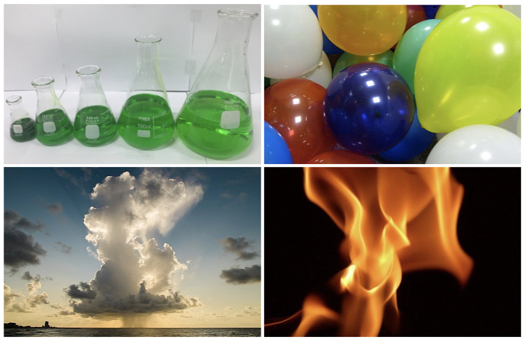

# Systems and Variables {#SystemVariables}

## Thermodynamic Systems
A thermodynamic system—or just simply a system—is a portion of space with defined boundaries that separate it from its surroundings (see also the title picture of this book). The surroundings may include other thermodynamic systems or physical systems that are not thermodynamic systems. A boundary may be a real physical barrier or a purely notional one. Typical examples of systems are reported in  Figure \@ref(fig:Fig1c1) below.^[The photos depicted in this figure are taken from [Wikipedia](https://en.wikipedia.org) and distributed under CC-BY-SA license.]
```{r Fig1c1, out.width='80%', fig.show='hold', echo=FALSE, fig.align = 'center', fig.cap='Examples of Thermodynamic Systems'}

```
In the first case, a liquid is contained in a typical Erlenmeyer flask. The boundaries of the system are the glass walls of the beaker. The second system is represented by the gas contained in a balloon. The boundary is a physical barrier also in this case, being the plastic of the balloon. The third case is that of a thunder cloud. The boundary is not a well-defined physical barrier, but rather some condition of pressure and chemical composition at the interface between the cloud and the atmosphere. Finally, the fourth case is the case of an open flame. In this case, the boundary is again non-physical, and possibly even harder to define than for a cloud. For example, we can choose to define the flame based on some temperature threshold, or some color criterion, or even some chemical one. Despite the lack of physical boundaries, both the cloud and the flame—as portions of space containing matter—can be defined as a thermodynamic system.

A system can exchange exclusively mass, exclusively energy, or both mass and energy with its surroundings. Depending on the boundaries' ability to exchange these quantities, a system is defined as open, closed, or isolated. An open system exchanges both mass and energy. A closed system exchanges only energy, but not mass. Finally, an isolated system does not exchange mass nor energy.

| **Type of System** | **Mass** | **Energy** <br> (either heat or work) |
|--------------------|:--------:|:--------------------------------:|
| **Open**           |     Y    |                 Y                |
| **Closed**         |     N    |                 Y                |
| **Isolated**       |     N    |                 N                |

When a system exchanges mass or energy with its surroundings, some of its parameters (variables) change. For example, if a system loses mass to the surroundings, the number of molecules (or moles) in the system will decrease. Similarly, if a system absorbs some energy, one or more of its variables (such as its temperature) increase. Mass and energy can flow into the system or out of the system. Let's consider mass exchange only. If some molecules of a substance leave the system, and then the same amount of molecules flow back into the system, the system will not be modified. We can count, for example, 100 molecules leaving a system and assign them the value of –100 in an outgoing process, and then observe the same 100 molecules going back into the system and assign them a value of +100. Regardless of the number of molecules present in the system in the first place, the overall balance will be –100 (from the outgoing process) +100 (from the ingoing process) = 0, which brings the system to its initial situation (mass has not changed). However, from a mathematical standpoint, we could have equally assigned the label +100 to the outgoing process and –100 to the ingoing one, and the overall total would have stayed the same: +100–100 = 0. Which of the two labels is best? For this case, it seems natural to define a mass going out of the system as negative (the system is losing it), and a mass going into the system as positive (the system is gaining it), but is it as straightforward for energy? 

> Here is another example. Let's consider a system that is composed of your body. When you exercise, you are losing mass in the form of water (sweat) and CO~2~ (from respiration). This mass loss can be easily measured by stepping on a scale before and after exercise. The number you observe on the scale will go down. Hence you have lost weight. After exercise, you will reintegrate the lost mass by drinking and eating. If you have reintegrated the same amount you have lost, your weight will be the same as before the exercise (no weight loss). Nevertheless, which label do you attach to the amounts that you have lost and gained? Let’s say that you are running a 5km race without drinking nor eating, and you measure your weight dropping 2 kg after the race. After the race, you drink 1.5 kg of water and eat a 500 g energy bar. Overall you did not lose any weight, and it would seem reasonable to label the 2 kg that you’ve lost as negative (–2)  and the 1.5 kg of water that you drank and the 500 g bar that you ate as positive (+1.5 +0.5 = +2). But is it the only way? After all, you didn’t gain nor lose any weight, so why not calling the 2 kg due to exercise +2 and the 2 that you’ve ingested as –2? It might seem silly, but mathematically it would not make any difference, the total would still be zero. Now, let’s consider energy instead of mass. Let’s say that in order to run the 5km race, you have spent 500 kcal, which then you reintegrate precisely by eating the energy bar. Which sign would you put in front of the kilocalories that you “burned” during the race? In principle, you’ve lost them, so if you want to be consistent, you should use a negative sign. But if you think about it, you’ve put quite an effort to “lose” those kilocalories, so it might not feel bad to assign them a positive sign instead. After all, it’s perfectly OK to say, “I’ve done a 500 kcal run today”, while it might sound quite awkward to say “I’ve done a –500 kcal run today.” Our previous exercise with mass demonstrates that it doesn’t really matter which sign you put in front of the quantities. As long as you are consistent throughout the process, the signs will cancel out. If you’ve done a +500 kcal run, you’ve eaten a bar for –500 kcal, resulting in a total zero loss/gain. Alternatively, if you’ve done a –500 kcal run, you would have eaten a +500 kcal bar, for a total of again zero loss/gain.

These simple examples demonstrate that the sign that we assign to quantities that flow through a boundary is arbitrary (i.e., we can define it any way we want, as long as we are always consistent with ourselves). There is no best way to assign those signs. If you ask two different people, you might obtain two different answers. But we are scientists, and we must make sure to be rigorous. For this reason, chemists have established a convention for the signs that we will follow throughout this course. If we are consistent in following the convention, we are guaranteed to never make any sign mistake. 

> ```{definition, chemistryconv}
*The chemistry convention of the sign is system-centric:*^[Notice that physicists use a different sign convention when it comes to thermodynamics. To eliminate confusion, I will not describe the physics convention here, but if you are reading thermodynamics on a physics textbook, or if you are browsing the web and stumble on thermodynamics formula (e.g., on Wikipedia), please be advised that they might have a different sign than what is used in this course. Obviously, the science will not change, but you need to be ALWAYS consistent, so if you decide that you want to use the physics convention, make sure to ALWAYS use the physics convention. In this course, on the other hand, we will ALWAYS use the chemistry one, as introduced above.]


- *If something (energy or mass) goes **into** the system it has a **positive** sign (the system is gaining)*
- *If something (energy or mass) goes **out of** the system it has a **negative** sign (the system is losing)*


```

If you want a trick to remember the convention, use the weight loss/gain during the exercise example above. You are the system, if you lose weight, the kilograms will be negative (–2 kg), while if you gain weight, they will be positive (+2 kg). Similarly, if you eat an energy bar, you are the system, and you will have increased your energy by +500 kcal (positive). In contrast, if you burned energy during exercise, you are the system, and you will have lost energy, hence –500 kcal (negative). If the system is a balloon filled with gas, and the balloon is losing mass, you are the balloon, and you are losing weight; hence the mass will be negative. If the balloon is absorbing heat (likely increasing its temperature and increasing its volume), you are the system, and you are gaining heat; hence heat will be positive.

## Thermodynamic Variables
The system is defined and studied using parameters that are called variables. These variables are quantities that we can measure, such as pressure and temperature. However, they don’t be surprised if, on some occasions, you encounter some variable that is a little harder to measure directly, such as entropy. The variables depend only on the current state of the system, and therefore they define it. If I know the values of all the “relevant variables” of a system, I know the state of the system. The relationship between the variables is described by mathematical functions called state functions, while the “relevant variables” are called natural variables.

What are the “relevant variables” of a system? The answer to this question depends on the system, and it is not always straightforward. The simplest case is the case of an ideal gas, for which the natural variables are those that enter the ideal gas law and the corresponding equation:

\begin{equation}
  PV=nRT       
  (\#eq:idealgaslaworiginal)
\end{equation}

Therefore, the natural variables for an ideal gas are the pressure P, the volume V,  the number of moles n, and the temperature T, with R being the ideal gas constant. Recalling from the general chemistry courses, R is a universal dimensional constant which has the values of R = 8.31 kJ/mol in SI units.  
We will use the ideal gas equation and its variables as an example to discuss variables and functions in this chapter. We will analyze more complicated cases in the next chapters. 
Variables can be classified according to numerous criteria, each with its advantages and disadvantages. A typical classification is:

- **Physical variables** ($P$, $V$, $T$ in the ideal gas law): independent on the chemical composition of the system.
- **Chemical variables** ($n$ in the ideal gas law): dependent on the chemical composition of the system.

Another useful classification is:

- **Intensive variables** ($P$, $T$ in the ideal gas law): independent on the physical size (extension) of the system.
- **Extensive variables** ($V$, $n$ in the ideal gas law): dependent on the physical size (extension) of the system.

When we deal with thermodynamic systems, it is more convenient to work with intensive variables. Luckily, it is relatively easy to convert extensive variables into intensive ones by just taking the ratio between two of them. For an ideal gas, by taking the ratio between V and n, we obtained the intensive variable called molar volume:

\begin{equation}
  V_m=\frac{V}{n}.   
  (\#eq:Vmdef)
\end{equation}

We can then recast eq. \@ref(eq:idealgaslaworiginal) as:

\begin{equation}
  PV_m=RT,
  (\#eq:idealgaslaw)
\end{equation}

which is the preferred equation that we will use for the remainder of this course.
The ideal gas equation connects the 3 variables pressure, molar volume, and temperature, and reduces the number of independent variables to just 2. In other words, once 2 of the 3 variables are known, the other one can be easily obtained using these simple relations:

\begin{equation}
  P(T,V_m)=\frac{RT}{V_m},
  (\#eq:PTVm)
\end{equation}

\begin{equation}
  V_m(T,P)=\frac{RT}{P},
  (\#eq:VmTP)
 \end{equation}
 
\begin{equation}
  T(P,V_m)=\frac{PV_m}{R}.
  (\#eq:TPVm)
\end{equation}

  
These equations define three state functions, each one expressed in terms of two independent natural variables. For example, eq. \@ref(eq:PTVm) defines the state function called “pressure”, expressed as a function of temperature and molar volume. Similarly, eq. \@ref(eq:VmTP) defines the “molar volume” as a function of temperature and pressure, and eq. \@ref(eq:TPVm) defines the “temperature” as a function of pressure and molar volume. When we know the natural variables that define a state function, we can express the function using its total differential, for example for the pressure $P(T, V_m)$:

\begin{equation}
  dP=\left( \frac{\partial P}{\partial T} \right)dT + \left( \frac{\partial P}{\partial V_m} \right)dV_m
  (\#eq:totaldifferentialP)
\end{equation}


Recalling Schwartz’s theorem, the mixed partial second derivatives that can be obtained from eq. 1.2.7 are the same:
 
\begin{equation}
  \frac{\partial^2 P}{\partial T \partial V_m}=\frac{\partial}{\partial V_m}\frac{\partial P}{\partial T}=\frac{\partial}{\partial T}\frac{\partial P}{\partial V_M}=\frac{\partial^2 P}{\partial V_m \partial T}
  (\#eq:schwartzP)
\end{equation}

Which can be easily verified considering that:

\begin{equation}
  \frac{\partial}{\partial V_m} \frac{\partial P}{\partial T}  = \frac{\partial}{\partial V_m} \left(\frac{R}{V_m}\right) = -\frac{R}{V_m^2} 
  (\#eq:secondderPA)
\end{equation}

and 

\begin{equation}
  \frac{\partial}{\partial T} \frac{\partial P}{\partial V_m}  = \frac{\partial}{\partial T} \left(\frac{-RT}{V_m^2}\right) = -\frac{R}{V_m^2} 
  (\#eq:secondderPB)
\end{equation}

While for the ideal gas law, all the variables are “well-behaved” and always satisfy Schwartz’s theorem, we will encounter some variable for which Schwartz’s theorem does not hold. Mathematically, if the Schwartz’s theorem is violated (i.e., if the mixed second derivatives are not equal), then the corresponding function cannot be integrated, hence it is not a state function. The differential of a function that cannot be integrated cannot be defined exactly. Thus, these functions are called path functions; that is, they depend on the path rather than the state. The most typical example of path functions that we will encounter in the next chapters are heat (Q) and work (W). For these functions, we cannot define exact differentials $dQ$ and $dW$, and we must introduce a new notation to define their “inexact differentials” $đ Q$ and $đ W$. 

> We will return on exact and inexact differential when we discuss heat and work, but for this chapter, it is important to notice the difference between a state function and a path function. A typical example to understand the difference between state and path function is to consider the distance between two geographical locations. Let’s, for example, consider the distance between New York City and Los Angeles. If we fly straight from one city to the other, there are roughly 4,000 km between them. This “air distance” depends exclusively on the geographical location of the two cities. It stays constant regardless of the method of transportation that I have accessibility to travel between them. Since the cities' positions depend uniquely on their latitudes and longitudes, the “air distance” is a state function, i.e., it is uniquely defined from a simple relationship between measurable variables. However, the “air distance” is not the distance that I will practically have to drive when I go from NYC to LA. Such “travel distance” depends on the method of transportation that I decide to take (airplane vs. car vs. train vs. boat vs. …). It will depend on a plentiful amount of other factors such as the choice of road to be traveled (if going by car), the atmospheric conditions (if flying), and so on. A typical “travel distance” by car is, for example, about 4,500 km, which is about 12% more than the “air distance.” Certainly, we could even design a very inefficient road trip that avoids all highways and will result in a “travel distance” of 8,000 km or even more (200% of the “air distance”). The “travel distance” is a clear example of a path function because it depends on the specific path that I decide to travel to go from NYC to LA. See Figure \@ref(fig:Fig2c1).

```{r Fig2c1, out.width='80%', fig.show='hold', echo=FALSE, fig.align = 'center', fig.cap='State Functions vs. Path Functions'}

```