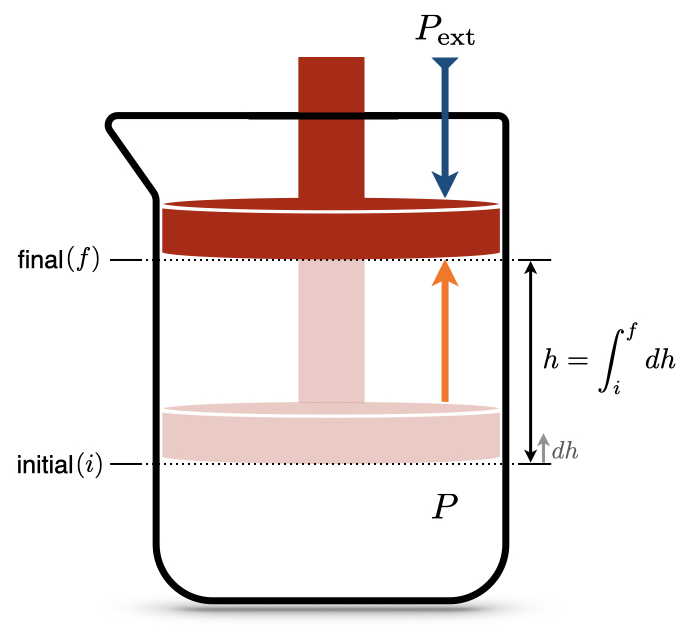

# Zeroth Law of Thermodynamics {#ZerothLaw}

## What is Thermodynamics? 
Thermodynamics is the branch of science that deals with heat and work, and their relation to energy. As the definition suggests, thermodynamics is concerned with two types of energy: heat and work. A formal definition of these forms of energy is as follows:

- Work is exchanged if external parameters are changed during the process. 
- Heat is exchanged if only internal parameters are changed during the process.

As we saw in chapter \@ref(SystemVariables), heat and work are not “well-behaved” quantities because they are path functions. On the one hand, it might be simple to measure the amount of heat and/or work experimentally, these measured quantities cannot be used to define the state of a system. Since heat and work are path functions, their values depend directly on the methods used to transfer them (their paths). Understanding and quantifying these energy transfers is the reason why thermodynamics was developed in the first place. The origin of thermodynamics dates back to the seventeenth century when people began to use heat and work for technological applications. These early scientists needed a mathematical tool to understand how heat and work were related to each other, and how they were related to the other variables that they were able to measure, such as temperature and volume.

Before we even discuss the definition of energy and how it relates to heat and work, it is crucial to introduce the essential concept of temperature. Temperature is an intuitive concept that has a surprisingly complex definition at the microscopic level.^[In fact, we will not even give a rigorous microscopic definition of temperature within this textbook.] However, for all our purposes, it is not essential to have a microscopic definition of temperature, as long as we have the guarantee that this quantity can be measured unambiguously. In other words, we only need a mathematical definition of temperature that agrees with the physical existence of thermometers.

## The Zeroth Law of Thermodynamics
The mathematical definition that guarantees that thermal equilibrium is an equivalence relation is called the zeroth law of thermodynamics. The zeroth law of thermodynamics states that if two thermodynamic systems are each in thermal equilibrium with a third one, then they are in thermal equilibrium with each other. The law might appear trivial and possibly redundant, but it is a fundamental requirement for the mathematical formulation of thermodynamics, so it needs to be stated. The zeroth law can be summarized by the following simple mathematical relation:

> ```{definition, zerothlaw}
*Zeroth Law of Thermodynamics:* If $T_A = T_B$, and $T_B = T_C$, then $T_A = T_C$.

```

Notice that when we state the zeroth law, it appears intuitive. However, this is not necessarily the case. Let’s, for example, consider a pot of boiling water at $P=1\;\mathrm{bar}$. Its temperature, $T_{H_2O}$, is about 373 K. Let’s now submerge in this water a coin made of wood and another coin made of metal. After some sufficient time, the wood coin will be in thermal equilibrium with the water, and its temperature $T_W = T_{H_2O}$. Similarly, the metal coin will also be in thermal equilibrium with the water, hence $T_M = T_{H_2O}$. According to the zeroth law, the temperature of the wood coin and that of the metal coin are precisely the same $T_W = T_M = 373\;\mathrm{K}$, even if they are not in direct contact with each other. Now here’s the catch: since wood and metal transmit heat in different manners if I take the coins out of the water and put them immediately in your hands, one of them will be very hot, but the other will burn you. If you had to guess the temperature of the two coins without a thermometer, and without knowing that they were immersed in boiling water, would you suppose that they have the same temperature? Probably not.

## Calculation of Heat {#heatint}

Heat ($Q$) is a property that gets transferred between substances. Similarly to work, the amount of heat that flows through a boundary can be measured, but its mathematical treatment is complicated because *heat is a path function*.
As you probably recall from general chemistry, the ability of a substance to absorb heat is given by a coefficient called the heat capacity, which is measured in SI in $\frac{\text{J}}{\text{mol K}}$. However, since heat is a path function, these coefficients are not unique, and we have different ones depending on how the heat transfer happens.

### Processes at constant volume (isochoric)
The heat capacity at constant volume measures the ability of a substance to absorb heat at constant volume. Recasting from general chemistry:

> The molar heat capacity at constant volume is the amount of heat required to increase the temperature of 1 mol of a substance by 1 K at constant volume.

This simple definition can be written in mathematical terms as:

\begin{equation}
  C_V = \frac{đ Q_V}{n dT} \Rightarrow đ Q_V = n C_V dT.
  (\#eq:Cvdef)
\end{equation}

Given a known value of $C_V$, the amount of heat that gets transfered can be easily calculated by measuring the changes in temperature, after integration of eq. \@ref(eq:Cvdef):

\begin{equation}
  đ Q_V = n C_V dT \rightarrow \int đ Q_V = n \int_{T_i}^{T_F}C_V dT \rightarrow Q_V = n C_V \int_{T_i}^{T_F}dT,
  (\#eq:Cvint1)
\end{equation}

which, assuming $C_V$ independent of temperature, simply becomes:

\begin{equation}
  Q_V \cong n C_V \Delta T.
  (\#eq:Cvint)
\end{equation}


### Processes at constant pressure (isobaric) {#heatconstp}
Similarly to the previous case, the heat capacity at constant pressure measures the ability of a substance to absorb heat at constant pressure. Recasting again from general chemistry:

> The molar heat capacity at constant pressure is the amount of heat required to increase the temperature of 1 mol of a substance by 1 K at constant pressure.

And once again, this mathematical treatment follows:

\begin{equation}
  C_P = \frac{đ Q_P}{n dT} \Rightarrow đ Q_P = n C_P dT \rightarrow \int đ Q_P = n \int_{T_i}^{T_F}C_P dT,
  (\#eq:Cpdef)
\end{equation}

which result in the simple formula:

\begin{equation}
  Q_P \cong n C_P \Delta T.
  (\#eq:Cpint)
\end{equation}

## Calculation of Work {#workint}
In thermodynamics, work ($W$) is the ability of a system to transfer energy by exerting a force on its surroundings. Work can be measured simply by evaluating its effects, such as displacing a massive object by some amount of space. The mathematical treatment of work, however, is complicated because *work is a path function*. In the following sections, we will analyze how work is calculated in some prototypical situations commonly encountered in the thermodynamical treatment of systems.  

```{r Fig2c3, out.width='50%', fig.show='hold', echo=FALSE, fig.align = 'center', fig.cap='Isothermal Expansion of an Ideal Gas Against a Constant External Pressure.'}

```

Let's consider the situation in Figure \@ref(fig:Fig2c3), where a special beaker with a piston that is free to move is filled with an ideal gas. The beaker sits on a desk, so the piston is not subject to any external forces other than the external pressure, $P_{\text{ext}}$, and the internal pressure of the gas, $P$.^[For this simple thought experiment, we will ignore any external force that is not significant. In other words, we will not consider the friction of the piston on the beaker walls or any other foreign influence.] The piston is initially compressed to a position that is not in equilibrium $(i)$. After the process, the piston reaches a final equilibrium position $(f)$. How do we calculate the work ($W$) performed by the system?

From basic physics, we recall that the infinitesimal amount of work associated with an object moving in space is given by the force acting on the object ($F$) multiplied by the infinitesimal amount it gets displaced ($d h$):

\begin{equation}
  đ W = - Fdh,
  (\#eq:Wphysics)
\end{equation}

where the negative sign comes from the chemistry sign convention, Definition \@ref(def:chemistryconv), since the work in Figure  \@ref(fig:Fig2c3) is *performed* by the system (expansion). What kind of force is moving the piston? It is the force due to the pressure of the gas. Relying upon another definition from physics, the pressure is the ratio between the force ($F$) and the area ($A$) that such force acts upon:

\begin{equation}
  P = F/A.
  (\#eq:Pphysics)
\end{equation}

Obtaining $F$ from eq. \@ref(eq:Pphysics) and replacing it in eq. \@ref(eq:Wphysics), we obtain:

\begin{equation}
  đ W = - P \underbrace{Adh}_{dV},
  (\#eq:Wphysics2)
\end{equation}

and considering that $Adh$ (area times infinitesimal height) is the definition of an infinitesimal volume $dV$, we obtain:

\begin{equation}
  đ W = - PdV,
  (\#eq:Wdef)
\end{equation}

If we want to calculate the amount of work performed by a system, $W$, from eq. \@ref(eq:Wdef), we need to recall that $đ W$ is an inexact differential. As such, we cannot integrate it from initial to final as for the (exact) differential of a state function, because:

\begin{equation}
  \int_{i}^{f}đ W \neq W_f - W_i,
  (\#eq:Wdiff)
\end{equation}

but rather:

\begin{equation}
  \int_{\text{path}} đ W = W,
  (\#eq:Wdiff2)
\end{equation}

where the integration is performed along the *path*. Using eq. \@ref(eq:Wdiff2), we can integrate eq. \@ref(eq:Wdef) as:

\begin{equation}
  \int đ W = W = - \int_{i}^{f} PdV,
  (\#eq:Wint)
\end{equation}

where the integral on the left-hand side is taken along the path,^[from here on we will replace the notation $\int_{\text{path}}$ with the more convenient $\int$ and we will keep in mind that the integral of an inexact differential must be taken along the path.] while the integral on the right-hand side can be taken between the initial and final states, since $dV$ is a state function.
How do we solve the integral in eq. \@ref(eq:Wint)? It turns out that there are many different ways to solve this integral (perhaps not surprisingly, since the left-hand side depends on the path), which we will explore in the next section.


### $| W_{\text{max}} |$ and  $| W_{\text{min}} |$ in processes at constant temperature (isothermal)
At constant temperature, the piston in Figure \@ref(fig:Fig2c3) moves along the following PV diagram (this curve is obtained from an ideal gas at constant $T=298$ K):

```{r, echo=FALSE, fig.align='center',fig.asp = .62, out.width="70%"}
x <- seq(0,1.25,0.01)
i <- 0.25
f <- 1
par(mar=c(4,4,1,4))
plot(x, 0.081*298/x,
     ylim=c(0, 150),
     type="l",
     ylab = "Pressure [bar]", xlab = "Volume [L]", col = "#2E9FDF")
points(i, 0.081*298/i, col="red", pch=19)
points(f, 0.081*298/f, col="red", pch=19)

arrows(i, 0.081*298/i, i, -10 , length=0, angle=90, code=3, lty="dotted")
arrows(i, 0.081*298/i, -10, 0.081*298/i , length=0, angle=90, code=3, lty="dotted")
arrows(f, 0.081*298/f, f, -10 , length=0, angle=90, code=3, lty="dotted")
arrows(f, 0.081*298/f, -10, 0.081*298/f , length=0, angle=90, code=3, lty="dotted")


 text(0.025+i, 5+0.081*298/i, "i")
 text(0.025+f, 8+0.081*298/f, "f")
 
 text(i-0.025, 0, expression('V'[i]))
 text(f+0.025, 0, expression('V'[f]))  
 text(-0.025, 5+0.081*298/i, expression('P'[i]))
 text(-0.025, 0.081*298/f-5, expression('P'[f]))  

```

An expansion of the gas will happen between $P_i$ and $P_f$. If the expansion happens in a one-step fast process, for example against external atmospheric pressure, then we can consider such final pressure constant (for example $P_f=P_{\text{ext}} =1\;\mathrm{bar}$), and solve the integral as: 

\begin{equation}
  W_{\text{1-step}} = - \int_{i}^{f} P_{\text{ext}}dV = -P_{\text{ext}} \int_{i}^{f} dV = -P_{\text{ext}} (V_f-V_i),
  (\#eq:Wint3)
\end{equation}

Notice how the work is negative, since during an expansion the work is performed by the system (recall the chemistry sign convention). The absolute value of the work^[we use the absolute value to avoid confusions due to the fact that the expansion work is negative according to Definition \@ref(def:chemistryconv).] represents the red area of the PV-diagram:

```{r, echo=FALSE, fig.align='center',fig.asp = .62, out.width="70%"}
x <- seq(0,1.25,0.01)
i <- 0.2
f <- 1
par(mar=c(4,4,1,4))
plot(x, 0.081*298/x,
     ylim=c(0, 150),
     type="l",
     ylab = "Pressure [bar]", xlab = "Volume [L]", col = "#2E9FDF")
points(i, 0.081*298/i, col="red", pch=19)
points(f, 0.081*298/f, col="red", pch=19)

arrows(i, 0.081*298/i, i, -10 , length=0, angle=90, code=3, lty="dotted")
arrows(i, 0.081*298/i, -10, 0.081*298/i , length=0, angle=90, code=3, lty="dotted")
arrows(f, 0.081*298/f, f, -10 , length=0, angle=90, code=3, lty="dotted")
arrows(f, 0.081*298/f, -10, 0.081*298/f , length=0, angle=90, code=3, lty="dotted")

rect(i,i, f, 0.081*298/f, density = 20, angle = 45,
     col = "red", border = NULL, lty = par("lty"), lwd = par("lwd"))


 text(0.025+i, 5+0.081*298/i, "i")
 text(0.025+f, 8+0.081*298/f, "f")
 
 text(i-0.025, 0, expression('V'[i]))
 text(f+0.025, 0, expression('V'[f]))  
 text(-0.025, 5+0.081*298/i, expression('P'[i]))
 text(-0.025, 0.081*298/f-5, expression('P'[f]))  
 


 legend(0.48,22, expression(P[f]*(V[f]-V[i])),box.col = "white", bg = "white", adj=0.15)

```

\begin{equation}
\left| W_{\text{1-step}} \right| = P_{\text{ext}} (V_f-V_i)
  (\#eq:Warea1)
\end{equation}

If the process happens in two steps by pausing at an intermediate position (1) until equilibrium is reached, then we should calculate the work by dividing it into two separate processes, $A$ and $B$, and solve each one as we did in the previous case. The first process is an expansion between $P_i$ and $P_1$, with $P_1$ constant. The absolute value of the work, $W_A$, is represented by the blue area:

```{r, echo=FALSE, fig.align='center',fig.asp = .62, out.width="70%"}
x <- seq(0,1.25,0.01)
i <- 0.2
f <- 1
p1 <- 0.5
par(mar=c(4,4,1,4))
plot(x, 0.081*298/x,
     ylim=c(0, 150),
     type="l",
     ylab = "Pressure [bar]", xlab = "Volume [L]", col = "#2E9FDF")
points(i, 0.081*298/i, col="red", pch=19)
points(f, 0.081*298/f, col="red", pch=19)
points(p1, 0.081*298/p1, col="red", pch=19)

arrows(i, 0.081*298/i, i, -10 , length=0, angle=90, code=3, lty="dotted")
arrows(i, 0.081*298/i, -10, 0.081*298/i , length=0, angle=90, code=3, lty="dotted")
arrows(f, 0.081*298/f, f, -10 , length=0, angle=90, code=3, lty="dotted")
arrows(f, 0.081*298/f, -10, 0.081*298/f , length=0, angle=90, code=3, lty="dotted")
arrows(p1, 0.081*298/p1, p1, -10 , length=0, angle=90, code=3, lty="dotted")
arrows(p1, 0.081*298/p1, -10, 0.081*298/p1 , length=0, angle=90, code=3, lty="dotted")

rect(i,i, p1, 0.081*298/p1, density = 20, angle = 45,
     col = "blue", border = NULL, lty = par("lty"), lwd = par("lwd"))


 text(0.025+i, 5+0.081*298/i, "i")
 text(0.025+f, 8+0.081*298/f, "f")
 text(0.025+p1, 8+0.081*298/p1, "1")
 
 text(i-0.025, 0, expression('V'[i]))
 text(-0.025, 5+0.081*298/i, expression('P'[i]))
 text(f+0.025, 0, expression('V'[f]))
 text(-0.025, 0.081*298/f-5, expression('P'[f]))  
 text(p1+0.025, 0, expression('V'[1]))
 text(-0.025, 0.081*298/p1-5, expression('P'[1]))  
   


 legend(0.205,35, expression(P[1]*(V[1]-V[i])),box.col = "white", bg = "white", adj=0.15)

```

\begin{equation}
\left| W_A \right| = P_1 (V_1-V_i)
  (\#eq:Warea2)
\end{equation}

The second process is an expansion between $P_1$ and $P_f$, with $P_f=P_{\text{ext}}$ constant. The absolute value of the work for this second process is represented by the green area:

```{r, echo=FALSE, fig.align='center',fig.asp = .62, out.width="70%"}
x <- seq(0,1.25,0.01)
i <- 0.2
f <- 1
p1 <- 0.5
par(mar=c(4,4,1,4))
plot(x, 0.081*298/x,
     ylim=c(0, 150),
     type="l",
     ylab = "Pressure [bar]", xlab = "Volume [L]", col = "#2E9FDF")
points(i, 0.081*298/i, col="red", pch=19)
points(f, 0.081*298/f, col="red", pch=19)
points(p1, 0.081*298/p1, col="red", pch=19)

arrows(i, 0.081*298/i, i, -10 , length=0, angle=90, code=3, lty="dotted")
arrows(i, 0.081*298/i, -10, 0.081*298/i , length=0, angle=90, code=3, lty="dotted")
arrows(f, 0.081*298/f, f, -10 , length=0, angle=90, code=3, lty="dotted")
arrows(f, 0.081*298/f, -10, 0.081*298/f , length=0, angle=90, code=3, lty="dotted")
arrows(p1, 0.081*298/p1, p1, -10 , length=0, angle=90, code=3, lty="dotted")
arrows(p1, 0.081*298/p1, -10, 0.081*298/p1 , length=0, angle=90, code=3, lty="dotted")

rect(p1,p1, f, 0.081*298/f, density = 20, angle = 45,
     col = "green", border = NULL, lty = par("lty"), lwd = par("lwd"))


 text(0.025+i, 5+0.081*298/i, "i")
 text(0.025+f, 8+0.081*298/f, "f")
 text(0.025+p1, 8+0.081*298/p1, "1")
 
 text(i-0.025, 0, expression('V'[i]))
 text(-0.025, 5+0.081*298/i, expression('P'[i]))
 text(f+0.025, 0, expression('V'[f]))
 text(-0.025, 0.081*298/f-5, expression('P'[f]))  
 text(p1-0.025, 0, expression('V'[1]))
 text(-0.025, 0.081*298/p1-5, expression('P'[1]))  
   


 legend(0.63,22, expression(P[f]*(V[f]-V[1])),box.col = "white", bg = "white", adj=0.15)

```

\begin{equation}
\left| W_B \right| = P_f (V_f-V_1)
  (\#eq:Warea3)
\end{equation}


The total absolute value of the work for the 2-step process is given by the sum of the two areas:

```{r, echo=FALSE, fig.align='center',fig.asp = .62, out.width="70%"}
x <- seq(0,1.25,0.01)
i <- 0.2
f <- 1
p1 <- 0.5
par(mar=c(4,4,1,4))
plot(x, 0.081*298/x,
     ylim=c(0, 150),
     type="l",
     ylab = "Pressure [bar]", xlab = "Volume [L]", col = "#2E9FDF")
points(i, 0.081*298/i, col="red", pch=19)
points(f, 0.081*298/f, col="red", pch=19)
points(p1, 0.081*298/p1, col="red", pch=19)

arrows(i, 0.081*298/i, i, -10 , length=0, angle=90, code=3, lty="dotted")
arrows(i, 0.081*298/i, -10, 0.081*298/i , length=0, angle=90, code=3, lty="dotted")
arrows(f, 0.081*298/f, f, -10 , length=0, angle=90, code=3, lty="dotted")
arrows(f, 0.081*298/f, -10, 0.081*298/f , length=0, angle=90, code=3, lty="dotted")
arrows(p1, 0.081*298/p1, p1, -10 , length=0, angle=90, code=3, lty="dotted")
arrows(p1, 0.081*298/p1, -10, 0.081*298/p1 , length=0, angle=90, code=3, lty="dotted")

rect(i,i, p1, 0.081*298/p1, density = 20, angle = 45,
     col = "darkgrey", border = NULL, lty = par("lty"), lwd = par("lwd"))
rect(p1,p1, f, 0.081*298/f, density = 20, angle = 45,
     col = "darkgrey", border = NULL, lty = par("lty"), lwd = par("lwd"))


 text(0.025+i, 5+0.081*298/i, "i")
 text(0.025+f, 8+0.081*298/f, "f")
 text(0.025+p1, 8+0.081*298/p1, "1")
 
 text(i-0.025, 0, expression('V'[i]))
 text(-0.025, 5+0.081*298/i, expression('P'[i]))
 text(f+0.025, 0, expression('V'[f]))
 text(-0.025, 0.081*298/f-5, expression('P'[f]))  
 
 legend(0.45,22, expression(abs(W[2-step])),box.col = "white", bg = "white", adj=0.15)


```

\begin{equation}
  \left| W_{\text{2-step}} \right| = \left| W_A \right| + \left| W_B \right| = P_1 (V_1-V_i)+P_f (V_f-V_1).
  (\#eq:Warea4)
\end{equation}

As can be easily verified by comparing the shaded areas in the plots, $\left| W_{\text{2-step}} \right| > \left| W_{\text{1-step}} \right|$.

We can easily extend this procedure to consider processes that happens in 3, 4, 5, ..., $n$ steps. What is the limit of this procedure? In other words, what happens when $n \rightarrow \infty$? A simple answer is given by the plots in the next Figure, which clearly demonstrates that the maximum value of the area underneath the curve $\left| W_{\text{max}}\right|$ is achieved in an $\infty$-step process, for which the work is calculated as:

\begin{equation}
  \left| W_{\infty \text{-step}} \right| = \left| W_{\text{max}} \right| = \sum_{n}^{\infty} P_n(V_n-V_{n-1}) = \int_{i}^{f} PdV.
  (\#eq:WintsolvedV2)
\end{equation}


```{r, echo=FALSE, figures-side, fig.show="hold", out.width="50%",out.height="100%"}
x <- seq(0,1.25,0.01)
i <- 0.2
f <- 1
p2 <- 0.3
p3 <- 0.4
p1 <- 0.5
p4 <- 0.6
p5 <- 0.7
p6 <- 0.8
p7 <- 0.9

plot(x, 0.081*298/x,
     ylim=c(0, 150),
     type="l",
     ylab = "Pressure [bar]", xlab = "Volume [L]", col = "#2E9FDF")
points(i, 0.081*298/i, col="red", pch=19)
points(f, 0.081*298/f, col="red", pch=19)

arrows(i, 0.081*298/i, i, -10 , length=0, angle=90, code=3, lty="dotted")
arrows(i, 0.081*298/i, -10, 0.081*298/i , length=0, angle=90, code=3, lty="dotted")
arrows(f, 0.081*298/f, f, -10 , length=0, angle=90, code=3, lty="dotted")
arrows(f, 0.081*298/f, -10, 0.081*298/f , length=0, angle=90, code=3, lty="dotted")

rect(i,i, f, 0.081*298/f, density = 20, angle = 45,
     col = "red", border = NULL, lty = par("lty"), lwd = par("lwd"))


 text(0.025+i, 5+0.081*298/i, "i")
 text(0.025+f, 8+0.081*298/f, "f")
 
 text(i-0.025, 0, expression('V'[i]))
 text(f+0.025, 0, expression('V'[f]))  
 text(-0.025, 5+0.081*298/i, expression('P'[i]))
 text(-0.025, 0.081*298/f-5, expression('P'[f]))  
 


 legend(0.48,22, expression(abs(W[1-step])),box.col = "white", bg = "white", adj=0.15)


plot(x, 0.081*298/x,
     ylim=c(0, 150),
     type="l",
     ylab = "Pressure [bar]", xlab = "Volume [L]", col = "#2E9FDF")
points(i, 0.081*298/i, col="red", pch=19)
points(f, 0.081*298/f, col="red", pch=19)
points(p1, 0.081*298/p1, col="red", pch=19)

arrows(i, 0.081*298/i, i, -10 , length=0, angle=90, code=3, lty="dotted")
arrows(i, 0.081*298/i, -10, 0.081*298/i , length=0, angle=90, code=3, lty="dotted")
arrows(f, 0.081*298/f, f, -10 , length=0, angle=90, code=3, lty="dotted")
arrows(f, 0.081*298/f, -10, 0.081*298/f , length=0, angle=90, code=3, lty="dotted")
arrows(p1, 0.081*298/p1, p1, -10 , length=0, angle=90, code=3, lty="dotted")
arrows(p1, 0.081*298/p1, -10, 0.081*298/p1 , length=0, angle=90, code=3, lty="dotted")

rect(i,i, p1, 0.081*298/p1, density = 20, angle = 45,
     col = "darkgrey", border = NULL, lty = par("lty"), lwd = par("lwd"))
rect(p1,p1, f, 0.081*298/f, density = 20, angle = 45,
     col = "darkgrey", border = NULL, lty = par("lty"), lwd = par("lwd"))


 text(0.025+i, 5+0.081*298/i, "i")
 text(0.025+f, 8+0.081*298/f, "f")
 text(0.025+p1, 8+0.081*298/p1, "1")
 
 text(i-0.025, 0, expression('V'[i]))
 text(-0.025, 5+0.081*298/i, expression('P'[i]))
 text(f+0.025, 0, expression('V'[f]))
 text(-0.025, 0.081*298/f-5, expression('P'[f]))  
 
 legend(0.45,22, expression(abs(W[2-step])),box.col = "white", bg = "white", adj=0.15)


plot(x, 0.081*298/x,
     ylim=c(0, 150),
     type="l",
     ylab = "Pressure [bar]", xlab = "Volume [L]", col = "#2E9FDF")
points(i, 0.081*298/i, col="red", pch=19)
points(f, 0.081*298/f, col="red", pch=19)

arrows(i, 0.081*298/i, i, -10 , length=0, angle=90, code=3, lty="dotted")
arrows(i, 0.081*298/i, -10, 0.081*298/i , length=0, angle=90, code=3, lty="dotted")
arrows(f, 0.081*298/f, f, -10 , length=0, angle=90, code=3, lty="dotted")
arrows(f, 0.081*298/f, -10, 0.081*298/f , length=0, angle=90, code=3, lty="dotted")
arrows(p1, 0.081*298/p1, p1, -10 , length=0, angle=90, code=3, lty="dotted")
arrows(p1, 0.081*298/p1, -10, 0.081*298/p1 , length=0, angle=90, code=3, lty="dotted")

rect(i,i, p2, 0.081*298/p2, density = 20, angle = 45,
     col = "darkblue", border = NULL, lty = par("lty"), lwd = par("lwd"))
rect(p2,p2, p3, 0.081*298/p3, density = 20, angle = 45,
     col = "darkblue", border = NULL, lty = par("lty"), lwd = par("lwd"))
rect(p3,p3, p1, 0.081*298/p1, density = 20, angle = 45,
     col = "darkblue", border = NULL, lty = par("lty"), lwd = par("lwd"))
rect(p1,p1, p4, 0.081*298/p4, density = 20, angle = 45,
     col = "darkblue", border = NULL, lty = par("lty"), lwd = par("lwd"))
rect(p4,p4, p5, 0.081*298/p5, density = 20, angle = 45,
     col = "darkblue", border = NULL, lty = par("lty"), lwd = par("lwd"))
rect(p5,p5, p6, 0.081*298/p6, density = 20, angle = 45,
     col = "darkblue", border = NULL, lty = par("lty"), lwd = par("lwd"))
rect(p6,p6, p7, 0.081*298/p7, density = 20, angle = 45,
     col = "darkblue", border = NULL, lty = par("lty"), lwd = par("lwd"))
rect(p7,p7, f, 0.081*298/f, density = 20, angle = 45,
     col = "darkblue", border = NULL, lty = par("lty"), lwd = par("lwd"))

 text(0.025+i, 5+0.081*298/i, "i")
 text(0.025+f, 8+0.081*298/f, "f")
 
 text(i-0.025, 0, expression('V'[i]))
 text(-0.025, 5+0.081*298/i, expression('P'[i]))
 text(f+0.025, 0, expression('V'[f]))
 text(-0.025, 0.081*298/f-5, expression('P'[f]))  
 
 legend(0.45,22, expression(abs(W[n-step])),box.col = "white", bg = "white", adj=0.15)


plot(x, 0.081*298/x,
     ylim=c(0, 150),
     type="l",
     ylab = "Pressure [bar]", xlab = "Volume [L]", col = "#2E9FDF")
points(i, 0.081*298/i, col="red", pch=19)
points(f, 0.081*298/f, col="red", pch=19)

arrows(i, 0.081*298/i, i, -10 , length=0, angle=90, code=3, lty="dotted")
arrows(i, 0.081*298/i, -10, 0.081*298/i , length=0, angle=90, code=3, lty="dotted")
arrows(f, 0.081*298/f, f, -10 , length=0, angle=90, code=3, lty="dotted")
arrows(f, 0.081*298/f, -10, 0.081*298/f , length=0, angle=90, code=3, lty="dotted")


 text(0.025+i, 5+0.081*298/i, "i")
 text(0.025+f, 8+0.081*298/f, "f")
 
 text(i-0.025, 0, expression('V'[i]))
 text(f+0.025, 0, expression('V'[f]))  
 text(-0.025, 5+0.081*298/i, expression('P'[i]))
 text(-0.025, 0.081*298/f-5, expression('P'[f]))  
 

cord.1x <- c(i,seq(i,f,0.01),f) 
cord.1y <- c(0,0.081*298/(seq(i,f,0.01)),0) 
# Make a curve
#curve(dnorm(x,0,1), xlim=c(-3,3), main='Standard Normal',lwd=2) 
# Add the shaded area.
polygon(cord.1x,cord.1y,col='grey60')

 legend(0.52 ,29, expression(abs(W[max])),box.col = "white", bg = "white", adj=0.25)


```

The integral on the right hand side of eq. \@ref(eq:WintsolvedV2) can be solved for an ideal gas by calculating the pressure using the ideal gas law $P=\frac{nRT}{V}$, and solving the integral since $n$, $R$, and $T$ are constant:

\begin{equation}
  \left| W_{\text{max}} \right| = nRT \int_{i}^{f} \frac{dV}{V} = nRT \ln \frac{V_f}{V_i}.
  (\#eq:WmaxV)
\end{equation}

This example demonstrates why work is a path function. If we perform a fast 1-step expansion, the system will perform an amount of work that is much smaller than the amount of work it can perform if the expansion between the same points happens slowly in an $\infty$-step process.

The same considerations that we made up to this point for expansion processes hold specularly for compression ones. The only difference is that the work associated with compressions will have a positive sign since it must be performed onto the system. As such, the amount of work for a transformation that happens in a finite amount of steps will be an upper bound to the minimum amount of work required to compress the system.^[In contrast to a lower bound for expansion processes.] $\left| W_{\text{min}} \right|$ for compressions is calculated as the area underneath the $PV$ curve, exactly as $\left| W_{\text{max}} \right|$ for expansions in eq. \@ref(eq:WintsolvedV2).

