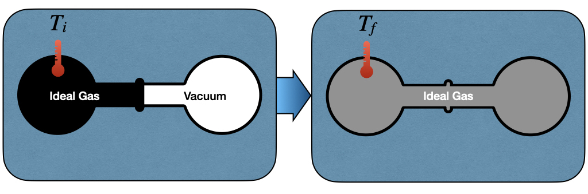
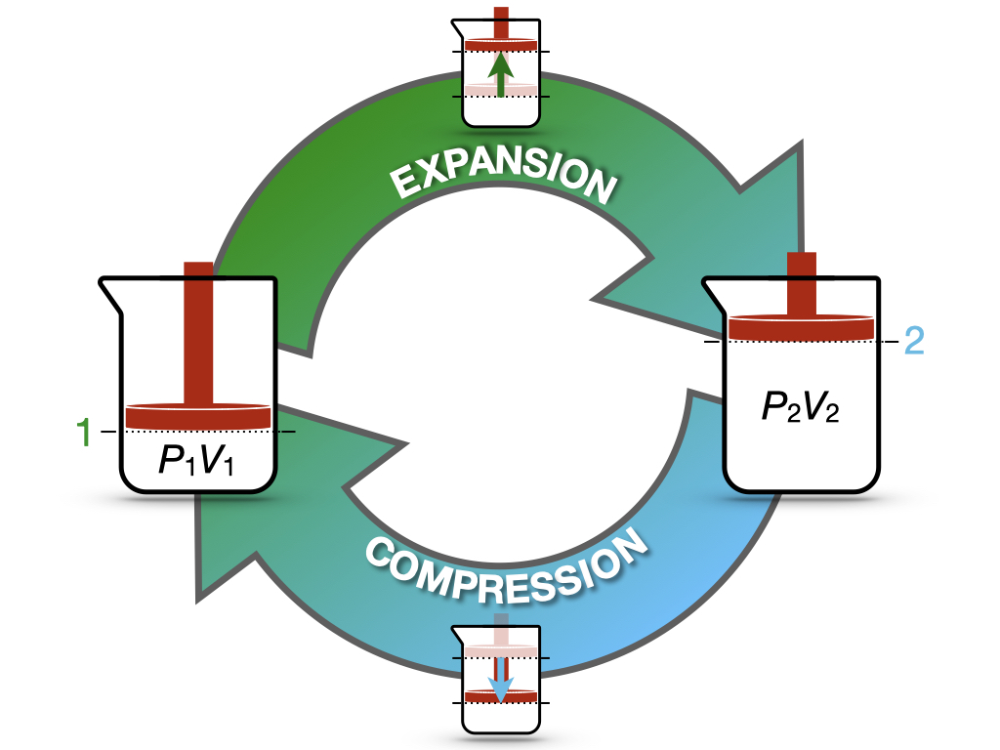

# First Law of Thermodynamics {#FirstLaw}

## Calculation of Internal Energy Changes {#energyint}

The internal energy ($U$) of a system is a thermodynamic state function defined as:

> ```{definition, energy}
*Internal Energy:* Property of a system that can be either transferred or converted.


```

In the absence of chemical transformations, heat and work are the only two forms of energy that thermodynamics is concerned with. Keeping in mind Definition \@ref(def:chemistryconv), which gives the convention for the signs of heat and work, the internal energy of a system can be written as:

\begin{equation}
  U = Q + W,
  (\#eq:U)
\end{equation}

which we can write in differential form by considering that the internal energy is a state function, as:
\begin{equation}
  dU = đ Q + đ W,
  (\#eq:dU)
\end{equation}

which, using eq. \@ref(eq:Wdef) becomes:

\begin{equation}
  dU = đ Q - PdV.
  (\#eq:dUpdv)
\end{equation}

### Internal energy in isothermal processes {#isothermalE}
To study the behavior of the internal energy in a process at constant temperature ($dT=0$), James Prescott Joule (1818–1889) created the apparatus depicted in Figure \@ref(fig:FigJexp).

```{r FigJexp, out.width='80%', fig.show='hold', echo=FALSE, fig.align = 'center', fig.cap='The Joule Expansion Experiment.'}

```

The left side of the Joule apparatus's inner chamber is filled with an ideal gas, while a vacuum is created in the right chamber. Both chambers are immersed in a water bath, to guarantee isolation from the environment. When the communication channel between the chambers is open, the gas expands and equilibrates. The work associated with the transformation is:

\begin{equation}
  đ W=-P_{\text{ext}}dV = 0,
  (\#eq:JexpW)
\end{equation}

since the chambers are not in communication with the environment, $P_{\text{ext}}=0$. Thus, changes in internal energy are associated with the heat transfer of the process, which can be measured by monitoring the temperature of the gas at the beginning, $T_i$, and at the end of the experiment $T_f$. Joule noticed experimentally that if he used an ideal gas for this experiment, the temperature would not change $T_i = T_f$. Since the temperature doesn't change, there is no heat transfer, and therefore the internal energy stays constant:

\begin{equation}
  dU = đ Q = 0.
  (\#eq:JexpQU)
\end{equation}

> Notice that Joule's conclusion is valid only for an ideal gas. If we expand a real gas, we do notice a change in temperature associated with the expansion. A typical example of this behavior is when you use a pressurized spray bottle and release its content for an extended time in the air. The container will typically get colder. We will discuss this behavior in chapter \@ref(RealGases) when we will study non-ideal gases. 

From this simple experiment, we can conclude that the internal energy of an ideal gas depends only on its temperature. 


### Internal energy in adiabatic processes 
An adiabatic process is defined as a process that happens without the exchange of heat. As such, $đ Q=0$, and the work associated with an adiabatic process becomes a state function:

\begin{equation}
  dU=đ W=-PdV,
  (\#eq:dUadiabatic)
\end{equation}

which can then be calculated using the formulas that we derived in section \@ref(workint). Notice that isothermal and adiabatic are two very different processes. While an adiabatic process happens without the exchange of heat across the system's boundaries, this does not mean that the system's temperature does not change. Isothermal processes are usually associated with a heat transfer across the boundaries to maintain the temperature of the system constant. For adiabatic processes, it is quite the opposite since they are usually associated with a change in temperature.

### Internal energy in isochoric processes
An isocoric process is a process in which the volume does not change. Therefore, $đ W=0$, and $dU = đ Q_V$, which for 1 mol of substance and using eq. \@ref(eq:Cvdef), becomes:

\begin{equation}
  dU = đ Q_V = n C_V dT.
  (\#eq:dUqv)
\end{equation}

Since no work is performed at these conditions, the heat becomes a state function. Eq. \@ref(eq:dUqv) also gives a mathematical justification of the concept of heat capacity at constant volume. $C_V$ can now be interpreted as the partial derivative (a coefficient) of a state function (the internal energy):

\begin{equation}
  C_V = \left( \frac{\partial U} {\partial T} \right)_{V,n},
  (\#eq:cvstatefunc)
\end{equation}

where we have replaced the total derivative $d$ with a partial one $\partial$, and we have specified that the derivation happens at constant volume and number of moles. Eq. \@ref(eq:cvstatefunc)  equation brings a rigorous definition of heat capacity at constant volume for 1 mol of substance:

> ```{definition, newdefcv}
*The heat capacity of a substance, $C_V$, represents its ability to absorb **energy** at constant **volume**.*
```

### Internal energy in isobaric processes {#enthalpy}
In an isobaric process, the pressure does not change, hence $dP=0$. Unfortunately, eq. \@ref(eq:dU) for this case does not simplify further, as happened in the two previous cases. However, in section \@ref(heatconstp), we have introduced the useful concept of heat capacity at constant $P$. $C_P$ was used in an adiabatic process in the same manner as $C_V$ was used in the isochoric case. That is, as a coefficient to measure the amount of heat absorbed at constant pressure. Eq. \@ref(eq:cvstatefunc) gave a mathematical definition of $C_V$ as the partial derivative of a state function (the internal energy). But if heat capacities are coefficients, and coefficients are partial derivatives of state functions, how do we explain $C_P$? In order to do so, we can introduce a new state function, called the enthalpy ($H$), as:

\begin{equation}
  H = U + PV,
  (\#eq:enthalpydef)
\end{equation}

and its differential, calculated as:

\begin{equation}
  dH = dU + d(PV) = dU + PdV + \overbrace{VdP}^{0},
  (\#eq:enthalpydefdiff)
\end{equation}

which can be rearranged as:

\begin{equation}
  dU = dH -PdV,
  (\#eq:enthalpydefdiffu)
\end{equation}

Replacing eq. \@ref(eq:enthalpydefdiffu) into eq. \@ref(eq:dUpdv):

\begin{equation}
  dH -PdV = đ Q_P - PdV,
  (\#eq:dh1)
\end{equation}

which simplifies to:

\begin{equation}
  dH = đ Q_P.
  (\#eq:dh2)
\end{equation}

Eq. \@ref(eq:dh2) establishes that the heat exchanged at constant pressure is equal to a new state function called the enthalpy, defined by eq. \@ref(eq:enthalpydef). It also establishes a mathematical justification of the concept of heat capacity at constant pressure. Similarly to $C_V$, $C_P$ can now be interpreted as the partial derivative (a coefficient) of the new state function (the enthalpy):

\begin{equation}
  C_P = \left( \frac{\partial H} {\partial T} \right)_{P,n},
  (\#eq:cpstatefunc)
\end{equation}

Eq. \@ref(eq:cpstatefunc) brings also a rigorous definition of heat capacity at constant pressure for 1 mol of substance:

> ```{definition, newdefcp}
*The heat capacity of a substance, $C_P$, represents its ability to absorb **enthalpy** at constant **pressure**.*
```

## The First Law of Thermodynamics
We finally come to a working definition of the first law. If we take an isolated system—i.e., a system that does not exchange heat nor mass with its surroundings—its internal energy is conserved. If the internal energy is conserved, $dU=0$. Therefore, for an isolated system:

\begin{equation}
  đ Q = -đ W,
  (\#eq:heateqwork)
\end{equation}

and heat and work can be easily calculated using any of the appropriate formulas introduced in either section \@ref(workint) or \@ref(heatint).

The first law is a conservation law. It is intuitive since it comes directly from Lavoisier's principle of "nothing is lost, nothing is created, everything is transformed." Considering that the only system that is truly isolated is the universe, we can condense the first law in one simple sentence:

> ```{definition, firstlaw}
*First Law of Thermodynamics:* The energy of the universe is conserved.
```


## Reversible and Irreversible processes

Let's now consider the cycle in Figure \@ref(fig:FigRevCyc). The process in this case starts from state 1 (system at $P_1V_1$), expands to state 2 (system at $P_2V_2$), and compresses back to state 1 (system back to $P_1V_1$).

```{r FigRevCyc, out.width='80%', fig.show='hold', echo=FALSE, fig.align = 'center', fig.cap='Expansion/Compression Cycle of an Ideal Gas.'}

```

Since the process starts and finishes at the same state, the value of the internal energy at the end of the process will be the same as its value at the beginning, regardless of the path:^[recall that the internal energy is a state function, so its value depends exclusively from the conditions at the beginning and at the end. In a cycle, we're going back to the same point, so the conditions at the beginning and at the end are equal by definition.]

\begin{equation}
  \oint dU=0,
  (\#eq:de0)
\end{equation}

where the symbol $\oint$ indicates an integral around a cycle. Considering the work associated with the cycle, however, the situation is radically different because it depends on the path that the system is taking, and in general 
\begin{equation}
\oint_{\text{path}} đW \neq 0.
  (\#eq:dw0)
\end{equation}

For instance, if we perform the expansion in one step, the work associated with it will be (using eq. \@ref(eq:Wint3)):^[notice that the work for the expansion is negative, as it should be.]

\begin{equation}
  W^{\text{expansion}}_{\text{1-step}}=-P_2(\underbrace{V_2-V_1}_{>0})<0,
  (\#eq:Wexp1)
\end{equation}

and if we also perform the compression in 1-step:^[notice that the work for the compression is positive, as it should be.]

\begin{equation}
  W^{\text{compression}}_{\text{1-step}}=-P_1(\underbrace{V_1-V_2}_{<0})>0.
  (\#eq:Wcomp1)
\end{equation}

With a little bit of math, it is easy to prove that the total work for the entire cycle is:

\begin{equation}
\begin{aligned}
W^{\text{cycle}}_{\text{1-step}} {} & =  W^{\text{expansion}}_{\text{1-step}}+W^{\text{compression}}_{\text{1-step}} \\
 & = -P_2(V_2-V_1)-P_1(V_1-V_2) \\
 & = -P_2(V_2-V_1)+P_1(V_2-V_1) \\
 & = (\underbrace{V_2-V_1}_{>0})(\underbrace{P_1-P_2}_{>0}) > 0,
\end{aligned}
  (\#eq:Wtot1)
\end{equation}

or, in other words, net work is destroyed. 

> In practice, if we want to manually perform this cycle by pushing on the piston by hand, we will notice that it requires more energy to push down than the amount it gives back when we release it, and it moves back up.


In contrast, if both the expansion and the compression happen in a slow $\infty$-step manner, the work associated with them will be $W_{\text{max}}$ and $W_{\text{min}}$, respectively, which are calculated using eq. \@ref(eq:WmaxV). The total work related with the cycle will be in this case:

\begin{equation}
\begin{aligned}
W^{\text{cycle}}_{\infty\text{-step}} {} & = W^{\text{expansion}}_{\text{max}}+W^{\text{compression}}_{\text{min}} \\
 & = -nRT \ln \frac{V_f}{V_i}-nRT \ln \frac{V_i}{V_f} \\
 & = -nRT \underbrace{\left( \ln \frac{V_f}{V_i} - \ln \frac{V_f}{V_i} \right) }_{=0}  = 0,
\end{aligned}
  (\#eq:Wtot2)
\end{equation}

which means that, in this case, work is not destroyed nor created. 

> In practice, if we were able to perform this cycle manually by pushing on the piston down by hand, we will notice that it requires the same amount of energy to push down than the amount it gives back when it moves up.

This process can happen both ways without losses, and is called *reversible*:

> ```{definition, reversible}
*Reversible process:* a process whose direction can be returned to its original position by inducing infinitesimal changes to some property of the system via its surroundings.^[Definition from: Sears, F.W. and Salinger, G.L. (1986), Thermodynamics, Kinetic Theory, and Statistical Thermodynamics, 3rd edition (Addison-Wesley.)]


```

Reversible processes are ideal processes that are hard to realize in practice since they require transformations that happen in an infinite amount of steps (infinitely slowly).
