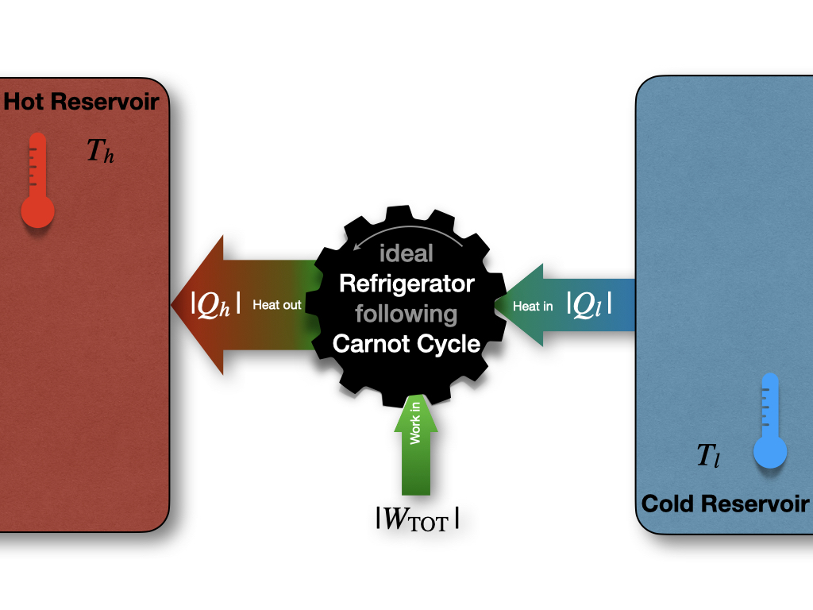

# Thermodynamic Cycles {#ThermodynamicCycles}

The first law of thermodynamics places no restrictions on the conversion of energy from one form to another. For example, let's consider once again the Joule experiment (Figure \@ref(fig:FigJexp)). If we design a cycle that goes from the gas on the left chamber only to the gas equilibrated in both chambers and backward, as in Figure \@ref(fig:FigJexpC), there are no restrictions imposed on this hypothetical cycle by the first law. 

```{r FigJexpC, out.width='80%', fig.show='hold', echo=FALSE, fig.align = 'center', fig.cap='Closing the Cycle in The Joule Expansion Experiment.'}
knitr::include_graphics('./img/OEP_Figures.008.jpeg')

```

As we saw in section \@ref(isothermalE), states 1 and 2 have exactly the same energy at constant temperature. Restricting the analysis to the information contained in the first law, the ideal gas could hypothetically go from state 1 (all gas in the left chamber) to state 2 (gas in both chambers), as well as spontaneously close the cycle back from state 2 to state 1, without external intervention. While the transformation from 1 $\rightarrow$ 2 is intuitively spontaneous (it's the same transformation that we considered in section \@ref(isothermalE)), the backward transformation from 2 $\rightarrow$ 1 is clearly not as intuitive. In this case, the gas should spontaneously compress back to the left side, leaving a vacuum on the right chambers, without interventions from the outside. This transformation is clearly never observed. A gas just does not spontaneously concentrate on one side of a room, leaving a vacuum on the other side. In fact, when we need to create a vacuum, a lot of energy must be spent. Suppose we use exclusively information contained in the first law. In this case, there is nothing that might suggest a system's preference to perform the transformation 1 $\rightarrow$ 2, while restricting the 2 $\rightarrow$ 1 from happening spontaneously. Both states have the same energy, and 

\begin{equation}
  \oint dU=0,
  (\#eq:de0c)
\end{equation}

James Joule himself was indeed convinced that this must be the case and that we don't observe the backward transformation in practice only because we cannot build ideal machines.^[Either because we don't really have ideal gases, or because we are unable to construct mechanical devices without loss, or in general because of other experimental factors] Another scientist of that era was not convinced. William Thomson, the 1^st^ Baron Kelvin (1824–1907), was unsure about this idea, and invested substantial resources to try to prove Joule's wrong.^[Interestingly enough, both Joule and Lord Kelvin are now recognized as key figures in the development of thermodynamics and science in general. So much so, that the energy unit and the temperature unit in the SI system are named after them.] 

A few years later, the controversy between Joule and Kelvin was redeemed in favor of the latter, thanks to the experiments of French military engineer Nicolas Léonard Sadi Carnot (1796–1832). The work of Carnot began in France several years before Joule and Kelvin's time.^[Carnot's lone book, the [*Réflexions sur la Puissance Motrice du Feu* ("Reflections on the Motive Power of Fire")](https://en.wikipedia.org/wiki/Reflections_on_the_Motive_Power_of_Fire) was published in France in 1824, the same year Kelvin was born and just 6 years after Joule's birth.] At that time, the importance of steam engines was growing for industrial applications, but a theoretical perspective was lacking. Carnot was convinced that a scientific understanding of heat engines was necessary to improve their efficiency. 

## Carnot Cycle {#carnotcyclesect}

The main contribution of Carnot to thermodynamics is his abstraction of the steam engine's essential features into a more general and idealized heat engine. The definition of Carnot's idealized cycle is as follows:

> ```{definition, carnotcycle}

A *Carnot cycle* is an idealized process composed of two isothermal and two adiabatic transformations. Each transformation is either an expansion or a compression of an *ideal gas*. All transformations are assumed to be *reversible*, and no energy is lost to mechanical friction.

```

A Carnot cycle connects two "heat reservoirs" at temperatures $T_h$ (hot) and $T_l$ (low), respectively. The reservoirs have a large thermal capacity so that their temperatures are unaffected by the cycle. The system is composed exclusively by the ideal gas, which is the only substance that changes temperature throughout the cycle. If we report the four transformations of a Carnot cycle on a $PV$ diagram, we obtain the following plot:

```{r FigCarnotPV, echo=FALSE, fig.align='center', fig.cap='PV-Diagram of a Carnot Cycle.', out.width="70%"}
x <- seq(0,1.25,0.01)
i <- 0.2
f <- 1
p1 <- 0.5

plot(x, 0.081*298/x,
     xlim=c(0.2, 0.45),
     ylim=c(50, 230),
     type="l",
     ylab = "Pressure [bar]", xlab = "Volume [L]", col = "#2E9FDF")
     
par(new=TRUE)
plot(x, 0.081*600/x,
     xlim=c(0.2, 0.45),
     ylim=c(50, 230),
     type="l",
     ylab = "Pressure [bar]", xlab = "Volume [L]", col = "#2E9FDF")
     
par(new=TRUE)
plot(x, 0.4/x^(13/3),
     xlim=c(0.2, 0.45),
     ylim=c(50, 230),
     type="l",
     ylab = "Pressure [bar]", xlab = "Volume [L]", col = "blue")

par(new=TRUE)
plot(x, 1.2/x^(13/3),
     xlim=c(0.2, 0.45),
     ylim=c(50, 230),
     type="l",
     ylab = "Pressure [bar]", xlab = "Volume [L]", col = "blue")

text(0.41,135, "isotherm", col = "#2E9FDF")
text(0.425,123, expression('T'[h]), col = "#2E9FDF")
text(0.225,125, "isotherm", col = "#2E9FDF")
text(0.23,113, expression('T'[l]), col = "#2E9FDF")
text(0.255,225, "adiabatic 1", col = "blue")
text(0.32,225, "adiabatic 2", col = "blue")

points(0.237,205, col="red", pch=19)
points(0.33, 147, col="red", pch=19)
points(0.406, 59, col="red", pch=19)
points(0.292, 83, col="red", pch=19)

text(0.237+0.005,205+8 , col="red", "A")
text(0.33+0.005, 147+10, col="red", "B")
text(0.406+0.005, 59+10, col="red", "C")
text(0.292-0.005, 83-10, col="red", "D")

text(0.285,160, col="green", "1")
text(0.355, 95, col="green", "2")
text(0.345, 78, col="green", "3")
text(0.27, 135, col="green", "4")

arrows(0.237,205, 0.237, -10 , length=0, angle=90, code=3, lty="dotted")
arrows(0.237,205, -10, 205 , length=0, angle=90, code=3, lty="dotted")

arrows(0.33, 147, 0.33, -10 , length=0, angle=90, code=3, lty="dotted")
arrows(0.33, 147, -10, 147 , length=0, angle=90, code=3, lty="dotted")

arrows(0.406,59, 0.406, -10 , length=0, angle=90, code=3, lty="dotted")
arrows(0.406,59, -10, 59 , length=0, angle=90, code=3, lty="dotted")

arrows(0.292,83, 0.292, -10 , length=0, angle=90, code=3, lty="dotted")
arrows(0.292,83, -10, 89 , length=0, angle=90, code=3, lty="dotted")
text(0.237-0.005, 50, expression('V'[A]))
text(0.2, 215,        expression('P'[A]))
text(0.33-0.005, 50,  expression('V'[B]))
text(0.2, 157,        expression('P'[B]))
text(0.292-0.005, 50, expression('V'[D]))
text(0.2, 93,         expression('P'[D]))
text(0.406-0.005, 50, expression('V'[C]))
text(0.2, 69,         expression('P'[C]))
legend(0.45,22, expression(abs(W[2-step])),box.col = "white", bg = "white", adj=0.15)
```

### Stage 1: isothermal expansion $A \rightarrow B$ {#CCstage1}

```{r out.width='70%', fig.show='hold', echo=FALSE, fig.align = 'center'}

```

Starting the analysis of the cycle from point $A$ in Figure \@ref(fig:FigCarnotPV),^[The stages of a Carnot depicted at the beginning of each of this section and the following three ones are genetaken from [Wikipedia](https://en.wikipedia.org/wiki/Carnot_cycle), and have been generated and distributed by Author BlyumJ under CC-BY-SA license.] the first transformation we encounter is an isothermal expansion at $T_h$. Since the transformation is isothermal:

\begin{equation}
\Delta U_1 = \overbrace{W_1}^{<0} + \overbrace{Q_1}^{>0} = 0 \Rightarrow Q_1 = -W_1,
  (\#eq:CCst1)
\end{equation}


and heat and work can be calculated for this stage using eq. \@ref(eq:WmaxV):

\begin{equation}
\begin{aligned}
 Q_1 & = \left| Q_h \right|  = nRT_h \overbrace{\ln \frac{V_B}{V_A}}^{>0 \text{ since } V_B>V_A} > 0, \\
 W_1 & = -Q_1 = - nRT_h \ln \frac{V_B}{V_A} < 0,
\end{aligned}
  (\#eq:CCst1b)
\end{equation}

where we denoted $\left| Q_h \right|$ the absolute value of the heat that gets **into** the system from the hot reservoir. 


### Stage 2: adiabatic expansion $B \rightarrow C$ {#CCstage2}

```{r out.width='70%', fig.show='hold', echo=FALSE, fig.align = 'center'}
knitr::include_graphics('./img/OEP_Figures.007b.png')
```

The second transformation is an adiabatic expansion between $T_h$ and $T_l$. Since we are at adiabatic conditions:

\begin{equation}
Q_2 = 0 \Rightarrow \Delta U_2 = W_2,
  (\#eq:CCst2)
\end{equation}

and the negative energy (expansion work) can be calculated using:

\begin{equation}
\Delta U_2 = W_2 = n \underbrace{\int_{T_h}^{T_l} C_V dT}_{<0 \text{ since } T_\mathrm{l}<T_\mathrm{h}} < 0.
  (\#eq:CCst2b)
\end{equation}


### Stage 3: isothermal compression $C \rightarrow D$ {#CCstage3}

```{r out.width='70%', fig.show='hold', echo=FALSE, fig.align = 'center'}

```

The third transformation is an isothermal compression at $T_l$. The formulas are the same as those used for stage 1, but they will results in heat and work with reversed signs (since this is a compression):

\begin{equation}
\Delta U_3 = \overbrace{W_3}^{>0} + \overbrace{Q_3}^{<0} = 0 \Rightarrow Q_3 = -W_3,
  (\#eq:CCst3)
\end{equation}

and:

\begin{equation}
\begin{aligned}
 Q_3 & = \left| Q_l \right|  = nRT_l \overbrace{\ln \frac{V_D}{V_C}}^{<0 \text{ since } V_D<V_C} < 0 , \\
 W_3 & = -Q_3 = - nRT_l \ln \frac{V_D}{V_C} > 0,
\end{aligned}
  (\#eq:CCst3b)
\end{equation}

where $\left| Q_l \right|$ is the absolute value of the heat that gets **out of** the system to the cold reservoir ($\left| Q_l \right|$ being the heat entering the system). 


### Stage 4: adiabatic compression $D \rightarrow A$ {#CCstage4}

```{r out.width='70%', fig.show='hold', echo=FALSE, fig.align = 'center'}
knitr::include_graphics('./img/OEP_Figures.007d.png')
```

The fourth and final transformation is an adiabatic comprssion that restores the system to point $A$, bringing it from $T_l$ to $T_h$. Similarly to stage 3:

\begin{equation}
Q_4 = 0 \Rightarrow \Delta U_4 = W_4,
  (\#eq:CCst4)
\end{equation}

Since we are at adiabatic conditions. The energy associated with this process is now positive (compression work), and can be calculated using:

\begin{equation}
\Delta U_4 = W_4 = n \underbrace{\int_{T_l}^{T_h} C_V dT}_{>0 \text{ since } T_\mathrm{h}>T_\mathrm{l}} > 0.
  (\#eq:CCst4b)
\end{equation}

Notice how $\Delta U_4 = - \Delta U_2$ because $\int_x^y=-\int_y^x$.

## Energy, Heat, and Work in the Carnot Cycle {#UWQCarnot}
Summarizing the results of the previous sections, the total amount of energy for a Carnot cycle is:

\begin{equation}
\begin{aligned}
  \Delta U_{\text{TOT}} & = \Delta U_1+\Delta U_2+\Delta U_3+\Delta U_4 \\
                 & = 0 + n \int_{T_h}^{T_l} C_V dT + 0 + n \int_{T_l}^{T_h} C_V dT  \\
                 & = n \int_{T_h}^{T_l} C_V dT - n \int_{T_h}^{T_l} C_V dT = 0 \\
\end{aligned}
  (\#eq:UtotCC)
\end{equation}

which is obviously zero, since $\oint dU=0$. The amounts of work and heat, however, are not zero, since $Q$ and $W$ are path functions. Therefore:

\begin{equation}
\begin{aligned}
  W_{\text{TOT}} & = W_1+W_2+W_3+W_4 \\
                 & = - nRT_h \ln \frac{V_B}{V_A} + n \int_{T_h}^{T_l} C_V dT - nRT_l \ln \frac{V_D}{V_C} + n \int_{T_l}^{T_h} C_V dT \\
                 & = - nRT_h \ln \frac{V_B}{V_A} - nRT_l \ln \frac{V_D}{V_C}, \\
\end{aligned}
  (\#eq:WtotCC)
\end{equation}

which, considering that $V_C/V_D=V_B/V_A$, reduces to:

\begin{equation}
  W_{\text{TOT}} = - nR \left( T_h-T_l \right) \ln \frac{V_B}{V_A} < 0,
  (\#eq:WtotCC2)
\end{equation}

which is negative, because $T_h>T_l$ and $V_B>V_A$. Negative work means that the work is done by the system. In other words, the system is performing $PV$-work by transferring heat from a hot reservoir to a cold one via a Carnot cycle. On the other hand, for the heat:

\begin{equation}
\begin{aligned}
  Q_{\text{TOT}} & = Q_1+Q_2+Q_3+Q_4 \\
                 & = Q_h + 0 + Q_l + 0    \\
                 & = nRT_h \ln \frac{V_B}{V_A} + nRT_l \ln \frac{V_D}{V_C} \\
                 & = nR \left( T_h-T_l \right) \ln \frac{V_B}{V_A} = -W_{\text{TOT}},
\end{aligned}
  (\#eq:QtotCC)
\end{equation}

which, simplifies to:

\begin{equation}
W_{\text{TOT}}=-(Q_1+Q_3),
  (\#eq:WtotCC3)
\end{equation}

and, replacing $Q_1$ and $Q_3$ with the absolute values of the heats drawn from the hot and cold reservoirs, $\left| Q_h \right|$, and $\left| Q_l \right|$ respectively:

\begin{equation}
\left| W_{\text{TOT}} \right| = \left| Q_h \right| - \left| Q_l \right|,
  (\#eq:QtotCC2)
\end{equation}

or, in other words, more heat is extracted from the hot reservoir than it is put into the cold one. The difference between the absolute value of these amounts of heat gives the total work of the cycle. This process is depicted in Figure \@ref(fig:FigCarnotEff).

```{r FigCarnotEff, out.width='80%', fig.show='hold', echo=FALSE, fig.align = 'center', fig.cap='Carnot Cycle Diagram.'}
knitr::include_graphics('./img/OEP_Figures.009.jpeg')
```

> ```{exercise, CarnotEx}
Up to this point, we have discussed Carnot cycles working in the hot $\rightarrow$ cold direction ($A$ $\rightarrow$ $B$ $\rightarrow$ $C$ $\rightarrow$ $D$ $\rightarrow$ $A$), since this is the primary mode of operation of heat engines that produce work. However, a heat engine could also—in principle—work in the reversed cold $rightarrow$ hot direction ($A$ $\rightarrow$ $D$ $\rightarrow$ $C$ $\rightarrow$ $B$ $\rightarrow$ $A$). Write the equations for heat, work, and energy of each stage of a Carnot cycle going the opposite direction than the one discussed in sections \@ref(carnotcyclesect) and \@ref(UWQCarnot).

*Solution:* When the heat engine works in reverse order, the formulas remain the same, but all the signs in front of $Q$, $W$, and $U$ will be reversed. In this case, the total work would get **into** the systems, and heat would be transferred from the cold reservoir to the hot one. Figure \@ref(fig:FigCarnotEff) would be modified as:
```{r out.width='60%', fig.show='hold', echo=FALSE, fig.align = 'right'}

```
This reversed mode of operation is the basic principle behind refrigerators and air conditioning.


## Efficiency of a Carnot Cycle

The efficiency ($\varepsilon$) of a cycle is defined as the ratio between the absolute value of the work extracted from the cycle ($\left| W_{\text{TOT}} \right|$) and the heat that gets into the system ($\left| Q_h \right|$):

\begin{equation}
\varepsilon = \frac{\left| W_{\text{TOT}} \right|}{\left| Q_h \right|} =\frac{-W_{\text{TOT}}}{Q_1}
(\#eq:effCC1)
\end{equation}

where the minus sign in front of the work is necessary because the efficiency is defined as a positive number. Replacing eq. \@ref(eq:WtotCC3) into \@ref(eq:effCC1), we obtain:

\begin{equation}
\varepsilon = \frac{Q_3+Q_1}{Q_1} = 1+\frac{Q_3}{Q_1}.
(\#eq:effCC2)
\end{equation}

If we go back to eq. \@ref(eq:effCC1) and we replace eq. \@ref(eq:WtotCC2) for $W_{\mathrm{TOT}}$ and eq. \@ref(eq:CCst1b) for $Q_1$, we obtain:
 
 \begin{equation}
\varepsilon = \frac{nR \left( T_h - T_l \right) \ln V_B/V_A}{nRT_h \ln V_B/V_A} = \frac{T_h-T_l}{T_h}=1-\frac{T_l}{T_h }<1,
(\#eq:effCC3)
\end{equation}

which proves that the efficiency of a Carnot cycle is strictly smaller than 1.^[Eq. \@ref(eq:effCC3) can be equal to 1 only if $T_l=0 \; \text{K}$ or $T_h=\infty$, two conditions that are both equally impossible.] In other words, no cycle can convert 100% of the heat into work it extracts from a hot reservoir. This finding had remarkable consequences on the entire thermodynamics field and set the foundation for the introduction of entropy. We will use eqs. \@ref(eq:effCC1) and \@ref(eq:effCC3) for this purpose in the next chapter, but we conclude the discussion on Carnot cycles by returning back to Lord Kelvin. In 1851 he used this finding to state his statement "It is impossible for a self-acting machine, unaided by any external agency, to convey heat from one body to another at a higher temperature. It is impossible, by means of inanimate material agency, to derive mechanical effect from any portion of matter by cooling it below the temperature of the coldest of the surrounding objects."^[Thomson W. [Transactions of the Royal Society of Edinburgh. 1851 XX 261–268, 289–298.](https://www.biodiversitylibrary.org/item/126047#page/295/mode/1up).] This statement conclusively disproved Joule's original theories and demonstrated that there is some fundamental principle to govern the flow of heat beyond the first law of thermodynamics.


## Chapter Review {#rev5}

### Practice Problems {#exer5}

**Problem 1: Calculating Work in a Carnot Cycle**

A Carnot cycle operates between temperatures of $400 \,\text{K}$ and $300 ,\text{K}$. The volume of the gas expands from $2.0\,\text{L}$ to $5.0\,\text{L}$ during the isothermal expansion stage. If 2.0 moles of an ideal gas are used, calculate the total work done by the system.

**Solution:** The total work in a Carnot cycle is given by eq. \@ref(eq:WtotCC2):

$$W_{TOT} = -nR(T_h - T_l)\ln\frac{V_B}{V_A}.$$

Given:

$n = 2.0 \,\text{mol}$

$R = 8.314\,\text{J}\,\text{mol}^{-1}\text{K}^{-1}$

$T_h = 400\,\text{K}$

$T_l = 300\,\text{K}$

$V_B = 5.0\,\text{L}$

$V_A = 2.0\,\text{L}$

Then:

$$W_{TOT} = -2.0 \,\text{mol} \cdot 8.314\,\text{J}\,\text{mol}^{-1}\text{K}^{-1} \cdot(400\,\text{K} - 300\,\text{K})\cdot \ln\frac{5.0\,\text{L}}{2.0\,\text{L}}$$
$$W_{TOT} = -1662.8\,\text{J} \cdot \ln(2.5) = -1662.8 \,\text{J} \cdot 0.916 = -1523.13\,\text{J}$$

Adjusting the significant digits we get the final answer.

**Answer:** The total work done by the system is $-1.5 \,\text{kJ}$.

---

**Problem 2: Efficiency of a Carnot Cycle**

A Carnot engine operates between a hot reservoir at $500\,\text{K}$ and a cold reservoir at $250\,\text{K}$. Calculate the efficiency of this engine.

**Solution:** The efficiency of a Carnot cycle is given by eq. \@ref(eq:effCC3):

$$\varepsilon = 1 - \frac{T_l}{T_h}.$$

Given:

$T_h = 500\,\text{K}$

$T_l = 250\,\text{K}$

Then:

$$\varepsilon = 1 - \frac{250\,\text{K}}{500\,\text{K}} = 1 - 0.5 = 0.5$$

**Answer:** The efficiency of the Carnot engine is 50%.

---

**Problem 3: Determining Cold Reservoir Temperature in a Carnot Cycle**

A Carnot engine operates between a hot reservoir at $600 \,\text{K}$ and an unknown cold reservoir temperature. The engine absorbs $5000\,\text{J}$ of heat from the hot reservoir and performs $2000\,\text{J}$ of work in each cycle. Calculate the temperature of the cold reservoir.

**Solution:** We can use eqs. \@ref(eq:effCC1) and \@ref(eq:effCC3) to solve this problem:

$$\varepsilon = 1 - \frac{T_l}{T_h} = \frac{|W_{TOT}|}{|Q_h|}.$$


Given:

$T_h = 600\,\text{K}$

$|W_{TOT}| = 2000\,\text{J}$

$|Q_h| = 5000\,\text{J}$


First, we calculate the efficiency of the engine:

$$\varepsilon = \frac{|W_{TOT}|}{|Q_h|} = \frac{2000\,\text{J}}{5000 \,\text{J}} = 0.4$$

Then, we can use this efficiency to find $T_l$:

$$0.4 = 1 - \frac{T_l}{600\,\text{K}}$$

$$\frac{T_l}{600\,\text{K}} = 1 - 0.4 = 0.6$$

$$T_l = 0.6 \cdot 600\,\text{K} = 360 \,\text{K}$$

**Answer:** The temperature of the cold reservoir is 360 K.

---

**Problem 4: Heat Absorbed in a Carnot Cycle**

A Carnot engine performs $1000\,\text{J}$ of work in each cycle. If it operates between temperatures of $600\,\text{K}$ and $300\,\text{K}$, calculate the amount of heat absorbed from the hot reservoir in each cycle.

**Solution:**  As for the previous problem, we can use eqs. \@ref(eq:effCC1) and \@ref(eq:effCC3) to solve this problem::

$$\varepsilon = 1 - \frac{T_l}{T_h} = \frac{|W_{TOT}|}{|Q_h|}.$$

Given:

$T_h = 600\,\text{K}$

$T_l = 300\,\text{K}$

$|W_{TOT}| = 1000\,\text{J}$

First, we calculate the efficiency:

$$\varepsilon = 1 - \frac{300\,\text{K}}{600\,\text{K}} = 0.5$$

Then, we can use this to find $|Q_h|$:

$$0.5 = \frac{1000\,\text{J}}{|Q_h|}$$

$$|Q_h| = \frac{1000\,\text{J}}{0.5} = 2000\,\text{J}$$

**Answer:** The heat absorbed from the hot reservoir in each cycle is $2000 \,\text{J}$.


### Study Questions {#quest5}

**1. Which of the following is the basic principle behind refrigerators and air conditioning?**

a. A Carnot cycle operating in the normal direction.
b. A Carnot cycle operating in reverse order.
c. An isothermal expansion followed by an adiabatic compression.
d. A series of isochoric processes.
e. A continuously expanding system.

---

**2. In a Carnot cycle, how many isothermal and how many adiabatic transformations are there?**

a. 1 isothermal and 3 adiabatic.
b. 2 isothermal and 2 adiabatic.
c. 3 isothermal and 1 adiabatic.
d. 4 isothermal and no adiabatic.
e. No isothermal and 4 adiabatic.

---

**3. What is the total change in internal energy ($\Delta U_{\text{TOT}}$) for a complete Carnot cycle?**

a. $\Delta U_{\text{TOT}}=nR(T_h - T_l)\ln\frac{V_B}{V_A}$.
b. $\Delta U_{\text{TOT}}=nRT_h\ln\frac{V_B}{V_A}$.
c. $-\Delta U_{\text{TOT}}=nR(T_h - T_l)\ln\frac{V_B}{V_A}$.
d. $\Delta U_{\text{TOT}}=0$.
e. $\Delta U_{\text{TOT}}=nC_V(T_h - T_l)$.

---

**4. Which of the following equations correctly represents the total work done in a Carnot cycle?**

a. $W_{\text{TOT}} = nR(T_h - T_l)\ln\frac{V_B}{V_A}$.
b. $W_{\text{TOT}} = -nR(T_h - T_l)\ln\frac{V_B}{V_A}$.
c. $W_{\text{TOT}} = nRT_h\ln\frac{V_B}{V_A}$.
d. $W_{\text{TOT}} = nRT_l\ln\frac{V_D}{V_C}$.
e. $W_{\text{TOT}} = n\int_{T_l}^{T_h}C_V dT$.

---

**5. What is the relationship between the total work and total heat in a Carnot cycle?**

a. $W_{\text{TOT}} = Q_{\text{TOT}}$.
b. $W_{\text{TOT}} = Q_3 - Q_1$.
c. $W_{\text{TOT}} = Q_1 + Q_3$.
d. $W_{\text{TOT}} = Q_1 - Q_3$.
e. $W_{\text{TOT}} = -Q_{\text{TOT}}$.

---

**6. How is the efficiency ($\varepsilon$) of a Carnot cycle defined?**

a. $\varepsilon = \frac{|Q_{\text{TOT}}|}{|W_{\text{TOT}}|}$.
b. $\varepsilon = \frac{|W_{\text{TOT}}|}{|Q_l|}$.
c. $\varepsilon = \frac{|W_{\text{TOT}}|}{|Q_h|}$.
d. $\varepsilon = \frac{|Q_h|}{|Q_l|}$.
e. $\varepsilon = \frac{|Q_h|}{|W_{\text{TOT}}|}$.

---

**7. Which of the following formulas allows us to calculate the efficiency of a Carnot cycle?**

a. $\varepsilon = \frac{T_h}{T_l}$.
b. $\varepsilon = 1 - \frac{T_h}{T_l}$.
c. $\varepsilon = 1 - \frac{T_l}{T_h}$.
d. $\varepsilon = \frac{T_h - T_l}{T_h + T_l}$.
e. $\varepsilon = \frac{T_h - T_l}{T_l}$.

---

**8. What happens when a Carnot cycle operates in reverse?**

a. It produces more work than a forward cycle.
b. It transfers heat from the cold reservoir to the hot reservoir.
c. It violates the laws of thermodynamics.
d. It has 100% efficiency.
e. It only performs adiabatic transformations.

---

**9. What is the relationship between the volumes at different stages of the Carnot cycle?**

a. $\frac{V_C}{V_D} = \frac{V_A}{V_B}$.
b. $\frac{V_C}{V_D} = \frac{V_B}{V_A}$.
c. $\frac{V_B}{V_A} = \frac{V_D}{V_C}$.
d. $V_A = V_C$ and $V_B = V_D$.
e. $V_A > V_B > V_C > V_D$.

---

**10. What is the significance of the Carnot cycle in the development of thermodynamics?**

a. It proved the existence of absolute zero.
b. It demonstrated that not all heat can be converted to work in a cyclic process.
c. It disproved the existence of ideal gases.
d. It showed that all thermodynamic processes are reversible.
e. It proved that energy can be created in closed systems.

---

`r if (knitr::is_html_output()) {
  '
  Answers: <span style="cursor: pointer; color: blue; text-decoration: underline;" onclick="document.getElementById(\'reveal-inline-content\').style.display=\'inline\'; this.style.display=\'none\';">
    Click to reveal
  </span>
  <span id="reveal-inline-content" style="display: none;">
1.b, 2.b, 3.d, 4.b, 5.e, 6.c, 7.c, 8.b, 9.b, 10.b
  </span>
  '
} else if (knitr::is_latex_output()) {
  'Answers: 1.b, 2.b, 3.d, 4.b, 5.e, 6.c, 7.c, 8.b, 9.b, 10.b'
}`

