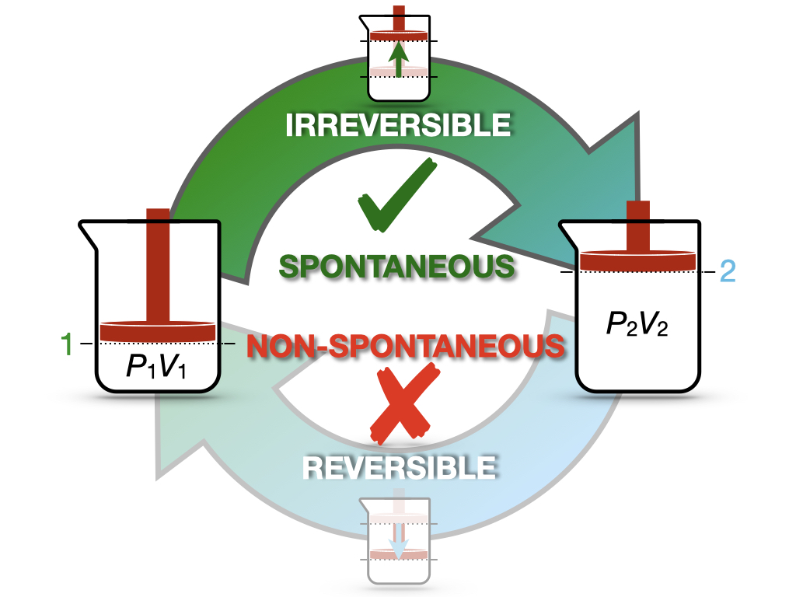

# Second Law of Thermodynamics {#SecondLaw}

In the previous chapter, we have discussed heat engines as a means of understanding how some processes are spontaneous while others are not. Carnot's findings did not just simply inspire Lord Kelvin on this subject, but they also motivated Rudolf Clausius (1822–1888) to introduce the concept of entropy. 

## Entropy {#entropyint}

Let's return to the definition of efficiency of a Carnot cycle and bring together eqs. \@ref(eq:effCC2) and \@ref(eq:effCC3):

\begin{equation}
\varepsilon = 1+\frac{Q_3}{Q_1} = 1-\frac{T_l}{T_h}.
(\#eq:effcQT)
\end{equation}

Simplifying this equality, we obtain:

\begin{equation}
\frac{Q_3}{T_l} = -\frac{Q_1}{T_h},
(\#eq:effcQTrearr)
\end{equation}

or alternatively:

\begin{equation}
\frac{Q_3}{T_l} + \frac{Q_1}{T_h} = 0.
(\#eq:effcQTrearr2)
\end{equation}


The left hand side of eq. \@ref(eq:effcQTrearr2) contains the sum of two quantities around the Carnot cycle, each calculated as $\frac{Q_{\mathrm{REV}}}{T}$, with $Q_{\mathrm{REV}}$ being the heat exchanged at reversible conditions (recall that according to Definition \@ref(def:carnotcycle) each transformation in a Carnot cycle is reversible). Eq. \@ref(eq:effcQTrearr) can be generalized to a sequence of connected Carnot cycles joining more than two isotherms by taking the summation across different temperatures:
```{r  echo=FALSE, fig.align='center',fig.asp = .62, out.width="70%"}
x <- seq(0,1.25,0.01)
i <- 0.2
f <- 1
p1 <- 0.5

par(mar=c(4,4,0,4))
plot(x, 0.081*298/x,
     xlim=c(0.2, 0.45),
     ylim=c(50, 230),
     type="l",
     ylab = "Pressure [bar]", xlab = "Volume [L]", col = "#2E9FDF")

par(new=TRUE)
plot(x, 0.081*350/x,
     xlim=c(0.2, 0.45),
     ylim=c(50, 230),
     type="l",
     ylab = "Pressure [bar]", xlab = "Volume [L]", col = "#2E9FDF")

par(new=TRUE)
plot(x, 0.081*400/x,
     xlim=c(0.2, 0.45),
     ylim=c(50, 230),
     type="l",
     ylab = "Pressure [bar]", xlab = "Volume [L]", col = "#2E9FDF")

par(new=TRUE)
plot(x, 0.081*450/x,
     xlim=c(0.2, 0.45),
     ylim=c(50, 230),
     type="l",
     ylab = "Pressure [bar]", xlab = "Volume [L]", col = "#2E9FDF")

par(new=TRUE)
plot(x, 0.081*500/x,
     xlim=c(0.2, 0.45),
     ylim=c(50, 230),
     type="l",
     ylab = "Pressure [bar]", xlab = "Volume [L]", col = "#2E9FDF")

par(new=TRUE)
plot(x, 0.081*550/x,
     xlim=c(0.2, 0.45),
     ylim=c(50, 230),
     type="l",
     ylab = "Pressure [bar]", xlab = "Volume [L]", col = "#2E9FDF")

par(new=TRUE)
plot(x, 0.081*600/x,
     xlim=c(0.2, 0.45),
     ylim=c(50, 230),
     type="l",
     ylab = "Pressure [bar]", xlab = "Volume [L]", col = "#2E9FDF")

par(new=TRUE)
plot(x, 0.081*650/x,
     xlim=c(0.2, 0.45),
     ylim=c(50, 230),
     type="l",
     ylab = "Pressure [bar]", xlab = "Volume [L]", col = "#2E9FDF")

     
par(new=TRUE)
plot(x, 0.4/x^(13/3),
     xlim=c(0.2, 0.45),
     ylim=c(50, 230),
     type="l",
     ylab = "Pressure [bar]", xlab = "Volume [L]", col = "blue")

par(new=TRUE)
plot(x, 0.55/x^(13/3),
     xlim=c(0.2, 0.45),
     ylim=c(50, 230),
     type="l",
     ylab = "Pressure [bar]", xlab = "Volume [L]", col = "blue")

par(new=TRUE)
plot(x, 0.75/x^(13/3),
     xlim=c(0.2, 0.45),
     ylim=c(50, 230),
     type="l",
     ylab = "Pressure [bar]", xlab = "Volume [L]", col = "blue")

par(new=TRUE)
plot(x, 0.95/x^(13/3),
     xlim=c(0.2, 0.45),
     ylim=c(50, 230),
     type="l",
     ylab = "Pressure [bar]", xlab = "Volume [L]", col = "blue")

par(new=TRUE)
plot(x, 1.2/x^(13/3),
     xlim=c(0.2, 0.45),
     ylim=c(50, 230),
     type="l",
     ylab = "Pressure [bar]", xlab = "Volume [L]", col = "blue")

par(new=TRUE)
plot(x, 1.5/x^(13/3),
     xlim=c(0.2, 0.45),
     ylim=c(50, 230),
     type="l",
     ylab = "Pressure [bar]", xlab = "Volume [L]", col = "blue")

par(new=TRUE)
plot(x, 0.3/x^(13/3),
     xlim=c(0.2, 0.45),
     ylim=c(50, 230),
     type="l",
     ylab = "Pressure [bar]", xlab = "Volume [L]", col = "blue")


text(0.425,135, "isotherms", col = "#2E9FDF")

text(0.335,225, "adiabats", col = "blue")


par(new=TRUE)
plot(seq(0.2753,0.303,0.001), 0.081*500/seq(0.2753,0.303,0.001),
     xlim=c(0.2, 0.45),
     ylim=c(50, 230),
     type="l",
     ylab = "Pressure [bar]", xlab = "Volume [L]", col = "black", lwd=3)

par(new=TRUE)
plot(seq(0.294,0.315,0.001), 0.081*550/seq(0.294,0.315,0.001),
     xlim=c(0.2, 0.45),
     ylim=c(50, 230),
     type="l",
     ylab = "Pressure [bar]", xlab = "Volume [L]", col = "black", lwd=3)

par(new=TRUE)
plot(seq(0.307,0.329,0.001), 0.081*600/seq(0.307,0.329,0.001),
     xlim=c(0.2, 0.45),
     ylim=c(50, 230),
     type="l",
     ylab = "Pressure [bar]", xlab = "Volume [L]", col = "black", lwd=3)

par(new=TRUE)
plot(seq(0.336,0.358,0.001), 0.081*450/seq(0.336,0.358,0.001),
     xlim=c(0.2, 0.45),
     ylim=c(50, 230),
     type="l",
     ylab = "Pressure [bar]", xlab = "Volume [L]", col = "black", lwd=3)

par(new=TRUE)
plot(seq(0.324,0.347,0.001), 0.081*400/seq(0.324,0.347,0.001),
     xlim=c(0.2, 0.45),
     ylim=c(50, 230),
     type="l",
     ylab = "Pressure [bar]", xlab = "Volume [L]", col = "black", lwd=3)

par(new=TRUE)
plot(seq(0.279,0.336,0.001), 0.081*350/seq(0.279,0.336,0.001),
     xlim=c(0.2, 0.45),
     ylim=c(50, 230),
     type="l",
     ylab = "Pressure [bar]", xlab = "Volume [L]", col = "black", lwd=3)

par(new=TRUE)
plot(seq(0.259,0.284,0.001), 0.081*450/seq(0.259,0.284,0.001),
     xlim=c(0.2, 0.45),
     ylim=c(50, 230),
     type="l",
     ylab = "Pressure [bar]", xlab = "Volume [L]", col = "black", lwd=3)


par(new=TRUE)
plot(seq(0.294,0.302,0.001), 0.75/seq(0.294,0.302,0.001)^(13/3),
     xlim=c(0.2, 0.45),
     ylim=c(50, 230),
     type="l",
     ylab = "Pressure [bar]", xlab = "Volume [L]", col = "black", lwd=3)

par(new=TRUE)
plot(seq(0.307,0.315,0.001), 0.95/seq(0.307,0.315,0.001)^(13/3),
     xlim=c(0.2, 0.45),
     ylim=c(50, 230),
     type="l",
     ylab = "Pressure [bar]", xlab = "Volume [L]", col = "black", lwd=3)
     
par(new=TRUE)
plot(seq(0.329,0.358,0.001), 1.2/seq(0.329,0.358,0.001)^(13/3),
     xlim=c(0.2, 0.45),
     ylim=c(50, 230),
     type="l",
     ylab = "Pressure [bar]", xlab = "Volume [L]", col = "black", lwd=3)

par(new=TRUE)
plot(seq(0.336,0.347,0.001), 0.95/seq(0.336,0.347,0.001)^(13/3),
     xlim=c(0.2, 0.45),
     ylim=c(50, 230),
     type="l",
     ylab = "Pressure [bar]", xlab = "Volume [L]", col = "black", lwd=3)

par(new=TRUE)
plot(seq(0.324,0.336,0.001), 0.75/seq(0.324,0.336,0.001)^(13/3),
     xlim=c(0.2, 0.45),
     ylim=c(50, 230),
     type="l",
     ylab = "Pressure [bar]", xlab = "Volume [L]", col = "black", lwd=3)

par(new=TRUE)
plot(seq(0.259,0.279,0.001), 0.4/seq(0.259,0.279,0.001)^(13/3),
     xlim=c(0.2, 0.45),
     ylim=c(50, 230),
     type="l",
     ylab = "Pressure [bar]", xlab = "Volume [L]", col = "black", lwd=3)

par(new=TRUE)
plot(seq(0.2753,0.285,0.001), 0.55/seq(0.2753,0.285,0.001)^(13/3),
     xlim=c(0.2, 0.45),
     ylim=c(50, 230),
     type="l",
     ylab = "Pressure [bar]", xlab = "Volume [L]", col = "black", lwd=3)
```

\begin{equation}
\sum_i \frac{Q_{\mathrm{REV}}}{T_i} = 0,
(\#eq:effQrevT)
\end{equation}

where the summation happens across a sequence of Carnot cycles that connects different temperatures. Eqs. \@ref(eq:effcQTrearr2) and \@ref(eq:effQrevT) show that for a Carnot cycle—or a series of connected Carnot cycles—there exists a conserved quantity obtained by dividing the heat associated with each reversible stage and the temperature at which such heat is exchanged. If a quantity is conserved around a cycle, it must be independent on the path, and therefore it is a state function. Looking at similar equations, Clausius introduced in 1865 a new state function in thermodynamics, which he decided to call entropy and indicate with the letter $S$:

> ```{definition, entropy}
*Entropy:* \begin{equation}
S = \frac{Q_{\mathrm{REV}}}{T}.
\end{equation}
```

We can use the new state function to generalize eq. \@ref(eq:effQrevT) to any reversible cycle in a $PV$-diagram by using the rules of calculus. First, we will slice $S$ into an infinitesimal quantity:

\begin{equation}
dS = \frac{đQ_{\mathrm{REV}}}{T},
(\#eq:dentropy)
\end{equation}

then we can extend the summation across temperatures of eq. \@ref(eq:effQrevT) to a sum over infinitesimal quantities—that is the integral—around the cycle:

\begin{equation}
\oint dS = \oint \frac{đQ_{\mathrm{REV}}}{T} = 0.
(\#eq:ds0)
\end{equation}

## Irreversible Cycles

Up to this point, we have discussed *reversible* cycles only. Notice that the heat that enters the definition of entropy (Definition \@ref(def:entropy) is the heat exchanged at reversible conditions since it is only at those conditions that the right-hand side of eq. \@ref(eq:dentropy) becomes a state function. What happens when we face an irreversible cycle? The efficiency of a Carnot cycle in eq. \@ref(eq:effCC3) is the maximum efficiency that an idealized thermodynamic cycle can reach. As such, any irreversible cycle will incontrovertibly have an efficiency smaller than the maximum efficiency of the idealized Carnot cycle. Therefore, eq. \@ref(eq:effcQT) for an *irreversible* cycle will not hold anymore and must be rewritten as:

\begin{equation}
\overbrace{1+\frac{Q_3}{Q_1}}^{\varepsilon_{\mathrm{IRR}}} < \overbrace{1-\frac{T_l}{T_h}}^{\varepsilon_{\mathrm{REV}}},
(\#eq:effcIRR)
\end{equation}

and, following the same procedure used in section \@ref(entropyint), we can rewrite eq. \@ref(eq:effcIRR) as:

\begin{equation}
\frac{Q^{\text{IRR}}_3}{Q^{\text{IRR}}_1} < - \frac{T_l}{T_h} \longrightarrow \frac{Q^{\text{IRR}}_3}{T_l} + \frac{Q^{\text{IRR}}_1}{T_h} < 0 \longrightarrow \sum_i \frac{Q_{\text{IRR}}}{T_i} < 0,
(\#eq:effcIRR2)
\end{equation}

which can be generalized using calculus to:

\begin{equation}
\oint \frac{đQ_{\mathrm{IRR}}}{T} < 0.
(\#eq:dqirrineq)
\end{equation}

Putting eqs. \@ref(eq:ds0) and \@ref(eq:dqirrineq) together, we obtain:

\begin{equation}
\oint \frac{đQ}{T} \leq 0,
(\#eq:clausiusineq)
\end{equation}

where the equal sign holds for reversible transformations exclusively, while the inequality sign holds for irreversible ones. Eq. \@ref(eq:clausiusineq) is known as **Clausius inequality**. 

## The Second Law of Thermodynamics {#secondlaw}

Now we can consider an isolated system undergoing a cycle composed of an irreversible forward transformation (1 $\rightarrow$ 2) and a reversible backward transformation (2 $\rightarrow$ 1), as in Figure \@ref(fig:FigJexpC2). 

```{r FigJexpC2, out.width='80%', fig.show='hold', echo=FALSE, fig.align = 'center', fig.cap='Spontaneous and Non-Spontaneous Transformations in a Cycle.'}


```

This cycle is similar to the cycle depicted in Figure \@ref(fig:FigJexpC) for the Joule's expansion experiment. In this case, we have an intuitive understanding of the spontaneity of the irreversible expansion process, while the non-spontaneity of the backward compression. Since the cycle has at least one irreversible step, it is overall irreversible, and we can calculate: 

\begin{equation}
\oint \frac{đQ_{\mathrm{IRR}}}{T} = \int_1^2 \frac{đQ_{\mathrm{IRR}}}{T} + \int_2^1 \frac{đQ_{\mathrm{REV}}}{T}.
(\#eq:qirrcycle)
\end{equation}

We can then use Clausius inequality (eq. \@ref(eq:clausiusineq)) to write:

\begin{equation}
\begin{aligned}
\int_1^2 \frac{đQ_{\mathrm{IRR}}}{T} + \int_2^1 \frac{đQ_{\mathrm{REV}}}{T} < 0,
\end{aligned}
(\#eq:qirrcycle1)
\end{equation}

which can be rearranged as:

\begin{equation}
\underbrace{\int_1^2 \frac{đQ_{\mathrm{REV}}}{T}}_{\int_1^2 dS = \Delta S} > \underbrace{\int_1^2 \frac{đQ_{\mathrm{IRR}}}{T}}_{=0},
(\#eq:qirrcycle2)
\end{equation}

where we have used the fact that, for an isolated system (the universe), $đQ_{\mathrm{IRR}}=0$. Eq. \@ref(eq:qirrcycle2) can be rewritten as:

\begin{equation}
\Delta S > 0,
(\#eq:secondlaweq)
\end{equation}

which proves that for any irreversible process in an isolated system, the entropy is increasing. Using eq. \@ref(eq:secondlaweq) and considering that the only system that is truly isolated is the universe, we can write a concise statement for a new fundamental law of thermodynamics:

> ```{definition, secondlawdef}
*Second Law of Thermodynamics:* for any spontaneous process, the entropy of the universe is increasing.
```

