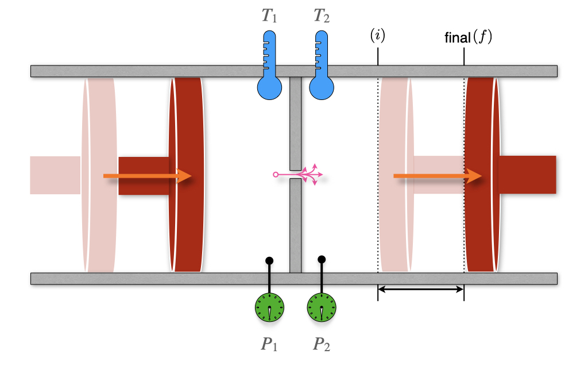
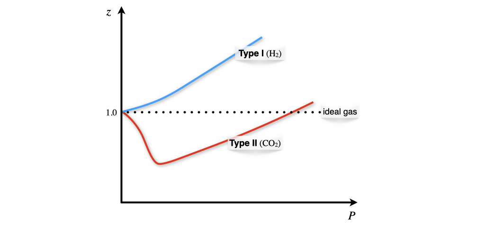
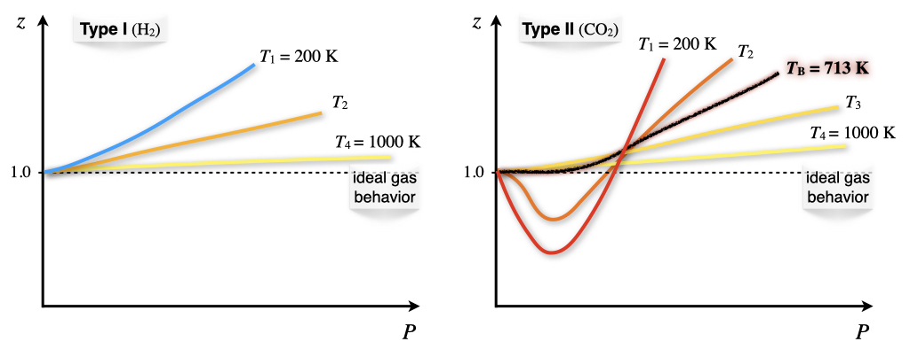
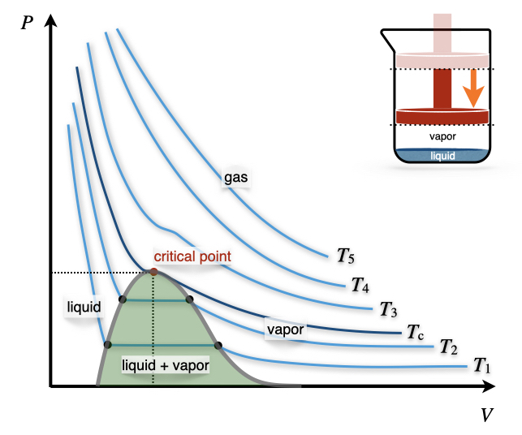
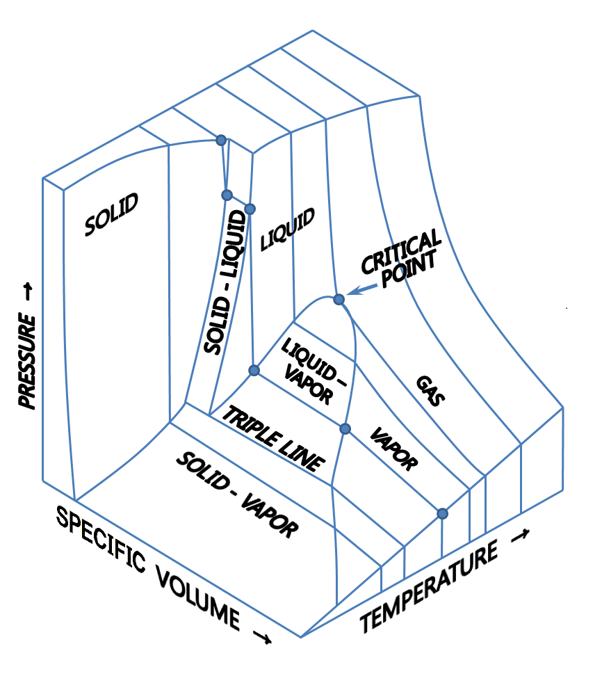

\renewcommand*{\standardstate}{{-\kern-6pt{\ominus}\kern-6pt-}}

# Ideal and Non-Ideal Gases {#RealGases}

## The Ideal Gas Equation

The concept of an ideal gas is a theoretical construct that allows for straightforward treatment and interpretation of gases' behavior. As such, the ideal gas is a simplified *model* that we use to understand nature, and it does not correspond to any real system. The following two assumptions define the ideal gas model:

> ```{definition, iedalgasdef}


- The particles that compose an ideal gas do not occupy any volume.
- The particles that compose an ideal gas do not interact with each other.

```

Because of its simplicity, the ideal gas model has been the historical foundation of thermodynamics and of science in general. The first studies of the ideal gas behavior date back to the seventeenth century, and the scientists that performed them are among the founders of modern science.

### Boyle's Law
In 1662 Robert Boyle (1627–1691) found that the pressure and the volume of an ideal gas are inversely related at constant temperature. Boyle's Law has the following mathematical description:

\begin{equation}
P\propto\frac{1}{V}\quad\text{at const.}\;T,
(\#eq:boylelaw1)
\end{equation}

or, in other terms:

\begin{equation}
PV=k_1\quad\text{at const.}\;T,
(\#eq:boylelaw2)
\end{equation}

which results in the familiar $PV$ plots of Figure \@ref(fig:FigPVideal). As we already discussed in chapter \@ref(ZerothLaw), each of the curves in Figure \@ref(fig:FigPVideal) is obtained at constant temperature, and it is therefore called *"isotherm."*

```{r FigPVideal, echo=FALSE, fig.align='center', fig.cap='PV-Diagram of an ideal Gas.', out.width="70%"}
x <- seq(0,1.25,0.01)
i <- 0.2
f <- 1
p1 <- 0.5

plot(x, 0.081*298/x,
     xlim=c(0, 1.25),
     ylim=c(0, 600),
     type="l",
     ylab = "Pressure [bar]", xlab = "Volume [L]", col = "#2E9FDF",lwd=3)
     
par(new=TRUE)
plot(x, 0.081*1200/x,
     xlim=c(0, 1.25),
     ylim=c(0, 600),
     type="l",
     ylab = "Pressure [bar]", xlab = "Volume [L]", col = "#2E9FDF",lwd=3)
     
text(1.1,150, "isotherms", col = "#2E9FDF")
text(0.02,500, expression('T'[1]), col = "#2E9FDF")
text(0.26,500, expression('T'[2]>'T'[1]), col = "#2E9FDF")
legend("topright", inset=.03, "constant T ",box.col = "white", bg = "white", adj=0.15)

```

### Charles's and Gay-Lussac's Laws
It took scientists more than a century to expand Boyle's work and study the relationship between volume and temperature. In 1787 Jacques Alexandre César Charles (1746–1823) wrote the relationship known as Charles's Law:

\begin{equation}
V\propto T\quad\text{at const.}\;P,
(\#eq:charleslaw1)
\end{equation}

or, in other terms:

\begin{equation}
V=k_2 T\quad\text{at const.}\;P,
(\#eq:charleslaw2)
\end{equation}

which results in the plots of Figure \@ref(fig:FigTVideal). Each of the curves is obtained at constant pressure, and it is termed *"isobar."*

```{r FigTVideal, echo=FALSE, fig.align='center', fig.cap='VT-Diagram of an ideal Gas.', out.width="70%"}
x <- seq(-273,200,1)
i <- 0.2
f <- 1
p1 <- 0.5

plot(x, 0.1*(x+273),
     xlim=c(-273,200),
     ylim=c(0, 100),
     type="l",
     ylab = "Volume [L]", xlab = "Temperature [°C]", col = "Darkgreen",lwd=3)
     
par(new=TRUE)
plot(x, 0.2*(x+273),
     xlim=c(-273,200),
     ylim=c(0, 100),
     type="l",
     ylab = "Volume [L]", xlab = "Temperature [°C]", col = "DarkGreen",lwd=3)

arrows(0.237,205, 0.237, -10 , length=0, angle=90, code=3, lwd=1.5)
points(-273, 0, col="black", pch=19)

text(-260,10, "-273.15", col = "black")
     
text(-40,60, "isobars", col = "DarkGreen")
text(20,20, expression('P'[1]), col = "DarkGreen")
text(38,75, expression('P'[2]>'P'[1]), col = "DarkGreen")
legend("topright", inset=.03, "constant P ",box.col = "white", bg = "white", adj=0.15)
```

The interesting thing about isobars is that each line seems to converge to a specific point along the temperature line when we extrapolate them to $V\rightarrow 0$. This led to the introduction of the absolute temperature scale, suggesting that the temperature will never get smaller than $-273.15^\circ\mathrm{C}$.

It took an additional 21 years to write a formal relationship between pressure and temperature. The following relationships were proposed by Joseph Louis Gay-Lussac (1778–1850) in 1808:

\begin{equation}
P\propto T\quad\text{at const.}\;V,
(\#eq:gaylussac1)
\end{equation}

or, in other terms:

\begin{equation}
P=k_3 T\quad\text{at const.}\;V,
(\#eq:gaylussac2)
\end{equation}

which results in the plots of Figure \@ref(fig:FigTPideal). Each of the curves is obtained at constant volume, and it is termed *"isochor."*

```{r FigTPideal, echo=FALSE, fig.align='center', fig.cap='PT-Diagram of an ideal Gas.', out.width="70%"}
x <- seq(-273,200,1)
i <- 0.2
f <- 1
p1 <- 0.5

plot(x, 0.1*(x+273),
     xlim=c(-273,200),
     ylim=c(0, 100),
     type="l",
     ylab = "Pressure [bar]", xlab = "Temperature [°C]", col = "orange",lwd=3)
     
par(new=TRUE)
plot(x, 0.2*(x+273),
     xlim=c(-273,200),
     ylim=c(0, 100),
     type="l",
     ylab = "Pressure [bar]", xlab = "Temperature [°C]", col = "orange",lwd=3)

arrows(0.237,205, 0.237, -10 , length=0, angle=90, code=3, lwd=1.5)
points(-273, 0, col="black", pch=19)

text(-260,10, "-273.15", col = "black")
     
text(-40,60, "isochors", col = "orange")
text(30,70, expression('V'[1]), col = "orange")
text(40,20, expression('V'[2]>'V'[1]), col = "orange")
legend("topright", inset=.03, "constant V ",box.col = "white", bg = "white", adj=0.15)
```

### Avogadro's Law
Ten years later, Amedeo Avogadro (1776–1856) discovered a seemingly unrelated principle by studying the composition of matter. His Avogadro's Law encodes the relationship between the number of moles in an ideal gas and its volume as:

\begin{equation}
V\propto n\quad\text{at const.}\;P,T,
(\#eq:avogadrolaw1)
\end{equation}

or in other terms:

\begin{equation}
V=k_4 n\quad\text{at const.}\;P,T,
(\#eq:avogadrolaw2)
\end{equation}

### The ideal gas Law
Despite all of the ingredients being available for more than 20 years, it's only in 1834 that Benoît Paul Émile Clapeyron (1799–1864) was finally able to combine them into what is now known as the **ideal gas Law**. Using the same formulas obtained above, we can write:

\begin{equation}
PV=\underbrace{k_3 T}_{\text{from Gay-Lussac's}} \cdot \underbrace{k_4 n,}_{\text{from Avogadro's}}
(\#eq:ideallaw1)
\end{equation}

which by renaming the product of the two constants $k_3$ and $k_4$ as $R$, becomes:

\begin{equation}
PV=nRT
(\#eq:ideallaw2)
\end{equation}

The value of the constant $R$ can be determined experimentally by measuring the volume that 1 mol of an ideal gas occupies at a constant temperature (e.g., at $T=0^\circ\mathrm{C}$) and a constant pressure (e.g., atmospheric pressure $P=1\;\mathrm{atm}$). At those conditions, the volume is measured at 22.4 L, resulting in the following value of $R$:

\begin{equation}
R=\frac{VP}{nT}=\frac{22.4 \cdot 1}{1 \cdot 273}=0.082 \;\frac{\text{L atm}}{\text{mol K}},
(\#eq:ideallaw3)
\end{equation}

which a simple conversion to SI units transforms into: 

\begin{equation}
R=8.31\;\frac{\text{J}}{\text{mol K}}.
(\#eq:RvalueSI)
\end{equation}

## Behaviors of Non-Ideal Gases
Non-ideal gases (sometimes also referred to as "real gases"), do not behave as ideal gases because at least one of the assumptions in definition \@ref(def:iedalgasdef) is violated. What characterizes non-ideal gases is that there is no unique equation that we can use to describe their behavior. For this reason, we have a plethora of several experimental models, none of which is superior to the other. The van der Waals (vdW) equation is the only model that we will analyze in detail because of its simple interpretation. However, it is far from universal, and for several non-ideal gases, it is severely inaccurate. Other popular non-ideal gases equations are the Clausius equation, the virial equation, the Redlich–Kwong equation and several others.^[For more information on empirical equations for non-ideal gases see [this Wikipedia page](https://en.wikipedia.org/wiki/Real_gas).]

### The van der Waals equation
One of the simplest empirical equation that describes non-ideal gases was obtained in 1873 by Johannes Diderik van der Waals (1837–1923). The vdW equation includes two empirical parameters ($a$ and $b$) with different values for different non-ideal gases. Each of the parameters corresponds to a correction for the breaking of one of the two conditions that define the ideal gas behavior (definition \@ref(def:iedalgasdef)). The vdW equation is obtained from the ideal gas equation performing the following simple substitutions:

\begin{equation}
\begin{aligned}
P & \;\rightarrow\;\left( P + \frac{a}{\overline{V}^2} \right)\\
\overline{V} & \;\rightarrow\;\left( \overline{V} - b\right),\\
\end{aligned}
(\#eq:vdWeq1)
\end{equation}

which results in:

\begin{equation}
\begin{aligned}
P\overline{V} &=RT \; \rightarrow \; \left( P + \frac{a}{\overline{V}^2} \right)\left( \overline{V} - b\right)=RT\\
P &=\frac{RT}{\overline{V} - b}-\frac{a}{\overline{V}^2}.
\end{aligned}
(\#eq:vdWeq2)
\end{equation}

The parameter $a$ accounts for the presence of intermolecular interactions, while the parameter $b$ accounts for the non-negligible volume of the gas molecules. Despite the parameters having simple interpretations, their values for each gas must be determined experimentally. Values for these parameters for some significant non-ideal gas are reported below:

\scriptsize
|                 | $a \left[ \frac{\mathrm{L}^2\mathrm{bar}}{\mathrm{mol}^2} \right]$ | $b \left[ \frac{\mathrm{L}}{\mathrm{mol}} \right]$ |
|-----------------|:------------------------------------------------------------------:|:-------------------------------------------------:|
| Ammonia         |                                4.225                               |                       0.0371                      |
| Argon           |                                1.355                               |                      0.03201                      |
| Carbon dioxide  |                                3.640                               |                      0.04267                      |
| Carbon monoxide |                                1.505                               |                      0.03985                      |
| Chlorine        |                                6.579                               |                      0.05622                      |
| Freon           |                                10.78                               |                       0.0998                      |
| Helium          |                               0.0346                               |                       0.0238                      |
| Hydrogen        |                               0.2476                               |                      0.02661                      |
| Mercury         |                                8.200                               |                      0.01696                      |
| Methane         |                                2.283                               |                      0.04278                      |
| Neon            |                               0.2135                               |                      0.01709                      |
| Nitrogen        |                                1.370                               |                       0.0387                      |
| Oxygen          |                                1.382                               |                      0.03186                      |
| Radon           |                                6.601                               |                      0.06239                      |
| Xenon           |                                4.250                               |                      0.05105                      |
\normalsize

### Joule–Thomson effect

```{r FigJT, out.width='80%', fig.show='hold', echo=FALSE, fig.align = 'center', fig.cap='The Joule–Thomson Experiment.'}

```

We have already met William Thomson, also known as Lord Kelvin, and his seminal work on the second law of thermodynamics. In conjunction with that work, Thomson is famous for developing a sensitive method for measuring the temperature changes related to the expansion of a gas. These experiments improved on the earlier work by James Joule, and Lord Kelvin's improved instrument depicted in Figure \@ref(fig:FigJT) is named the Joule–Thomson apparatus. The apparatus is composed of two chambers, each with its own mobile piston. The chambers are connected via a valve or a porous plug. The entire equipment is also thermally isolated from the surroundings. This instrument is a more sensitive version of the Joule expansion apparatus that we already described in section \@ref(FirstLaw) (compare with Figure \@ref(fig:FigJexp)).

Thomson realized that a gas flowing through an obstruction experiences a drop in pressure. If the entire apparatus is insulated, it will not exchange heat with its surroundings ($Q=0$), and each transformation will happen at adiabatic conditions. Let's consider an initial condition with 1 mol of gas in the left chamber, occupying a volume $V_l$, and a completely closed right chamber, for which $V_r^i=0$. After the process completes, the volume of the left chamber will reduce to $V_l^f=0$, while the volume of the right chamber will be $V_r$. Using the first law of thermodynamics, we can write:

\begin{equation}
\Delta U=U_r-U_l=\underbrace{Q}_{=0}+W=W_l+W_r,
(\#eq:JT1)
\end{equation}

with:

\begin{equation}
\begin{aligned}
W_l &=-\int_{V_l}^0 P_l dV = P_l V_l\\
W_r &=-\int_0^{V_r} P_r dV = - P_r V_r.
\end{aligned}
(\#eq:JT2)
\end{equation}

Replacing \@ref(eq:JT2) into eq. \@ref(eq:JT1), results in:

\begin{equation}
\begin{aligned}
U_r-U_l &=P_l V_l-P_r V_r \\
\underbrace{U_r+P_r V_r}_{H_r} &= \underbrace{U_l + P_l V_l}_{H_l},
\end{aligned}
(\#eq:JT3)
\end{equation}

which, replacing the definition of enthalpy $H=U+PV$, we obtain:

\begin{equation}
\begin{aligned}
H_r &=H_l \\
\Delta H &=0,
\end{aligned}
(\#eq:JT4)
\end{equation}

or, in other words, the process is **isenthalpic**. Using the total differential of $H$:

\begin{equation}
dH=\left(\frac{\partial H}{\partial T} \right)_P dT + \left(\frac{\partial H}{\partial P} \right)_T dP = C_P dT + \left(\frac{\partial H}{\partial P} \right)_T dP,
(\#eq:JT5)
\end{equation}

we obtain:

\begin{equation}
\Delta H=\int dH = \int C_P dT + \int \left(\frac{\partial H}{\partial P} \right)_T dP =0,
(\#eq:JT6b)
\end{equation}

or, in purely differential form:

\begin{equation}
dH = C_P dT + \left(\frac{\partial H}{\partial P} \right)_T dP =0,
(\#eq:JT6)
\end{equation}

From eq. \@ref(eq:JT6) we can define a new coefficient, called the *Joule–Thomson coefficient*, $\mu_{\mathrm{JT}}$, that measures the rate of change of temperature of a gas with respect to pressure in the Joule–Thomson process:

\begin{equation}
\mu_{\mathrm{JT}}=\left( \frac{\partial T}{\partial P} \right)_H=-\frac{1}{C_P} \left( \frac{\partial H}{\partial T} \right)_P
(\#eq:muJT)
\end{equation}

The value of $\mu_{\mathrm{JT}}$ depends on the type of gas, the temperature and pressure before expansion, and the heat capacity at constant pressure of the gas. The temperature at which $\mu_{\mathrm{JT}}$ changes sign is called the "Joule–Thomson inversion temperature." Since the pressure decreases during an expansion, $\partial P$ is negative by definition, and the following possibilities are available for $\mu_{\mathrm{JT}}$:

| Gas temperature:                  | $\partial P$ | $\mu_{\mathrm{JT}}$ | $\partial T$ | The gas will: |
|-----------------------------------|:------------:|:-------------------:|:------------:|:-------------:|
| *Below the inversion temperature* |       –      |          +          |       –      |      cool     |
| *Above the inversion temperature* |       –      |          –          |       +      |      warm     |

For example, helium has a very low Joule–Thomson inversion temperature at standard pressure $(T=45\;\text{K})$, and it warms when expanded at constant enthalpy at typical room temperatures. The only other gases that have standard inversion temperature lower than room temperature are hydrogen and neon. On the other hand, nitrogen and oxygen have high inversion temperatures ($T=621\;\text{K}$ and $T=764\;\text{K}$, respectively), and they both cool when expanded at room temperature. Therefore, it is possible to use the Joule–Thomson effect in refrigeration processes such as air conditioning.^[Nitrogen and oxygen are the two most abundant gases in the air. A sequence of Joule–Thomson expansions are also used for the industrial liquefaction of air.] As we already discussed in chapter \@ref(FirstLaw), the temperature of an ideal gases stays constant in an adiabatic expansion, therefore its Joule–Thomson coefficient is always equal to zero.

## Critical Phenomena
### Compressibility factors
The compressibility factor is a correction coefficient that describes the deviation of a real gas from ideal gas behaviour. It is usually represented with the symbol $z$, and is calculated as:

\begin{equation}
z=\frac{\overline{V}}{\overline{V}_{\text{ideal}}} = \frac{P \overline{V}}{RT}.
(\#eq:comprdef)
\end{equation}

It is evident from eq. \@ref(eq:comprdef) that the compressibility factor is dependent on the pressure, and for an ideal gas $z=1$ always. For a non-ideal gas at any given pressure, $z$ can be higher or lower than one, separating the behavior of non-ideal gases into two possibilities. The dependence of the compressibility factor against pressure is represented for $\mathrm{H}_2$ and $\mathrm{CO}_2$ in Figure \@ref(fig:FigZb).

```{r FigZb, out.width='80%', fig.show='hold', echo=FALSE, fig.align = 'center', fig.cap='Non-Ideal Gases Behaviors.'}

```

The two types of possible behaviors are differentiated based on the compressibility factor at $P\rightarrow 0$. To analyze these situations we can use the vdW equation to calculate the compressibility factor as:

\begin{equation}
z= \frac{\overline{V}}{RT} \left( \frac{RT}{\overline{V}-b} -\frac{a}{\overline{V}^2} \right).
(\#eq:compr1)
\end{equation}

and then we can differentiate this equation at constant temperature with respect to changes in the pressure near $P=0$, to obtain:

\begin{equation}
\left. \left( \frac{\partial z}{\partial P}\right)_T \right|_{P=0} = \frac{1}{RT} \left( b -\frac{a}{RT} \right).
(\#eq:compr2)
\end{equation}

which is then interpreted as follows:

- **Type I gases**: $b>\frac{a}{RT} \; \Rightarrow \; \frac{\partial z}{\partial P} > 0$ *molecular size* dominates ($\mathrm{H}_2-$like behavior).
- **Type II gases**: $b<\frac{a}{RT} \; \Rightarrow \; \frac{\partial z}{\partial P} < 0$ *attractive forces* dominates ($\mathrm{CO}_2-$like behavior).

The dependence of the compressibility factor as a function of temperature (Figure \@ref(fig:Fig1Zb2)) results in different plots for each of the two types of behavior.

```{r Fig1Zb2, out.width='90%', fig.show='hold', echo=FALSE, fig.align = 'center', fig.cap='Temperature Dependence of the Compressibility Factor.'}

```

Both type I and type II non-ideal gases will approach the ideal gas behavior as $T\rightarrow \infty$, because $\frac{1}{RT}\rightarrow 0$ as $T\rightarrow \infty$. For type II gases, there are three interesting situations:

- At low $T$: $b<\frac{a}{RT} \; \Rightarrow \; \frac{\partial z}{\partial P} < 0,$ which is the behavior described above.
- At high $T$: $b>\frac{a}{RT} \; \Rightarrow \; \frac{\partial z}{\partial P} > 0,$ which is the same behavior of type I gases.
- At a very specific temperature, inversion will occur (i.e., at $T=713 \; \mathrm{K}$ for $\mathrm{CO}_2$). This temperature is called the **Boyle temperature**, $T_{\mathrm{B}}$, and is the temperature at which the attractive and repulsive forces balance out. It can be calculated from the vdW equation, since $b-\frac{a}{RT_{\mathrm{B}}}=0 \; \Rightarrow \; T_{\mathrm{B}}=\frac{a}{bR}.$ At the Boyle's temperature a type II gas shows ideal gas behavior over a large range of pressure.

### Phase diagram of a non-ideal gas

```{r FigPVni, out.width='60%', fig.show='hold', echo=FALSE, fig.align = 'center', fig.cap='The Pressure–Volume Diagram of a Non-Ideal Gas.'}

```

Let's now turn our attention to the $PV$ phase diagram of a non-ideal gas, reported in Figure \@ref(fig:FigPVni). We can start the analysis from an isotherm at a high temperature. Since every gas will behave as an ideal gas at those conditions, the corresponding isotherms will look similar to those of an ideal gas ($T_5$ and $T_4$ in Figure \@ref(fig:FigPVni)). Lowering the temperature, we start to see the deviation from ideality getting more prominent ($T_3$ in Figure \@ref(fig:FigPVni)) until we reach a particular temperature called the critical temperature, $T_c$. 

> ```{definition, criticalT}
*Critical Temperature:* The temperature above which no appearance of a second phase is observed, regardless of how high the pressure becomes.

```

At the critical temperature and below, the gas liquefies when the pressure is increased. For this reason, the liquefaction of a gas is called a *critical phenomenon*.

The critical temperature is the coordinate of a unique point, called the **critical point**, that can be visualized in the three-dimensional $T,P,V$ diagram of each gas (Figure \@ref(fig:FigTPVd)^[This diagram is taken from [Wikipedia](https://en.wikipedia.org) and distributed under CC-BY-SA license.]).

```{r FigTPVd, out.width='50%', fig.show='hold', echo=FALSE, fig.align = 'center', fig.cap='The three-dimensional diagram.'}

```

The critical point has coordinates ${T_c,P_c, \overline{V}_c}$. These critical coordinates can be determined from the vdW equation at $T_c$, as:

\begin{equation}
T_c=\frac{8a}{27Rb} \qquad P_c=\frac{a}{27b^2} \qquad \overline{V}_c=3b, 
(\#eq:criticpt)
\end{equation}

These relations are used, in practice, to determine the vdW constants $a,b$ from the experimentally measured critical isotherms.

The critical compressibility factor, $z_c$, is predicted from the vdW equation at:

\begin{equation}
z_c=\frac{P_c \overline{V}_c}{R T_c}=\left( \frac{a}{27b^2} \right) \left( \frac{3b}{R} \right) \left( \frac{27Rb}{8a} \right) = \frac{3}{8} = 0.375,
(\#eq:critiz)
\end{equation}

a value that is independent of the gas. Experimentally measured values of $z_c$ for different non-ideal gases are in the range of 0.2–0.3. These values can be used to infer the accuracy of the vdW equation for each non-ideal gas. Since the experimental $z_c$ is usually lower than the one calculated from the vdW equation, we can deduce that the vdW equation overestimates the critical molar volume. 

Notice how slicing the $PT\overline{V}$ diagram at constant $T$ results in the $PV$ diagram that we reported in Figure \@ref(fig:FigTPVd). On the other hand, slicing the $PT\overline{V}$ diagram at constant $P$ results in the $PT$ diagram that we will examine in detail in the next chapter.

## Fugacity

The chemical potential of a pure ideal gas can be calculated using eq. \@ref(eq:dgconstn4). Since we are not interested in a mixture, we can drop the asterisk in $\mu^*$, and rewrite eq. \@ref(eq:dgconstn4) as:

\begin{equation}
\mu_{\text{ideal}} = \mu^\standardstate + RT \ln \frac{P}{P^\standardstate}.
(\#eq:dcpig)
\end{equation}

For a non-ideal gas, the pressure cannot be used in eq. \@ref(eq:dcpig) because the response of each gas to changes in pressure is not universal. We can, however, define a new variable to replace the pressure in eq. \@ref(eq:dcpig) and call it fugacity ($f$). 

> ```{definition, fugacitydef}
*Fugacity:* The effective pressure of a non-ideal gas that corresponds to the pressure of an ideal gas with the same temperature and chemical potential of the non-ideal one. 


```
Eq. \@ref(eq:dcpig) then becomes:

\begin{equation}
\mu_{\text{non-ideal}} = \mu^\standardstate + RT \ln \frac{f}{P^\standardstate}.
(\#eq:dcpnig)
\end{equation}

Since the chemical potential of a gas $\mu$ is equal to the standard chemical potential $\mu^\standardstate$ when $P=P^\standardstate$, it is easy to use eq. \@ref(eq:dcpnig) to demonstrate that:

\begin{equation}
\lim_{P\rightarrow 0} \frac{f}{P} = 1,
(\#eq:dcpnigL)
\end{equation}

in other words, any non-ideal gas will approach the ideal gas behavior as $P\rightarrow 0$. This condition, in conjunction with the $T\rightarrow \infty$ behavior obtained in the previous section, results in the following statement:

> The highest chances for any gas to behave ideally happen at high temperature and low pressure.

We can now return our attention to the definition of fugacity. Remembering that the chemical potential is the molar Gibbs free energy of a substance, we can write:

\begin{equation}
d \mu_{\text{ideal}} = \overline{V}_{\text{ideal}}dP,
(\#eq:dmufug1)
\end{equation}

and:

\begin{equation}
d \mu_{\text{non-ideal}} = \overline{V}_{\text{non-ideal}}dP,
(\#eq:dmufug2)
\end{equation}

Subtracting eq. \@ref(eq:dmufug1) from eq. \@ref(eq:dmufug2), we obtain:

\begin{equation}
d \mu_{\text{non-ideal}}-d \mu_{\text{ideal}} = \left(\overline{V}_{\text{non-ideal}}-\overline{V}_{\text{ideal}} \right) dP,
(\#eq:dmufug3)
\end{equation}

which we can then integrate between $0$ and $P$:

\begin{equation}
\mu_{\text{non-ideal}}-\mu_{\text{ideal}} = \int_0^P \left(\overline{V}_{\text{non-ideal}}-\overline{V}_{\text{ideal}} \right) dP.
(\#eq:dmufug4)
\end{equation}

Using eqs. \@ref(eq:dcpig) and \@ref(eq:dcpnig) we can then replace the definition of chemical potentials, resulting into:

\begin{equation}
\ln f - \ln P = \frac{1}{RT} \int_0^P \left(\overline{V}_{\text{non-ideal}} - \overline{V}_{\text{ideal}} \right) dP,
(\#eq:dmufug5)
\end{equation}

which gives us a mathematical definition of the fugacity, as:

\begin{equation}
f = P \cdot \underbrace{\exp\left[ \frac{1}{RT} \int_0^P \left(\overline{V}_{\text{non-ideal}}-\overline{V}_{\text{ideal}} \right) dP \right]}_{\text{fugacity coefficient, }\phi(T,P)}.
(\#eq:dmufug6)
\end{equation}

The exponential term in eq. \@ref(eq:dmufug6) is complicated to write, but it can be interpreted as a coefficient—unique to each non-ideal gas—that can be measured experimentally. Such coefficients are dependent on pressure and temperature and are called the *fugacity coefficients*. Using letter $\phi$ to represent the fugacity coefficient, we can rewrite eq. \@ref(eq:dmufug6) as:

\begin{equation}
f = \phi P,
(\#eq:dmufug7)
\end{equation}

which gives us a straightforward interpretation of the fugacity as an effective pressure. As such, the fugacity will have the same unit as the pressure, while the fugacity coefficients will be adimensional.

As we already saw in chapter \@ref(ChemicalEquilibrium), the fugacity can be used to replace the pressure in the definition of the equilibrium constant for reactions that involve non-ideal gases. The new constant is usually called $K_f$, and is obtained from:

\begin{equation}
K_f=\prod_i f_{i,\text{eq}}^{\nu_i} = K_P \prod_i \phi_{i}^{\nu_i}.
(\#eq:kfdef)
\end{equation}

[//]: ## Law of Corresponding States
