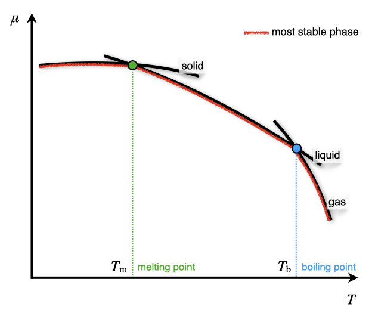
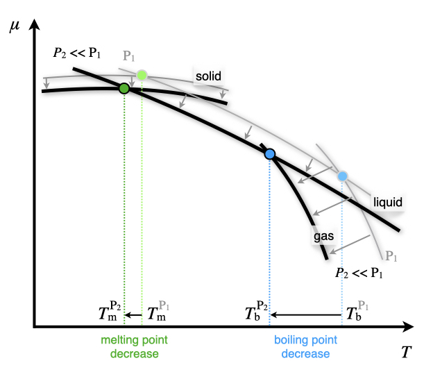
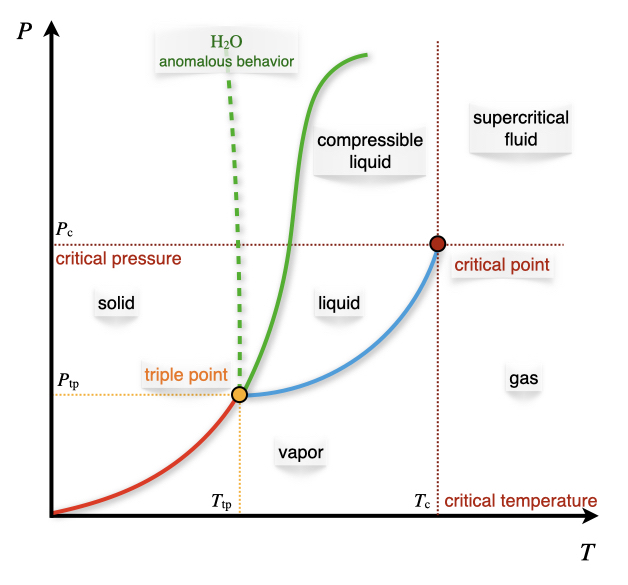

\renewcommand*{\standardstate}{{-\kern-6pt{\ominus}\kern-6pt-}}

# Phase Equilibrium {#PhaseEquilibrium}

## Phase Stability

We have already encountered the gas, liquid, and solid phases and already discussed some of their properties. These terms are intuitive since these are the three most common states of matter.^[Other states of matter—such as plasma—are possible, but they are not usually observed at the values of temperature and pressure that classical thermodynamics is usually applied to. Discussion of these extreme cases is beyond the scope of this textbook.] For this reason, we have previously used the terms without the necessity of formally defining their meaning. However, a formal definition of "phase" is necessary to discuss several concepts in this chapter and the following ones: 

> ```{definition, phasedef}
*Phase:* A region of the system with homogeneous chemical composition and physical state.

```

Let's now use the total differential of the chemical potential and the definition of molar Gibbs free energy for one component:

\begin{equation}
\begin{aligned}
d\mu &= \left( \frac{\partial \mu}{\partial T} \right)_P dT + \left( \frac{\partial \mu}{\partial P} \right)_T dP \\
d\mu &= -SdT+\overline{V}dP,
\end{aligned}
(\#eq:muequal1)
\end{equation}

to write:

\begin{equation}
\left( \frac{\partial \mu}{\partial T} \right)_P=-S \qquad \left( \frac{\partial \mu}{\partial P} \right)_T =\overline{V}.
(\#eq:muequal2)
\end{equation}

We can use these definitions to study the dependence of the chemical potential with respect to changes in pressure and temperature. If we plot $\mu$ as a function of $T$ using the first coefficient in eq. \@ref(eq:muequal2), we obtain the diagram in Figure \@ref(fig:FigPhase1). The diagram presents three curves, each corresponding to one of the three most common states of matter – solid, liquid, and gas. As we saw in several previous chapters, the entropy of a phase is almost constant with respect to temperature,^[Think, for example, at the integral $\int SdT$, for which we can assume $S$ independent of temperature to obtain $S\Delta T$. In practice, the entropy increases slightly with the temperature. Therefore the curves in Figure \@ref(fig:FigPhase1) are slightly concave downwards (remember that they are obtained from values of $-S$, so if $S$ increase with $T$, the curves bend downwards.)] and therefore the three curves are essentially straight, with negative angular coefficients $-S$. This also explains why the solid phase has a basically flat line since, according to the third law, the entropy of a perfect solid is zero and close to zero if the solid is not perfect. The difference between the three lines' angular coefficients is explained by the fact that each of these states has a different value of entropy:

\begin{equation}
\left( \frac{\partial \mu_{\text{solid}}}{\partial T} \right)_P =-S_{\text{s}} \qquad \left( \frac{\partial \mu_{\text{liquid}}}{\partial T} \right)_P =-S_{\text{l}} \qquad \left( \frac{\partial \mu_{\text{gas}}}{\partial T} \right)_P =-S_{\text{g}},
(\#eq:muequal3)
\end{equation}

and since the entropy of a gas is always bigger than the entropy of a liquid, which in turn, is yet bigger than the entropy of a solid ($S_{\text{g}} \gg S_{\text{l}}>S_{\text{s}}$), we obtain three lines with different angular coefficients that intersect each other. At each temperature, the phase with the lowest chemical potential will be the most stable (see red segments in Figure \@ref(fig:FigPhase1)). At each intersection between two lines, the two phases have the same chemical potential, representing the temperature at which they coexist. This temperature is the temperature at which the phase change happens. Recalling from general chemistry, at the junction between the solid and the liquid lines, the fusion (fus) process occurs, and the corresponding temperature is called the melting point $T_{\text{m}}$. At the junction between the liquid and the gas lines, the vaporization (vap) process happens, and the corresponding temperature is called the boiling point $T_{\text{b}}$. Depending on the substance and the pressure at which the process happens, the solid line might intersect the gas line before the liquid line. When that occurs, the liquid phase is never observed, and only the sublimation (subl) process happens at the sublimation point $T_{\text{subl}}$.

```{r FigPhase1, out.width='60%', fig.show='hold', echo=FALSE, fig.align = 'center', fig.cap='Dependence of the Chemical Potentials of Solid, Liquid, and Gas Phases on Temperature at Constant Pressure.'}

```

The effects of pressure on this diagram can be studied using the second coefficient in eq. \@ref(eq:muequal2). For the majority of substances, $\overline{V}_{\text{g}} \gg \overline{V}_{\text{l}} > \overline{V}_{\text{s}}$, hence the curves will shift to lower values when the pressure is reduced, as in Figure \@ref(fig:FigPhase2). Notice also that since $\overline{V}_{\text{l}} \cong \overline{V}_{\text{s}}$, the shifts for both the solid and liquid lines is much smaller than the shift for the gas line. These shifts also translate to different values of the junctions, which means the phase changes will occur at different temperatures. Therefore both the melting point and the boiling point in general decrease when pressure is increased (and vice versa). Notice how the change for the melting point is always much smaller than the change for the boiling point. 
Water is a noticeable exception to these trend because $\overline{V}_{\mathrm{H}_2\mathrm{O,l}} < \overline{V}_{\text{ice}}$. This explains the experimental observation that increasing the pressure on ice causes the ice to melt^[Despite the effect being minimal, it is one of the contributing causes to the fact that we can skate on ice, but we can't on stone. If we increase our pressure on ice by reducing our footprints' surface area using thin skates, ice will slightly melt under our own weight, creating a thin liquid film on which we can skate because of the reduced friction.]

```{r FigPhase2, out.width='60%', fig.show='hold', echo=FALSE, fig.align = 'center', fig.cap='Effect of Pressure on the Chemical Potential Diagram.'}

```

Considering the intersections between two lines, two phases are in equilibrium with each other at each of these points. Therefore their chemical potentials must be equal:

For two or more phases to be in equilibrium, their chemical potential must be equal:

\begin{equation}
\mu_{\alpha} = \mu_{\beta}.
(\#eq:muequal)
\end{equation}

If we now change either the temperature or the pressure, the location of the intersection will be shifted (see again Figure \@ref(fig:FigPhase2) and the discussion above). For infinitesimal changes in variables, the new location will be:

\begin{equation}
\mu_{\alpha} + d\mu_{\alpha}= \mu_{\beta}+d\mu_{\beta},
(\#eq:muequalA)
\end{equation}

which using eq. \@ref(eq:muequal), simply becomes:

\begin{equation}
d\mu_{\alpha}= d\mu_{\beta}.
(\#eq:muequalB)
\end{equation}

Replacing the differential with the definition of chemical potential in eq. \@ref(eq:muequal1), we obtain:

\begin{equation}
\begin{aligned}
-S_{\alpha}dT+\overline{V}_{\alpha} &= -S_{\beta}dT+\overline{V}_{\beta} \\
\underbrace{\left(S_{\beta}-S_{\alpha}\right)}_{\Delta S} dT &= \underbrace{\left( \overline{V}_{\beta}-\overline{V}_{\alpha}\right)}_{\Delta \overline{V}},
\end{aligned}
(\#eq:muequalC)
\end{equation}

which can be rearranged into:

\begin{equation}
\frac{dP}{dT}=\frac{\Delta S}{\Delta \overline{V}}.
(\#eq:ClapeyronEq)
\end{equation}

This equation is known as the **Clapeyron equation**, and it is the mathematical relation at the basis of the pressure-temperature phase diagrams. Plotting the results of eq. \@ref(eq:ClapeyronEq) on a $PT$ phase diagram for common substances results in three lines representing the equilibrium between two different phases. These diagrams are useful to study the relationship between the phases of a substance.

## Gibbs Phase Rule
In chapter \@ref(SystemVariables), we have already seen that the number of independent variables required to describe an ideal gas is two. This number was derived by counting the total number of variables $(3: P,\overline{V},T)$, and reduce it by one because the ideal gas law constrains the value of one of them, once the other two are fixed. For a generic system potentially containing more than one chemical substance in several different phases, however, the number of independent variables can be different than two. For a system composed of $c$ components (chemical substances) and $p$ phases, the number of independent variables, $f$, is given by the Gibbs phase rule:

\begin{equation}
f=c-p+2.
(\#eq:Gibbsrule)
\end{equation}

The Gibbs phase rule derives from the fact that different phases are in equilibrium with each other at some conditions, resulting in the reduction of the number of independent variables at those conditions. More rigorously, when two phases are in thermodynamic equilibrium, their chemical potentials are equal (see eq. \@ref(eq:muequal)). For each equality, the number of independent variables—also called the number of *degrees of freedom*—is reduced by one. For example, the chemical potentials of the liquid and its vapor depend on both $T$ and $P$. But when these phases are in equilibrium with each other, their chemical potentials must be equal. If either the pressure or the temperature is fixed, the other variable will be uniquely determined by the equality relation. In other terms, when a liquid is in equilibrium with its vapor at a given pressure, the temperature is determined by the fact that the chemical potentials of the two phases is the same, and is denoted as the boiling temperature $T_{\text{b}}$. Similarly, at a given temperature, the pressure of the vapor is uniquely determined by the same equality relation and is denoted as the vapor pressure, $P^*$.

The Gibbs phase rule is obtained considering that the number of independent variables is given by the total number of variables minus the constraints. The total number of variables is given by temperature, pressure, plus all the variables required to describe each of the phases. The composition of each phase is determined by $(c-1)$ variables.^[For a 1-component system $c-1=1-1=0$, and no additional variable is required to determine the composition of each phase. For a 2-component system, however, each phase will contain both components, hence $c-1=2-1=1$ additional variable will be required to describe it–the mole fraction.] The number of constraints is determined by the number of possible equilibrium relations, which is $c(p-1)$ since the chemical potential of each component must be equal in all phases. The number of degrees of freedom $f$ is then given by $f=(c-1)p+2-c(p-1)$ $=c-p+2$, which is the Gibbs phase rule, as in eq. \@ref(eq:Gibbsrule).

## $PT$ Phase Diagrams

```{r FigPhase3, out.width='60%', fig.show='hold', echo=FALSE, fig.align = 'center', fig.cap='The Pressure–Temperature Phase Diagram.'}

```
Let's now discuss the pressure–temperature diagram of a typical substance, as reported in Figure \@ref(fig:FigPhase3). Each of the lines reported in the diagram represents an equilibrium between two phases, and therefore it represents a condition that reduces the number of degrees of freedom to one. The lines can be determined using the Clapeyron equation, eq. \@ref(eq:ClapeyronEq). The interpretation of each line is as follows:

### Liquid $\rightleftarrows$ Gas equilibrium

For this equilibrium we can use Trouton's rule, eq. \@ref(eq:trouton), and write:
\begin{equation}
\Delta_{\text{vap}} S = S_{\text{g}}-S_{\text{l}} \cong 88 \; \frac{\text{kJ}}{\text{mol}} > 0\quad \text{always},
(\#eq:PTdia1)
\end{equation}

where the entropy of vaporization is always positive, even for cases where the Trouton's rule is violated. The difference in molar volumes is easily obtained, since the volume of the gas is always much greater than the volume of the liquid:

\begin{equation}
\overline{V}_{\text{g}} - \overline{V}_{\text{l}} \cong \overline{V}_{\text{g}} = 22.4\; \frac{\text{L}}{\text{mol}} >0\quad \text{always}.
(\#eq:PTdia2)
\end{equation}

Replacing these values in the Clapeyron equation, we obtain:

\begin{equation}
\frac{dP}{dT}=\frac{88}{22.4}\left( \frac{0.0831}{8.31} \right) = 0.004\;\text{bar} > 0 \quad \text{always},
(\#eq:PTdia3)
\end{equation}

which is always positive,regardless of violations to the Trouton's rule. Notice how small this value is, meaning that the liquid–gas equilibrium curve is mostly flat as $T\rightarrow 0$.

### Solid $\rightleftarrows$ Gas equilibrium

If we look at the signs of each quantity, this case is similar to the previous one: 
\begin{equation}
\begin{aligned}
\Delta_{\text{subl}} S &> 0 \quad \text{always} \\
\Delta_{\text{subl}} \overline{V }&> 0 \quad \text{always} \\
\\
\frac{dP}{dT} &> 0 \quad \text{always}.
\end{aligned}
(\#eq:PTdi1)
\end{equation}

However, the Trouton's rule is not valid for the solid–gas equilibrium, and $\frac{dP}{dT}$ will be larger than for the previous case.

### Solid $\rightleftarrows$ Liquid equilibrium

The final curve is for the solid-liquid equilibrium, for which we have:

\begin{equation}
\Delta_{\text{fus}} S = \frac{\Delta_{\text{fusion}} H}{T_{\text{m}}} > 0 \quad \text{always},
(\#eq:PTd1)
\end{equation}

since fusion is always an exothermic process, $(\Delta_{\text{fus}} H>0)$. On the other side:

\begin{equation}
\Delta_{\text{fusion}} \overline{V} = \overline{V}_{\text{l}} - \overline{V}_{\text{s}} > 0 \quad \text{generally}.
\end{equation}

In other words, the difference of the molar volume of the liquid and that of the solid is positive for most substances, but it might be negative (for example for $\mathrm{H}_2\mathrm{O}$). As such:

\begin{equation}
 \frac{dP}{dT} > 0 \quad \text{generally}.
(\#eq:PTd2)
\end{equation}

For $\mathrm{H}_2\mathrm{O}$ and a few other substances, $\frac{dP}{dT}<0$, an anomalous behavior that has crucial consequences for the existence of life on earth.^[As is well explained by [Wikipedia](https://en.wikipedia.org/wiki/Properties_of_water#Density_of_water_and_ice): "The unusual density curve and lower density of ice than of water is vital to life—if water were most dense at the freezing point, then in winter the very cold water at the surface of lakes and other water bodies would sink, lakes could freeze from the bottom up, and all life in them would be killed. Furthermore, given that water is a good thermal insulator (due to its heat capacity), some frozen lakes might not completely thaw in summer.[34] The layer of ice that floats on top insulates the water below. Water at about 4 °C (39 °F) also sinks to the bottom, thus keeping the temperature of the water at the bottom constant."] For this importance, this behavior is also depicted in Figure \@ref(fig:FigPhase3) using a dashed green line. 

Since the differences in molar volumes between the solid and the liquid phases are usually small (changes are generally of the order of $10^{-3}\;\mathrm{L}$), $\frac{dP}{dT}$ is always much larger than for the previous two cases. The resulting lines for the solid–liquid equilibria are still almost vertical, regardless of the signs of their angular coefficients. 

### The triple point and the critical point
The only point in the $PT$ diagram where all the three phases coexist is called the triple point. The number of degrees of freedom at the triple point for every 1-component diagram is $f=1-3+2=0$. The fact that the triple point has zero degrees of freedom means that its coordinates, ${T_{\text{tp}},P_{\text{tp}},\overline{V}_{\text{tp}}}$, are uniquely determined for each chemical substance. For this reason, the value of the triple point of water was fixed by definition—rather than measured—until 2019. This definition was necessary to establish the base unit of the thermodynamic temperature scale in the SI (the Kelvin).^[For more information on the 2019 redefinition of the SI units, see [this Wikipedia page](https://en.wikipedia.org/wiki/2019_redefinition_of_the_SI_base_units).]

In addition to the triple point where the solid, liquid, and gas phases meet, a triple point may involve more than one condensed phase. Triple points are common for substances with multiple solid phases (polymorphs), involving either two solid phases and a liquid one or three solid phases. Helium is a special case that presents a triple point involving two different fluid phases, called the lambda point. Since the number of degrees of freedom cannot be negative, the Gibbs phase rule for a 1-component diagram sets the limit to how many phases can coexist to just three. Therefore, quadruple points (or higher coexistence points) are not possible for pure substances, even for polymorphs.^[Notice that quadruple points are possible for 2-component diagrams.]

Another point with a fixed position in the $PT$ diagram is the critical point, ${T_{\text{c}},P_{\text{c}},\overline{V}_{\text{c}}}$. We have already given the definition of the critical temperature in \@ref(def:criticalT). This point represents the end of the liquid–gas equilibrium curve. This point is also semantically important to define different regions of the phase diagram, as in Figure \@ref(fig:FigPhase3). A gas whose pressure and temperature are below the critical point is called a *vapor*. A gas whose temperature and pressure are above the critical point is called a *supercritical fluid*. Finally, a liquid whose pressure is above the critical point is called a *compressible liquid*.^[Notice that the temperature of a liquid must be below the critical point, otherwise it is no longer a liquid but rather a supercritical fluid.]

## The Clausius–Clapeyron Equation
Let's now take a closer look at the equilibrium between a condensed phase and the gas phase. For both the vaporization and sublimation processes, Clausius showed that the Clapeyron equation can be simplified by using:


\begin{equation}
 \Delta_{\text{vap}} S = \frac{\Delta_{\text{vap}} H}{T} \qquad \Delta \overline{V}= \overline{V}_{\mathrm{g}} -\overline{V}_{\mathrm{l}} \cong \overline{V}_{\mathrm{g}},
(\#eq:clacla1)
\end{equation}

resulting in:

\begin{equation}
 \frac{dP}{dT} = \frac{ \Delta_{\text{vap}} S}{\Delta \overline{V}} \cong \frac{ \Delta_{\text{vap}} H}{T \overline{V}_{\mathrm{g}}}.
(\#eq:clacla2)
\end{equation}

Using the ideal gas law to replace the molar volume of the gas, we obtain:

\begin{equation}
 \frac{dP}{dT} = \frac{P \Delta_{\text{vap}} H}{RT^2},
(\#eq:clacla3)
\end{equation}

which can be rearranged as:

\begin{equation}
 \frac{dP}{P} = \frac{\Delta_{\text{vap}} H}{R} \frac{dT}{T^2}.
(\#eq:clacla)
\end{equation}

Eq. \@ref(eq:clacla) is known as the **Clausius–Clapeyron equation**, and it measures the dependence of the vapor pressure of a substance as a function of the temperature. The Clausius–Clapeyron equation can be integrated to obtain:

\begin{equation}
\begin{aligned}
\int_{P_i}^{P_f} \frac{dP}{P} &= \frac{\Delta_{\text{vap}} H}{R} \int_{T_i}^{T_f} \frac{dT}{T^2} \\
\ln \frac{P_f}{P_i} &=-\frac{\Delta_{\text{vap}} H}{R} \left( \frac{1}{T_f}-\frac{1}{T_i} \right).
\end{aligned}
(\#eq:clacla4)
\end{equation}

The integrated Clausius–Clapeyron equation shows that the vapor pressure depends exponentially on the temperature. Thus, even a small change in the temperature will result in a significant change in the vapor pressure. In fact, we daily use the fact that the vapor pressure of water changes drastically when we increase its temperature for cooking most of our food. For example, at an external pressure of 1 bar, it rapidly grows from $P^*=0.02\;\text{bar}$ to $P^*=1\;\text{bar}$ when the temperature is increased from $T=293\;\mathrm{K}$ (around room temperature) to $T=373\;\mathrm{K}$ (boiling point). The integrated Clausius–Clapeyron equation is also often used to determine the enthalpy of vaporization from measurements of vapor pressure at different temperatures.
