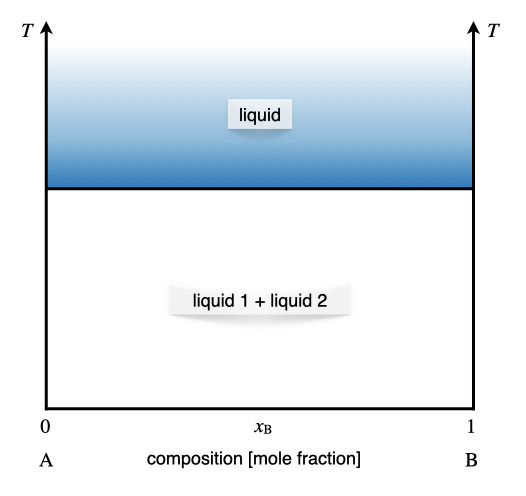
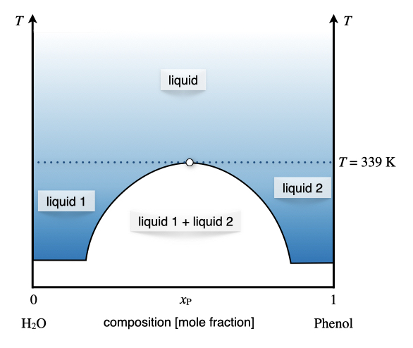
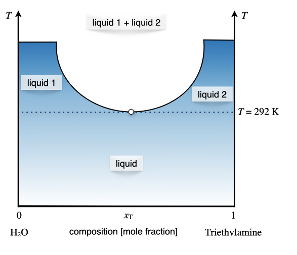
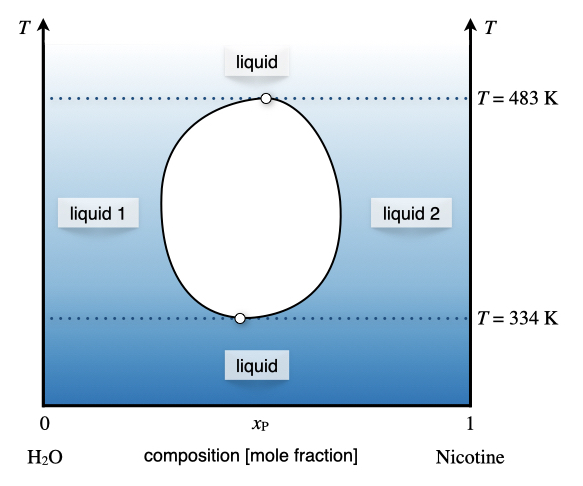
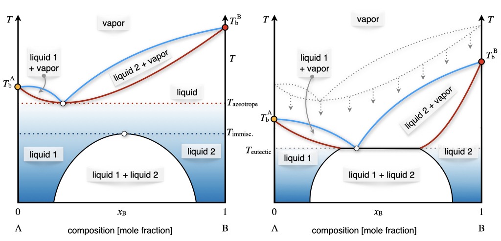
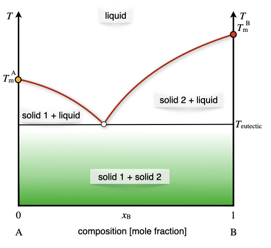

# Multi-Component Phase Diagrams {#MCPhaseDiagrams}

We now move from studying 1-component systems to multi-component ones. Systems that include two or more chemical species are usually called *solutions*. Solutions are possible for all three states of matter:

\scriptsize
| Type:             | Solvent | Solute | Examples:                    |
|-------------------|:-------:|:------:|------------------------------|
| Solid solutions   | Solid   | Solid  | Alloys: brass, bronze        |
|                   | Solid   | Liquid | Dental amalgam               |
|                   | Solid   | Gas    | Hydrogen stored in Palladium |
| Liquid solutions  | Liquid  | Solid  | Saltwater, bleach           |
|                   | Liquid  | Liquid | Alcoholic beverages, vinegar |
|                   | Liquid  | Gas    | Carbonated drinks            |
| Gaseous solutions | Gas     | Solid  | Smoke, smog                  |
|                   | Gas     | Liquid | Aerosols and perfumes        |
|                   | Gas     | Gas    | Air                          |
\normalsize

The number of degrees of freedom for binary solutions (solutions containing two components) is calculated from the Gibbs phase rules at $f=2-p+2=4-p$. When one phase is present, binary solutions require $4-1=3$ variables to be described, usually temperature ($T$), pressure ($P$), and mole fraction ($y_i$ in the gas phase and $x_i$ in the liquid phase). Single-phase, 1-component systems require three-dimensional $T,P,x_i$ diagram to be described. When two phases are present (e.g., gas and liquid), only two variables are independent: pressure and concentration. Thus, we can study the behavior of the partial pressure of a gas–liquid solution in a 2-dimensional plot. If the gas phase in a solution exhibits properties similar to those of a mixture of ideal gases, it is called an *ideal solution*. The obvious difference between ideal solutions and ideal gases is that the intermolecular interactions in the liquid phase cannot be neglected as for the gas phase. The main advantage of ideal solutions is that the interactions between particles in the liquid phase have similar mean strength throughout the entire phase. We will consider ideal solutions first, and then we'll discuss deviation from ideal behavior and non-ideal solutions.  

## Raoult's Law and Phase Diagrams of Ideal Solutions

The behavior of the vapor pressure of an ideal solution can be mathematically described by a simple law established by François-Marie Raoult (1830–1901). **Raoult's law** states that the partial pressure of each component, $i$, of an ideal mixture of liquids, $P_i$, is equal to the vapor pressure of the pure component $P_i^*$ multiplied by its mole fraction in the mixture $x_i$:

\begin{equation}
P_i=x_i P_i^*.
(\#eq:mc1)
\end{equation}

### One volatile component
Raoult's law applied to a system containing only one volatile component describes a line in the $Px_{\text{B}}$ plot, as in Figure \@ref(fig:FigMC1).

```{r FigMC1, out.width='60%', fig.show='hold', echo=FALSE, fig.align = 'center', fig.cap='The Pressure–Composition Phase Diagram of an Ideal Solution Containing a Single Volatile Component at Constant Temperature.'}
knitr::include_graphics('./img/OEP_Figures.019.jpeg')
```

As emerges from Figure \@ref(fig:FigMC1), Raoult's law divides the diagram into two distinct areas, each with three degrees of freedom.^[Only two degrees of freedom are visible in the $Px_{\text{B}}$ diagram. Temperature represents the third independent variable.] Each area contains a phase, with the vapor at the bottom (low pressure), and the liquid at the top (high pressure). Raoult's law acts as an additional constraint for the points sitting on the line. Therefore, the number of independent variables along the line is only two. Once the temperature is fixed, and the vapor pressure is measured, the mole fraction of the volatile component in the liquid phase is determined.

### Two volatile components

In an ideal solution, every volatile component follows Raoult's law. Since the vapors in the gas phase behave ideally, the total pressure can be simply calculated using Dalton's law as the sum of the partial pressures of the two components $P_{\text{TOT}}=P_{\text{A}}+P_{\text{B}}$. The corresponding diagram is reported in Figure \@ref(fig:FigMC2). The total vapor pressure, calculated using Dalton's law, is reported in red. The Raoult's behaviors of each of the two components are also reported using black dashed lines.

```{r FigMC2, out.width='60%', fig.show='hold', echo=FALSE, fig.align = 'center', fig.cap='The Pressure–Composition Phase Diagram of an Ideal Solution Containing Two Volatile Components at Constant Temperature.'}
knitr::include_graphics('./img/OEP_Figures.020.jpeg')
```

> ```{exercise, xaya}
Calculate the mole fraction in the vapor phase of a liquid solution composed of 67% of toluene ($\mathrm{A}$) and 33% of benzene ($\mathrm{B}$), given the vapor pressures of the pure substances: $P_{\text{A}}^*=0.03\;\text{bar}$, and $P_{\text{B}}^*=0.10\;\text{bar}$.
*Solution:* The data available for the systems are summarized as follows:
\begin{equation}
\begin{aligned}
x_{\text{A}}=0.67  \qquad & \qquad x_{\text{B}}=0.33 \\
P_{\text{A}}^* = 0.03\;\text{bar} \qquad & \qquad P_{\text{B}}^* = 0.10\;\text{bar} \\
& P_{\text{TOT}} = ? \\
y_{\text{A}}=? \qquad & \qquad y_{\text{B}}=?
\end{aligned}
(\#eq:mc2)
\end{equation}
The total pressure of the vapors can be calculated combining Dalton's and Roult's laws:
\begin{equation}
\begin{aligned}
P_{\text{TOT}} &= P_{\text{A}}+P_{\text{B}}=x_{\text{A}} P_{\text{A}}^* + x_{\text{B}} P_{\text{B}}^* \\
&= 0.67\cdot 0.03+0.33\cdot 0.10 \\
&= 0.02 + 0.03 = 0.05 \;\text{bar}
\end{aligned}
(\#eq:mc3)
\end{equation}
We can then calculate the mole fraction of the components in the vapor phase as:
\begin{equation}
\begin{aligned}
y_{\text{A}}=\frac{P_{\text{A}}}{P_{\text{TOT}}} & \qquad y_{\text{B}}=\frac{P_{\text{B}}}{P_{\text{TOT}}} \\
y_{\text{A}}=\frac{0.02}{0.05}=0.40 & \qquad y_{\text{B}}=\frac{0.03}{0.05}=0.60
\end{aligned}
(\#eq:mc4)
\end{equation}
Notice how the mole fraction of toluene is much higher in the liquid phase, $x_{\text{A}}=0.67$, than in the vapor phase, $y_{\text{A}}=0.40$.
```

As is clear from the results of Exercise \@ref(exr:xaya), the concentration of the components in the gas and vapor phases are different. We can also report the mole fraction in the vapor phase as an additional line in the $Px_{\text{B}}$ diagram of Figure \@ref(fig:FigMC2). When both concentrations are reported in one diagram—as in Figure \@ref(fig:FigMC3)—the line where $x_{\text{B}}$ is obtained is called the *liquidus line*, while the line where the $y_{\text{B}}$ is reported is called the *Dew point line*.

```{r FigMC3, out.width='60%', fig.show='hold', echo=FALSE, fig.align = 'center', fig.cap='The Pressure–Composition Phase Diagram of an Ideal Solution Containing Two Volatile Components at Constant Temperature. Both the Liquidus and Dew Point Line are Emphasized in this Plot.'}
knitr::include_graphics('./img/OEP_Figures.021.jpeg')

```

The liquidus and Dew point lines determine a new section in the phase diagram where the liquid and vapor phases coexist. Since the degrees of freedom inside the area are only 2, for a system at constant temperature, a point inside the coexistence area has fixed mole fractions for both phases. We can reduce the pressure on top of a liquid solution with concentration $x^i_{\text{B}}$ (see Figure \@ref(fig:FigMC3)) until the solution hits the liquidus line. At this pressure, the solution forms a vapor phase with mole fraction given by the corresponding point on the Dew point line, $y^f_{\text{B}}$.

### $T_{\text{B}}$ phase diagrams and fractional distillation

We can now consider the phase diagram of a 2-component ideal solution as a function of temperature at constant pressure. The $T_{\text{B}}$ diagram for two volatile components is reported in Figure \@ref(fig:FigMC4). 

```{r FigMC4, out.width='60%', fig.show='hold', echo=FALSE, fig.align = 'center', fig.cap='The Temperature–Composition Phase Diagram of an Ideal Solution Containing Two Volatile Components at Constant Pressure.'}
knitr::include_graphics('./img/OEP_Figures.022.jpeg')

```

Compared to the $Px_{\text{B}}$ diagram of Figure \@ref(fig:FigMC3), the phases are now in reversed order, with the liquid at the bottom (low temperature), and the vapor on top (high Temperature). The liquidus and Dew point lines are curved and form a lens-shaped region where liquid and vapor coexists. Once again, there is only one degree of freedom inside the lens. As such, a liquid solution of initial composition $x_{\text{B}}^i$ can be heated until it hits the liquidus line. At this temperature the solution boils, producing a vapor with concentration $y_{\text{B}}^f$. As is clear from Figure \@ref(fig:FigMC4), the mole fraction of the $\text{B}$ component in the gas phase is lower than the mole fraction in the liquid phase. This fact can be exploited to separate the two components of the solution. In particular, if we set up a series of consecutive evaporations and condensations, we can distill fractions of the solution with an increasingly lower concentration of the less volatile component $\text{B}$. This is exemplified in the industrial process of fractional distillation, as schematically depicted in Figure \@ref(fig:FigMC5).

```{r FigMC5, out.width='60%', fig.show='hold', echo=FALSE, fig.align = 'center', fig.cap='The Fractional Distillation Process and Theoretical Plates Calculated on a Temperature–Composition Phase Diagram.'}
knitr::include_graphics('./img/OEP_Figures.023.jpeg')

```

Each of the horizontal lines in the lens region of the $Tx_{\text{B}}$ diagram of Figure \@ref(fig:FigMC5) corresponds to a condensation/evaporation process and is called a *theoretical plate*. These plates are industrially realized on large columns with several floors equipped with condensation trays. The temperature decreases with the height of the column. A condensation/evaporation process will happen on each level, and a solution concentrated in the most volatile component is collected. The theoretical plates and the $Tx_{\text{B}}$ are crucial for sizing the industrial fractional distillation columns. 

## Phase Diagrams of Non-Ideal Solutions
Non-ideal solutions follow Raoult's law for only a small amount of concentrations. The typical behavior of a non-ideal solution with a single volatile component is reported in the $Px_{\text{B}}$ plot in Figure \@ref(fig:FigMC6).

```{r FigMC6, out.width='60%', fig.show='hold', echo=FALSE, fig.align = 'center', fig.cap='The Pressure–Composition Phase Diagram of a Non-Ideal Solution Containing a Single Volatile Component at Constant Temperature.'}
knitr::include_graphics('./img/OEP_Figures.024.jpeg')

```

Raoult's behavior is observed for high concentrations of the volatile component. This behavior is observed at $x_{\text{B}} \rightarrow 0$ in Figure \@ref(fig:FigMC6), since the volatile component in this diagram is $\mathrm{A}$. At low concentrations of the volatile component $x_{\text{B}} \rightarrow 1$ in Figure \@ref(fig:FigMC6), the solution follows a behavior along a steeper line, which is known as **Henry's law**. William Henry (1774–1836) has extensively studied the behavior of gases dissolved in liquids. His studies resulted in a simple law that relates the vapor pressure of a solution to a constant, called Henry's law solubility constants:

\begin{equation}
P_{\text{B}}=k_{\text{AB}} x_{\text{B}},
(\#eq:mc1b)
\end{equation}

where $k_{\text{AB}}$ depends on the chemical nature of $\mathrm{A}$ and $\mathrm{B}$. The corresponding diagram for non-ideal solutions with two volatile components is reported on the left panel of Figure \@ref(fig:FigMC7). The total pressure is once again calculated as the sum of the two partial pressures. Positive deviations on Raoult's ideal behavior are not the only possible deviation from ideality, and negative deviation also exits, albeit slightly less common. An example of a negative deviation is reported in the right panel of Figure \@ref(fig:FigMC7).


```{r FigMC7, out.width='80%', fig.show='hold', echo=FALSE, fig.align = 'center', fig.cap='The Pressure–Composition Phase Diagram of Non-Ideal Solutions Containing Two Volatile Components at Constant Temperature.'}
knitr::include_graphics('./img/OEP_Figures.025.jpeg')

```

If we move from the $Px_{\text{B}}$ diagram to the $Tx_{\text{B}}$ diagram, the behaviors observed in Figure \@ref(fig:FigMC7) will correspond to the diagram in Figure \@ref(fig:FigMC8).

```{r FigMC8, out.width='80%', fig.show='hold', echo=FALSE, fig.align = 'center', fig.cap='The Temperature–Composition Phase Diagram of Non-Ideal Solutions Containing Two Volatile Components at Constant Pressure.'}
knitr::include_graphics('./img/OEP_Figures.026.jpeg')

```

The minimum (left plot) and maximum (right plot) points in Figure \@ref(fig:FigMC8) represent the so-called *azeotrope*.

An azeotrope is a constant boiling point solution whose composition cannot be altered or changed by simple distillation. This happens because the liquidus and Dew point lines coincide at this point. Therefore, the liquid and the vapor phases have the same composition, and distillation cannot occur. Two types of azeotropes exist, representative of the two types of non-ideal behavior of solutions. The first type is the positive azeotrope (left plot in Figure \@ref(fig:FigMC8)). A notorious example of this behavior at atmospheric pressure is the ethanol/water mixture, with composition 95.63% ethanol by mass. This positive azeotrope boils at $T=78.2\;^\circ \text{C}$, a temperature that is lower than the boiling points of the pure constituents, since ethanol boils at $T=78.4\;^\circ \text{C}$ and water at $T=100\;^\circ \text{C}$. The second type is the negative azeotrope (right plot in Figure \@ref(fig:FigMC8)). An example of this behavior at atmospheric pressure is the hydrochloric acid/water mixture with composition 20.2% hydrochloric acid by mass. This negative azeotrope boils at $T=110\;^\circ \text{C}$, a temperature that is higher than the boiling points of the pure constituents, since hydrochloric acid boils at $T=-84\;^\circ \text{C}$ and water at $T=100\;^\circ \text{C}$.


## Phase Diagrams of 2-Components/2-Condensed Phases Systems
We now consider equilibria between two condensed phases: liquid/liquid, liquid/solid, and solid/solid. These equilibria usually occur in the low-temperature region of a phase diagram (or high pressure). Three situations are possible, depending on the constituents and concentration of the mixture.

### Totally miscible 
We have already encountered the situation where the components of a solution mix entirely in the liquid phase. All the diagrams that we've discussed up to this point belong to this category.

### Totally immiscible 
A more complicated case is that for components that do not mix in the liquid phase. The liquid region of the temperature–composition phase diagram for a solution with components that do not mix in the liquid phase below a specific temperature is reported in Figure \@ref(fig:FigMC9).

```{r FigMC9, out.width='60%', fig.show='hold', echo=FALSE, fig.align = 'center', fig.cap='The Liquid Region of the Temperature–Composition Phase Diagram of Solutions Containing Two Components that are Completely Immiscible in the Liquid Phase.'}


```

While the liquid 1+liquid 2 region (white area in Figure \@ref(fig:FigMC9)) might seem similar to the liquid region that sits on top of it (blue area in Figure \@ref(fig:FigMC9)), it is substantially different in nature. To prove this, we can calculate the degrees of freedom in each region using the Gibbs phase rule. For the liquid region at the top of the diagram, at constant pressure, we have $f=2-1+1=2$. In other words, the temperature and the composition are independent, and their values can be changed regardless of each other. In the liquid 1+liquid 2 at the bottom, however, we have $f=2-2+1=1$, which means that only one variable is independent of the others. The white region in Figure \@ref(fig:FigMC9) is a 2-phase region, and it behaves similarly to the other 2-phases regions that we encountered before, such as the inner portion of the lens in Figure \@ref(fig:FigMC4). In other words, since the two components are entirely immiscible, once we set the temperature at a value below the immiscibility line, the concentration of the two liquids will be determined by tracing a horizontal line and by reading the concentrations on the left and right of the diagram (corresponding to 100% $\mathrm{A}$ and 100% $\mathrm{B}$, respectively).

### Partially miscible 
The third and final case is undoubtedly the most interesting since several behaviors are possible. In fact, there might be components that are partially miscible at low temperatures but totally miscible at higher temperatures, for which the diagram will assume the general shape depicted in Figure \@ref(fig:FigMC10). A typical example of this behavior is the mixture between water and phenol, whose liquids are completely miscible at $T>66\;^\circ \text{C}$, and only partially miscible below this temperature. The composition of the 2-phases region (white area in Figure \@ref(fig:FigMC10)) is determined by tracing a horizontal line and reading the mole fraction on the line that delimits the area, as for the previous case.^[The only noticeable difference, in this case, is that the two concentrations will be different than 0 and 100% since the component mix partially.] 

```{r FigMC10, out.width='60%', fig.show='hold', echo=FALSE, fig.align = 'center', fig.cap='The Liquid Region of the Temperature–Composition Phase Diagram of Solutions Containing Two Components that are Partially Immiscible at Low Temperature in the Liquid Phase, but Completely Miscible at High Temperatures'}


```


On the opposite side of the spectrum, the diagram for a mixture whose components are partially miscible at high temperature, but completely miscible at lower temperatures is depicted in Figure \@ref(fig:FigMC11). A typical example of this behavior is the mixture between water and triethylamine, whose liquids are completely miscible at $T<18.5\;^\circ \text{C}$, and only partially miscible above this temperature.


```{r FigMC11, out.width='60%', fig.show='hold', echo=FALSE, fig.align = 'center', fig.cap='The Liquid Region of the Temperature–Composition Phase Diagram of Solutions Containing Two Components that are Partially Immiscible at High Temperature in the Liquid Phase, but Completely Miscible at Low Temperatures.'}


```

Finally, both situations described above are possible simultaneously. For some particular solutions, there exists a range of temperature where the two components are only partially miscible. A typical example of this behavior is given by the water/nicotine mixture, whose liquids are completely miscible at $T>210\;^\circ \text{C}$ and $T<61\;^\circ \text{C}$, but only partially miscible in between these two temperatures, as in the diagram of Figure \@ref(fig:FigMC12).

```{r FigMC12, out.width='60%', fig.show='hold', echo=FALSE, fig.align = 'center', fig.cap='The Liquid Region of the Temperature–Composition Phase Diagram of Solutions Containing Two Components that are Partially Immiscible Only Between Two Temperatures.'}


```

### Eutectic systems
For some particular mixture, the temperature of partial miscibility in the liquid/liquid region might be close to the azeotrope temperature. In some cases, these two regions might even overlap. These characteristic behaviors are reported in Figure \@ref(fig:FigMC13). 

```{r FigMC13, out.width='80%', fig.show='hold', echo=FALSE, fig.align = 'center', fig.cap='Interaction Between the Liquid/Gas and Liquid/Liquid Equilibria.'}


```


When the azeotrope and partially miscibility temperature overlap, the system forms what is known as an *eutectic*. Eutectic diagrams are possible at the liquid/gas equilibrium. Still, they are widespread at the liquid/solid equilibrium, where two components are completely miscible in the liquid phase, but only partially miscible in the solid phase. Eutectics with completely immiscible components in the solid phase are also very common, as the diagram reported in Figure \@ref(fig:FigMC14).


```{r FigMC14, out.width='60%', fig.show='hold', echo=FALSE, fig.align = 'center', fig.cap='Typical Eutectic System with Components that are Completely Miscible in the Liquid Phase and Completely Immiscible in the Solid Phase.'}


```
