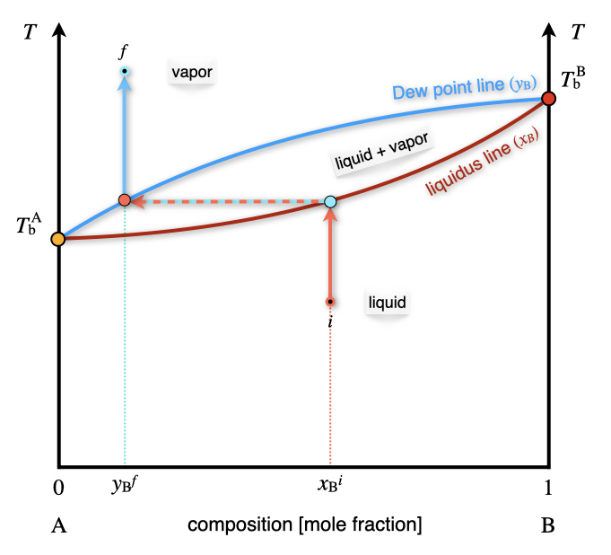
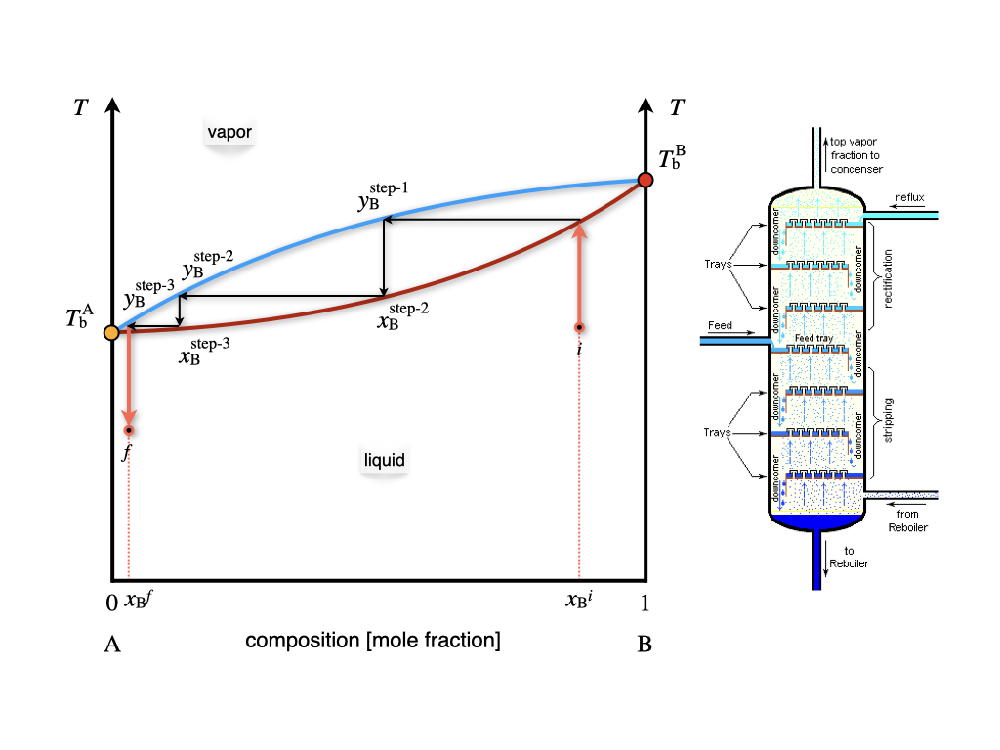

\renewcommand*{\standardstate}{{-\kern-6pt{\ominus}\kern-6pt-}}

# Multi-Component Phase Diagrams and Solutions {#MCPhaseDiagrams}

We now move from studying 1-component systems to multi-component ones. Systems that include two or more chemical species are usually called *solutions*. Solutions are possible for all three states of matter:

\scriptsize
| Type:             | Solvent | Solute | Examples:                    |
|-------------------|:-------:|:------:|------------------------------|
| Solid solutions   | Solid   | Solid  | Alloys: brass, bronze        |
|                   | Solid   | Liquid | Dental amalgam               |
|                   | Solid   | Gas    | Hydrogen stored in Palladium |
| Liquid solutions  | Liquid  | Solid  | Saltwater, bleach           |
|                   | Liquid  | Liquid | Alcoholic beverages, vinegar |
|                   | Liquid  | Gas    | Carbonated drinks            |
| Gaseous solutions | Gas     | Solid  | Smoke, smog                  |
|                   | Gas     | Liquid | Aerosols and perfumes        |
|                   | Gas     | Gas    | Air                          |
\normalsize

The number of degrees of freedom for binary solutions (solutions containing two components) is calculated from the Gibbs phase rules at $f=2-p+2=4-p$. When one phase is present, binary solutions require $4-1=3$ variables to be described, usually temperature ($T$), pressure ($P$), and mole fraction ($y_i$ in the gas phase and $x_i$ in the liquid phase). Single-phase, 2-component systems require three-dimensional $T,P,x_i$ diagram to be described. When two phases are present (e.g., gas and liquid), only two variables are independent: pressure and concentration. Thus, we can study the behavior of the partial pressure of a gas–liquid solution in a 2-dimensional plot. If the gas phase in a solution exhibits properties similar to those of a mixture of ideal gases, it is called an *ideal solution*. The obvious difference between ideal solutions and ideal gases is that the intermolecular interactions in the liquid phase cannot be neglected as for the gas phase. The main advantage of ideal solutions is that the interactions between particles in the liquid phase have similar mean strength throughout the entire phase. We will consider ideal solutions first, and then we'll discuss deviation from ideal behavior and non-ideal solutions.  

## Raoult's Law and Phase Diagrams of Ideal Solutions

The behavior of the vapor pressure of an ideal solution can be mathematically described by a simple law established by François-Marie Raoult (1830–1901). **Raoult's law** states that the partial pressure of each component, $i$, of an ideal mixture of liquids, $P_i$, is equal to the vapor pressure of the pure component $P_i^*$ multiplied by its mole fraction in the mixture $x_i$:

\begin{equation}
P_i=x_i P_i^*.
(\#eq:mc1)
\end{equation}

### One volatile component
Raoult's law applied to a system containing only one volatile component describes a line in the $Px_{\text{B}}$ plot, as in Figure \@ref(fig:FigMC1).

```{r FigMC1, out.width='60%', fig.show='hold', echo=FALSE, fig.align = 'center', fig.cap='The Pressure–Composition Phase Diagram of an Ideal Solution Containing a Single Volatile Component at Constant Temperature.'}
knitr::include_graphics('./img/OEP_Figures.019.jpeg')
```

As emerges from Figure \@ref(fig:FigMC1), Raoult's law divides the diagram into two distinct areas, each with three degrees of freedom.^[Only two degrees of freedom are visible in the $Px_{\text{B}}$ diagram. Temperature represents the third independent variable.] Each area contains a phase, with the vapor at the bottom (low pressure), and the liquid at the top (high pressure). Raoult's law acts as an additional constraint for the points sitting on the line. Therefore, the number of independent variables along the line is only two. Once the temperature is fixed, and the vapor pressure is measured, the mole fraction of the volatile component in the liquid phase is determined.

### Two volatile components

In an ideal solution, every volatile component follows Raoult's law. Since the vapors in the gas phase behave ideally, the total pressure can be simply calculated using Dalton's law as the sum of the partial pressures of the two components $P_{\text{TOT}}=P_{\text{A}}+P_{\text{B}}$. The corresponding diagram is reported in Figure \@ref(fig:FigMC2). The total vapor pressure, calculated using Dalton's law, is reported in red. The Raoult's behaviors of each of the two components are also reported using black dashed lines.

```{r FigMC2, out.width='60%', fig.show='hold', echo=FALSE, fig.align = 'center', fig.cap='The Pressure–Composition Phase Diagram of an Ideal Solution Containing Two Volatile Components at Constant Temperature.'}

```

> ```{exercise, xaya}
Calculate the mole fraction in the vapor phase of a liquid solution composed of 67% of toluene ($\mathrm{A}$) and 33% of benzene ($\mathrm{B}$), given the vapor pressures of the pure substances: $P_{\text{A}}^*=0.03\;\text{bar}$, and $P_{\text{B}}^*=0.10\;\text{bar}$.
*Solution:* The data available for the systems are summarized as follows:
\begin{equation}
\begin{aligned}
x_{\text{A}}=0.67  \qquad & \qquad x_{\text{B}}=0.33 \\
P_{\text{A}}^* = 0.03\;\text{bar} \qquad & \qquad P_{\text{B}}^* = 0.10\;\text{bar} \\
& P_{\text{TOT}} = ? \\
y_{\text{A}}=? \qquad & \qquad y_{\text{B}}=?
\end{aligned}
(\#eq:mc2)
\end{equation}
The total pressure of the vapors can be calculated combining Dalton's and Roult's laws:
\begin{equation}
\begin{aligned}
P_{\text{TOT}} &= P_{\text{A}}+P_{\text{B}}=x_{\text{A}} P_{\text{A}}^* + x_{\text{B}} P_{\text{B}}^* \\
&= 0.67\cdot 0.03+0.33\cdot 0.10 \\
&= 0.02 + 0.03 = 0.05 \;\text{bar}
\end{aligned}
(\#eq:mc3)
\end{equation}
We can then calculate the mole fraction of the components in the vapor phase as:
\begin{equation}
\begin{aligned}
y_{\text{A}}=\frac{P_{\text{A}}}{P_{\text{TOT}}} & \qquad y_{\text{B}}=\frac{P_{\text{B}}}{P_{\text{TOT}}} \\
y_{\text{A}}=\frac{0.02}{0.05}=0.40 & \qquad y_{\text{B}}=\frac{0.03}{0.05}=0.60
\end{aligned}
(\#eq:mc4)
\end{equation}
Notice how the mole fraction of toluene is much higher in the liquid phase, $x_{\text{A}}=0.67$, than in the vapor phase, $y_{\text{A}}=0.40$.
```

As is clear from the results of Exercise \@ref(exr:xaya), the concentration of the components in the gas and vapor phases are different. We can also report the mole fraction in the vapor phase as an additional line in the $Px_{\text{B}}$ diagram of Figure \@ref(fig:FigMC2). When both concentrations are reported in one diagram—as in Figure \@ref(fig:FigMC3)—the line where $x_{\text{B}}$ is obtained is called the *liquidus line*, while the line where the $y_{\text{B}}$ is reported is called the *Dew point line*.

```{r FigMC3, out.width='60%', fig.show='hold', echo=FALSE, fig.align = 'center', fig.cap='The Pressure–Composition Phase Diagram of an Ideal Solution Containing Two Volatile Components at Constant Temperature. Both the Liquidus and Dew Point Line are Emphasized in this Plot.'}
knitr::include_graphics('./img/OEP_Figures.021.jpeg')

```

The liquidus and Dew point lines determine a new section in the phase diagram where the liquid and vapor phases coexist. Since the degrees of freedom inside the area are only 2, for a system at constant temperature, a point inside the coexistence area has fixed mole fractions for both phases. We can reduce the pressure on top of a liquid solution with concentration $x^i_{\text{B}}$ (see Figure \@ref(fig:FigMC3)) until the solution hits the liquidus line. At this pressure, the solution forms a vapor phase with mole fraction given by the corresponding point on the Dew point line, $y^f_{\text{B}}$.

### $T_{\text{B}}$ phase diagrams and fractional distillation

We can now consider the phase diagram of a 2-component ideal solution as a function of temperature at constant pressure. The $T_{\text{B}}$ diagram for two volatile components is reported in Figure \@ref(fig:FigMC4). 

```{r FigMC4, out.width='60%', fig.show='hold', echo=FALSE, fig.align = 'center', fig.cap='The Temperature–Composition Phase Diagram of an Ideal Solution Containing Two Volatile Components at Constant Pressure.'}


```

Compared to the $Px_{\text{B}}$ diagram of Figure \@ref(fig:FigMC3), the phases are now in reversed order, with the liquid at the bottom (low temperature), and the vapor on top (high Temperature). The liquidus and Dew point lines are curved and form a lens-shaped region where liquid and vapor coexists. Once again, there are only two degrees of freedom inside the lens, of which the pressure is kept constant by definition.^[This effectively corresponds to a region with just a single degree of freedom in the plot,:either the temperature or the composition can be changed independently.] As such, a liquid solution of initial composition $x_{\text{B}}^i$ can be heated until it hits the liquidus line. At this temperature the solution boils, producing a vapor with concentration $y_{\text{B}}^f$. As is clear from Figure \@ref(fig:FigMC4), the mole fraction of the $\text{B}$ component in the gas phase is lower than the mole fraction in the liquid phase. This fact can be exploited to separate the two components of the solution. In particular, if we set up a series of consecutive evaporations and condensations, we can distill fractions of the solution with an increasingly lower concentration of the less volatile component $\text{B}$. This is exemplified in the industrial process of fractional distillation, as schematically depicted in Figure \@ref(fig:FigMC5).

```{r FigMC5, out.width='60%', fig.show='hold', echo=FALSE, fig.align = 'center', fig.cap='The Fractional Distillation Process and Theoretical Plates Calculated on a Temperature–Composition Phase Diagram.'}


```

Each of the horizontal lines in the lens region of the $Tx_{\text{B}}$ diagram of Figure \@ref(fig:FigMC5) corresponds to a condensation/evaporation process and is called a *theoretical plate*. These plates are industrially realized on large columns with several floors equipped with condensation trays. The temperature decreases with the height of the column. A condensation/evaporation process will happen on each level, and a solution concentrated in the most volatile component is collected. The theoretical plates and the $Tx_{\text{B}}$ are crucial for sizing the industrial fractional distillation columns. 

## Phase Diagrams of Non-Ideal Solutions
Non-ideal solutions follow Raoult's law for only a small amount of concentrations. The typical behavior of a non-ideal solution with a single volatile component is reported in the $Px_{\text{B}}$ plot in Figure \@ref(fig:FigMC6).

```{r FigMC6, out.width='60%', fig.show='hold', echo=FALSE, fig.align = 'center', fig.cap='The Pressure–Composition Phase Diagram of a Non-Ideal Solution Containing a Single Volatile Component at Constant Temperature.'}
knitr::include_graphics('./img/OEP_Figures.024.jpeg')

```

Raoult's behavior is observed for high concentrations of the volatile component. This behavior is observed at $x_{\text{B}} \rightarrow 0$ in Figure \@ref(fig:FigMC6), since the volatile component in this diagram is $\mathrm{A}$. At low concentrations of the volatile component $x_{\text{B}} \rightarrow 1$ in Figure \@ref(fig:FigMC6), the solution follows a behavior along a steeper line, which is known as **Henry's law**. William Henry (1774–1836) has extensively studied the behavior of gases dissolved in liquids. His studies resulted in a simple law that relates the vapor pressure of a solution to a constant, called Henry's law solubility constants:

\begin{equation}
P_{\text{B}}=k_{\text{AB}} x_{\text{B}},
(\#eq:mc1b)
\end{equation}

where $k_{\text{AB}}$ depends on the chemical nature of $\mathrm{A}$ and $\mathrm{B}$. The corresponding diagram for non-ideal solutions with two volatile components is reported on the left panel of Figure \@ref(fig:FigMC7). The total pressure is once again calculated as the sum of the two partial pressures. Positive deviations on Raoult's ideal behavior are not the only possible deviation from ideality, and negative deviation also exits, albeit slightly less common. An example of a negative deviation is reported in the right panel of Figure \@ref(fig:FigMC7).


```{r FigMC7, out.width='80%', fig.show='hold', echo=FALSE, fig.align = 'center', fig.cap='The Pressure–Composition Phase Diagram of Non-Ideal Solutions Containing Two Volatile Components at Constant Temperature.'}
knitr::include_graphics('./img/OEP_Figures.025.jpeg')

```

If we move from the $Px_{\text{B}}$ diagram to the $Tx_{\text{B}}$ diagram, the behaviors observed in Figure \@ref(fig:FigMC7) will correspond to the diagram in Figure \@ref(fig:FigMC8).

```{r FigMC8, out.width='80%', fig.show='hold', echo=FALSE, fig.align = 'center', fig.cap='The Temperature–Composition Phase Diagram of Non-Ideal Solutions Containing Two Volatile Components at Constant Pressure.'}
knitr::include_graphics('./img/OEP_Figures.026.jpeg')

```

The minimum (left plot) and maximum (right plot) points in Figure \@ref(fig:FigMC8) represent the so-called *azeotrope*.

An azeotrope is a constant boiling point solution whose composition cannot be altered or changed by simple distillation. This happens because the liquidus and Dew point lines coincide at this point. Therefore, the liquid and the vapor phases have the same composition, and distillation cannot occur. Two types of azeotropes exist, representative of the two types of non-ideal behavior of solutions. The first type is the positive azeotrope (left plot in Figure \@ref(fig:FigMC8)). A notorious example of this behavior at atmospheric pressure is the ethanol/water mixture, with composition 95.63% ethanol by mass. This positive azeotrope boils at $T=78.2\;^\circ \text{C}$, a temperature that is lower than the boiling points of the pure constituents, since ethanol boils at $T=78.4\;^\circ \text{C}$ and water at $T=100\;^\circ \text{C}$. The second type is the negative azeotrope (right plot in Figure \@ref(fig:FigMC8)). An example of this behavior at atmospheric pressure is the hydrochloric acid/water mixture with composition 20.2% hydrochloric acid by mass. This negative azeotrope boils at $T=110\;^\circ \text{C}$, a temperature that is higher than the boiling points of the pure constituents, since hydrochloric acid boils at $T=-84\;^\circ \text{C}$ and water at $T=100\;^\circ \text{C}$.

## Activity
For non-ideal gases, we introduced in chapter \@ref(RealGases) the concept of *fugacity* as an *effective pressure* that accounts for non-ideal behavior. If we extend this concept to non-ideal solution, we can introduce the *activity* of a liquid or a solid, $a$, as:

\begin{equation}
\mu_{\text{non-ideal}} = \mu^{\standardstate} + RT \ln a,
(\#eq:act1)
\end{equation}

where $\mu$ is the chemical potential of the substance or the mixture, and $\mu^{\standardstate}$ is the chemical potential at standard state. Comparing this definition to eq. \@ref(eq:dcpnig), it is clear that the activity is equal to the fugacity for a non-ideal gas (which, in turn, is equal to the pressure for an ideal gas). However, for a liquid and a liquid mixture, it depends on the chemical potential at standard state. This means that the activity is not an absolute quantity, but rather a relative term describing how "active" a compound is compared to standard state conditions. The choice of the standard state is, in principle, arbitrary, but conventions are often chosen out of mathematical or experimental convenience. We already discussed the convention that standard state for a gas is at $P^{\standardstate}=1\;\text{bar}$, so the activity is equal to the fugacity. The standard state for a component in a solution is the pure component at the temperature and pressure of the solution. This definition is equivalent to setting the activity of a pure component, $i$, at $a_i=1$.

For a component in a solution we can use eq. \@ref(eq:dcpnig) to write the chemical potential in the gas phase as:

\begin{equation}
\mu_i^{\text{vapor}} = \mu_i^{\standardstate} + RT \ln \frac{P_i}{P^{\standardstate}}.
(\#eq:act2)
\end{equation}

If the gas phase is in equilibrium with the liquid solution, then: 

\begin{equation}
\mu_i^{\text{solution}} = \mu_i^{\text{vapor}} = \mu_i^*,
(\#eq:act3)
\end{equation}

where $\mu_i^*$ is the chemical potential of the pure element. Subtracting eq. \@ref(eq:act3) from eq. \@ref(eq:act2), we obtain:

\begin{equation}
\mu_i^{\text{solution}} = \mu_i^* + RT \ln \frac{P_i}{P^*_i}.
(\#eq:act4)
\end{equation}

For an ideal solution, we can use Raoult's law, eq. \@ref(eq:mc1), to rewrite eq. \@ref(eq:act4) as:

\begin{equation}
\mu_i^{\text{solution}} = \mu_i^* + RT \ln x_i,
(\#eq:act5)
\end{equation}

which relates the chemical potential of a component in an ideal solution to the chemical potential of the pure liquid and its mole fraction in the solution. For a non-ideal solution, the partial pressure in eq. \@ref(eq:act4) is either larger (positive deviation) or smaller (negative deviation) than the pressure calculated using Raoult's law. The chemical potential of a component in the mixture is then calculated using:

\begin{equation}
\mu_i^{\text{solution}} = \mu_i^* + RT \ln \left(\gamma_i x_i\right),
(\#eq:act6)
\end{equation}

where $\gamma_i$ is a positive coefficient that accounts for deviations from ideality. This coefficient is either larger than one (for positive deviations), or smaller than one (for negative deviations). The activity of component $i$ can be calculated  as an *effective mole fraction*, using:

\begin{equation}
a_i = \gamma_i x_i,
(\#eq:act7)
\end{equation}

where $\gamma_i$ is defined as the *activity coefficient*. The partial pressure of the component can then be related to its vapor pressure, using:

\begin{equation}
P_i = a_i P_i^*.
(\#eq:act8)
\end{equation}

Comparing eq. \@ref(eq:act8) with Raoult's law, we can calculate the activity coefficient as:

\begin{equation}
\gamma_i = \frac{P_i}{x_i P_i^*} = \frac{P_i}{P_i^{\text{R}}},
(\#eq:act9)
\end{equation}

where $P_i^{\text{R}}$ is the partial pressure calculated using Raoult's law. This result also proves that for an ideal solution, $\gamma=1$. Eq. \@ref(eq:act9) can also be used experimentally to obtain the activity coefficient from the phase diagram of the non-ideal solution. This is achieved by measuring the value of the partial pressure of the vapor of a non-ideal solution. Examples of this procedure are reported for both positive and negative deviations in Figure \@ref(fig:FigSol1). 

```{r FigSol1, out.width='80%', fig.show='hold', echo=FALSE, fig.align = 'center', fig.cap='Positive and Negative Deviation from Raoult\'s Law in the Pressure–Composition Phase Diagram of Non-Ideal Solutions at Constant Temperature.'}
knitr::include_graphics('./img/OEP_Figures.033.jpeg')

```

As we already discussed in chapter \@ref(ChemicalEquilibrium), the activity is the most general quantity that we can use to define the equilibrium constant of a reaction (or the reaction quotient). The advantage of using the activity is that it's defined for ideal and non-ideal gases and mixtures of gases, as well as for ideal and non-ideal solutions in both the liquid and the solid phase.^[Notice that, since the activity is a relative measure, the equilibrium constant expressed in terms of the activities is also a relative concept. In other words, it measures equilibrium relative to a standard state. This fact, however, should not surprise us, since the equilibrium constant is also related to $\Delta_{\text{rxn}} G^{\standardstate}$ using Gibbs' relation. This is why the definition of a universally agreed-upon [standard state](https://en.wikipedia.org/wiki/Standard_state) is such an essential concept in chemistry, and why it is defined by the [International Union of Pure and Applied Chemistry (IUPAC)](https://en.wikipedia.org/wiki/International_Union_of_Pure_and_Applied_Chemistry) and followed systematically by chemists around the globe.]

## Colligative Properties
Colligative properties are properties of solutions that depend on the number of particles in the solution and not on the nature of the chemical species. More specifically, a colligative property depends on the ratio between the number of particles of the solute and the number of particles of the solvent. This ratio can be measured using any unit of concentration, such as mole fraction, molarity, and normality. For diluted solutions, however, the most useful concentration for studying colligative properties is the molality, $m$, which measures the ratio between the number of particles of the solute (in moles) and the mass of the solvent (in kg):

\begin{equation}
m = \frac{n_{\text{solute}}}{m_{\text{solvent}}}.
(\#eq:coll1)
\end{equation}

Colligative properties usually result from the dissolution of a nonvolatile solute in a volatile liquid solvent, and they are properties of the solvent, modified by the presence of the solute. They are physically explained by the fact that the solute particles displace some solvent molecules in the liquid phase, thereby reducing the concentration of the solvent. This explanation shows how colligative properties are independent of the nature of the chemical species in a solution only if the solution is ideal. For non-ideal solutions, the formulas that we will derive below are valid only in an approximate manner. We will discuss the following four colligative properties: relative lowering of the vapor pressure, elevation of the boiling point, depression of the melting point, and osmotic pressure.

### Vapor pressure lowering
As we have already discussed in chapter \@ref(MCPhaseDiagrams), the vapor pressure of an ideal solution follows Raoult's law. Its difference with respect to the vapor pressure of the pure solvent can be calculated as:

\begin{equation}
\begin{aligned}
P_{\text{solvent}}^* &- P_{\text{solution}} = P_{\text{solvent}}^* - x_{\text{solvent}} P_{\text{solvent}}^* \\ 
& = \left( 1-x_{\text{solvent}}\right)P_{\text{solvent}}^* =x_{\text{solute}} P_{\text{solvent}}^*,
\end{aligned}
(\#eq:coll2)
\end{equation}

which shows that the vapor pressure lowering depends only on the concentration of the solute. As such, it is a colligative property.

### Boiling point elevation and melting point depression
The following two colligative properties are explained by reporting the changes due to the solute molecules in the plot of the chemical potential as a function of temperature (Figure \@ref(fig:FigPhase1)). 

At the boiling point, the chemical potential of the solution is equal to the chemical potential of the vapor, and the following relation can be obtained:

\begin{equation}
\begin{aligned}
\mu_{\text{solution}} &=\mu_{\text{vap}}=\mu_{\text{solvent}}^{\standardstate} + RT \ln P_{\text{solution}} \\
&= \mu_{\text{solvent}}^{\standardstate} + RT \ln \left(x_{\text{solution}} P_{\text{solvent}}^* \right)\\
&= \underbrace{\mu_{\text{solvent}}^{\standardstate} + RT \ln P_{\text{solvent}}^*}_{\mu_{\text{solvent}}^*} + RT \ln x_{\text{solution}} \\
&= \mu_{\text{solvent}}^* + RT \ln x_{\text{solution}},
\end{aligned}
(\#eq:collA)
\end{equation}

and since $x_{\text{solution}}<1$, the logarithmic term in the last expression is negative, and:

\begin{equation}
\mu_{\text{solution}} < \mu_{\text{solvent}}^*. 
(\#eq:collB)
\end{equation}

Eq. \@ref(eq:collA) proves that the addition of a solute always stabilizes the solvent in the liquid phase, and lowers its chemical potential, as shown in Figure \@ref(fig:FigSol2).

```{r FigSol2, out.width='60%', fig.show='hold', echo=FALSE, fig.align = 'center', fig.cap='Reduction of the Chemical Potential of the Liquid Phase Due to the Addition of a Solute.'}
knitr::include_graphics('./img/OEP_Figures.034.jpeg')

```

The elevation of the boiling point can be quantified using:

\begin{equation}
\Delta T_{\text{b}}=T_{\text{b}}^{\text{solution}}-T_{\text{b}}^{\text{solvent}}=iK_{\text{b}}m,
(\#eq:coll3)
\end{equation}

where $i$ is the *van 't Hoff factor*, a coefficient that measures the number of solute particles for each formula unit, $K_{\text{b}}$ is the ebullioscopic constant of the solvent, and $m$ is the molality of the solution, as introduced in eq. \@ref(eq:coll1) above. For a solute that does not dissociate in solution, $i=1$. For a solute that dissociates in solution, the number of particles in solutions depends on how many particles it dissociates into, and $i>1$. For example, the strong electrolyte $\mathrm{Ca}\mathrm{Cl}_2$ completely dissociates into three particles in solution, one $\mathrm{Ca}^{2+}$ and two $\mathrm{Cl}^-$, and $i=3$. For cases of partial dissociation, such as weak acids, weak bases, and their salts, $i$ can assume non-integer values.

If we assume ideal solution behavior,the ebullioscopic constant can be obtained from the thermodynamic condition for liquid-vapor equilibrium. At the boiling point of the solution, the chemical potential of the solvent in the solution phase equals the chemical potential in the pure vapor phase above the solution:

\begin{equation}
\mu_{\text{solution}} (T_{\text{b}})  = \mu_{\text{solvent}}^*(T_b)  + RT\ln x_{\text{solvent}},
(\#eq:coll4)
\end{equation}

from which we can derive, using the Gibbs–Helmholtz equation, eq. \@ref(eq:gibbshelm):

\begin{equation}
K_{\text{b}}=\frac{RMT_{\text{b}}^{2}}{\Delta_{\mathrm{vap}} H},
(\#eq:coll5)
\end{equation}

where $R$ is the ideal gas constant, $M$ is the molar mass of the solvent, and $\Delta_{\mathrm{vap}} H$ is its molar enthalpy of vaporization.

The reduction of the melting point is similarly obtained by:

\begin{equation}
\Delta T_{\text{m}}=T_{\text{m}}^{\text{solution}}-T_{\text{m}}^{\text{solvent}}=-iK_{\text{m}}m,
(\#eq:coll6)
\end{equation}

where $i$ is the van 't Hoff factor introduced above, $K_{\text{m}}$ is the *cryoscopic constant* of the solvent, $m$ is the molality, and the minus sign accounts for the fact that the melting temperature of the solution is lower than the melting temperature of the pure solvent ($\Delta T_{\text{m}}$ is defined as a negative quantity, while $i$, $K_{\text{m}}$, and $m$ are all positive). Similarly to the previous case, the cryoscopic constant can be related to the molar enthalpy of fusion of the solvent using the equivalence of the chemical potential of the solid and the liquid phases at the melting point, and employing the Gibbs–Helmholtz equation:

\begin{equation}
K_{\text{m}}=\frac{RMT_{\text{m}}^{2}}{\Delta_{\mathrm{fus}}H}.
(\#eq:coll7)
\end{equation}

Notice from Figure \@ref(fig:FigSol2) how the depression of the melting point is always smaller than the elevation of the boiling point. This is because the chemical potential of the solid is essentially flat, while the chemical potential of the gas is steep. Consequently, the value of the cryoscopic constant is always bigger than the value of the ebullioscopic constant. For example, for water $K_{\text{m}} = 1.86\; \frac{\text{K kg}}{\text{mol}}$, while $K_{\text{b}} = 0.512\; \frac{\text{K kg}}{\text{mol}}$. This is also proven by the fact that the enthalpy of vaporization is larger than the enthalpy of fusion.

### Osmotic pressure

The osmotic pressure of a solution is defined as the difference in pressure between the solution and the pure liquid solvent when the two are in equilibrium across a semi-permeable (osmotic) membrane. The osmotic membrane is made of a porous material that allows the flow of solvent molecules but blocks the flow of the solute ones. The osmosis process is depicted in Figure \@ref(fig:FigSol3). 

```{r FigSol3, out.width='80%', fig.show='hold', echo=FALSE, fig.align = 'center', fig.cap='Osmotic Pressure of a Solution.'}
knitr::include_graphics('./img/OEP_Figures.035.jpeg')

```

Starting from a solvent at atmospheric pressure in the apparatus depicted in Figure \@ref(fig:FigSol3), we can add solute particles to the left side of the apparatus. The increase in concentration on the left causes a net transfer of solvent across the membrane. This flow stops when the pressure difference equals the osmotic pressure, $\pi$. The formula that governs the osmotic pressure was initially proposed by van 't Hoff and later refined by Harmon Northrop Morse (1848–1920). The Morse formula reads:

\begin{equation}
\pi = imRT,
(\#eq:coll8)
\end{equation}

where $i$ is the van 't Hoff factor introduced above, $m$ is the molality of the solution, $R$ is the ideal gas constant, and $T$ the temperature of the solution. As with the other colligative properties, the Morse equation is a consequence of the equality of the chemical potentials of the solvent and the solution at equilibrium.^[For a derivation, see the osmotic pressure [Wikipedia page](https://en.wikipedia.org/wiki/Osmotic_pressure).]
