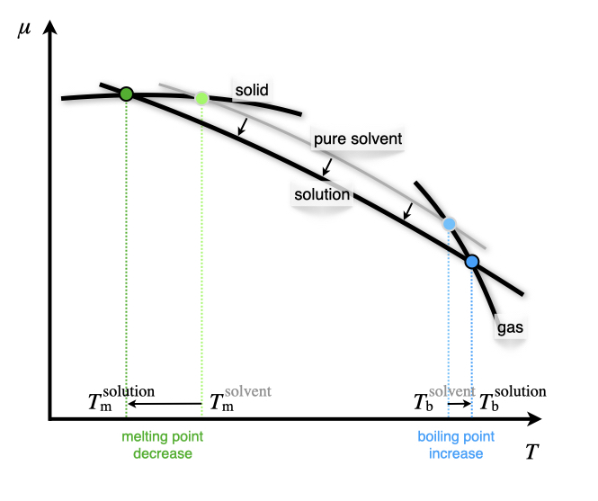

\renewcommand*{\standardstate}{{-\kern-6pt{\ominus}\kern-6pt-}}

# Solutions {#Solutions}
In the previous chapter, we have qualitatively described the deviation of real solutions from ideal behavior. In this section, we are discussing it quantitatively. We will be able to do so by using a concept that we have already encountered in chapter \@ref(ChemicalEquilibrium): Lewis's activity. 

## Activity
For non-ideal gases, we introduced in chapter \@ref(RealGases) the concept of *fugacity* as an *effective pressure* that accounts for non-ideal behavior. If we extend this concept to non-ideal solution, we can introduce the *activity* of a liquid or a solid, $a$, as:

\begin{equation}
\mu_{\text{non-ideal}} = \mu^{\standardstate} + RT \ln a,
(\#eq:act1)
\end{equation}

where $\mu$ is the chemical potential of the substance or the mixture, and $\mu^{\standardstate}$ is the chemical potential at standard state. Comparing this definition to eq. \@ref(eq:dcpnig), it is clear that the activity is equal to the fugacity for a non-ideal gas (which, in turn, is equal to the pressure for an ideal gas). However, for a liquid and a liquid mixture, it depends on the chemical potential at standard state. This means that the activity is not an absolute quantity, but rather a relative term describing how "active" a compound is compared to standard state conditions. The choice of the standard state is, in principle, arbitrary, but conventions are often chosen out of mathematical or experimental convenience. We already discussed the convention that standard state for a gas is at $P^standardstate=1\;\text{bar}$, so the activity is equal to the fugacity. The standard state for a component in a solution is the pure component at the temperature and pressure of the solution. This definition is equivalent to setting the activity of a pure component, $i$, at $a_i=1$.

For a component in a solution we can use eq. \@ref(eq:dcpnig) to write the chemical potential in the gas phase as:

\begin{equation}
\mu_i^{\text{vapor}} = \mu_i^{\standardstate} + RT \ln \frac{P_i}{P^{\standardstate}}.
(\#eq:act2)
\end{equation}

If the gas phase is in equilibrium with the liquid solution, then: 

\begin{equation}
\mu_i^{\text{solution}} = \mu_i^{\text{vapor}} = \mu_i^*,
(\#eq:act3)
\end{equation}

where $\mu_i^*$ is the chemical potential of the pure element. Subtracting eq. \@ref(eq:act3) from eq. \@ref(eq:act2), we obtain:

\begin{equation}
\mu_i^{\text{solution}} = \mu_i^* + RT \ln \frac{P_i}{P^*_i}.
(\#eq:act4)
\end{equation}

For an ideal solution, we can use Raoult's law, eq. \@ref(eq:mc1), to rewrite eq. \@ref(eq:act4) as:

\begin{equation}
\mu_i^{\text{solution}} = \mu_i^* + RT \ln x_i,
(\#eq:act5)
\end{equation}

which relates the chemical potential of a component in an ideal solution to the chemical potential of the pure liquid and its mole fraction in the solution. For a non-ideal solution, the partial pressure in eq. \@ref(eq:act4) is either larger (positive deviation) or smaller (negative deviation) than the pressure calculated using Raoult's law. The chemical potential of a component in the mixture is then calculated using:

\begin{equation}
\mu_i^{\text{solution}} = \mu_i^* + RT \ln \left(\gamma_i x_i\right),
(\#eq:act6)
\end{equation}

where $\gamma_i$ is a positive coefficient that accounts for deviations from ideality. This coefficient is either larger than one (for positive deviations), or smaller than one (for negative deviations). The activity of component $i$ can be calculated  as an *effective mole fraction*, using:

\begin{equation}
a_i = \gamma_i x_i,
(\#eq:act7)
\end{equation}

where $\gamma_i$ is defined as the *activity coefficient*. The partial pressure of the component can then be related to its vapor pressure, using:

\begin{equation}
P_i = a_i P_i^*.
(\#eq:act8)
\end{equation}

Comparing eq. \@ref(eq:act8) with Raoult's law, we can calculate the activity coefficient as:

\begin{equation}
\gamma_i = \frac{P_i}{x_i P_i^*} = \frac{P_i}{P_i^{\text{R}}},
(\#eq:act9)
\end{equation}

where $P_i^{\text{R}}$ is the partial pressure calculated using Raoult's law. This result also proves that for an ideal solution, $\gamma=1$. Eq. \@ref(eq:act9) can also be used experimentally to obtain the activity coefficient from the phase diagram of the non-ideal solution. This is achieved by measuring the value of the partial pressure of the vapor of a non-ideal solution. Examples of this procedure are reported for both positive and negative deviations in Figure \@ref(fig:FigSol1). 

```{r FigSol1, out.width='80%', fig.show='hold', echo=FALSE, fig.align = 'center', fig.cap='Positive and Negative Deviation from Raoult\'s Law in the Pressure–Composition Phase Diagram of Non-Ideal Solutions at Constant Temperature.'}
knitr::include_graphics('./img/OEP_Figures.033.jpeg')

```

As we already discussed in chapter \@ref(ChemicalEquilibrium), the activity is the most general quantity that we can use to define the equilibrium constant of a reaction (or the reaction quotient). The advantage of using the activity is that it's defined for ideal and non-ideal gases and mixtures of gases, as well as for ideal and non-ideal solutions in both the liquid and the solid phase.^[Notice that, since the activity is a relative measure, the equilibrium constant expressed in terms of the activities is also a relative concept. In other words, it measures equilibrium relative to a standard state. This fact, however, should not surprise us, since the equilibrium constant is also related to $\Delta_{\text{rxn}} G^{\standardstate}$ using Gibbs' relation. This is why the definition of a universally agreed-upon [standard state](https://en.wikipedia.org/wiki/Standard_state) is such an essential concept in chemistry, and why it is defined by the [International Union of Pure and Applied Chemistry (IUPAC)](https://en.wikipedia.org/wiki/International_Union_of_Pure_and_Applied_Chemistry) and followed systematically by chemists around the globe.]

## Colligative Properties
Colligative properties are properties of solutions that depend on the number of particles in the solution and not on the nature of the chemical species. More specifically, a colligative property depends on the ratio between the number of particles of the solute and the number of particles of the solvent. This ratio can be measured using any unit of concentration, such as mole fraction, molarity, and normality. For diluted solutions, however, the most useful concentration for studying colligative properties is the molality, $m$, which measures the ratio between the number of particles of the solute (in moles) and the mass of the solvent (in kg):

\begin{equation}
m = \frac{n_{\text{solute}}}{m_{\text{solvent}}}.
(\#eq:coll1)
\end{equation}

Colligative properties usually result from the dissolution of a nonvolatile solute in a volatile liquid solvent, and they are properties of the solvent, modified by the presence of the solute. They are physically explained by the fact that the solute particles displace some solvent molecules in the liquid phase, thereby reducing the concentration of the solvent. This explanation shows how colligative properties are independent of the nature of the chemical species in a solution only if the solution is ideal. For non-ideal solutions, the formulas that we will derive below are valid only in an approximate manner. We will discuss the following four colligative properties: relative lowering of the vapor pressure, elevation of the boiling point, depression of the freezing point, and osmotic pressure.

### Vapor pressure lowering
As we have already discussed in chapter \@ref(MCPhaseDiagrams), the vapor pressure of an ideal solution follows Raoult's law. Its difference with respect to the vapor pressure of the pure solvent can be calculated as:

\begin{equation}
\begin{aligned}
P_{\text{solvent}}^* &- P_{\text{solution}} = P_{\text{solvent}}^* - x_{\text{solvent}} P_{\text{solvent}}^* \\ 
& = \left( 1-x_{\text{solvent}}\right)P_{\text{solvent}}^* =x_{\text{solute}} P_{\text{solvent}}^*,
\end{aligned}
(\#eq:coll2)
\end{equation}

which shows that the vapor pressure lowering depends only on the concentration of the solute. As such, it is a colligative property.

### Boiling point elevation and melting point depression
The following two colligative properties are explained by reporting the changes due to the solute molecules in the plot of the chemical potential as a function of temperature (Figure \@ref(fig:FigPhase1)). 

At the boiling point, the chemical potential of the solution is equal to the chemical potential of the vapor, and the following relation can be obtained:

\begin{equation}
\begin{aligned}
\mu_{\text{solution}} &=\mu_{\text{vap}}=\mu_{\text{solvent}}^{\standardstate} + RT \ln P_{\text{solvent}} \\
&= \mu_{\text{solvent}}^{\standardstate} + RT \ln \left(x_{\text{solvent}} P_{\text{solvent}}^* \right)\\
&= \underbrace{\mu_{\text{solvent}}^{\standardstate} + RT \ln P_{\text{solvent}}^*}_{\mu_{\text{solvent}}^*} + RT \ln x_{\text{solvent}} \\
&= \mu_{\text{solvent}}^* + RT \ln x_{\text{solvent}},
\end{aligned}
(\#eq:collA)
\end{equation}

and since $x_{\text{solvent}}<1$, the logarithmic term in the last expression is negative, and:

\begin{equation}
\mu_{\text{solution}} < \mu_{\text{solvent}}^*. 
(\#eq:collB)
\end{equation}

Eq. \@ref(eq:collA) proves that the addition of a solute always stabilizes the solvent in the liquid phase, and lowers its chemical potential, as shown in Figure \@ref(fig:FigSol2).

```{r FigSol2, out.width='60%', fig.show='hold', echo=FALSE, fig.align = 'center', fig.cap='Reduction of the Chemical Potential of the Liquid Phase Due to the Addition of a Solute.'}


```

The elevation of the boiling point can be quantified using:

\begin{equation}
\Delta T_{\text{b}}=T_{\text{b}}^{\text{solution}}-T_{\text{b}}^{\text{solvent}}=iK_{\text{b}}m,
(\#eq:coll3)
\end{equation}

where $i$ is the *van 't Hoff factor*, a coefficient that measures the number of solute particles for each formula unit, $K_{\text{b}}$ is the ebullioscopic constant of the solvent, and $m$ is the molality of the solution, as introduced in eq. \@ref(eq:coll1) above. For a solute that does not dissociate in solution, $i=1$. For a solute that dissociates in solution, the number of particles in solutions depends on how many particles it dissociates into, and $i>1$. For example, the strong electrolyte $\mathrm{Ca}\mathrm{Cl}_2$ completely dissociates into three particles in solution, one $\mathrm{Ca}^{2+}$ and two $\mathrm{Cl}^-$, and $i=3$. For cases of partial dissociation, such as weak acids, weak bases, and their salts, $i$ can assume non-integer values.

If we assume ideal solution behavior,the ebullioscopic constant can be obtained from the thermodynamic condition for liquid-vapor equilibrium. At the boiling point of the solution, the chemical potential of the solvent in the solution phase equals the chemical potential in the pure vapor phase above the solution:

\begin{equation}
\mu_{\text{solution}} (T_{\text{b}})  = \mu_{\text{solvent}}^*(T_b)  + RT\ln x_{\text{solvent}},
(\#eq:coll4)
\end{equation}

from which we can derive, using the Gibbs–Helmholtz equation, eq. \@ref(eq:gibbshelm):

\begin{equation}
K_{\text{b}}=\frac{RMT_{\text{b}}^{2}}{\Delta_{\mathrm{vap}} H},
(\#eq:coll5)
\end{equation}

where $R$ is the ideal gas constant, $M$ is the molar mass of the solvent, and $\Delta_{\mathrm{vap}} H$ is its molar enthalpy of vaporization.

The reduction of the melting point is similarly obtained by:

\begin{equation}
\Delta T_{\text{m}}=T_{\text{m}}^{\text{solution}}-T_{\text{m}}^{\text{solvent}}=-iK_{\text{m}}m,
(\#eq:coll6)
\end{equation}

where $i$ is the van 't Hoff factor introduced above, $K_{\text{m}}$ is the *cryoscopic constant* of the solvent, $m$ is the molality, and the minus sign accounts for the fact that the melting temperature of the solution is lower than the melting temperature of the pure solvent ($\Delta T_{\text{f}}$ is defined as a negative quantity, while $i$, $K_{\text{f}}$, and $m$ are all positive). Similarly to the previous case, the cryoscopic constant can be related to the molar enthalpy of fusion of the solvent using the equivalence of the chemical potential of the solid and the liquid phases at the melting point, and employing the Gibbs–Helmholtz equation:

\begin{equation}
K_{\text{m}}=\frac{RMT_{\text{m}}^{2}}{\Delta_{\mathrm{fus}}H}.
(\#eq:coll7)
\end{equation}

Notice from Figure \@ref(fig:FigSol2) how the depression of the melting point is always smaller than the elevation of the boiling point. This is because the chemical potential of the solid is essentially flat, while the chemical potential of the gas is steep. Consequently, the value of the cryoscopic constant is always bigger than the value of the ebullioscopic constant. For example, for water $K_{\text{f}} = 1.86\; \frac{\text{K kg}}{\text{mol}}$, while $K_{\text{b}} = 0.512\; \frac{\text{K kg}}{\text{mol}}$. This is also proven by the fact that the enthalpy of vaporization is larger than the enthalpy of fusion.

### Osmotic pressure

The osmotic pressure of a solution is defined as the difference in pressure between the solution and the pure liquid solvent when the two are in equilibrium across a semi-permeable (osmotic) membrane. The osmotic membrane is made of a porous material that allows the flow of solvent molecules but blocks the flow of the solute ones. The osmosis process is depicted in Figure \@ref(fig:FigSol3). 

```{r FigSol3, out.width='80%', fig.show='hold', echo=FALSE, fig.align = 'center', fig.cap='Osmotic Pressure of a Solution.'}


```

Starting from a solvent at atmospheric pressure in the apparatus depicted in Figure \@ref(fig:FigSol3), we can add solute particles to the left side of the apparatus. The increase in concentration on the left causes a net transfer of solvent across the membrane. This flow stops when the pressure difference equals the osmotic pressure, $\pi$. The formula that governs the osmotic pressure was initially proposed by van 't Hoff and later refined by Harmon Northrop Morse (1848–1920). The Morse formula reads:

\begin{equation}
\pi = imRT,
(\#eq:coll8)
\end{equation}

where $i$ is the van 't Hoff factor introduced above, $m$ is the molality of the solution, $R$ is the ideal gas constant, and $T$ the temperature of the solution. As with the other colligative properties, the Morse equation is a consequence of the equality of the chemical potentials of the solvent and the solution at equilibrium.^[For a derivation, see the osmotic pressure [Wikipedia page](https://en.wikipedia.org/wiki/Osmotic_pressure).]

