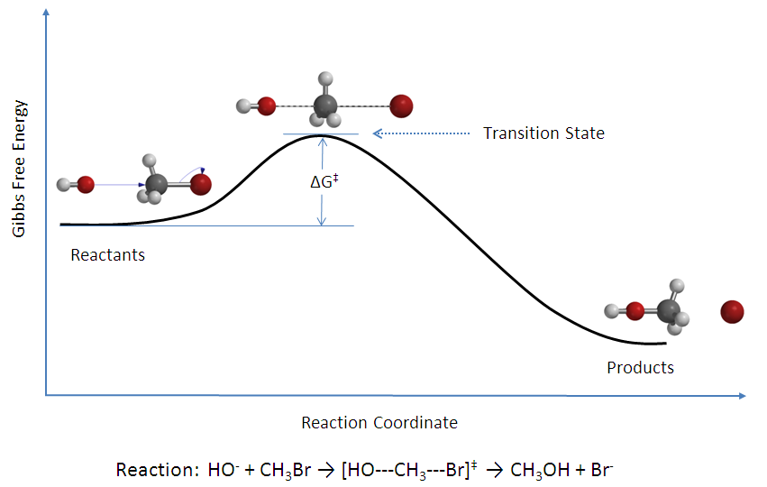

# Chemical Kinetics {#Kinetics}

From thermodynamics, we can determine the spontaneity of a reaction and its extent, using $\Delta G$ and $K_{\text{eq}}$, respectively. However, thermodynamics does not provide any information on how *fast* the reaction is going to happen. For example, while the reaction that converts solid carbon from its diamond allotropic form into hexagonal graphite is thermodynamically spontaneous, it is so slow as to be virtually non-existent. Diamond is effectively a meta-stable phase. The speed of a chemical reaction is the subject of a branch of physical chemistry called chemical kinetics. 

A chemical kinetics study aims to find the *rate* of a reaction and to find the microscopic steps that compose it, determining its *mechanism*. 

## Differential and integrated rate laws {#diffintk}
The rate law of a chemical reaction is an equation that links the initial rate with the concentrations (or pressures) of the reactants. Rate laws usually include a constant parameter, $k$,  called the *rate coefficient*, and several parameters found at the exponent of the concentrations of the reactants, and are called *reaction orders*. The rate coefficient depends on several conditions, including the reaction type, the temperature, the surface area of an adsorbent, light irradiation, and others. The reaction rate is usually represented with the lowercase letter $k$, and it should not be confused with the thermodynamic equilibrium constant that is generally designated with the uppercase letter $K$. Another useful concept in kinetics is the half-life, usually abbreviated with $t_{1/2}$. The half-life is defined as the time required to reach half of the initial reactant concentration. 

A reaction that happens in one single microscopic step is called elementary. Elementary reactions have reaction orders equal to the (integer) stoichiometric coefficients for each reactant. As such, only a limited number of elementary reactions are possible (four types are commonly observed), and they are classified according to their overall reaction order. The global reaction order of a reaction is calculated as the sum of each reactant's individual orders and is, at most, equal to three. We examine in detail the four most common reaction orders below.

### Zeroth-order reaction
For a zeroth-order reaction, the reaction rate is independent of the concentration of a reactant. In other words, if we have a reaction of the type:

\begin{equation}
\text{A}\longrightarrow\text{products}
\end{equation}

the differential rate law can be written:

\begin{equation}
- \frac{d[\mathrm{A}]}{dt}=k_0 [\mathrm{A}]^0 = k_0,
(\#eq:kin2)
\end{equation}

which shows that any change in the concentration of $\mathrm{A}$ will have no effect on the speed of the reaction. The minus sign at the right-hand-side is required because the rate is always defined as a positive quantity, while the derivative is negative because the concentration of the reactant is diminishing with time. 
Separating the variables $[\mathrm{A}]$ and $t$ of eq. \@ref(eq:kin2) and integrating both sides, we obtain the integrated rate law for a zeroth-order reaction as:

\begin{equation}
\begin{aligned}
\int_{[\mathrm{A}]_0}^{[A]} d[\mathrm{A}] &= -k_0 \int_{t=0}^{t} dt \\
[\mathrm{A}]-[\mathrm{A}]_0 &= -k_0 t \\ \\
[\mathrm{A}]&=[\mathrm{A}]_0 -k_0 t.
\end{aligned}
(\#eq:kin3)
\end{equation}

Using the integrated rate law, we notice that the concentration on the reactant diminishes linearly with respect to time. A plot of $[\mathrm{A}]$ as a function of $t$, therefore, will result in a straight line with an angular coefficient equal to $-k_0$, as in the plot of Figure \@ref(fig:figk1). 

```{r figk1, echo=FALSE, fig.align='center', fig.cap='Reaction Rate Plot for a Zeroth-Order Reaction.',fig.asp = .62}
x <- seq(0,4,0.1)
i <- 0.2
f <- 1
p1 <- 0.5
par(mar=c(4,4,1,4))
plot(x, -0.4*x+1.6,
     xlim=c(0, 4),
     ylim=c(0, 2),
     type="l",
     ylab = "[A]", xlab = "t", col = "#2E9FDF")
arrows(1, 0.75,2.5,0.75 , length=0, angle=90, code=3, lty="dotted")
text(1.5,0.85, expression(paste('-k'[0])), col = "black")
legend("topleft", inset=.03, expression(paste("zeroth-order reaction")),box.col = "white", bg = "white", adj=0.15)
```

Eq. \@ref(eq:kin3) also suggests that the units of the rate coefficient for a zeroth-order reaction are of concentration divided by time, typically $\frac{\mathrm{M}}{\mathrm{s}}$, with $\mathrm{M}$ being the molar concentration in $\frac{\mathrm{mol}}{\mathrm{L}}$ and $s$ the time in seconds.
The half-life of a zero order reaction can be calculated from eq. \@ref(eq:kin3), by replacing $[\mathrm{A}]$ with $\frac{1}{2}[\mathrm{A}]_0$:

\begin{equation}
\begin{aligned}
\frac{1}{2}[\mathrm{A}]_0 &=[\mathrm{A}]_0 -k_0 t_{1/2} \\
t_{1/2} &= \frac{[\mathrm{A}]_0}{2k_0}.
\end{aligned}
(\#eq:kin4)
\end{equation}

Zeroth-order reactions are common in several biochemical processes catalyzed by enzymes, such as the oxidation of ethanol to acetaldehyde in the liver by the alcohol dehydrogenase enzyme, which is zero-order in ethanol.

### First-order reaction
A first-order reaction depends on the concentration of only one reactant, and is therefore also called a *unimolecular reaction*. As for the previous case, if we consider a reaction of the type:

\begin{equation}
\mathrm{A}\rightarrow \text{products}
\end{equation}

the differential rate law for a first-order reaction is:

\begin{equation}
- \frac{d[\mathrm{A}]}{dt}=k_1 [\mathrm{A}].
(\#eq:kin6)
\end{equation}

Following the usual blueprint of separating the variables, and integrating both sides, we obtain the integrated rate law as:

\begin{equation}
\begin{aligned}
\int_{[\mathrm{A}]_0}^{[A]} \frac{d[\mathrm{A}]}{[\mathrm{A}]} &= -k_1 \int_{t=0}^{t} dt \\
\ln \frac{[\mathrm{A}]}{[\mathrm{A}]_0}&=-k_1 t\\ \\
[\mathrm{A}] &= [\mathrm{A}]_0 \exp(-k_1 t).
\end{aligned}
(\#eq:kin7)
\end{equation}

Using the integrated rate law to plot the concentration of the reactant, $[\mathrm{A}]$, as a function of time, $t$, we obtain an exponential decay, as in Figure \@ref(fig:figk2). 

```{r figk2, echo=FALSE, fig.align='center', fig.cap='Reaction Rate Plot for a First-Order Reaction.',fig.asp = .62}
x <- seq(0,4,0.1)
i <- 0.2
f <- 1
p1 <- 0.5
par(mar=c(4,4,1,4))
plot(x, 1.6*exp(-0.8*x),
     xlim=c(0, 4),
     ylim=c(0, 2),
     type="l",
     ylab = "[A]", xlab = "t", col = "#2E9FDF")
legend("topleft", inset=.03, expression(paste("first-order reaction")),box.col = "white", bg = "white", adj=0.15)
```

However, if we plot the logarithm of the concentration, $\ln[\mathrm{A}]$, as a function of time, we obtain a line with angular coefficient $-k_1$, as in the plot of Figure \@ref(fig:figk3). From eq. \@ref(eq:kin7), we can also obtain the units for the rate coefficient for a first-order reaction, which typically is $\frac{1}{\mathrm{s}}$, independent of concentration. Since the rate coefficient for first-order reactions has units of inverse time, it is sometimes called the frequency rate.

```{r figk3, echo=FALSE, fig.align='center', fig.cap='Linear Plot for a First-Order Reaction. Notice that the Quantity on the y Axes is ln[A].',fig.asp = .62}
x <- seq(0,4,0.1)
i <- 0.2
f <- 1
p1 <- 0.5
par(mar=c(4,4,1,4))
plot(x, -0.4*x+1.6,
     xlim=c(0, 4),
     ylim=c(0, 2),
     type="l",
     ylab = "ln[A]", xlab = "t", col = "darkgreen")
arrows(1, 0.75,2.5,0.75 , length=0, angle=90, code=3, lty="dotted")
text(1.5,0.85, expression(paste('-k'[1])), col = "black")
legend("topleft", inset=.03, expression(paste("first-order reaction")),box.col = "white", bg = "white", adj=0.15)
```

The half-life of a first-order reaction is:

\begin{equation}
\begin{aligned}
\ln \frac{\frac{1}{2}[\mathrm{A}]_0}{[\mathrm{A}]_0}&=-k_1 t_{1/2}\\
t_{1/2} &= \frac{\ln 2}{k_1}.
\end{aligned}
(\#eq:kin8)
\end{equation}

The half-life of a first-order reaction is independent of the initial concentration of the reactant. Therefore, the half-life can be used in place of the rate coefficient to describe the reaction rate. Typical examples of first-order reactions are radioactive decays. For radioactive isotopes, it is common to report their rate of decay in terms of their half-life. For example, the most stable uranium nucleotide, $^{238}\mathrm{U}$, has a half-life of $4.468\times 10^9$ years, while the most common fissile isotope of uranium, $^{235}\mathrm{U}$, has a half-life of $7.038\times 10^8$ years.^[Notice how large these numbers are for uranium. To put these numbers in perspective, we can compare them with the half-life of the most unstable isotope of plutonium, $^{241}\mathrm{Pu}$, which is $t_{1/2}=14.1$ years.] Other examples of first-order reactions in chemistry are the class of S~N~1 nucleophilic substitution reactions in organic chemistry. 

### Second-order reaction
A reaction is second-order when the sum of the reaction orders is two. Elementary second-order reactions are also called *bimolecular reactions*. There are two possibilities, a simple one, where the reaction order of one reagent is two, or a more complicated one, with two reagents having each a reaction order of one.

- For the simple case, we can write the reaction as:
\begin{equation}
2\mathrm{A}\rightarrow \text{products}
\end{equation}
the differential rate law for a first-order reaction is:
\begin{equation}
-\frac{d[\mathrm{A}]}{dt}=k_2 [\mathrm{A}]^2.
(\#eq:kin10)
\end{equation}
Following the same procedure used for the two previous cases, we can obtain the integrated rate law as:
\begin{equation}
\begin{aligned}
\int_{[\mathrm{A}]_0}^{[A]} \frac{d[\mathrm{A}]}{[\mathrm{A}]^2} &= -k_2 \int_{t=0}^{t} dt \\
\frac{1}{[\mathrm{A}]}-\frac{1}{[\mathrm{A}]_0} &= k_2 t\\ \\
\frac{1}{[\mathrm{A}]}&=\frac{1}{[\mathrm{A}]_0} + k_2 t.
\end{aligned}
(\#eq:kin11)
\end{equation}
As for first-order reactions, the plot of the concentration as a function of time shows a non-linear decay. However, if we plot the inverse of the concentration, $\frac{1}{[\mathrm{A}]}$, as a function of time, $t$, we obtain a line with angular coefficient $+k_2$, as in the plot of Figure \@ref(fig:figk4). 

```{r figk4, echo=FALSE, fig.align='center', fig.cap='Linear Plot for a Second-Order Reaction. Notice that the Quantity on the y Axes is 1/[A].',fig.asp = .62}
x <- seq(0,4,0.1)
i <- 0.2
f <- 1
p1 <- 0.5
par(mar=c(4,4,1,4))
plot(x, ((1/3)+0.4*x),
     xlim=c(0, 4),
     ylim=c(0, 2),
     type="l",
     ylab = "1/[A]", xlab = "t", col = "orange")
arrows(0.8, 0.75,2.5,0.75 , length=0, angle=90, code=3, lty="dotted")
text(1.7,0.85, expression(paste('+k'[2])), col = "black")
legend("topleft", inset=.03, expression(paste("second-order reaction")),box.col = "white", bg = "white", adj=0.15)
```
Notice that the line has a *positive* angular coefficient, in contrast with the previous two cases, for which the angular coefficients were negative. The units of $k$ for a simple second order reaction are calculated from eq. \@ref(eq:kin11) and typically are $\frac{1}{\mathrm{M}\cdot \mathrm{s}}$.
The half-life of a simple second-order reaction is:
\begin{equation}
\begin{aligned}
\frac{1}{\frac{1}{2}[\mathrm{A}]_0}-\frac{1}{[\mathrm{A}]_0} &= k_2 t_{1/2} \\
t_{1/2} &= \frac{1}{k_2 [\mathrm{A}]_0},
\end{aligned}
(\#eq:kin12)
\end{equation}
which, perhaps not surprisingly, depends on the initial concentration of the reactant, $[\mathrm{A}]_0$. Therefore, if we start with a higher concentration of the reactant, the half-life will be shorter, and the reaction will be faster. An example of simple second-order behavior is the reaction $\mathrm{NO}_2 + \mathrm{CO} \rightarrow \mathrm{NO} + \mathrm{CO}_2$, which is second-order in $\mathrm{NO}_2$ and zeroth-order in $\mathrm{CO}$.

- For the complex second-order case, the reaction is:
\begin{equation}
\mathrm{A}+\mathrm{B}\rightarrow \text{products}
\end{equation}
and the differential rate law is:
\begin{equation}
-\frac{d[\mathrm{A}]}{dt}=k'_2 [\mathrm{A}][\mathrm{B}].
(\#eq:kin14)
\end{equation}
The differential equation in eq. \@ref(eq:kin14) has two variables, and cannot be solved exactly unless an additional relationship is specified. If we assume that the initial concentration of the two reactants are equal, then $[\mathrm{A}]=[\mathrm{B}]$ at any time $t$, and eq. \@ref(eq:kin14) reduces to eq. \@ref(eq:kin10). If the concentration of the reactants are different, then the integrated rate law will assume the following shape:
\begin{equation}
\frac{\mathrm{[A]}}{\mathrm{[B]}} = \frac{\mathrm{[A]_0}}{\mathrm{[B]_0}} \exp \left\{ \left(\mathrm{[A]_0} - \mathrm{[B]_0}\right) k'_2t \right\}.
(\#eq:kin15)
\end{equation}
The units of $k$ for a complex second order reaction can be calculated from eq. \@ref(eq:kin15), and  are the same as those for the simple case, $\frac{1}{\mathrm{M}\cdot \mathrm{s}}$.
The half-life of a complex second-order reaction cannot be easily written since two different half-lives could, in principle, be defined for each of the corresponding reactants.

### Third and higher orders reaction
Although elementary reactions with order higher than two are possible, they are in practice infrequent, and only very few experimental third-order reactions are observed. Fourth-order or higher have never been observed because the probabilities for a simultaneous interaction between four molecules are essentially zero. Third-order elementary reactions are also called *termolelucar reactions*. While termolelucar reactions with three identical reactants are possible in principle, there is no known experimental example. Some complex third-order reactions are known, such as:

\begin{equation}
2\text{NO}_{(g)}+\text{O}_{2(g)}\longrightarrow 2\text{NO}_{2(g)}
\end{equation}

for which the differential rate law can be written as:

\begin{equation}
-\frac{dP_{\mathrm{O}_2}}{dt}=k_3 P_{\mathrm{NO}}^2 P_{\mathrm{O}_2}.
(\#eq:kin17)
\end{equation}

## Complex Rate Laws
It is essential to specify that the order of a reaction and its molecularity are equal only for elementary reactions. Reactions that follow complex laws are composed of several elementary steps, and they usually have non-integer reaction orders, for at least one of the reactants. 

### Consecutive reactions
A reaction that happens following a sequence of two elementary steps can be written as follows:

\begin{equation}
\text{A}\xrightarrow{\;k_1\;}\text{B}\xrightarrow{\;k_2\;}\text{C}
\end{equation}

Assuming that each of the steps follows a first order kinetic law, and that only the reagent $\mathrm{A}$ is present at the beginning of the reaction, we can write the differential change in concentration of each species with respect to infinitesimal time $dt$, using the following formulas:

\begin{equation}
\begin{aligned}
-\frac{d[\mathrm{A}]}{dt}&=k_1 [\mathrm{A}] \Rightarrow [\mathrm{A}] = [\mathrm{A}]_0 \exp(-k_1 t) \\
\frac{d[\mathrm{B}]}{dt} &=k_1 [\mathrm{A}]-k_2 [\mathrm{B}] \\
\frac{d[\mathrm{C}]}{dt} &=k_2 [\mathrm{B}].
\end{aligned}
(\#eq:kincomp2)
\end{equation}

These three equations represent a system of differential equations with three unknown variables. Unfortunately, these equations are linearly dependent on each other, and they are not sufficient to solve the system for each variable. To do so, we need to include a fourth equation, coming from the conservation of mass:

\begin{equation}
[\mathrm{A}]_0=[\mathrm{A}]+[\mathrm{B}]+[\mathrm{C}].
(\#eq:kincomp3)
\end{equation}

Using the first equation in eq. \@ref(eq:kincomp2), we can now replace the concentration $[\mathrm{A}]$ in the second equation and solve for $[\mathrm{B}]$:

\begin{equation}
\frac{d[\mathrm{B}]}{dt}+k_2 [\mathrm{B}]=k_1 [\mathrm{A}]_0 \exp(-k_1 t),
(\#eq:kincomp4)
\end{equation}

which can be simplified by multiplying both sides by $\exp (k_2t)$:

\begin{equation}
\begin{aligned}
\left( \frac{d[\mathrm{B}]}{dt}+k_2 [\mathrm{B}] \right) \exp (k_2t) &= k_1 [\mathrm{A}]_0 \exp[(k_2-k_1) t] \\
\Rightarrow \frac{d\left\{[\mathrm{B}]\exp (k_2t)\right\}}{dt} &= k_1 [\mathrm{A}]_0 \exp[(k_2-k_1) t],
\end{aligned}
(\#eq:kincomp5)
\end{equation}

which can then be integrated remembering that $[B]_0=0$, and $\int \exp(kx)=\frac{1}{k}\exp(kx)$:

\begin{equation}
[\mathrm{B}] = \frac{k_1}{k_2-k_1} [\mathrm{A}]_0 [\exp(-k_1t)-\exp(-k_2t)].
(\#eq:kincomp6)
\end{equation}

We can then use both $[\mathrm{A}]$, from eq. \@ref(eq:kincomp2), and $[\mathrm{B}]$, from eq. \@ref(eq:kincomp6), in eq. \@ref(eq:kincomp3) to solve for $[\mathrm{C}]$:

\begin{equation}
\begin{aligned}
\left[\mathrm{C}\right] &= [\mathrm{A}]_0-[\mathrm{A}]-[\mathrm{B}] \\
&= [\mathrm{A}]_0-[\mathrm{A}]_0 \exp(-k_1 t)-\frac{k_1}{k_2-k_1} [\mathrm{A}]_0 [\exp(-k_1t)-\exp(-k_2t)] \\
&= [\mathrm{A}]_0\left\{1+\frac{-k_2 \exp(-k_1t)+ k_1 \exp(-k_2t)}{k_2-k_1} \right\}.
\end{aligned}
(\#eq:kincomp7)
\end{equation}

From these results, we can distinguish two extreme behaviors. The first one is observed when $k_1 \cong k_2$, and it produces a plot of the concentration of species with respect to time reported in Figure \@ref(fig:figk5). This behavior is observed when a process undergoing a series of consecutive reactions present a rate-determining step in the middle of the sequence (the second reaction, in the simple case analyzed above). Once the process is established, its rate will equate the rate of the slowest step.

```{r figk5, echo=FALSE, fig.align='center', fig.cap='Concentration Plot for a Process with Two Consecutive Reactions with the Second One Being the Rate-Determining Step.',fig.asp = .62}
x <- seq(0,100,0.1)
i <- 0.2
f <- 1
k1 <- 0.08
k2 <- k1/2
par(mar=c(4,4,1,4))
plot(x, exp(-k1*x),
     xlim=c(0, 100),
     ylim=c(0, 1),
     type="l",
     ylab = "[X]/[A]o", xlab = "t", col = "#2E9FDF")
par(new=TRUE)
plot(x, k1/(k2-k1)*(exp(-k1*x)-exp(-k2*x)),
     xlim=c(0, 100),
     ylim=c(0, 1),
     type="l",
     ylab = "[X]/[A]o", xlab = "t", col = "red")
par(new=TRUE)
plot(x, (-k2*exp(-k1*x)+k1*exp(-k2*x))/(k2-k1)+1,
     xlim=c(0, 100),
     ylim=c(0, 1),
     type="l",
     ylab = "[X]/[A]o", xlab = "t", col = "green")
text(5,0.9, expression(paste('[A]')), col = "#2E9FDF")
text(20,0.55, expression(paste('[B]')), col = "red")
text(95,0.9, expression(paste('[C]')), col = "green")
legend(25,1, inset=.03, expression(paste(k[1]," = 2",k[2]," = 0.08 ",s^-1)),box.col = "white", bg = "white", adj=0.15)
```
The second behavior is observed when $k_1\ll k_2$, and it produces the plot in Figure \@ref(fig:figk6) In this case, the concentration of the intermediate species $B$ is not relevant throughout the process, and the rate-determining step is the first reaction. As such, the process has the same rate law as an elementary reaction going directly from $A$ to $C$.

```{r figk6, echo=FALSE, fig.align='center', fig.cap='Concentration Plot for a Process with Two Consecutive Reactions with the First One Being the Rate-Determining Step.',fig.asp = .62}
x <- seq(0,100,0.1)
i <- 0.2
f <- 1
k1 <- 0.08
k2 <- k1/0.04
par(mar=c(4,4,1,4))
plot(x, exp(-k1*x),
     xlim=c(0, 100),
     ylim=c(0, 1),
     type="l",
     ylab = "[X]/[A]o", xlab = "t", col = "#2E9FDF")
par(new=TRUE)
plot(x, k1/(k2-k1)*(exp(-k1*x)-exp(-k2*x)),
     xlim=c(0, 100),
     ylim=c(0, 1),
     type="l",
     ylab = "[X]/[A]o", xlab = "t", col = "red")
par(new=TRUE)
plot(x, (-k2*exp(-k1*x)+k1*exp(-k2*x))/(k2-k1)+1,
     xlim=c(0, 100),
     ylim=c(0, 1),
     type="l",
     ylab = "[X]/[A]o", xlab = "t", col = "green")
text(5,0.9, expression(paste('[A]')), col = "#2E9FDF")
text(10,0.08, expression(paste('[B]')), col = "red")
text(95,0.95, expression(paste('[C]')), col = "green")
legend(40,0.95, inset=.03, expression(paste(k[1]," = 0.04",k[2]," = 0.08 ",s^-1)),box.col = "white", bg = "white", adj=0.15)
```
Since the concentration of $B$ is small and relatively constant throughout the process, $\frac{d[\mathrm{B}]}{dT}=0$. We can then simplify the mathematical treatment of these reactions by eliminating it from the process altogether. This simplification is known as the *steady-state approximation*. It is used in chemical kinetics to study processes that undergo a series of reactions producing intermediate species whose concentrations are constants throughout the entire process.

\begin{equation}
\begin{aligned}
\text{A} &\xrightarrow{\;k_1\;} \text{I}_1 \xrightarrow{\;k_2\;} \text{I}_2 \xrightarrow{\quad} \cdots \xrightarrow{\;k_n\;}\text{products} \\
& \text{Steady State Approximation:} \\
\text{A}&\xrightarrow{\qquad\qquad\qquad\qquad\quad\quad\;\;}\text{products}
\end{aligned}
(\#eq:kincomp8)
\end{equation}

### Competitive reactions

A process where two elementary reactions happen in parallel, competing with each can be written as follows:

\begin{equation}
\begin{matrix}
 &_{k_1}  & B\\
 &\nearrow & \\
A &   & \\
 &\searrow& \\
  &_{k_2}  & C
\end{matrix}
\end{equation}

Assuming that each step follows first order kinetic, we can write:

\begin{equation}
\begin{aligned}
-\frac{d[\mathrm{A}]}{dt} &=k_1 [\mathrm{A}]+k_2 [\mathrm{A}] \Rightarrow [\mathrm{A}]=[\mathrm{A}]_0\exp \left[ -(k_1+k_2)t \right] \\
\frac{d[\mathrm{B}]}{dt} &=k_1 [\mathrm{A}] \Rightarrow [\mathrm{B}]=\frac{k_1}{k_1+k_2}[\mathrm{A}]_0 \left\{ 1-\exp \left[ -(k_1+k_2)t \right] \right\} \\
\frac{d[\mathrm{C}]}{dt} &=k_2 [\mathrm{A}]\Rightarrow [\mathrm{C}]=\frac{k_2}{k_1+k_2}[\mathrm{A}]_0 \left\{ 1-\exp \left[ -(k_1+k_2)t \right] \right\}.
\end{aligned}
(\#eq:kincomp2)
\end{equation}

The concentration of each of the species can then be plotted against time, obtaining the diagram reported in Figure \@ref(fig:figk7). The final concentrations of the products, $[\mathrm{B}]_f$ and $[\mathrm{C}]_f$, will depend on the values of the two rate coefficients. For example, if $k_1>k_2$, $[\mathrm{B}]_f>[\mathrm{C}]_f$, as in Figure \@ref(fig:figk7), but if $k_1<k_2$, $[\mathrm{B}]_f<[\mathrm{C}]_f$.

```{r figk7, echo=FALSE, fig.align='center', fig.cap='Concentration Plot for a Process with Two Competitive Reactions.',fig.asp = .62}
x <- seq(0,100,0.1)
i <- 0.2
f <- 1
k1 <- 0.08
k2 <- k1/2
par(mar=c(4,4,1,4))
plot(x, exp((-k1+k2)*x),
     xlim=c(0, 100),
     ylim=c(0, 1),
     type="l",
     ylab = "[X]/[A]o", xlab = "t", col = "#2E9FDF")
par(new=TRUE)
plot(x, k1/(k1+k2)*(1-exp((-k1+k2)*x)),
     xlim=c(0, 100),
     ylim=c(0, 1),
     type="l",
     ylab = "[X]/[A]o", xlab = "t", col = "red")
par(new=TRUE)
plot(x, k2/(k1+k2)*(1-exp((-k1+k2)*x)),
     xlim=c(0, 100),
     ylim=c(0, 1),
     type="l",
     ylab = "[X]/[A]o", xlab = "t", col = "green")
text(8,0.9, expression(paste('[A]')), col = "#2E9FDF")
text(95,0.7, expression(paste('[B]')), col = "red")
text(95,0.38, expression(paste('[C]')), col = "green")
legend("top", inset=.03, expression(paste(k[1]," = 2",k[2]," = 0.08 ",s^-1)),box.col = "white", bg = "white", adj=0.15)
```

An important relationship that can be derived from eq. \@ref(eq:kincomp2) is that:

\begin{equation}
\frac{[\mathrm{B}]}{[\mathrm{C}]} =\frac{k_1}{k_2}.
(\#eq:kincomp3)
\end{equation}

### Opposed reactions

Another case of complex kinetic law happens when a pair of forward and reverse reactions occur simultaneously:

\begin{equation}
\mathrm{A}\ce{<=>[k_1][k_{-1}]}\mathrm{B}
\end{equation}

where the rate coefficients for the forward and backwards reaction, $k_1$ and $k_{-1}$  respectively, are not necessarily equal to each other, but comparable in magnitude. We can write the rate laws for each of these elementary steps as:

\begin{equation}
\begin{aligned}
-\frac{d[\mathrm{A}]}{dt} &=k_1 [\mathrm{A}]-k_{-1} [\mathrm{B}] = k_1 [\mathrm{A}]-k_{-1}\left([\mathrm{A}]_0-[\mathrm{A}]\right) \\
\frac{d[\mathrm{A}]}{dt} &=-(k_1+k_{-1})[\mathrm{A}] + k_{-1}[\mathrm{A}]_0,
\end{aligned}
(\#eq:kinopp1)
\end{equation}

which can then be integrated to:

\begin{equation}
\begin{aligned}
\left[\mathrm{A}\right] &=[\mathrm{A}]_0\frac{k_{-1}+k_1\exp[-(k_1+k_{-1})t]}{k_1+k_{-1}} \\
\left[\mathrm{B}\right] &=[\mathrm{A}]_0\left\{ 1-\frac{k_{-1}+k_1\exp[-(k_1+k_{-1})t]}{k_1+k_{-1}}\right\}.
\end{aligned}
(\#eq:kinopp2)
\end{equation}

These formulas can then be used to obtain the plots in Figure \@ref(fig:figkK).

```{r figkK, echo=FALSE, fig.align='center', fig.cap='Concentration Plot for a Process with Two Opposed Reactions.',fig.asp = .62}
x <- seq(0,100,0.1)
i <- 0.2
f <- 1
k1 <- 0.2
k2 <- k1/2
par(mar=c(4,4,1,4))
plot(x, (k2+k1*(exp((-k1+k2)*x)))/(k1+k2),
     xlim=c(0, 100),
     ylim=c(0, 1),
     type="l",
     ylab = "[X]/[A]o", xlab = "t", col = "#2E9FDF")
par(new=TRUE)
plot(x, 1-(k2+k1*(exp((-k1+k2)*x)))/(k1+k2),
     xlim=c(0, 100),
     ylim=c(0, 1),
     type="l",
     ylab = "[X]/[A]o", xlab = "t", col = "red")
text(95,0.38, expression(paste('[A]')), col = "#2E9FDF")
text(95,0.7, expression(paste('[B]')), col = "red")
text(50,0, expression(paste('t'[eq])), col = "black")
arrows(45,0,45,1 , length=0, angle=90, code=3, lty="dotted")
legend(50,1, inset=.03, expression(paste(k[1]," = 2",k[-1]," = 0.2 ",s^-1)),box.col = "white", bg = "white", adj=0.15)
```
As can be seen from the plots in Figure \@ref(fig:figkK), after a sufficiently long time, the systems reach a dynamic equilibrium, where the concentration of $\mathrm{A}$ and $\mathrm{B}$ don't change. These equilibrium concentrations can be calculated replacing $t=\infty$ in eq. \@ref(eq:kinopp1):

\begin{equation}
\begin{aligned}
\left[\mathrm{A} \right] _{\mathrm{eq}} &= [\mathrm{A}]_0 \frac{k_{-1}}{k_1+k_{-1}} \\
[\mathrm{B}]_{\mathrm{eq}} &= [\mathrm{A}]_0 \frac{k_{1}}{k_1+k_{-1}}.
\end{aligned}
(\#eq:kinopp3)
\end{equation}

Considering that the concentrations of the species don't change at equilibrium:

\begin{equation}
\begin{aligned}
-\frac{d[\mathrm{A}]_{\mathrm{eq}}}{dt} &= \frac{d[\mathrm{B}]_{\mathrm{eq}}}{dt} = 0\\
& \Rightarrow \; k_1[\mathrm{A}]_{\mathrm{eq}} = k_{-1}[\mathrm{B}]_{\mathrm{eq}} \\
& \Rightarrow \;  \frac{k_1}{k_{-1}} =  \frac{[\mathrm{B}]_{\mathrm{eq}}}{[\mathrm{A}]_{\mathrm{eq}}} = K_C, \\
\end{aligned}
(\#eq:kinopp4)
\end{equation}

where $K_C$ is the equilibrium constant as defined in chapter \@ref(ChemicalEquilibrium). This is a rare link between kinetics and thermodynamics and appears only for opposed reactions after sufficient time has passed so that the system can reach the dynamic equilibrium.	

## Experimental Methods for Determination of Reaction Orders
To experimentally measure the reaction rate, we need a method to measure concentration changes with respect to time. The simplest way to determine the reaction rate is to monitor the entire reaction as it proceeds and then plot the resulting data differently until a linear plot is found. A summary of the results obtained in section \@ref(diffintk) and that is useful for this task is reported in the following table:

\tiny
|                           |                    *Zeroth-Order*                    |                 *First-Order*                |                   *Simple Second-Order*                   |                                                    *Complex Second-Order*                                                    |
|---------------------------|:----------------------------------------------------:|:--------------------------------------------:|:---------------------------------------------------------:|:----------------------------------------------------------------------------------------------------------------------------:|
| **Differential Rate Law** | $-\frac{d[\mathrm{A}]}{dt}=k_0 [\mathrm{A}]^0 = k_0$ | $-\frac{d[\mathrm{A}]}{dt}=k_1 [\mathrm{A}]$ |       $-\frac{d[\mathrm{A}]}{dt}=k_2 [\mathrm{A}]^2$      |                                   $-\frac{d[\mathrm{A}]}{dt}=k'_2 [\mathrm{A}][\mathrm{B}]$                                  |
| **Integrated Rate Law**   |         $[\mathrm{A}]=[\mathrm{A}]_0 -k_0 t$         |   $[\mathrm{A}]=[\mathrm{A}]_0 e^{-k_1 t}$   | $\frac{1}{[\mathrm{A}]}=\frac{1}{[\mathrm{A}]_0} + k_2 t$ | $\frac{\mathrm{[A]}}{\mathrm{[B]}}=\frac{\mathrm{[A]_0}}{\mathrm{[B]_0}}e^{\left(\mathrm{[A]_0}-\mathrm{[B]_0}\right)k'_2t}$ |
| **Units of $k$**          |            $\frac{\mathrm{M}}{\mathrm{s}}$           |            $\frac{1}{\mathrm{s}}$            |           $\frac{1}{\mathrm{M}\cdot \mathrm{s}}$          |                                            $\frac{1}{\mathrm{M}\cdot \mathrm{s}}$                                            |
| **Linear Plot vs. $t$**   |                    $[\mathrm{A}]$                    |              $\ln [\mathrm{A}]$              |                  $\frac{1}{[\mathrm{A}]}$                 |                              $\ln \frac{[\mathrm{A}]_0[\mathrm{B}]}{[\mathrm{B}]_0[\mathrm{A}]}$                             |
| **Half-life**             |         $t_{1/2}=\frac{[\mathrm{A}]_0}{2k_0}$        |          $t_{1/2}=\frac{\ln 2}{k_1}$         |           $t_{1/2}=\frac{1}{k_2 [\mathrm{A}]_0}$          |                                                      not easily defined                                                      |
\normalsize

However, this method works only if the reaction has few reactants, and it requires several measurements, each of which might be complicated to make. More useful methods to determine the reaction rate are the *initial rate* and the *isolation* methods that we describe below.

### Initial rates method

The *initial rates method* involves measuring the rate of a reaction as soon as it starts before any significant change in the concentrations of the reactants occurs. The initial rate method is practical only if the reaction is reasonably slow, but it can measure the rate unambiguously when more than one reactant is involved. For example, if we have a reaction with the following stoichiometry:

\begin{equation}
\alpha \mathrm{A} + \beta \mathrm{B} \xrightarrow{k} \text{products}
\end{equation}

the initial rate method can be used to determine the coefficients of the rate law:

\begin{equation}
\text{Rate}=k[\mathrm{A}]^{\alpha}[\mathrm{B}]^{\beta}
(\#eq:kinini1)
\end{equation}


by designing three experiment, where the initial concentrations of $\mathrm{A}$ and $\mathrm{B}$ are appropriately changed. For example, let's consider the following experimental data from three different experiments:

|                        | $[\mathrm{A}]_0 \; (\text{M})$ | $[\mathrm{B}]_0 \; (\text{M})$ | $\text{initial rate}\;\left(\frac{M}{s}\right)$ |
| :--------------------- | :----------------------------: | :----------------------------: | :---------------------------------------------: |
| $\text{Experiment 1:}$ |              0.10              |              0.10              |                      4.32                       |
| $\text{Experiment 2:}$ |              0.15              |              0.10              |                      9.70                       |
| $\text{Experiment 3:}$ |              0.10              |              0.20              |                      4.29                       |

we can calculate $\alpha$ by taking the ratio of the rates measured in experiment 1 and 2:

\begin{equation}
\begin{aligned}
\frac{\text{Rate}(1)}{\text{Rate}(2)}&=\frac{k(0.10\;\text{M})^\alpha(0.10\;\text{M})^\beta}{k(0.15\;\text{M})^\alpha(0.10\;\text{M})^\beta} \\
\frac{4.32}{9.70}&=\frac{(0.10\;\text{M})^\alpha}{(0.15\;\text{M})^\alpha} \\
0.445&=0.667^\alpha \;\rightarrow\; \ln0.445=\alpha \ln0.667 \\
\alpha &= \frac{-0.81}{-0.405}=2.
\end{aligned}
(\#eq:kiniso1)
\end{equation}

$\beta$ can be calculated similarly by taking the ratio between experiments 1 and 3. Alternatively, we can also notice that the reaction rate does not change when the initial concentration $[\mathrm{B}]_0$ is doubled, therefore $\beta=0$.

### Isolation method

Another method that is widely used to determine reaction orders is the *isolation method*. This method is performed by using large excess concentrations of all reactants but one. For example, if we have the following reaction with three reagents and unknown rate law:

\begin{equation}
\alpha \mathrm{A} + \beta \mathrm{B} + \gamma \mathrm{C} \xrightarrow{k} \text{products}
\end{equation}

we can perform three different experiments, in each of which we use an excessive amount of one of the two reagents, such as:

- Experiment 1: $[\mathrm{A}]_0=1\;\text{M},\quad [\mathrm{B}]_0=1000\;\text{M}, \quad [\mathrm{C}]_0=1000\;\text{M},$ in which the reaction order with respect to $\mathrm{A}$ is measured.

- Experiment 2: $[\mathrm{A}]_0=1000\;\text{M},\quad [\mathrm{B}]_0=1\;\text{M}, \quad [\mathrm{C}]_0=1000\;\text{M},$ in which the reaction order with respect to $\mathrm{B}$ is measured. 

- Experiment 3: $[\mathrm{A}]_0=1000\;\text{M},\quad [\mathrm{B}]_0=1000\;\text{M}, \quad [\mathrm{C}]_0=1\;\text{M},$ in which the reaction order with respect to $\mathrm{C}$ is measured. 

From each experiment we can determine the *pseudo-order* of the reaction with respect to the reagent that is in minority concentration. For example, for the reaction above, we can write the rate law as:

\begin{equation}
\text{Rate}=k[\mathrm{A}]^{\alpha}[\mathrm{B}]^{\beta}[\mathrm{C}]^{\gamma}
(\#eq:kiniso1)
\end{equation}

and we can write the initial concentrations, $[X]_0$, and the final concentrations, $[X]_f$, of each of the species in experiment 1, as:

\begin{equation}
\begin{aligned}
\left[\mathrm{A}\right]_0 =1\;\text{M}\;\longrightarrow &[\mathrm{A}]_f=0\;\text{M} \qquad &\text{(100\% change)} \\
\left[\mathrm{B}\right]_0 =1000\;\text{M}\;\longrightarrow &[\mathrm{B}]_f=1000-1=999\;\text{M}\cong [\mathrm{B}]_0\qquad &\text{(0.1\% change)}\\
\left[\mathrm{C}\right]_0 =1000\;\text{M}\;\longrightarrow &[\mathrm{C}]_f=1000-1=999\;\text{M} \cong \left[\mathrm{C}\right]_0. \qquad &\text{(0.1\% change)}
\end{aligned}
\end{equation}

The coefficient $\alpha$ can then be determined by incorporating the concentration of the reactants in excess into the rate constant as:

\begin{equation}
\begin{aligned}
\text{rate}&=k[\mathrm{A}]^{\alpha}\underbrace{[\mathrm{B}]^{\beta}[\mathrm{C}]^{\gamma}}_{\text{constant}} \\
&= k'[\mathrm{A}]^{\alpha}
\end{aligned}
\end{equation}

and then determine $\alpha$ by verifying which order the data collected for $[\mathrm{A}]$ at various time fit. This can be simply achieved by using the zero-, first-, and second-order kinetic plots, as reported in the table above. We can determine $\beta$ and $\gamma$ by repeating the same procedure for the data from the other two experiments. For example, if we find for a specific reaction that $\alpha=$ 1, $\beta=2$, and $\gamma=0$, we can then say that the reaction is pseudo-order one in $\mathrm{A}$, pseudo-order two in $\mathrm{B}$, and pseudo-order zero in $\mathrm{C}$, with an overall reaction order of three.

## Temperature Dependence of the Rate Coefficients
The dependence of the rate coefficient, $k$, on the temperature is given by the **Arrhenius equation**. This formula was derived by Svante August Arrhenius (1859–1927) in 1889 and is based on the simple experimental observation that every chemical process gets faster when the temperature is increased. Working on data from equilibrium reactions previously reported by van 't Hoff, Arrhenius proposed the following simple exponential formula to explain the increase of $k$ when $T$ is increased:

\begin{equation}
k=A\exp\left( \frac{E_a}{RT}\right),
(\#eq:Arr1)
\end{equation}

where $A$ is the so-called Arrhenius pre-exponential factor, and $E_a$ is the activation energy. Both of these terms are independent of temperature,^[In theory, both $A$ and $E_a$ show a weak temperature dependence. However, they can be considered constants at most experimental conditions, since kinetic studies are usually performed in a small temperature range.] and they represent experimental quantities that are unique to each individual reaction. Since there is no known exception to the fact that a temperature increase speeds up chemical reactions, both $A$ and $E_a$ are always positive. The pre-exponential factor units are the same as the rate constant and will vary depending on the order of the reaction. As suggested by its name, the activation energy has units of energy per mole of substance, $\frac{\mathrm{J}}{\mathrm{mol}}$ in SI. 

The Arrhenius equation is experimentally useful in its linearized form, which is obtained from two Arrhenius experiments, taken at different temperatures. Applying eq. \@ref(eq:Arr1) to two different experiments, and taking the ratio between the results, we obtain:


\begin{equation}
\ln \frac{k_{T_2}}{k_{T_1}}=-\frac{E_a}{RT}\left(\frac{1}{T_2}-\frac{1}{T_1}\right),
(\#eq:Arr2)
\end{equation}

which gives the plot of Figure \@ref(fig:figk8), from which $E_a$ can be determined.

```{r figk8, echo=FALSE, fig.align='center', fig.cap='Arrhenius Plot Obtained Using Experimental Data at Two Different Temperatures.',fig.asp = .62}
x <- seq(0,4,0.1)
i <- 1
f <- 3
p1 <- 0.5
par(mar=c(4,4,1,4))
plot(x, -0.4*x+2,
     xlim=c(0, 4),
     ylim=c(0, 2),
     type="l",
     ylab = "ln k", xlab = "1/T", col = "#2E9FDF",xaxt='n',yaxt='n')
arrows(1.4,1.1,2.4,1.1 , length=0, angle=90, code=3, lty="dotted")
text(1.6,1.2, expression(paste("-Ea/R")), col = "black")

points(i, -0.4*i+2, col="red", pch=19)
points(f, -0.4*f+2, col="red", pch=19)
text(.1+i, .1-0.4*i+2, "1")
text(.1+f, .1-0.4*f+2, "2")

text(i+0.15,0, expression(paste("1/T"[1])), col = "black")
text(f+0.15,0, expression(paste("1/T"[2])), col = "black")


arrows(i, -0.4*i+2, i, -10 , length=0, angle=90, code=3, lty="dotted")
arrows(i, -0.4*i+2, -10, -0.4*i+2 , length=0, angle=90, code=3, lty="dotted")
arrows(f, -0.4*f+2, f, -10 , length=0, angle=90, code=3, lty="dotted")
arrows(f, -0.4*f+2, -10, -0.4*f+2 , length=0, angle=90, code=3, lty="dotted")

```

From empirical arguments, Arrhenius proposed the idea that reactants must acquire a minimum amount of energy before they can form  any product. He called this amount of minimum energy the activation energy. We can motivate this assumption by plotting energy of a reaction along the reaction coordinate, as in Figure \@ref(fig:figk9).^[This plot is taken from [Wikipedia](https://en.wikipedia.org/wiki/Transition_state_theory), and have been generated and distributed by Author [Grimlock](https://commons.wikimedia.org/wiki/User:Grimlock) under CC-BY-SA license.] The reaction coordinate is defined as the minimum  energy path that connects the reactants with the products.

```{r figk9, out.width='70%', fig.show='hold', echo=FALSE, fig.align = 'center', fig.cap='Reaction Coordinate Diagram for a Typical Reaction.'}

```

