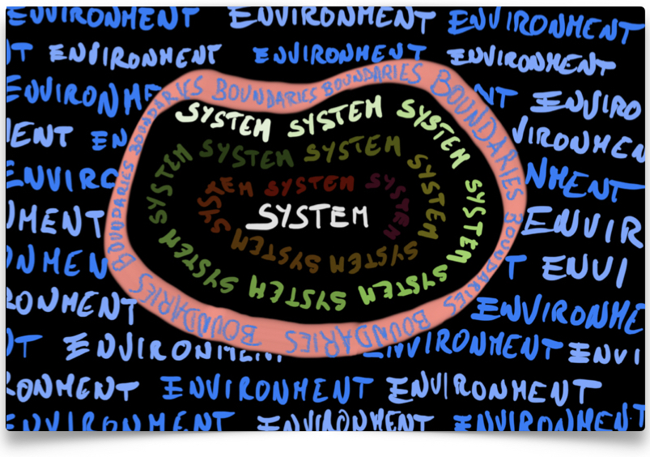

--- 
title: "The Live Textbook of Physical Chemistry 1"
author: "[Dr. Roberto Peverati](mailto:rpeverati@fit.edu)"
date: "`r format(Sys.time(), '%d %B %Y')`"
description: Textbook for P-Chem 1 class at Florida Tech
documentclass: book
github-repo: peverati/PChem1
link-citations: yes
bibliography:
- book.bib
- packages.bib
site: bookdown::bookdown_site
biblio-style: apalike
---

# Preface {-}

```{r out.width='80%', fig.show='hold', echo=FALSE, fig.align = 'center'}

```

This textbook is the official textbook for the Physical Chemistry 1 Course (CHM 3001) at Florida Tech.

The instructor for this course and author of this textbook is Dr. Roberto Peverati.

CONTACTS: [rpeverati@fit.edu](mailto:rpeverati@fit.edu), Office: OPS 333, (321) 674-7735

Chemistry Program, Department of Biomedical and Chenical Engineering and Science
Florida Institute of Technology, Melbourne, FL.


> This live open textbook is distributed under the [CC-BY-SA 4.0 License](https://creativecommons.org/licenses/by-sa/4.0/) and it was funded by the Florida Tech Open Educational Resources Grant Program: A Collaboration of the Teaching Council, eEducation, and the Evans Library.


## How to use this book {-}

Please read this book carefully, since everything that will be in your exams is explained here.
Since this book is specifically tailored for the CHM 3001 course at Florida Tech, there are no superfluous parts. In other words, everything in it might be subject to question in the quizzes and the final exam.

> Definitions and exercises are usually numbered and are highlighted in the text in this format (lighter grey, indented, and following a grey vertical bar). Please study the definitions carefully since they are fundamental concepts that will be used several times in the remainder of the text, and they will be subject to quizzes and exams. Exercises are essential for cementing the concepts, and you should attempt to execute them first without looking at the solution. Even if you were able to solve an exercise on your own, always read the solution after, since it might contain additional explanations expanding the main concepts in the text.

Navigating the book should be straightforward. On each page, there is a useful sidebar on the left that gives you an overview of all chapters, and  a toolbar at the top with important tools. Arrows to shift between chapters might also be present, depending on your browser. If you are old-school and prefer a pdf, you can download a printout by clicking on the toolbar's corresponding icon. If you are *really* old-school and prefer a printed book, the best solution is to download the pdf and print it yourself. It is a LaTeX book, and I can promise you it will look good on paper. However, I cannot provide physical copies to each student. In the toolbar, you will find a useful search box that is capable of searching the entire book. The most adventurous will find in the toolbar a link to the raw GitHub source code. Feel free to head on [over there](https://github.com/peverati/PChem1) and fork the book. 

Each chapter of this book represents one week of work in the classroom and at home. The sidebar on the left will reflect your syllabus, as well as the main structure of the class on Canvas. The book is a live document, which means it will be updated throughout the semester with new material. While you are not required to check it every day, you might want to review each week's chapter before the lecture on Friday.

> If you spot a mistake or a typo, contact Dr. Peverati via [email](mailto:rpeverati@fit.edu) and you will receive a credit of up to three points towards your final score, once the typo has been verified and corrected. 

[//]: ## A note on units {-}
