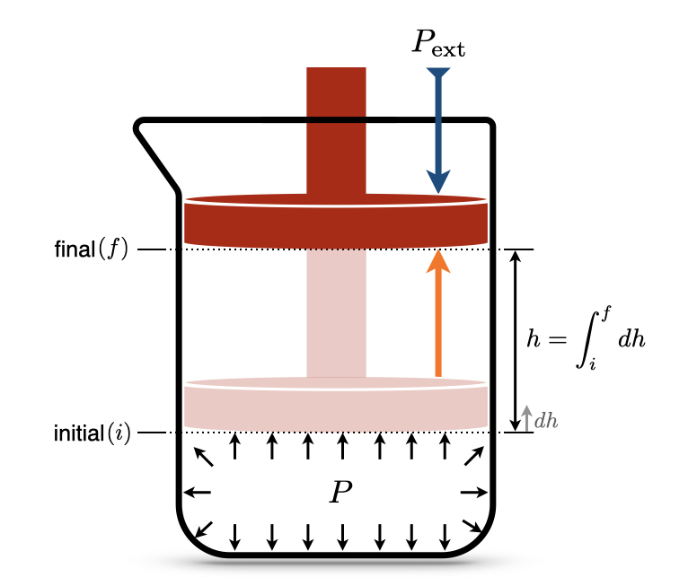
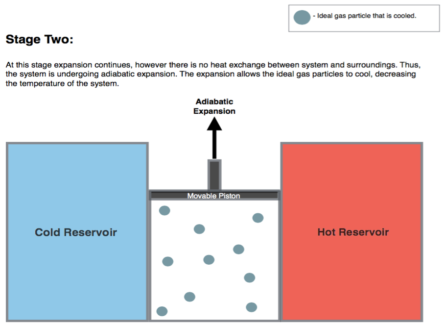
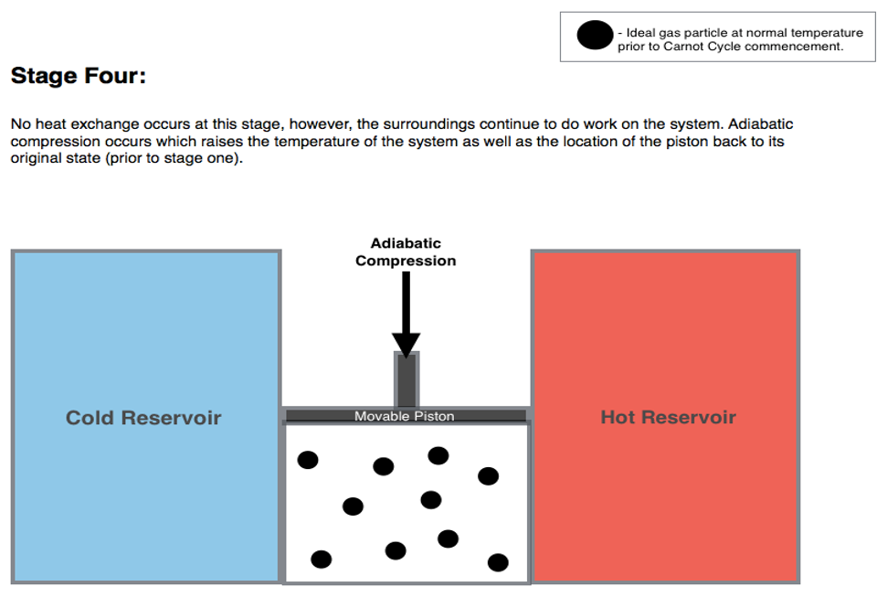
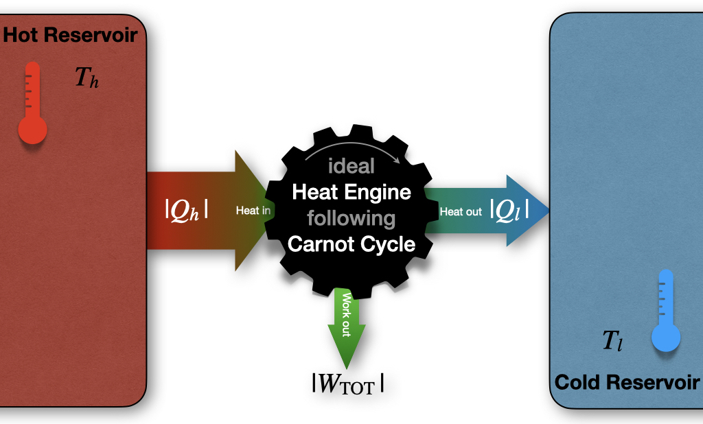

--- 
title: "The Live Textbook of Physical Chemistry 1"
author: "[Dr. Roberto Peverati](mailto:rpeverati@fit.edu)"
date: "`r format(Sys.time(), '%d %B %Y')`"
description: Textbook for P-Chem 1 class at Florida Tech
documentclass: book
github-repo: peverati/PChem1
link-citations: yes
site: bookdown::bookdown_site
biblio-style: apalike
---

# Preface {-}

```{r out.width='80%', fig.show='hold', echo=FALSE, fig.align = 'center'}
knitr::include_graphics('./img/OEP_Figures.000.jpeg')
```

This textbook is the official textbook for the Physical Chemistry 1 Course (CHM 3001) at Florida Tech.

The instructor for this course and author of this textbook is Dr. Roberto Peverati.

CONTACTS: [rpeverati@fit.edu](mailto:rpeverati@fit.edu), Office: OPS 333, (321) 674-7735

Chemistry Program, Department of Biomedical and Chenical Engineering and Science
Florida Institute of Technology, Melbourne, FL.


> This live open textbook is distributed under the [CC-BY-SA 4.0 License](https://creativecommons.org/licenses/by-sa/4.0/) and it was funded by the Florida Tech Open Educational Resources Grant Program: A Collaboration of the Teaching Council, eEducation, and the Evans Library.


## How to use this book {-}

Please read this book carefully, since everything that will be in your exams is explained here.
Since this book is specifically tailored for the CHM 3001 course at Florida Tech, there are no superfluous parts. In other words, everything in it might be subject to question in the quizzes and the final exam.

> Definitions and exercises are usually numbered and are highlighted in the text in this format (lighter grey, indented, and following a grey vertical bar). Please study the definitions carefully since they are fundamental concepts that will be used several times in the remainder of the text, and they will be subject to quizzes and exams. Exercises are essential for cementing the concepts, and you should attempt to execute them first without looking at the solution. Even if you were able to solve an exercise on your own, always read the solution after, since it might contain additional explanations expanding the main concepts in the text.

Navigating the book should be straightforward. On each page, there is a useful sidebar on the left that gives you an overview of all chapters, and  a toolbar at the top with important tools. Arrows to shift between chapters might also be present, depending on your browser. If you are old-school and prefer a pdf, you can download a printout by clicking on the toolbar's corresponding icon. If you are *really* old-school and prefer a printed book, the best solution is to download the pdf and print it yourself. It is a LaTeX book, and I can promise you it will look good on paper. However, I cannot provide physical copies to each student. In the toolbar, you will find a useful search box that is capable of searching the entire book. The most adventurous will find in the toolbar a link to the raw GitHub source code. Feel free to head on [over there](https://github.com/peverati/PChem1) and fork the book. 

Each chapter of this book represents one week of work in the classroom and at home. The sidebar on the left will reflect your syllabus, as well as the main structure of the class on Canvas. The book is a live document, which means it will be updated throughout the semester with new material. While you are not required to check it every day, you might want to review each week's chapter before the lecture on Friday.

> If you spot a mistake or a typo, contact Dr. Peverati via [email](mailto:rpeverati@fit.edu) and you will receive a credit of up to three points towards your final score, once the typo has been verified and corrected. 

[//]: ## A note on units {-}

<!--chapter:end:index.rmd-->

# Systems and Variables {#SystemVariables}

## Thermodynamic Systems
A thermodynamic system—or just simply a system—is a portion of space with defined boundaries that separate it from its surroundings (see also the title picture of this book). The surroundings may include other thermodynamic systems or physical systems that are not thermodynamic systems. A boundary may be a real physical barrier or a purely notional one. Typical examples of systems are reported in  Figure \@ref(fig:Fig1c1) below.^[The photos depicted in this figure are taken from [Wikipedia](https://en.wikipedia.org) and distributed under CC-BY-SA license.]
```{r Fig1c1, out.width='80%', fig.show='hold', echo=FALSE, fig.align = 'center', fig.cap='Examples of Thermodynamic Systems.'}
knitr::include_graphics('./img/OEP_Figures.001.jpeg')
```
In the first case, a liquid is contained in a typical Erlenmeyer flask. The boundaries of the system are the glass walls of the beaker. The second system is represented by the gas contained in a balloon. The boundary is a physical barrier also in this case, being the plastic of the balloon. The third case is that of a thunder cloud. The boundary is not a well-defined physical barrier, but rather some condition of pressure and chemical composition at the interface between the cloud and the atmosphere. Finally, the fourth case is the case of an open flame. In this case, the boundary is again non-physical, and possibly even harder to define than for a cloud. For example, we can choose to define the flame based on some temperature threshold, color criterion, or even some chemical one. Despite the lack of physical boundaries, the cloud and the flame—as portions of space containing matter—can be defined as a thermodynamic system.

A system can exchange exclusively mass, exclusively energy, or both mass and energy with its surroundings. Depending on the boundaries' ability to transfer these quantities, a system is defined as open, closed, or isolated. An open system exchanges both mass and energy. A closed system exchanges only energy, but not mass. Finally, an isolated system does not exchange mass nor energy.

| **Type of System** | **Mass** | **Energy** <br> (either heat or work) |
|--------------------|:--------:|:--------------------------------:|
| **Open**           |     Y    |                 Y                |
| **Closed**         |     N    |                 Y                |
| **Isolated**       |     N    |                 N                |

When a system exchanges mass or energy with its surroundings, some of its parameters (variables) change. For example, if a system loses mass to the surroundings, the number of molecules (or moles) in the system will decrease. Similarly, if a system absorbs some energy, one or more of its variables (such as its temperature) increase. Mass and energy can flow into the system or out of the system. Let's consider mass exchange only. If some molecules of a substance leave the system, and then the same amount of molecules flow back into the system, the system will not be modified. We can count, for example, 100 molecules leaving a system and assign them the value of –100 in an outgoing process, and then observe the same 100 molecules going back into the system and assign them a value of +100. Regardless of the number of molecules present in the system in the first place, the overall balance will be –100 (from the outgoing process) +100 (from the ingoing process) = 0, which brings the system to its initial situation (mass has not changed). However, from a mathematical standpoint, we could have equally assigned the label +100 to the outgoing process and –100 to the ingoing one, and the overall total would have stayed the same: +100–100 = 0. Which of the two labels is best? For this case, it seems natural to define a mass going out of the system as negative (the system is losing it), and a mass going into the system as positive (the system is gaining it), but is it as straightforward for energy? 

> Here is another example. Let's consider a system that is composed of your body. When you exercise, you lose mass in the form of water (sweat) and CO~2~ (from respiration). This mass loss can be easily measured by stepping on a scale before and after exercise. The number you observe on the scale will go down. Hence you have lost weight. After exercise, you will reintegrate the lost mass by drinking and eating. If you have reinstated the same amount you have lost, your weight will be the same as before the exercise (no weight loss). Nevertheless, which label do you attach to the amounts that you have lost and gained? Let’s say that you are running a 5km race without drinking nor eating, and you measure your weight dropping 2 kg after the race. After the race, you drink 1.5 kg of water and eat a 500 g energy bar. Overall you did not lose any weight, and it would seem reasonable to label the 2 kg that you’ve lost as negative (–2)  and the 1.5 kg of water that you drank and the 500 g bar that you ate as positive (+1.5 +0.5 = +2). But is it the only way? After all, you didn’t gain nor lose any weight, so why not calling the 2 kg due to exercise +2 and the 2 that you’ve ingested as –2? It might seem silly, but mathematically it would not make any difference, the total would still be zero. Now, let’s consider energy instead of mass. To run the 5km race, you have spent 500 kcal, which then you reintegrate precisely by eating the energy bar. Which sign would you put in front of the kilocalories that you “burned” during the race? In principle, you’ve lost them, so if you want to be consistent, you should use a negative sign. But if you think about it, you’ve put quite an effort to “lose” those kilocalories, so it might not feel bad to assign them a positive sign instead. After all, it’s perfectly OK to say, “I’ve done a 500 kcal run today”, while it might sound quite awkward to say, “I’ve done a –500 kcal run today.” Our previous exercise with mass demonstrates that it doesn’t really matter which sign you put in front of the quantities. As long as you are consistent throughout the process, the signs will cancel out. If you’ve done a +500 kcal run, you’ve eaten a bar for –500 kcal, resulting in a total zero loss/gain. Alternatively, if you’ve done a –500 kcal run, you would have eaten a +500 kcal bar, for a total of again zero loss/gain.

These simple examples demonstrate that the sign that we assign to quantities that flow through a boundary is arbitrary (i.e., we can define it any way we want, as long as we are always consistent with ourselves). There is no best way to assign those signs. If you ask two different people, you might obtain two different answers. But we are scientists, and we must make sure to be rigorous. For this reason, chemists have established a convention for the signs that we will follow throughout this course. If we are consistent in following the convention, we are guaranteed to never make any mistake with the signs. 

> ```{definition, chemistryconv}
*The chemistry convention of the sign is system-centric:*^[Notice that physicists use a different sign convention when it comes to thermodynamics. To eliminate confusion, I will not describe the physics convention here, but if you are reading thermodynamics on a physics textbook, or if you are browsing the web and stumble on thermodynamics formula (e.g., on Wikipedia), please be advised that they might have a different sign than what is used in this course. Obviously, the science will not change, but you need to be ALWAYS consistent, so if you decide that you want to use the physics convention, make sure to ALWAYS use the physics convention. In this course, on the other hand, we will ALWAYS use the chemistry one, as introduced above.]


- *If something (energy or mass) goes **into** the system it has a **positive** sign (the system is gaining)*
- *If something (energy or mass) goes **out of** the system it has a **negative** sign (the system is losing)*


```

If you want a trick to remember the convention, use the weight loss/gain during the exercise example above. You are the system, if you lose weight, the kilograms will be negative (–2 kg), while if you gain weight, they will be positive (+2 kg). Similarly, if you eat an energy bar, you are the system, and you will have increased your energy by +500 kcal (positive). In contrast, if you burned energy during exercise, you are the system, and you will have lost energy, hence –500 kcal (negative). If the system is a balloon filled with gas, and the balloon is losing mass, you are the balloon, and you are losing weight; hence the mass will be negative. If the balloon is absorbing heat (likely increasing its temperature and increasing its volume), you are the system, and you are gaining heat; hence heat will be positive.

## Thermodynamic Variables
The system is defined and studied using parameters that are called variables. These variables are quantities that we can measure, such as pressure and temperature. However, they don’t be surprised if, on some occasions, you encounter some variable that is a little harder to measure directly, such as entropy. The variables depend only on the current state of the system, and therefore they define it. If I know the values of all the “relevant variables” of a system, I know the state of the system. The relationship between the variables is described by mathematical functions called state functions, while the “relevant variables” are called natural variables.

What are the “relevant variables” of a system? The answer to this question depends on the system, and it is not always straightforward. The simplest case is the case of an ideal gas, for which the natural variables are those that enter the ideal gas law and the corresponding equation:

\begin{equation}
  PV=nRT       
  (\#eq:idealgaslaworiginal)
\end{equation}

Therefore, the natural variables for an ideal gas are the pressure P, the volume V,  the number of moles n, and the temperature T, with R being the ideal gas constant. Recalling from the general chemistry courses, R is a universal dimensional constant which has the values of R = 8.31 kJ/mol in SI units.  
We will use the ideal gas equation and its variables as an example to discuss variables and functions in this chapter. We will analyze more complicated cases in the next chapters. 
Variables can be classified according to numerous criteria, each with its advantages and disadvantages. A typical classification is:

- **Physical variables** ($P$, $V$, $T$ in the ideal gas law): independent on the chemical composition of the system.
- **Chemical variables** ($n$ in the ideal gas law): dependent on the chemical composition of the system.

Another useful classification is:

- **Intensive variables** ($P$, $T$ in the ideal gas law): independent on the physical size (extension) of the system.
- **Extensive variables** ($V$, $n$ in the ideal gas law): dependent on the physical size (extension) of the system.

When we deal with thermodynamic systems, it is more convenient to work with intensive variables. Luckily, it is relatively easy to convert extensive variables into intensive ones by just taking the ratio between the two of them. For an ideal gas, by taking the ratio between V and n, we obtained the intensive variable called molar volume:

\begin{equation}
  V_m=\frac{V}{n}.   
  (\#eq:Vmdef)
\end{equation}

We can then recast eq. \@ref(eq:idealgaslaworiginal) as:

\begin{equation}
  PV_m=RT,
  (\#eq:idealgaslaw)
\end{equation}

which is the preferred equation that we will use for the remainder of this course.
The ideal gas equation connects the 3 variables pressure, molar volume, and temperature, reducing the number of independent variables to just 2. In other words, once 2 of the 3 variables are known, the other one can be easily obtained using these simple relations:

\begin{equation}
  P(T,V_m)=\frac{RT}{V_m},
  (\#eq:PTVm)
\end{equation}

\begin{equation}
  V_m(T,P)=\frac{RT}{P},
  (\#eq:VmTP)
 \end{equation}
 
\begin{equation}
  T(P,V_m)=\frac{PV_m}{R}.
  (\#eq:TPVm)
\end{equation}

  
These equations define three state functions, each one expressed in terms of two independent natural variables. For example, eq. \@ref(eq:PTVm) defines the state function called “pressure”, expressed as a function of temperature and molar volume. Similarly, eq. \@ref(eq:VmTP) defines the “molar volume” as a function of temperature and pressure, and eq. \@ref(eq:TPVm) defines the “temperature” as a function of pressure and molar volume. When we know the natural variables that define a state function, we can express the function using its total differential, for example for the pressure $P(T, V_m)$:

\begin{equation}
  dP=\left( \frac{\partial P}{\partial T} \right)dT + \left( \frac{\partial P}{\partial V_m} \right)dV_m
  (\#eq:totaldifferentialP)
\end{equation}


Recalling Schwartz’s theorem, the mixed partial second derivatives that can be obtained from eq. 1.2.7 are the same:
 
\begin{equation}
  \frac{\partial^2 P}{\partial T \partial V_m}=\frac{\partial}{\partial V_m}\frac{\partial P}{\partial T}=\frac{\partial}{\partial T}\frac{\partial P}{\partial V_M}=\frac{\partial^2 P}{\partial V_m \partial T}
  (\#eq:schwartzP)
\end{equation}

Which can be easily verified considering that:

\begin{equation}
  \frac{\partial}{\partial V_m} \frac{\partial P}{\partial T}  = \frac{\partial}{\partial V_m} \left(\frac{R}{V_m}\right) = -\frac{R}{V_m^2} 
  (\#eq:secondderPA)
\end{equation}

and 

\begin{equation}
  \frac{\partial}{\partial T} \frac{\partial P}{\partial V_m}  = \frac{\partial}{\partial T} \left(\frac{-RT}{V_m^2}\right) = -\frac{R}{V_m^2} 
  (\#eq:secondderPB)
\end{equation}

While for the ideal gas law, all the variables are “well-behaved” and always satisfy Schwartz’s theorem, we will encounter some variable for which Schwartz’s theorem does not hold. Mathematically, if the Schwartz’s theorem is violated (i.e., if the mixed second derivatives are not equal), then the corresponding function cannot be integrated, hence it is not a state function. The differential of a function that cannot be integrated cannot be defined exactly. Thus, these functions are called path functions; that is, they depend on the path rather than the state. The most typical examples of path functions that we will encounter in the next chapters are heat ($Q$) and work ($W$). For these functions, we cannot define exact differentials $dQ$ and $dW$, and we must introduce a new notation to define their “inexact differentials” $đ Q$ and $đ W$. 

> We will return on exact and inexact differential when we discuss heat and work, but for this chapter, it is crucial to notice the difference between a state function and a path function. A typical example to understand the difference between state and path function is to consider the distance between two geographical locations. Let’s, for example, consider the distance between New York City and Los Angeles. If we fly straight from one city to the other, there are roughly 4,000 km between them. This “air distance” depends exclusively on the geographical location of the two cities. It stays constant regardless of the method of transportation that I have accessibility to travel between them. Since the cities' positions depend uniquely on their latitudes and longitudes, the “air distance” is a state function, i.e., it is uniquely defined from a simple relationship between measurable variables. However, the “air distance” is not the distance that I will practically have to drive when I go from NYC to LA. Such “travel distance” depends on the method of transportation that I decide to take (airplane vs. car vs. train vs. boat vs. …). It will depend on a plentiful amount of other factors such as the choice of the road to be traveled (if going by car), the atmospheric conditions (if flying), and so on. A typical “travel distance” by car is, for example, about 4,500 km, which is about 12% more than the “air distance.” Indeed, we could even design a very inefficient road trip that avoids all highways and will result in a “travel distance” of 8,000 km or even more (200% of the “air distance”). The “travel distance” is a clear example of a path function because it depends on the specific path that I decide to travel to go from NYC to LA. See Figure \@ref(fig:Fig2c1).

```{r Fig2c1, out.width='80%', fig.show='hold', echo=FALSE, fig.align = 'center', fig.cap='State Functions vs. Path Functions.'}
knitr::include_graphics('./img/OEP_Figures.002.jpeg')
```

<!--chapter:end:01_Basis.rmd-->

# Zeroth Law of Thermodynamics {#ZerothLaw}

## What is Thermodynamics? 
Thermodynamics is the branch of science that deals with heat and work, and their relation to energy. As the definition suggests, thermodynamics is concerned with two types of energy: heat and work. A formal definition of these forms of energy is as follow:

- Work is exchanged if external parameters are changed during the process. 
- Heat is exchanged if only internal parameters are changed during the process.

As we saw in chapter \@ref(SystemVariables), though, heat and work are not “well-behaved” quantities because they are path functions. On the one hand, it might be simple to measure the amount of heat and/or work experimentally, these measured quantities cannot be used to define the state of a system. Since heat and work are path functions, their values depend directly on the methods used to transfer them (their paths). Understanding and quantifying these energy transfers is the reason why thermodynamics was developed in the first place. The origin of thermodynamics dates back to the seventeenth century when people began to use heat and work for technological applications. These early scientists needed a mathematical tool to understand how heat and work were related to each other, and how they were related to the other variables that they were able to measure, such as temperature and volume.

Before we even discuss the definition of energy and how it relates to heat and work, it is crucial to introduce the essential concept of temperature. Temperature is an intuitive concept that has a surprisingly complex definition at the microscopic level.^[In fact, we will not even give a rigorous microscopic definition of temperature within this textbook.] However, for all our purposes, it is not essential to have a microscopic definition of temperature, as long as we have the guarantee that this quantity can be measured unambiguously. In other words, we need a mathematical definition of temperature that agrees with the physical existence of thermometers.

## The Zeroth Law of Thermodynamics
The mathematical definition that guaranteer that the thermal equilibrium is an equivalence relation is called the zeroth law of thermodynamics. The zeroth law of thermodynamics states that if two thermodynamic systems are each in thermal equilibrium with a third one, then they are in thermal equilibrium with each other. The law might appear trivial and possibly redundant, but it is a fundamental requirement for the mathematical formulation of thermodynamics, so it needs to be stated. The zeroth law can be summarized by the following simple mathematical relation:

> ```{definition, zerothlaw}
*Zeroth Law of Thermodynamics:* If $T_A = T_B$, and $T_B = T_C$, then $T_A = T_C$.

```

Notice that when we state the zeroth law, it appears intuitive. However, this is not necessarily the case. Let’s, for example, consider a pot of boiling water at $P=$ 1 atm. Its temperature, $T_{H_2O}$, is about 373 K. Let’s now submerge in this water a coin made of wood and another coin made of metal. After some sufficient time, the wood coin will be in thermal equilibrium with the water, and its temperature $T_W = T_{H_2O}$. Similarly, the metal coin will also be in thermal equilibrium with the water, hence $T_M = T_{H_2O}$. According to the zeroth law, the temperature of the wood coin and that of the metal coin are precisely the same $T_W = T_M$, even if they are not in direct contact with each other. Now here’s the catch: since wood and metal transmit heat in different manners if I take the coins out of the water and put them immediately in your hands, one of them will be very hot, but the other will burn you. If you had to guess the temperature of the two coins without a thermometer, and without knowing that they were immersed in boiling water, would you suppose that they have the same temperature? Probably not.


## Calculation of Work {#workint}
In thermodynamics, work ($W$) is the ability of a system to transfer energy by exerting a force on its surroundings. Work can be measured simply by evaluating its effects, such as displacing a massive object by some amount of space. The mathematical treatment of work, however, is complicated because *work is a path function*. In the following sections, we will analyze how work is calculated in some prototypical situations commonly encountered in the thermodynamical treatment of systems.  

### Free expansion at constant temperature
```{r Fig1c3, out.width='50%', fig.show='hold', echo=FALSE, fig.align = 'center', fig.cap='Free Expansion at Constant Temperature of an Ideal Gas.'}
knitr::include_graphics('./img/OEP_Figures.003.jpeg')
```

Let's consider the situation in Figure \@ref(fig:Fig1c3), where a special beaker with a piston that is free to move is filled with an ideal gas. The beaker sits in a horizontal position on a desk, so the piston is not subject to any external forces^[For this simple thought experiment, we will ignore any external force that is not significant. In other words, we will not consider the friction of the piston on the beaker walls or any other foreign influence.]. The piston is initially compressed to a position that is not in equilibrium $(i)$. After the process, the piston reaches a final equilibrium position $(f)$. We assume that the only force acting on the piston is the pressure of the ideal gas, $P$. How do we calculate the work ($W$) performed by the system?

From basic physics, we recall that the infinitesimal amount of work associated with an object moving in space is given by the force acting on the object ($F$) multiplied by the infinitesimal amount it gets displaced ($d h$):

\begin{equation}
  đ W = - Fdh,
  (\#eq:Wphysics)
\end{equation}

where the negative sign comes from the chemistry sign convention, Definition \@ref(def:chemistryconv), since the work in Figure  \@ref(fig:Fig1c3) is *performed* by the system (expansion). What kind of force is moving the piston? It is the force due to the pressure of the gas. Relying upon another definition from physics, the pressure is the ratio between the force ($F$) and the area ($A$) that such force acts upon:

\begin{equation}
  P = F/A.
  (\#eq:Pphysics)
\end{equation}

Obtaining $F$ from eq. \@ref(eq:Pphysics) and replacing it in eq. \@ref(eq:Wphysics), we obtain:

\begin{equation}
  đ W = - P \underbrace{Adh}_{dV},
  (\#eq:Wphysics2)
\end{equation}

and considering that $Adh$ (area times infinitesimal height) is the definition of an infinitesimal volume $dV$, we obtain:

\begin{equation}
  đ W = - PdV,
  (\#eq:Wdef)
\end{equation}

If we want to calculate the amount of work performed by a system, $W$, from eq. \@ref(eq:Wdef), we need to recall that $đ W$ is an inexact differential. As such, we cannot integrate it from initial to final as for the (exact) differential of a state function, because:

\begin{equation}
  \int_{i}^{f}đ W \neq W_f - W_i,
  (\#eq:Wdiff)
\end{equation}

but rather:

\begin{equation}
  \int_{\text{path}} đ W = W,
  (\#eq:Wdiff2)
\end{equation}

where the integration is performed along the *path*. Using eq. \@ref(eq:Wdiff2), we can integrate eq. \@ref(eq:Wdef) as:

\begin{equation}
  \int đ W = W = - \int_{i}^{f} PdV,
  (\#eq:Wint)
\end{equation}

where the integral on the left-hand side is taken along the path,^[from here on we will replace the notation $\int_{\text{path}}$ with the more convenient $\int$ and we will keep in mind that the integral of an inexact differential must be taken along the path.] while the integral on the right-hand side can be taken between the initial and final states, since $dV$ is a state function.
How do we solve the integral in eq. \@ref(eq:Wint)? The pressure in this process is not constant since it decreases throughout the process. Therefore $P$ cannot be moved outside the integral. However, if our gas is ideal, we can calculate the pressure using the ideal gas law $P=\frac{nRT}{V}$, and solve the integral because $n$, $R$, and $T$ are constant:

\begin{equation}
  W = - nRT \int_{i}^{f} \frac{dV}{V} = -nRT \ln \frac{V_f}{V_i},
  (\#eq:WintsolvedV)
\end{equation}

which, considering that $P_iV_i=P_fV_f$, can be also written as:

\begin{equation}
  W = -nRT \ln \frac{P_i}{P_f}.
  (\#eq:WintsolvedP)
\end{equation}


### Isothermal expansion against a constant external pressure

```{r Fig2c3, out.width='50%', fig.show='hold', echo=FALSE, fig.align = 'center', fig.cap='Isothermal Expansion of an Ideal Gas Against a Constant External Pressure.'}

```
The process that we are analyzing here (Figure \@ref(fig:Fig2c3)) is apparently similar to the case we have seen in the previous section, with the noticeable difference that the beaker now sits vertically on the workbench. In this case, when the piston moves upwards, it is no longer moving freely, but it moves against the force due to the constant external pressure $P_{\text{ext}}$.

The integral that describes the work performed by the system in this case involves a transformation at constant external pressure:

\begin{equation}
  \int đ W = W = - \int_{i}^{f} P_{\text{ext}}dV,
  (\#eq:Wint2)
\end{equation}

which can be easily simplified as:

\begin{equation}
  W = - \int_{i}^{f} P_{\text{ext}}dV = -P_{\text{ext}} \int_{i}^{f} dV = -P_{\text{ext}} (V_f-V_i),
  (\#eq:Wint3)
\end{equation}

resulting in the following simple formula to calculate $W$:

\begin{equation}
  W = -P_{\text{ext}} \Delta V,
  (\#eq:WintF)
\end{equation}

Comparing eq. \@ref(eq:WintF) with eq. \@ref(eq:WintsolvedP) shows how different this case is from the previous one. 

## Calculation of Heat {#heatint}

Heat ($Q$) is a property that gets transferred between substances. Similarly to work, the amount of heat that flows through a boundary can be measured, but its mathematical treatment is complicated because *heat is a path function*.
As you probably recall from general chemistry, the ability of a substance to absorb heat is given by a coefficient called the heat capacity, which is measured in SI in $\frac{\text{J}}{\text{mol K}}$. However, since heat is a path function, these coefficients are not unique, and we have different ones depending on how the heat transfer happens.

### Processes at constant volume (isochoric)
The heat capacity at constant volume measures the ability of a substance to absorb heat at constant volume. Recasting from general chemistry:

> The molar heat capacity at constant volume is the amount of heat required to increase the temperature of 1 mol of a substance by 1 K at constant volume.

This simple definition can be written in mathematical terms as:

\begin{equation}
  C_V = \frac{đ Q_V}{n dT} \Rightarrow đ Q_V = n C_V dT.
  (\#eq:Cvdef)
\end{equation}

Given a known value of $C_V$, the amount of heat that gets transfered can be easily calculated by measuring the changes in temperature, after integration of eq. \@ref(eq:Cvdef):

\begin{equation}
  đ Q_V = n C_V dT \rightarrow \int đ Q_V = n \int_{T_i}^{T_F}C_V dT \rightarrow Q_V = n C_V \int_{T_i}^{T_F}dT,
  (\#eq:Cvint1)
\end{equation}

which, assuming $C_V$ independent of temperature, simply becomes:

\begin{equation}
  Q_V \cong n C_V \Delta T.
  (\#eq:Cvint)
\end{equation}


### Processes at constant pressure (isobaric) {#heatconstp}
Similarly to the previous case, the heat capacity at constant pressure measures the ability of a substance to absorb heat at constant pressure. Recasting again from general chemistry:

> The molar heat capacity at constant pressure is the amount of heat required to increase the temperature of 1 mol of a substance by 1 K at constant pressure.

And once again, this mathematical treatment follows:

\begin{equation}
  C_P = \frac{đ Q_P}{n dT} \Rightarrow đ Q_P = n C_P dT \rightarrow \int đ Q_P = n \int_{T_i}^{T_F}C_P dT,
  (\#eq:Cpdef)
\end{equation}

which result in the simple formula:

\begin{equation}
  Q_P \cong n C_P \Delta T.
  (\#eq:Cpint)
\end{equation}


<!--chapter:end:02_ZerothLaw.rmd-->

# First Law of Thermodynamics {#FirstLaw}

## Calculation of Internal Energy Changes {#energyint}

The internal energy ($U$) of a system is a thermodynamic state function defined as:

> ```{definition, energy}
*Internal Energy:* Property of a system that can be wither transferred or converted.


```

In the absence of chemical transformations, heat and work are the only two forms of energy that thermodynamics is concerned with. Keeping in mind Definition \@ref(def:chemistryconv), which gives the convention for the signs of heat and work, the internal energy of a system can be written as:

\begin{equation}
  U = Q + W,
  (\#eq:U)
\end{equation}

which we can write in differential form by considering that the internal energy is a state function, as:
\begin{equation}
  dU = đ Q + đ W,
  (\#eq:dU)
\end{equation}

which, using eq. \@ref(eq:Wdef) becomes:

\begin{equation}
  dU = đ Q - PdV.
  (\#eq:dUpdv)
\end{equation}

### Internal energy in isothermal processes {#isothermalE}
To study the behavior of the internal energy in a process at constant temperature ($dT=0$), James Prescott Joule (1818–1889) created the apparatus depicted in Figure \@ref(fig:FigJexp).

```{r FigJexp, out.width='80%', fig.show='hold', echo=FALSE, fig.align = 'center', fig.cap='The Joule Expansion Experiment.'}
knitr::include_graphics('./img/OEP_Figures.006.jpeg')
```

The left side of the Joule apparatus's inner chamber is filled with an ideal gas, while a vacuum is created in the right chamber. Both chambers are immersed in a water bath, to guarantee isolation from the environment. When the communication channel between the chambers is open, the gas expands and equilibrates. The work associated with the transformation is:

\begin{equation}
  đ W=P_{\text{ext}}dV = 0,
  (\#eq:JexpW)
\end{equation}

since the chambers are not in communication with the environment, $P_{\text{ext}}=0$. Thus, changes in internal energy are associated with the heat transfer of the process, which can be measured by monitoring the temperature of the gas at the beginning, $T_i$, and at the end of the experiment $T_f$. Joule noticed experimentally that if he used an ideal gas for this experiment, the temperature would not change $T_i = T_f$. Since the temperature doesn't change, there is no heat transfer, and therefore the internal energy stays constant:

\begin{equation}
  dU = đ Q = 0.
  (\#eq:JexpQU)
\end{equation}

> Notice that Joule's conclusion is valid only for an ideal gas. If we expand a real gas, we do notice a change in temperature associated with the expansion. A typical example of this behavior is when you use a pressurized spray bottle and release its content for an extended time in the air. The container will typically get colder. We will discuss this behavior in chapter \@ref(RealGases) when we will study non-ideal gases. 

From this simple experiment, we can conclude that the internal energy of an ideal gas depends only on its temperature. 


### Internal energy in adiabatic processes 
An adiabatic process is defined as a process that happens without the exchange of heat. As such, $đ Q=0$, and the work associated with an adiabatic process becomes a state function:

\begin{equation}
  dU=đ W=PdV,
  (\#eq:dUadiabatic)
\end{equation}

which can then be calculated using the formulas that we derived in section \@ref(workint). Notice that isothermal and adiabatic are two very different processes. While an adiabatic process happens without the exchange of heat across the system's boundaries, this does not mean that the system's temperature does not change. Isothermal processes are usually associated with a heat transfer across the boundaries to maintain the temperature of the system constant. For adiabatic processes, it is quite the opposite since they are usually associated with a change in temperature.

### Internal energy in isochoric processes
An isocoric process is a process in which the volume does not change. Therefore, $đ W=0$, and $dU = đ Q_V$, which for 1 mol of substance and using eq. \@ref(eq:Cvdef), becomes:

\begin{equation}
  dU = đ Q_V = n C_V dT.
  (\#eq:dUqv)
\end{equation}

Since no work is performed at these conditions, the heat becomes a state function. Eq. \@ref(eq:dUqv) also gives a mathematical justification of the concept of heat capacity at constant volume. $C_V$ can now be interpreted as the partial derivative (a coefficient) of a state function (the internal energy):

\begin{equation}
  C_V = \left( \frac{\partial U} {\partial T} \right)_{V,n},
  (\#eq:cvstatefunc)
\end{equation}

where we have replaced the total derivative $d$ with a partial one $\partial$, and we have specified that the derivation happens at constant volume and number of moles. Eq. \@ref(eq:cvstatefunc)  equation brings a rigorous definition of heat capacity at constant volume for 1 mol of substance:

> ```{definition, newdefcv}
*The heat capacity of a substance, $C_V$, represents its ability to absorb **energy** at constant **volume**.*
```

### Internal energy in isobaric processes {#enthalpy}
In an isobaric process, the pressure does not change, hence $dP=0$. Unfortunately, eq. \@ref(eq:dU) for this case does not simplify further, as happened in the two previous cases. However, in section \@ref(heatconstp), we have introduced the useful concept of heat capacity at constant $P$. $C_P$ was used in an adiabatic process in the same manner as $C_V$ was used in the isochoric case. That is, as a coefficient to measure the amount of heat absorbed at constant pressure. Eq. \@ref(eq:cvstatefunc) gave a mathematical definition of $C_V$ as the partial derivative of a state function (the internal energy). But if heat capacities are coefficients, and coefficients are partial derivatives of state functions, how do we explain $C_V$?

In order to do so, we can introduce a new state function, called the enthalpy ($H$), as:

\begin{equation}
  H = U + PV,
  (\#eq:enthalpydef)
\end{equation}

and its differential, calculated as:

\begin{equation}
  dH = dU + d(PV) = dU + PdV + \overbrace{VdP}^{0},
  (\#eq:enthalpydefdiff)
\end{equation}

which can be rearranged as:

\begin{equation}
  dU = dH -PdV,
  (\#eq:enthalpydefdiffu)
\end{equation}

Replacing eq. \@ref(eq:enthalpydefdiffu) into eq. \@ref(eq:dUpdv):

\begin{equation}
  dH -PdV = đ Q_P - PdV,
  (\#eq:dh1)
\end{equation}

which simplifies to:

\begin{equation}
  dH = đ Q_P.
  (\#eq:dh2)
\end{equation}

Eq. \@ref(eq:dh2) establishes that the heat exchanged at constant pressure is equal to a new state function called the enthalpy, defined by eq. \@ref(eq:enthalpydef). It also establishes a mathematical justification of the concept of heat capacity at constant pressure. Similarly to $C_V$, $C_P$ can now be interpreted as the partial derivative (a coefficient) of the new state function (the enthalpy):

\begin{equation}
  C_P = \left( \frac{\partial H} {\partial T} \right)_{P,n},
  (\#eq:cpstatefunc)
\end{equation}

Eq. \@ref(eq:cpstatefunc) brings also a rigorous definition of heat capacity at constant pressure for 1 mol of substance:

> ```{definition, newdefcp}
*The heat capacity of a substance, $C_P$, represents its ability to absorb **enthalpy** at constant **pressure**.*
```

## The First Law of Thermodynamics
We finally come to a working definition of the first law. If we take an isolated system—i.e., a system that does not exchange heat nor mass with its surroundings—its internal energy is conserved. If the internal energy is conserved, $dU=0$. Therefore, for an isolated system:

\begin{equation}
  đ Q = -đ W,
  (\#eq:heateqwork)
\end{equation}

and heat and work can be easily calculated using any of the appropriate formulas introduced in either section \@ref(workint) or \@ref(heatint).

The first law is a conservation law. It is intuitive since it comes directly from Lavoisier's principle of "nothing is lost, nothing is created, everything is transformed." Considering that the only system that is truly isolated is the universe, we can condense the first law in one simple sentence:

> ```{definition, firstlaw}
*First Law of Thermodynamics:* The energy of the universe is conserved.
```


## Reversible and Irreversible processes

### Calculation of $| W_{\text{max}} |$ and  $| W_{\text{min}} |$
Let's go back to the calculation of the work in a process at constant temperature. We can use the formulas obtained in section \@ref(workint) to understand a little bit better the meaning of a *path function*. Let's consider the following PV diagram, obtained from an ideal gas at constant $T=298$ K:

```{r, echo=FALSE, fig.align='center',fig.asp = .62}
x <- seq(0,1.25,0.01)
i <- 0.25
f <- 1
par(mar=c(4,4,1,4))
plot(x, 0.081*298/x,
     ylim=c(0, 150),
     type="l",
     ylab = "Pressure [atm]", xlab = "Volume [L]", col = "#2E9FDF")
points(i, 0.081*298/i, col="red", pch=19)
points(f, 0.081*298/f, col="red", pch=19)

arrows(i, 0.081*298/i, i, -10 , length=0, angle=90, code=3, lty="dotted")
arrows(i, 0.081*298/i, -10, 0.081*298/i , length=0, angle=90, code=3, lty="dotted")
arrows(f, 0.081*298/f, f, -10 , length=0, angle=90, code=3, lty="dotted")
arrows(f, 0.081*298/f, -10, 0.081*298/f , length=0, angle=90, code=3, lty="dotted")


 text(0.025+i, 5+0.081*298/i, "i")
 text(0.025+f, 8+0.081*298/f, "f")
 
 text(i-0.025, 0, expression('V'[i]))
 text(f+0.025, 0, expression('V'[f]))  
 text(-0.025, 5+0.081*298/i, expression('P'[i]))
 text(-0.025, 0.081*298/f-5, expression('P'[f]))  

```

where the isothermal expansion happens between $P_i$ and $P_f$. If the expansion happens in a one-step fast process, for example against a constant pressure $P_f=P_{\text{ext}}$, the work is given by eq. \@ref(eq:WintF). On the plot, the absolute value of the work^[we use the absolute value to avoid confusions due to the fact that the expansion work is negative according to Definition \@ref(def:chemistryconv).] is represented by the red area:
```{r, echo=FALSE, fig.align='center',fig.asp = .62}
x <- seq(0,1.25,0.01)
i <- 0.2
f <- 1
par(mar=c(4,4,1,4))
plot(x, 0.081*298/x,
     ylim=c(0, 150),
     type="l",
     ylab = "Pressure [atm]", xlab = "Volume [L]", col = "#2E9FDF")
points(i, 0.081*298/i, col="red", pch=19)
points(f, 0.081*298/f, col="red", pch=19)

arrows(i, 0.081*298/i, i, -10 , length=0, angle=90, code=3, lty="dotted")
arrows(i, 0.081*298/i, -10, 0.081*298/i , length=0, angle=90, code=3, lty="dotted")
arrows(f, 0.081*298/f, f, -10 , length=0, angle=90, code=3, lty="dotted")
arrows(f, 0.081*298/f, -10, 0.081*298/f , length=0, angle=90, code=3, lty="dotted")

rect(i,i, f, 0.081*298/f, density = 20, angle = 45,
     col = "red", border = NULL, lty = par("lty"), lwd = par("lwd"))


 text(0.025+i, 5+0.081*298/i, "i")
 text(0.025+f, 8+0.081*298/f, "f")
 
 text(i-0.025, 0, expression('V'[i]))
 text(f+0.025, 0, expression('V'[f]))  
 text(-0.025, 5+0.081*298/i, expression('P'[i]))
 text(-0.025, 0.081*298/f-5, expression('P'[f]))  
 


 legend(0.48,22, expression(P[f]*(V[f]-V[i])),box.col = "white", bg = "white", adj=0.15)

```
\begin{equation}
\left| W_{\text{1-step}} \right| = P_{\text{ext}} (V_f-V_i)
  (\#eq:Warea1)
\end{equation}

However, if the process happens in two steps, by pausing at position (1) until equilibrium is reached, then we should calculate the work by dividing the process into two. The first process is an expansion between $P$ and $P_1$, whose absolute value of the work, $W_A$, is represented by the blue area:
```{r, echo=FALSE, fig.align='center',fig.asp = .62}
x <- seq(0,1.25,0.01)
i <- 0.2
f <- 1
p1 <- 0.5
par(mar=c(4,4,1,4))
plot(x, 0.081*298/x,
     ylim=c(0, 150),
     type="l",
     ylab = "Pressure [atm]", xlab = "Volume [L]", col = "#2E9FDF")
points(i, 0.081*298/i, col="red", pch=19)
points(f, 0.081*298/f, col="red", pch=19)
points(p1, 0.081*298/p1, col="red", pch=19)

arrows(i, 0.081*298/i, i, -10 , length=0, angle=90, code=3, lty="dotted")
arrows(i, 0.081*298/i, -10, 0.081*298/i , length=0, angle=90, code=3, lty="dotted")
arrows(f, 0.081*298/f, f, -10 , length=0, angle=90, code=3, lty="dotted")
arrows(f, 0.081*298/f, -10, 0.081*298/f , length=0, angle=90, code=3, lty="dotted")
arrows(p1, 0.081*298/p1, p1, -10 , length=0, angle=90, code=3, lty="dotted")
arrows(p1, 0.081*298/p1, -10, 0.081*298/p1 , length=0, angle=90, code=3, lty="dotted")

rect(i,i, p1, 0.081*298/p1, density = 20, angle = 45,
     col = "blue", border = NULL, lty = par("lty"), lwd = par("lwd"))


 text(0.025+i, 5+0.081*298/i, "i")
 text(0.025+f, 8+0.081*298/f, "f")
 text(0.025+p1, 8+0.081*298/p1, "1")
 
 text(i-0.025, 0, expression('V'[i]))
 text(-0.025, 5+0.081*298/i, expression('P'[i]))
 text(f+0.025, 0, expression('V'[f]))
 text(-0.025, 0.081*298/f-5, expression('P'[f]))  
 text(p1+0.025, 0, expression('V'[1]))
 text(-0.025, 0.081*298/p1-5, expression('P'[1]))  
   


 legend(0.215,35, expression(P[1]*(V[1]-V[i])),box.col = "white", bg = "white", adj=0.15)

```
\begin{equation}
\left| W_A \right| = P_1 (V_1-V_i)
  (\#eq:Warea2)
\end{equation}


The second process is an expansion between $P_1$ and $P_{\text{ext}}$, whose absolute value of the work is represented by the green area:

```{r, echo=FALSE, fig.align='center',fig.asp = .62}
x <- seq(0,1.25,0.01)
i <- 0.2
f <- 1
p1 <- 0.5
par(mar=c(4,4,1,4))
plot(x, 0.081*298/x,
     ylim=c(0, 150),
     type="l",
     ylab = "Pressure [atm]", xlab = "Volume [L]", col = "#2E9FDF")
points(i, 0.081*298/i, col="red", pch=19)
points(f, 0.081*298/f, col="red", pch=19)
points(p1, 0.081*298/p1, col="red", pch=19)

arrows(i, 0.081*298/i, i, -10 , length=0, angle=90, code=3, lty="dotted")
arrows(i, 0.081*298/i, -10, 0.081*298/i , length=0, angle=90, code=3, lty="dotted")
arrows(f, 0.081*298/f, f, -10 , length=0, angle=90, code=3, lty="dotted")
arrows(f, 0.081*298/f, -10, 0.081*298/f , length=0, angle=90, code=3, lty="dotted")
arrows(p1, 0.081*298/p1, p1, -10 , length=0, angle=90, code=3, lty="dotted")
arrows(p1, 0.081*298/p1, -10, 0.081*298/p1 , length=0, angle=90, code=3, lty="dotted")

rect(p1,p1, f, 0.081*298/f, density = 20, angle = 45,
     col = "green", border = NULL, lty = par("lty"), lwd = par("lwd"))


 text(0.025+i, 5+0.081*298/i, "i")
 text(0.025+f, 8+0.081*298/f, "f")
 text(0.025+p1, 8+0.081*298/p1, "1")
 
 text(i-0.025, 0, expression('V'[i]))
 text(-0.025, 5+0.081*298/i, expression('P'[i]))
 text(f+0.025, 0, expression('V'[f]))
 text(-0.025, 0.081*298/f-5, expression('P'[f]))  
 text(p1-0.025, 0, expression('V'[1]))
 text(-0.025, 0.081*298/p1-5, expression('P'[1]))  
   


 legend(0.65,22, expression(P[f]*(V[f]-V[1])),box.col = "white", bg = "white", adj=0.15)

```

\begin{equation}
\left| W_B \right| = P_f (V_f-V_1)
  (\#eq:Warea3)
\end{equation}


The total absolute value of the work for the 2-step process is given by the sum of the two areas:

```{r, echo=FALSE, fig.align='center',fig.asp = .62}
x <- seq(0,1.25,0.01)
i <- 0.2
f <- 1
p1 <- 0.5
par(mar=c(4,4,1,4))
plot(x, 0.081*298/x,
     ylim=c(0, 150),
     type="l",
     ylab = "Pressure [atm]", xlab = "Volume [L]", col = "#2E9FDF")
points(i, 0.081*298/i, col="red", pch=19)
points(f, 0.081*298/f, col="red", pch=19)
points(p1, 0.081*298/p1, col="red", pch=19)

arrows(i, 0.081*298/i, i, -10 , length=0, angle=90, code=3, lty="dotted")
arrows(i, 0.081*298/i, -10, 0.081*298/i , length=0, angle=90, code=3, lty="dotted")
arrows(f, 0.081*298/f, f, -10 , length=0, angle=90, code=3, lty="dotted")
arrows(f, 0.081*298/f, -10, 0.081*298/f , length=0, angle=90, code=3, lty="dotted")
arrows(p1, 0.081*298/p1, p1, -10 , length=0, angle=90, code=3, lty="dotted")
arrows(p1, 0.081*298/p1, -10, 0.081*298/p1 , length=0, angle=90, code=3, lty="dotted")

rect(i,i, p1, 0.081*298/p1, density = 20, angle = 45,
     col = "darkgrey", border = NULL, lty = par("lty"), lwd = par("lwd"))
rect(p1,p1, f, 0.081*298/f, density = 20, angle = 45,
     col = "darkgrey", border = NULL, lty = par("lty"), lwd = par("lwd"))


 text(0.025+i, 5+0.081*298/i, "i")
 text(0.025+f, 8+0.081*298/f, "f")
 text(0.025+p1, 8+0.081*298/p1, "1")
 
 text(i-0.025, 0, expression('V'[i]))
 text(-0.025, 5+0.081*298/i, expression('P'[i]))
 text(f+0.025, 0, expression('V'[f]))
 text(-0.025, 0.081*298/f-5, expression('P'[f]))  
 
 legend(0.45,22, expression(abs(W[2-step])),box.col = "white", bg = "white", adj=0.15)


```

\begin{equation}
  \left| W_{\text{2-step}} \right| = \left| W_A \right| + \left| W_B \right| = P_1 (V_1-V_i)+P_f (V_f-V_1).
  (\#eq:Warea4)
\end{equation}

As can be easily verified by comparing the shaded areas in the plots, $\left| W_{\text{2-step}} \right| > \left| W_{\text{1-step}} \right|$.

We can easily extend this procedure to consider processes that happens in 3, 4, 5, ..., $n$ steps. What is the limit of this procedure? In other words, what happens when $n \rightarrow \infty$? A simple answer is given by the plots in the next Figure, which clearly demonstrates that the maximum value of the area underneath the curve $\left| W_{\text{max}}\right|$ is achieved in an $\infty$-step process, for which the work is calculated as:

\begin{equation}
  \left| W_{\infty \text{-step}} \right| = \left| W_{\text{max}} \right| = \sum_{n}^{\infty} P_n(V_n-V_{n-1}) = \int_{i}^{f} PdV.
  (\#eq:WintsolvedV2)
\end{equation}


```{r, echo=FALSE, figures-side, fig.show="hold", out.width="50%",out.height="100%"}
x <- seq(0,1.25,0.01)
i <- 0.2
f <- 1
p2 <- 0.3
p3 <- 0.4
p1 <- 0.5
p4 <- 0.6
p5 <- 0.7
p6 <- 0.8
p7 <- 0.9

plot(x, 0.081*298/x,
     ylim=c(0, 150),
     type="l",
     ylab = "Pressure [atm]", xlab = "Volume [L]", col = "#2E9FDF")
points(i, 0.081*298/i, col="red", pch=19)
points(f, 0.081*298/f, col="red", pch=19)

arrows(i, 0.081*298/i, i, -10 , length=0, angle=90, code=3, lty="dotted")
arrows(i, 0.081*298/i, -10, 0.081*298/i , length=0, angle=90, code=3, lty="dotted")
arrows(f, 0.081*298/f, f, -10 , length=0, angle=90, code=3, lty="dotted")
arrows(f, 0.081*298/f, -10, 0.081*298/f , length=0, angle=90, code=3, lty="dotted")

rect(i,i, f, 0.081*298/f, density = 20, angle = 45,
     col = "red", border = NULL, lty = par("lty"), lwd = par("lwd"))


 text(0.025+i, 5+0.081*298/i, "i")
 text(0.025+f, 8+0.081*298/f, "f")
 
 text(i-0.025, 0, expression('V'[i]))
 text(f+0.025, 0, expression('V'[f]))  
 text(-0.025, 5+0.081*298/i, expression('P'[i]))
 text(-0.025, 0.081*298/f-5, expression('P'[f]))  
 


 legend(0.48,22, expression(abs(W[1-step])),box.col = "white", bg = "white", adj=0.15)


plot(x, 0.081*298/x,
     ylim=c(0, 150),
     type="l",
     ylab = "Pressure [atm]", xlab = "Volume [L]", col = "#2E9FDF")
points(i, 0.081*298/i, col="red", pch=19)
points(f, 0.081*298/f, col="red", pch=19)
points(p1, 0.081*298/p1, col="red", pch=19)

arrows(i, 0.081*298/i, i, -10 , length=0, angle=90, code=3, lty="dotted")
arrows(i, 0.081*298/i, -10, 0.081*298/i , length=0, angle=90, code=3, lty="dotted")
arrows(f, 0.081*298/f, f, -10 , length=0, angle=90, code=3, lty="dotted")
arrows(f, 0.081*298/f, -10, 0.081*298/f , length=0, angle=90, code=3, lty="dotted")
arrows(p1, 0.081*298/p1, p1, -10 , length=0, angle=90, code=3, lty="dotted")
arrows(p1, 0.081*298/p1, -10, 0.081*298/p1 , length=0, angle=90, code=3, lty="dotted")

rect(i,i, p1, 0.081*298/p1, density = 20, angle = 45,
     col = "darkgrey", border = NULL, lty = par("lty"), lwd = par("lwd"))
rect(p1,p1, f, 0.081*298/f, density = 20, angle = 45,
     col = "darkgrey", border = NULL, lty = par("lty"), lwd = par("lwd"))


 text(0.025+i, 5+0.081*298/i, "i")
 text(0.025+f, 8+0.081*298/f, "f")
 text(0.025+p1, 8+0.081*298/p1, "1")
 
 text(i-0.025, 0, expression('V'[i]))
 text(-0.025, 5+0.081*298/i, expression('P'[i]))
 text(f+0.025, 0, expression('V'[f]))
 text(-0.025, 0.081*298/f-5, expression('P'[f]))  
 
 legend(0.45,22, expression(abs(W[2-step])),box.col = "white", bg = "white", adj=0.15)


plot(x, 0.081*298/x,
     ylim=c(0, 150),
     type="l",
     ylab = "Pressure [atm]", xlab = "Volume [L]", col = "#2E9FDF")
points(i, 0.081*298/i, col="red", pch=19)
points(f, 0.081*298/f, col="red", pch=19)

arrows(i, 0.081*298/i, i, -10 , length=0, angle=90, code=3, lty="dotted")
arrows(i, 0.081*298/i, -10, 0.081*298/i , length=0, angle=90, code=3, lty="dotted")
arrows(f, 0.081*298/f, f, -10 , length=0, angle=90, code=3, lty="dotted")
arrows(f, 0.081*298/f, -10, 0.081*298/f , length=0, angle=90, code=3, lty="dotted")
arrows(p1, 0.081*298/p1, p1, -10 , length=0, angle=90, code=3, lty="dotted")
arrows(p1, 0.081*298/p1, -10, 0.081*298/p1 , length=0, angle=90, code=3, lty="dotted")

rect(i,i, p2, 0.081*298/p2, density = 20, angle = 45,
     col = "darkblue", border = NULL, lty = par("lty"), lwd = par("lwd"))
rect(p2,p2, p3, 0.081*298/p3, density = 20, angle = 45,
     col = "darkblue", border = NULL, lty = par("lty"), lwd = par("lwd"))
rect(p3,p3, p1, 0.081*298/p1, density = 20, angle = 45,
     col = "darkblue", border = NULL, lty = par("lty"), lwd = par("lwd"))
rect(p1,p1, p4, 0.081*298/p4, density = 20, angle = 45,
     col = "darkblue", border = NULL, lty = par("lty"), lwd = par("lwd"))
rect(p4,p4, p5, 0.081*298/p5, density = 20, angle = 45,
     col = "darkblue", border = NULL, lty = par("lty"), lwd = par("lwd"))
rect(p5,p5, p6, 0.081*298/p6, density = 20, angle = 45,
     col = "darkblue", border = NULL, lty = par("lty"), lwd = par("lwd"))
rect(p6,p6, p7, 0.081*298/p7, density = 20, angle = 45,
     col = "darkblue", border = NULL, lty = par("lty"), lwd = par("lwd"))
rect(p7,p7, f, 0.081*298/f, density = 20, angle = 45,
     col = "darkblue", border = NULL, lty = par("lty"), lwd = par("lwd"))

 text(0.025+i, 5+0.081*298/i, "i")
 text(0.025+f, 8+0.081*298/f, "f")
 
 text(i-0.025, 0, expression('V'[i]))
 text(-0.025, 5+0.081*298/i, expression('P'[i]))
 text(f+0.025, 0, expression('V'[f]))
 text(-0.025, 0.081*298/f-5, expression('P'[f]))  
 
 legend(0.45,22, expression(abs(W[n-step])),box.col = "white", bg = "white", adj=0.15)


plot(x, 0.081*298/x,
     ylim=c(0, 150),
     type="l",
     ylab = "Pressure [atm]", xlab = "Volume [L]", col = "#2E9FDF")
points(i, 0.081*298/i, col="red", pch=19)
points(f, 0.081*298/f, col="red", pch=19)

arrows(i, 0.081*298/i, i, -10 , length=0, angle=90, code=3, lty="dotted")
arrows(i, 0.081*298/i, -10, 0.081*298/i , length=0, angle=90, code=3, lty="dotted")
arrows(f, 0.081*298/f, f, -10 , length=0, angle=90, code=3, lty="dotted")
arrows(f, 0.081*298/f, -10, 0.081*298/f , length=0, angle=90, code=3, lty="dotted")


 text(0.025+i, 5+0.081*298/i, "i")
 text(0.025+f, 8+0.081*298/f, "f")
 
 text(i-0.025, 0, expression('V'[i]))
 text(f+0.025, 0, expression('V'[f]))  
 text(-0.025, 5+0.081*298/i, expression('P'[i]))
 text(-0.025, 0.081*298/f-5, expression('P'[f]))  
 

cord.1x <- c(i,seq(i,f,0.01),f) 
cord.1y <- c(0,0.081*298/(seq(i,f,0.01)),0) 
# Make a curve
#curve(dnorm(x,0,1), xlim=c(-3,3), main='Standard Normal',lwd=2) 
# Add the shaded area.
polygon(cord.1x,cord.1y,col='grey60')

 legend(0.52 ,29, expression(abs(W[max])),box.col = "white", bg = "white", adj=0.25)


```

The integral on the right hand side of eq. \@ref(eq:WintsolvedV2) is similar to the integral that we already solved for eq.  \@ref(eq:WintsolvedV). Using the same trick, we can solve eq. \@ref(eq:WintsolvedV2) for an ideal gas as:

\begin{equation}
  \left| W_{\text{max}} \right| = nRT \int_{i}^{f} \frac{dV}{V} = nRT \ln \frac{V_f}{V_i}.
  (\#eq:WmaxV)
\end{equation}

This example demonstrates why work is a path function. If we perform a fast 1-step expansion, the system will perform an amount of work that is much smaller than the amount of work it can perform if the expansion between the same points happens slowly in an $\infty$-step process.

The same considerations that we made up to this point for expansion processes hold specularly for compression ones. The only difference is that the work associated with compressions will have a positive sign since it must be performed onto the system. As such, the amount of work for a transformation that happens in a finite amount of steps will be an upper bound to the minimum amount of work required to compress the system.^[In contrast to a lower bound for expansion processes.] $\left| W_{\text{min}} \right|$ for compressions is calculated as the area underneath the PV curve, exactly as $\left| W_{\text{min}} \right|$ for expansions in eq. \@ref(eq:WintsolvedV2).


### Cycles and reversibility

Let's now consider the cycle in Figure \@ref(fig:FigRevCyc). The process in this case starts from state 1 (system at $P_1V_1$), expands to state 2 (system at $P_2V_2$), and compresses back to state 1 (system back to $P_1V_1$).

```{r FigRevCyc, out.width='80%', fig.show='hold', echo=FALSE, fig.align = 'center', fig.cap='Expansion/Compression Cycle of an Ideal Gas.'}
knitr::include_graphics('./img/OEP_Figures.005.jpeg')
```

Since the process starts and finishes at the same state, the value of the internal energy at the end of the process will be the same as its value at the beginning, regardless of the path:^[recall that the internal energy is a state function, so its value depends exclusively from the conditions at the beginning and at the end. In a cycle, we're going back to the same point, so the conditions at the beginning and at the end are equal by definition.]

\begin{equation}
  \oint dU=0,
  (\#eq:de0)
\end{equation}

where the symbol $\oint$ indicates an integral around a cycle. Considering the work associated with the cycle, however, the situation is radically different because it depends on the path that the system is taking, and in general 
\begin{equation}
\oint_{\text{path}} đW \neq 0.
  (\#eq:dw0)
\end{equation}

For instance, if we perform the expansion in one step, the work associated with it will be (using eq. \@ref(eq:WintF)):^[notice that the work for the expansion is negative, as it should be.]

\begin{equation}
  W^{\text{expansion}}_{\text{1-step}}=-P_2(\underbrace{V_2-V_1}_{>0})<0,
  (\#eq:Wexp1)
\end{equation}

and if we also perform the compression in 1-step:^[notice that the work for the compression is positive, as it should be.]

\begin{equation}
  W^{\text{compression}}_{\text{1-step}}=-P_1(\underbrace{V_2-V_1}_{<0})>0.
  (\#eq:Wcomp1)
\end{equation}

With a little bit of math, it is easy to prove that the total work for the entire cycle is:

\begin{equation}
\begin{aligned}
W^{\text{cycle}}_{\text{1-step}} {} & =  W^{\text{expansion}}_{\text{1-step}}+W^{\text{compression}}_{\text{1-step}} \\
 & = -P_2(V_2-V_1)-P_1(V_1-V_2) \\
 & = -P_2(V_2-V_1)+P_1(V_2-V_1) \\
 & = (\underbrace{V_2-V_1}_{>0})(\underbrace{P_1-P_2}_{>0}) > 0,
\end{aligned}
  (\#eq:Wtot1)
\end{equation}

or, in other words, net work is destroyed. 

> In practice, if we want to manually perform this cycle by pushing on the piston by hand, we will notice that it requires more energy to push down than the amount it gives back when we release it, and it moves back up.


In contrast, if both the expansion and the compression happen in a slow $\infty$-step manner, the work associated with them will be $W_{\text{max}}$ and $W_{\text{min}}$, respectively, which are calculated using eq. \@ref(eq:WmaxV). The total work related with the cycle will be in this case:

\begin{equation}
\begin{aligned}
W^{\text{cycle}}_{\infty\text{-step}} {} & = W^{\text{expansion}}_{\text{max}}+W^{\text{compression}}_{\text{min}} \\
 & = -nRT \ln \frac{V_f}{V_i}-nRT \ln \frac{V_i}{V_f} \\
 & = -nRT \underbrace{\left( \ln \frac{V_f}{V_i} - \ln \frac{V_f}{V_i} \right) }_{=0}  = 0,
\end{aligned}
  (\#eq:Wtot2)
\end{equation}

which means that, in this case, work is not destroyed nor created. 

> In practice, if we were able to perform this cycle manually by pushing on the piston down by hand, we will notice that it requires the same amount of energy to push down than the amount it gives back when it moves up.

This process can happen both ways without losses, and is called *reversible*:

> ```{definition, reversible}
*Reversible process:* a process whose direction can be returned to its original position by inducing infinitesimal changes to some property of the system via its surroundings.^[Definition from: Sears, F.W. and Salinger, G.L. (1986), Thermodynamics, Kinetic Theory, and Statistical Thermodynamics, 3rd edition (Addison-Wesley.)]


```

Reversible processes are ideal processes that are hard to realize in practice since they require transformations that happen in an infinite amount of steps (infinitely slowly).

<!--chapter:end:03_FirstLaw.rmd-->

\newcommand*{\standardstate}{{-\kern-6pt{\ominus}\kern-6pt-}}

# Thermochemistry {#Thermochemistry}

## Reaction Enthalpies {#rxnenthalpy}
In the previous chapter, we have discussed thermodynamical changes in energy in the absence of chemical reactions. When a chemical reaction takes place, some bonds break and/or some new one form. This process either absorbs or releases the energy contained in these bonds. For a proper thermodynamic treatment of the system, this extra energy must be included in the net balance.

In this chapter, we will consider the heat associated with chemical reactions. Since most chemical reactions happen at constant atmospheric pressure (isobaric conditions) in the lab, we can use eq. \@ref(eq:dh2) to replace the inexact differential of the heat with the exact differential of the state function called enthalpy. The advantage of this transformation is that it allows us to study the heat associated with chemical reactions at constant pressure independently of their path. If we call the molecules at the beginning of the reaction "reactants" and the molecules at the end of the reaction "products," the heat associated with the reaction (rxn) is defined as:

\begin{equation}
  \Delta_{\text{rxn}} H = H_{\text{products}}-H_{\text{reactants}} \; .
  (\#eq:DHrxn1)
\end{equation}

For example, if we take a simple reaction of the form:

$$ \mathrm{A} + \mathrm{B} \rightarrow \mathrm{C} + \mathrm{D}, $$

the heat at constant pressure is equal to the enthalpy of reaction, which is calculated as:

\begin{equation}
  Q_P = \Delta_{\text{rxn}} H = \underbrace{ \left (H_{\mathrm{C}}+H_{\mathrm{D}} \right) }_{\text{products}} - \underbrace{\left( H_{\mathrm{A}}+H_{\mathrm{B}}\right)}_{\text{reactants}}.
  (\#eq:DHrxn2)
\end{equation}

Using the chemistry sign convention, Definition \@ref(def:chemistryconv), reactions are classified in terms of the sign of their reaction enthalpies as follows:

> ```{definition, exoendo} 
$\;$

- $\Delta_{\text{rxn}} H > 0 \Rightarrow$ *Endothermic reaction* (heat is gained by the system).
- $\Delta_{\text{rxn}} H < 0 \Rightarrow$ *Exothermic reaction* (heat is lost by the system).

```

If we expand the sample reaction to account for its stoichiometry:

$$ a\mathrm{A} + b\mathrm{B} \rightarrow c\mathrm{C} + d\mathrm{D}\; , $$

where $a,b,c,d$ are the stoichiometric coefficients of species $\mathrm{A,B,C,D}$. Eq. \@ref(eq:DHrxn2) can be rewritten as:

\begin{equation}
  Q_P = \Delta_{\text{rxn}} H = \underbrace{\left( cH_{\mathrm{C}}+dH_{\mathrm{D}} \right) }_{\text{products}} - \underbrace{ \left( aH_{\mathrm{A}}+bH_{\mathrm{B}} \right)}_{\text{reactants}},
  (\#eq:DHrxn3)
\end{equation}

while for the most general case we can write it:

\begin{equation}
  \Delta_{\text{rxn}} H = \sum_i \nu_i H_i,
  (\#eq:DHrxn4)
\end{equation}

where $\nu_i$ is the stoichiometric coefficient of species $i$ with its own sign. The signs of the stoichiometric are defined according to eq. \@ref(eq:DHrxn3) as:

> ```{definition, nui} 
*Signs of the stoichiometric coefficients:*

- $\nu_i$  is **positive** if $i$ is a **product**.
- $\nu_i$  is **negative** if $i$ is a **reactant**.

```


## Standard Enthalpies of Formation {#formenthalpy}

In principle, we could use eq. \@ref(eq:DHrxn3) to calculate the reaction enthalpy associated with any reaction. However, to do so, the absolute enthalpies $H_i$ of reactants and products would be required. Unfortunately, absolute enthalpies are not known—and theoretically unknowable, since this would require an absolute zero for the enthalpy scale, which does not exist.^[An example of a known absolute zero for a scale is the zero of the temperature scale, a temperature that can be approached only as a limit from above. No such thing exists for the enthalpy.] To prevent this problem, enthalpies relative to a defined reference state must be used. This reference state is defined at the constituent elements in their standard state, and the enthalpies of 1 mol of substance in this reference state are called **standard enthalpies of formation**.

> ```{definition, stdenthapies}

The *standard enthalpy of formation* of compound $i$, $\Delta_{\mathrm{f}} H_i^\standardstate$, is the change of enthalpy during the formation of 1 mol of $i$ from its constituent elements, with all substances in their standard states. 


```

The standard pressure is defined at $P^{\standardstate} = 100 \; \mathrm{kPa} = 1 \; \mathrm{bar}$.^[prior to 1982 the value of $P^{\standardstate} = 1.0 \mathrm{ atm}$ was used. The two values of $P^\standardstate$ are within 1% of each other, since 1 atm = 101.325 kPa.] There is no standard temperature, but standard enthalpies of formation are usually reported at room temperature, $T = 298.15 \; \mathrm{K}$. Standard states are indicated with the symbol $\standardstate$ and they are defined for elements as the form in which such element is most stable at standard pressure (for example, for hydrogen, carbon, and oxygen the standard states are $\mathrm{H}_{2(g)}, \mathrm{C}_{(s,\text{graphite})}, \text{and }\mathrm{O}_{2(g)}$,  respectively).^[There are some exception, such as phosphorus, for which the most stable form at 1 bar is black phosphorus, but white phosphorus is chosen as the standard reference state for zero enthalpy of formation. For the purposes of this course, however, we can safely ignore them.]

For example, the standard enthalpies of formation of some common compounds at $T = 298.15 \; \mathrm{K}$ are calculated from the following reactions:

\begin{equation}
\begin{aligned}
  \mathrm{C}_{(s,\text{graphite})}+\mathrm{O}_{2(g)} \rightarrow \mathrm{CO}_{2(g)} \qquad & \Delta_{\mathrm{f}} H_{\mathrm{CO}_{2(g)}}^\standardstate = -394 \; \text{kJ/mol} \\
   \mathrm{C}_{(s,\text{graphite})}+2 \mathrm{H}_{2(g)} \rightarrow \mathrm{CH}_{4(g)} \qquad & \Delta_{\mathrm{f}} H_{\mathrm{CH}_{4(g)}}^\standardstate = -75 \; \text{kJ/mol} \\ 
   \mathrm{H}_{2(g)}+\frac{1}{2} \mathrm{O}_{2(g)} \rightarrow \mathrm{H}_2 \mathrm{O}_{(l)} \qquad & \Delta_{\mathrm{f}} H_{\mathrm{H}_2 \mathrm{O}_{(l)}}^\standardstate = -286 \; \text{kJ/mol} 
\end{aligned}
(\#eq:someDfH)
\end{equation}

## Hess's Law {#hessslaw}
The calculation of a standard reaction enthalpy can be performed using the following cycle:

\begin{equation}
\begin{aligned}
 \text{reactants} & \quad \xrightarrow{\Delta_{\text{rxn}} H^\standardstate} \quad \text{products} \\
\scriptstyle{-\Delta_{\text{f}} H_{\text{reactants}}^\standardstate} \quad \bigg\downarrow \quad & \qquad \qquad \qquad \qquad \scriptstyle{\bigg\uparrow  \; \Delta_{\text{f}} H_{\text{products}}^\standardstate} \\
 \text{"elements in } & \text{their standard reference state"}
\end{aligned}
(\#eq:Hesscycle)
\end{equation}

This process is summarized by the simple formula:

\begin{equation}
  \Delta_{\text{rxn}} H^\standardstate = \Delta_{\mathrm{f}} H_{\text{products}}^\standardstate - \Delta_{\mathrm{f}} H_{\text{reactants}}^\standardstate.
  (\#eq:Hess1)
\end{equation}

Notice how there is a negative sign in front of the enthalpy of formation of the reactants because they are normally defined for the reactions that go from the elements to the reactants and not vice-versa. To close the cycle in eq. \@ref(eq:Hesscycle), however, we should go from the reactants to the elements, and therefore we must invert the sign in front of the formation enthalpies of the reactants. Eq. \@ref(eq:Hess1) can be generalized using the same technique used to derive eq. \@ref(eq:DHrxn4), resulting in:

\begin{equation}
  \Delta_{\text{rxn}} H^\standardstate = \sum_i \nu_i \Delta_{\mathrm{f}} H_i^\standardstate,
  (\#eq:Hess)
\end{equation}

which is a mathematical expression of the law that is known as **Hess's Law**. Hess's law is valid at constant pressure because, at those conditions, the heat of reaction—a path function—is equal to the enthalpy of reaction—a state function. Therefore, the enthalpy of a reaction depends exclusively on the initial and final state, and it can be obtained via the pathway that passes through the elements in their standard state (the formation pathway). 

> ```{exercise, HessLawEx}
Calculate the standard enthalpy of formation at 298 K for the combustion of 1 mol of methane, using the data in eq. \@ref(eq:someDfH).

*Solution:* The reaction that is under consideration is:
\begin{equation}
  \mathrm{CH}_{4(g)} + 2 \mathrm{O}_{2(g)} \rightarrow \mathrm{CO}_{2(g)} + 2 \mathrm{H}_2 \mathrm{O}_{(l)} \qquad \Delta_{\mathrm{f}} H_{\mathrm{CH}_{4(g)}}^\standardstate = ?
\end{equation}  

Using Hess's Law, \@ref(eq:Hess), the enthalpy of formation for methane is:
 
\begin{equation}
 \Delta_{\text{rxn}} H^\standardstate =  \Delta_{\text{f}} H^\standardstate_{\mathrm{CO}_{2(g)}} + 2 \Delta_{\text{f}} H^\standardstate_{\mathrm{H}_{2}O_{(l)}} - \Delta_{\text{f}} H^\standardstate_{\mathrm{CH}_{4(g)}} - 2 \underbrace{\Delta_{\text{f}} H^\standardstate_{\mathrm{O}_{2(g)}}}_{=0}
\end{equation}  
 
whose values are reported in eqs. \@ref(eq:someDfH). Notice that the formation enthalpy of $O_{2(g)}$ is zero, since it is an element in its standard state. The final result is:

\begin{equation}
 \Delta_{\text{rxn}} H^\standardstate =  \overbrace{-394}^{\Delta_{\text{f}} H^\standardstate_{\mathrm{CO}_{2(g)}}} +2 \overbrace{(-286)}^{\Delta_{\text{f}} H^\standardstate_{\mathrm{H}_{2}O_{(l)}}} - \overbrace{(-75)}^{\Delta_{\text{f}} H^\standardstate_{\mathrm{CH}_{4(g)}}}  = -891 \mathrm{kJ/mol}.
\end{equation}  

where the negative sign indicates that the reaction is exothermic (see \@ref(def:exoendo)), as we should expect. The cycle that we used to solve this exercise can be summarized with :

\begin{equation}
\begin{aligned}
\mathrm{CH}_{4(g)} + & 2 \mathrm{O}_{2(g)} \quad \xrightarrow{\Delta_{\text{rxn}} H^\standardstate} \quad \mathrm{CO}_{2(g)} + 2 \mathrm{H}_2 \mathrm{O}_{(l)} \\
  \scriptstyle{-\Delta_{\text{f}} H_{\mathrm{CH}_{4(g)},\mathrm{O}_{2(g)}}^\standardstate} & \searrow \qquad \qquad \qquad \qquad \qquad \nearrow \; \scriptstyle{\Delta_{\text{f}} H_{\text{CO}_{2(g)},\mathrm{H}_{2(g)}}^\standardstate}\\
  & \qquad \mathrm{H}_{2(g)}, \mathrm{C}_{s,\text{graphite}}, \mathrm{O}_{2(g)}
\end{aligned}
\end{equation}

Notice that at standard pressure and $T = 298 \; \mathrm{K}$ water is in liquid form. However, when we burn methane, the heat associated with the exothermic reaction immediately vaporize the water. Substances in different states of matter have different formation enthalpies, and $\Delta_{\text{f}} H^\standardstate_{\mathrm{H}_{2}O_{(l)}} =  -242 \  \mathrm{kJ/mol}$. The difference between the formation enthalpies of the same substance in different states represents the latent heat that separates them. For example, for water:

\begin{equation}
\begin{aligned}
\Delta_{\text{vap}} H^\standardstate_{\mathrm{H}_2O} & = \Delta_{\text{f}} H^\standardstate_{\mathrm{H}_{2}O_{(g)}} - \Delta_{\text{f}} H^\standardstate_{\mathrm{H}_{2}O_{(l)}} \\
& = (-242) - (-286) = + 44 \; \text{kJ/mol}
\end{aligned}
\end{equation}

which is the latent heat of vaporization for water, $\Delta_{\text{vap}} H^\standardstate_{\mathrm{H}_2O}$. The latent heat is positive to indicate that the system absorbs energy in going from the liquid to the gaseous state (and it will release energy when going the opposite direction from gas to liquid).
```

## Calculations of Enthalpies of Reaction at $T \neq 298 \; \text{K}$

Standard enthalpies of formation are usually reported at room temperature ($T$ = 298 K), but enthalpies of formation at any temperature $T'$ can be calculated from the values at 298 K using eqs. \@ref(eq:Cpdef) and \@ref(eq:dh2):

\begin{equation}
\begin{aligned}
dH = C_P dT \rightarrow & \int_{H_{T=298}^\standardstate}^{H_{T'}} dH =  \int_{T=298}^{T'} C_P dT \\
            & H_{T'}^\standardstate - H_{T=298}^\standardstate = \int_{T=298}^{T'} C_P dT \\
            & H_{T'}^\standardstate = H_{T=298}^\standardstate + \int_{T=298}^{T'} C_P dT,
\end{aligned}
  (\#eq:DrxnHneq298)
\end{equation}

which, in conjunction with Hess's Law (eq. \@ref(eq:Hess)), results in:

\begin{equation}
 \Delta_{\text{rxn}} H_{T'}^\standardstate = \Delta_{\text{rxn}} H_{T=298}^\standardstate + \int_{T=298}^{T'} \Delta C_P dT,
  (\#eq:DrxnHneq298f)
\end{equation}

with $\Delta C_P = \sum_i \nu_i C_{P,i}$.

> ```{exercise, DHtdiff298}
Calculate $\Delta_{\text{rxn}}H$ of the following reaction at 398 K, knowing that $\Delta_{\text{rxn}}H^\standardstate$ at 298 K is -283.0 kJ/mol, and the following $C_P$ values: $\mathrm{CO}_{(g)}$ = 29 J/(mol K), $\mathrm{O}_{2(g)}$ = 30 J/(mol K), $\mathrm{CO}_{2(g)}$ = 38 J/(mol K): 

$$
\mathrm{CO}_{(g)}+\frac{1}{2}\mathrm{O}_{2(g)} \rightarrow \mathrm{CO}_{2(g)},
$$

*Solution:* Using eq. \@ref(eq:DrxnHneq298f) we obtain:

$$
 \Delta_{\text{rxn}} H_{398} = \overbrace{-283.0}^{\Delta_{\text{rxn}}^\standardstate} + \int_{298}^{398} ( \overbrace{38}^{C_P^{\mathrm{CO}_2}} -\overbrace{29}^{C_P^{\mathrm{CO}}} -\frac{1}{2}\overbrace{30}^{C_P^{\mathrm{O}_2}} ) \times 10^{3} dT,
$$

which, assuming that the heat capacities does not depend on the temperature, becomes:

$$
 \Delta_{\text{rxn}} H_{398} = -283.0 + \left(38-29-\frac{1}{2}30 \right) \times 10^{-3} (398-298) = -283.6 \; \text{kJ/mol}.
$$

As we notice from this result, a difference in temperature of 100 K translates into a change in $\Delta_{\text{rxn}}H^\standardstate$ of this reaction of only 0.6 kJ/mol. This is a trend that is often observed, and values of $\Delta_{\text{rxn}}H$ are very weakly dependent on changes in temperature for most chemical reactions. This numerical result can also be compared with the amount that is experimentally measured for $\Delta_{\text{rxn}}H^{398}$ of this reaction, which is -283.67 kJ/mol. This comparison strongly supports the assumption that we used to solve the integral in eq. \@ref(eq:DrxnHneq298f), confirming that the heat capacities are mostly independent of temperature. 

```

<!--chapter:end:04_Thermochemistry.rmd-->

# Thermodynamic Cycles {#ThermodynamicCycles}

The first law of thermodynamics places no restrictions on the conversion of energy from one form to another. For example, let's consider once again the Joule experiment (Figure \@ref(fig:FigJexp)). If we design a cycle that goes from the gas on the left chamber only to the gas equilibrated in both chambers and backward, as in Figure \@ref(fig:FigJexpC), there are no restrictions imposed on this hypothetical cycle by the first law. 

```{r FigJexpC, out.width='80%', fig.show='hold', echo=FALSE, fig.align = 'center', fig.cap='Closing the Cycle in The Joule Expansion Experiment.'}
knitr::include_graphics('./img/OEP_Figures.008.jpeg')

```

As we saw in section \@ref(isothermalE), states 1 and 2 have exactly the same energy at constant temperature. Restricting the analysis to the information contained in the first law, the ideal gas could hypothetically go from state 1 (all gas in the left chamber) to state 2 (gas in both chambers), as well as spontaneously close the cycle back from state 2 to state 1, without external intervention. While the transformation from 1 $\rightarrow$ 2 is intuitively spontaneous (it's the same transformation that we considered in section \@ref(isothermalE)), the backward transformation from 2 $\rightarrow$ 1 is clearly not as intuitive. In this case, the gas should spontaneously compress back to the left side, leaving a vacuum on the right chambers, without interventions from the outside. This transformation is clearly never observed. A gas just does not spontaneously concentrate on one side of a room, leaving a vacuum on the other side. In fact, when we need to create a vacuum, a lot of energy must be spent. Suppose we use exclusively information contained in the first law. In this case, there is nothing that might suggest a system's preference to perform the transformation 1 $\rightarrow$ 2, while restricting the 2 $\rightarrow$ 1 from happening spontaneously. Both states have the same energy, and 

\begin{equation}
  \oint dU=0,
  (\#eq:de0c)
\end{equation}

James Joule himself was indeed convinced that this must be the case and that we don't observe the backward transformation in practice only because we cannot to build ideal machines.^[Either because we don't really have ideal gases, or because we are unable to construct mechanical devices without loss, or in general because of other experimental factors] Another scientist of that era was not convinced. William Thomson, the 1^st^ Baron Kelvin (1824–1907), was unsure about this idea, and invested substantial resources to try to prove Joule's wrong.^[Interestingly enough, both Joule and Lord Kelvin are now recognized as key figures in the development of thermodynamics and science in general. So much so, that the energy unit and the temperature unit in the SI system are named after them.] 

A few years later, the controversy between Joule and Kelvin was redeemed in favor of the latter, thanks to the experiments of French military engineer Nicolas Léonard Sadi Carnot (1796–1832). The work of Carnot began in France several years before Joule and Kelvin's time.^[Carnot's lone book, the [*Réflexions sur la Puissance Motrice du Feu* ("Reflections on the Motive Power of Fire")](https://en.wikipedia.org/wiki/Reflections_on_the_Motive_Power_of_Fire) was published in France in 1824, the same year Kelvin was born and just 6 years after Joule's birth.] At that time, the importance of steam engines was growing for industrial applications, but a theoretical perspective was lacking. Carnot was convinced that a scientific understanding of heat engines was necessary to improve their efficiency. 

## Carnot Cycle {#carnotcyclesect}

The main contribution of Carnot to thermodynamics is his abstraction of the steam engine's essential features into a more general and idealized heat engine. The definition of Carnot's idealized cycle is as follows:

> ```{definition, carnotcycle}

A *Carnot cycle* is an idealized process composed of two isothermal and two adiabatic transformations. Each transformation is either an expansion or a compression of an *ideal gas*. All transformations are assumed to be *reversible*, and no energy is lost to mechanical friction.

```

A Carnot cycle connects two "heat reservoirs" at temperatures $T_h$ (hot) and $T_l$ (low), respectively. The reservoirs have a large thermal capacity so that their temperatures are unaffected by the cycle. The system is composed exclusively by the ideal gas, which is the only substance that changes temperature throughout the cycle. If we report the four transformations of a Carnot cycle on a $PV$ diagram, we obtain the following plot:

```{r FigCarnotPV, echo=FALSE, fig.align='center', fig.cap='PV-Diagram of a Carnot Cycle.'}
x <- seq(0,1.25,0.01)
i <- 0.2
f <- 1
p1 <- 0.5

plot(x, 0.081*298/x,
     xlim=c(0.2, 0.45),
     ylim=c(50, 230),
     type="l",
     ylab = "Pressure [atm]", xlab = "Volume [L]", col = "#2E9FDF")
     
par(new=TRUE)
plot(x, 0.081*600/x,
     xlim=c(0.2, 0.45),
     ylim=c(50, 230),
     type="l",
     ylab = "Pressure [atm]", xlab = "Volume [L]", col = "#2E9FDF")
     
par(new=TRUE)
plot(x, 0.4/x^(13/3),
     xlim=c(0.2, 0.45),
     ylim=c(50, 230),
     type="l",
     ylab = "Pressure [atm]", xlab = "Volume [L]", col = "blue")

par(new=TRUE)
plot(x, 1.2/x^(13/3),
     xlim=c(0.2, 0.45),
     ylim=c(50, 230),
     type="l",
     ylab = "Pressure [atm]", xlab = "Volume [L]", col = "blue")

text(0.41,135, "isotherm", col = "#2E9FDF")
text(0.425,123, expression('T'[h]), col = "#2E9FDF")
text(0.225,125, "isotherm", col = "#2E9FDF")
text(0.23,113, expression('T'[l]), col = "#2E9FDF")
text(0.255,225, "adiabatic 1", col = "blue")
text(0.32,225, "adiabatic 2", col = "blue")

points(0.237,205, col="red", pch=19)
points(0.33, 147, col="red", pch=19)
points(0.406, 59, col="red", pch=19)
points(0.292, 83, col="red", pch=19)

text(0.237+0.005,205+8 , col="red", "A")
text(0.33+0.005, 147+10, col="red", "B")
text(0.406+0.005, 59+10, col="red", "C")
text(0.292-0.005, 83-10, col="red", "D")

text(0.285,160, col="green", "1")
text(0.355, 95, col="green", "2")
text(0.345, 78, col="green", "3")
text(0.27, 135, col="green", "4")

arrows(0.237,205, 0.237, -10 , length=0, angle=90, code=3, lty="dotted")
arrows(0.237,205, -10, 205 , length=0, angle=90, code=3, lty="dotted")

arrows(0.33, 147, 0.33, -10 , length=0, angle=90, code=3, lty="dotted")
arrows(0.33, 147, -10, 147 , length=0, angle=90, code=3, lty="dotted")

arrows(0.406,59, 0.406, -10 , length=0, angle=90, code=3, lty="dotted")
arrows(0.406,59, -10, 59 , length=0, angle=90, code=3, lty="dotted")

arrows(0.292,83, 0.292, -10 , length=0, angle=90, code=3, lty="dotted")
arrows(0.292,83, -10, 89 , length=0, angle=90, code=3, lty="dotted")
text(0.237-0.005, 50, expression('V'[A]))
text(0.2, 215,        expression('P'[A]))
text(0.33-0.005, 50,  expression('V'[B]))
text(0.2, 157,        expression('P'[B]))
text(0.292-0.005, 50, expression('V'[C]))
text(0.2, 93,         expression('P'[C]))
text(0.406-0.005, 50, expression('V'[D]))
text(0.2, 69,         expression('P'[D]))
legend(0.45,22, expression(abs(W[2-step])),box.col = "white", bg = "white", adj=0.15)
```

### Stage 1: isothermal expansion $A \rightarrow B$ {#CCstage1}

```{r out.width='70%', fig.show='hold', echo=FALSE, fig.align = 'center'}
knitr::include_graphics('./img/OEP_Figures.007a.png')
```

Starting the analysis of the cycle from point $A$ in Figure \@ref(fig:FigCarnotPV),^[The stages of a Carnot depicted at the beginning of each of this section and the following three ones are taken from [Wikipedia](https://en.wikipedia.org/wiki/Carnot_cycle) and distributed under CC-BY-SA license.] the first transformation we encounter is an isothermal expansion at $T_h$. Since the transformation is isothermal:

\begin{equation}
U_1 = \overbrace{W_1}^{<0} + \overbrace{Q_1}^{>0} = 0 \Rightarrow Q_1 = -W_1,
  (\#eq:CCst1)
\end{equation}


and heat and work can be calculated for this stage using either eqs. \@ref(eq:WintsolvedV) or \@ref(eq:WintsolvedP):

\begin{equation}
\begin{aligned}
 Q_1 & = \left| Q_h \right|  = nRT_h \overbrace{\ln \frac{V_B}{V_A}}^{>0 \text{ since } V_B>V_A} > 0, \\
 W_1 & = -Q_1 = - nRT_h \ln \frac{V_B}{V_A} < 0,
\end{aligned}
  (\#eq:CCst1b)
\end{equation}

where we denoted $\left| Q_h \right|$ the absolute value of the heat that gets **into** the system from the hot reservoir. 


### Stage 2: adiabatic expansion $B \rightarrow C$ {#CCstage2}

```{r out.width='70%', fig.show='hold', echo=FALSE, fig.align = 'center'}

```

The second transformation is an adiabatic expansion between $T_h$ and $T_l$. Since we are at adiabatic conditions:

\begin{equation}
Q_2 = 0 \Rightarrow U_2 = W_2,
  (\#eq:CCst2)
\end{equation}

and the negative energy (expansion work) can be calculated using:

\begin{equation}
U_2 = W_2 = n \underbrace{\int_{T_h}^{T_l} C_V dT}_{<0 \text{ since } T_\mathrm{l}<T_\mathrm{h}} < 0.
  (\#eq:CCst2b)
\end{equation}


### Stage 3: isothermal compression $C \rightarrow D$ {#CCstage3}

```{r out.width='70%', fig.show='hold', echo=FALSE, fig.align = 'center'}
knitr::include_graphics('./img/OEP_Figures.007c.png')
```

The third transformation is an isothermal compression at $T_l$. The formulas are the same as those used for stage 1, but they will results in heat and work with reversed signs (since this is a compression):

\begin{equation}
U_3 = \overbrace{W_3}^{>0} + \overbrace{Q_3}^{<0} = 0 \Rightarrow Q_3 = -W_3,
  (\#eq:CCst3)
\end{equation}

and:

\begin{equation}
\begin{aligned}
 Q_3 & = \left| Q_l \right|  = nRT_l \overbrace{\ln \frac{V_D}{V_C}}^{<0 \text{ since } V_D<V_C} < 0 , \\
 W_3 & = -Q_3 = - nRT_l \ln \frac{V_D}{V_C} > 0,
\end{aligned}
  (\#eq:CCst3b)
\end{equation}

where $\left| Q_l \right|$ is the absolute value of the heat that gets **out of** the system to the cold reservoir ($\left| Q_l \right|$ being the heat entering the system). 


### Stage 4: adiabatic compression $D \rightarrow A$ {#CCstage4}

```{r out.width='70%', fig.show='hold', echo=FALSE, fig.align = 'center'}

```

The fourth and final transformation is an adiabatic comprssion that restores the system to point $A$, bringing it from $T_l$ to $T_h$. Similarly to stage 3:

\begin{equation}
Q_4 = 0 \Rightarrow U_4 = W_4,
  (\#eq:CCst4)
\end{equation}

Since we are at adiabatic conditions. The energy associated with this process is now positive (compression work), and can be calculated using:

\begin{equation}
U_4 = W_4 = n \underbrace{\int_{T_l}^{T_h} C_V dT}_{>0 \text{ since } T_\mathrm{h}>T_\mathrm{l}} > 0.
  (\#eq:CCst4b)
\end{equation}

Notice how $U_4 = -U_2$ because $\int_x^y=-\int_y^x$.

## Energy, Heat, and Work in the Carnot Cycle {#UWQCarnot}
Summarizing the results of the previous sections, the total amount of energy for a Carnot cycle is:

\begin{equation}
\begin{aligned}
  U_{\text{TOT}} & = U_1+U_2+U_3+U_4 \\
                 & = 0 + n \int_{T_h}^{T_l} C_V dT + 0 + n \int_{T_l}^{T_h} C_V dT  \\
                 & = n \int_{T_h}^{T_l} C_V dT - n \int_{T_h}^{T_l} C_V dT = 0 \\
\end{aligned}
  (\#eq:UtotCC)
\end{equation}

which is obviously zero, since $\oint dU=0$. The amounts of work and heat, however, are not zero, since $Q$ and $W$ are path functions. Therefore:

\begin{equation}
\begin{aligned}
  W_{\text{TOT}} & = W_1+W_2+W_3+W_4 \\
                 & = - nRT_h \ln \frac{V_B}{V_A} + n \int_{T_h}^{T_l} C_V dT - nRT_l \ln \frac{V_D}{V_C} + n \int_{T_l}^{T_h} C_V dT \\
                 & = nRT_h \ln \frac{V_B}{V_A} + nRT_l \ln \frac{V_D}{V_C}, \\
\end{aligned}
  (\#eq:WtotCC)
\end{equation}

which, considering that $V_C/V_D=V_B/V_A$, reduces to:

\begin{equation}
  W_{\text{TOT}} = - nR \left( T_h-T_l \right) \ln \frac{V_B}{V_A} < 0,
  (\#eq:WtotCC2)
\end{equation}

which is negative, because $T_h>T_l$ and $V_B>V_A$. Negative work means that the work is done by the system. In other words, the system is performing $PV$-work by transferring heat from a hot reservoir to a cold one via a Carnot cycle. On the other hand, for the heat:

\begin{equation}
\begin{aligned}
  Q_{\text{TOT}} & = Q_1+Q_2+Q_3+Q_4 \\
                 & = Q_h + 0 + Q_l + 0    \\
                 & = nRT_h \ln \frac{V_B}{V_A} + nRT_l \ln \frac{V_D}{V_C} \\
                 & = nR \left( T_h-T_l \right) \ln \frac{V_B}{V_A} = -W_{\text{TOT}},
\end{aligned}
  (\#eq:QtotCC)
\end{equation}

which, simplifies to:

\begin{equation}
W_{\text{TOT}}=-(Q_1+Q_3),
  (\#eq:WtotCC3)
\end{equation}

and, replacing $Q_1$ and $Q_3$ with the absolute values of the heats drawn from the hot and cold reservoirs, $\left| Q_h \right|$, and $\left| Q_l \right|$ respectively:

\begin{equation}
\left| W_{\text{TOT}} \right| = \left| Q_h \right| - \left| Q_l \right|,
  (\#eq:QtotCC2)
\end{equation}

or, in other words, more heat is extracted from the hot reservoir than it is put into the cold one. The difference between the absolute value of these amounts of heat gives the total work of the cycle. This process is depicted in Figure \@ref(fig:FigCarnotEff).

```{r FigCarnotEff, out.width='80%', fig.show='hold', echo=FALSE, fig.align = 'center', fig.cap='Carnot Cycle Diagram.'}

```

> ```{exercise, CarnotEx}
Up to this point, we have discussed Carnot cycles working in the hot $rightarrow$ cold direction ($A$ $\rightarrow$ $B$ $\rightarrow$ $C$ $\rightarrow$ $D$ $\rightarrow$ $A$), since this is the primary mode of operation of heat engines that produce work. However, a heat engine could also—in principle—work in the reversed cold $rightarrow$ hot direction ($A$ $\rightarrow$ $D$ $\rightarrow$ $C$ $\rightarrow$ $B$ $\rightarrow$ $A$). Write the equations for heat, work, and energy of each stage of a Carnot cycle going the opposite direction than the one discussed in sections \@ref(carnotcyclesect) and \@ref(UWQCarnot).

*Solution:* When the heat engine works in reverse order, the formulas remain the same, but all the signs in front of $Q$, $W$, and $U$ will be reversed. In this case, the total work would get **into** the systems, and heat would be transferred from the cold reservoir to the hot one. Figure \@ref(fig:FigCarnotEff) would be modified as:
```{r out.width='60%', fig.show='hold', echo=FALSE, fig.align = 'right'}
knitr::include_graphics('./img/OEP_Figures.010.jpeg')
```
This reversed mode of operation is the basic principle behind refrigerators and air conditioning.


## Efficiency of a Carnot Cycle

The efficiency ($\varepsilon$) of a cycle is defined as the ratio between the absolute value of the work extracted from the cycle ($\left| W_{\text{TOT}} \right|$) and the heat that gets into the system ($\left| Q_h \right|$):

\begin{equation}
\varepsilon = \frac{\left| W_{\text{TOT}} \right|}{\left| Q_h \right|} =\frac{-W_{\text{TOT}}}{Q_1}
(\#eq:effCC1)
\end{equation}

where the minus sign in front of the work is necessary because the efficiency is defined as a positive number. Replacing eq. \@ref(eq:WtotCC3) into \@ref(eq:effCC1), we obtain:

\begin{equation}
\varepsilon = \frac{Q_3+Q_1}{Q_1} = 1+\frac{Q_3}{Q_1}.
(\#eq:effCC2)
\end{equation}

If we go back to eq. \@ref(eq:effCC1) and we replace eq. \@ref(eq:WtotCC2) for $W_{\mathrm{TOT}}$ and eq. \@ref(eq:CCst1b) for $Q_1$, we obtain:
 
 \begin{equation}
\varepsilon = \frac{nR \left( T_h - T_l \right) \ln V_B/V_A}{nRT_h \ln V_B/V_A} = \frac{T_h-T_l}{T_h}=1-\frac{T_l}{T_h }<1,
(\#eq:effCC3)
\end{equation}

which proves that the efficiency of a Carnot cycle is strictly smaller than 1.^[Eq. \@ref(eq:effCC3) can be equal to 1 only if $T_l=0 \; \text{K}$ or $T_h=\infty$, two conditions that are both equally impossible.] In other words, no cycle can convert 100% of the heat into work it extracts from a hot reservoir. This finding had remarkable consequences on the entire thermodynamics field and set the foundation for the introduction of entropy. We will use eqs. \@ref(eq:effCC1) and \@ref(eq:effCC3) for this purpose in the next chapter, but we conclude the discussion on Carnot cycles by returning back to Lord Kelvin. In 1851 he used this finding to state his statement "It is impossible for a self-acting machine, unaided by any external agency, to convey heat from one body to another at a higher temperature. It is impossible, by means of inanimate material agency, to derive mechanical effect from any portion of matter by cooling it below the temperature of the coldest of the surrounding objects."^[Thomson W. [Transactions of the Royal Society of Edinburgh. 1851 XX 261–268, 289–298.](https://www.biodiversitylibrary.org/item/126047#page/295/mode/1up).] This statement conclusively disproved Joule's original theories and demonstrated that there is some fundamental principle to govern the flow of heat beyond the first law of thermodynamics.

<!--chapter:end:05_ThermodynamicCycles.rmd-->

# Second Law of Thermodynamics {#SecondLaw}

In the previous chapter, we have discussed heat engines as a means of understanding how some processes are spontaneous while others are not. Carnot's findings did not just simply inspire Lord Kelvin on this subject, but they also motivated Rudolf Clausius (1822–1888) to introduce the concept of entropy. 

## Entropy {#entropyint}

Let's return to the definition of efficiency of a Carnot cycle and bring together eqs. \@ref(eq:effCC2) and \@ref(eq:effCC3):

\begin{equation}
\varepsilon = 1+\frac{Q_3}{Q_1} = 1-\frac{T_l}{T_h}.
(\#eq:effcQT)
\end{equation}

Simplifying this equality, we obtain:

\begin{equation}
\frac{Q_3}{T_l} = -\frac{Q_1}{T_h},
(\#eq:effcQTrearr)
\end{equation}

or alternatively:

\begin{equation}
\frac{Q_3}{T_l} + \frac{Q_1}{T_h} = 0.
(\#eq:effcQTrearr2)
\end{equation}


The left hand side of eq. \@ref(eq:effcQTrearr2) contains the sum of two quantities around the Carnot cycle, each calculated as $\frac{Q_{\mathrm{REV}}}{T}$, with $Q_{\mathrm{REV}}$ being the heat exchanged at reversible conditions (recall that according to Definition \@ref(def:carnotcycle) each transformation in a Carnot cycle is reversible). Eq. \@ref(eq:effcQTrearr) can be generalized to a sequence of connected Carnot cycles joining more than two isotherms by taking the summation across different temperatures:
```{r  echo=FALSE, fig.align='center',fig.asp = .62}
x <- seq(0,1.25,0.01)
i <- 0.2
f <- 1
p1 <- 0.5

par(mar=c(4,4,0,4))
plot(x, 0.081*298/x,
     xlim=c(0.2, 0.45),
     ylim=c(50, 230),
     type="l",
     ylab = "Pressure [atm]", xlab = "Volume [L]", col = "#2E9FDF")

par(new=TRUE)
plot(x, 0.081*350/x,
     xlim=c(0.2, 0.45),
     ylim=c(50, 230),
     type="l",
     ylab = "Pressure [atm]", xlab = "Volume [L]", col = "#2E9FDF")

par(new=TRUE)
plot(x, 0.081*400/x,
     xlim=c(0.2, 0.45),
     ylim=c(50, 230),
     type="l",
     ylab = "Pressure [atm]", xlab = "Volume [L]", col = "#2E9FDF")

par(new=TRUE)
plot(x, 0.081*450/x,
     xlim=c(0.2, 0.45),
     ylim=c(50, 230),
     type="l",
     ylab = "Pressure [atm]", xlab = "Volume [L]", col = "#2E9FDF")

par(new=TRUE)
plot(x, 0.081*500/x,
     xlim=c(0.2, 0.45),
     ylim=c(50, 230),
     type="l",
     ylab = "Pressure [atm]", xlab = "Volume [L]", col = "#2E9FDF")

par(new=TRUE)
plot(x, 0.081*550/x,
     xlim=c(0.2, 0.45),
     ylim=c(50, 230),
     type="l",
     ylab = "Pressure [atm]", xlab = "Volume [L]", col = "#2E9FDF")

par(new=TRUE)
plot(x, 0.081*600/x,
     xlim=c(0.2, 0.45),
     ylim=c(50, 230),
     type="l",
     ylab = "Pressure [atm]", xlab = "Volume [L]", col = "#2E9FDF")

par(new=TRUE)
plot(x, 0.081*650/x,
     xlim=c(0.2, 0.45),
     ylim=c(50, 230),
     type="l",
     ylab = "Pressure [atm]", xlab = "Volume [L]", col = "#2E9FDF")

     
par(new=TRUE)
plot(x, 0.4/x^(13/3),
     xlim=c(0.2, 0.45),
     ylim=c(50, 230),
     type="l",
     ylab = "Pressure [atm]", xlab = "Volume [L]", col = "blue")

par(new=TRUE)
plot(x, 0.55/x^(13/3),
     xlim=c(0.2, 0.45),
     ylim=c(50, 230),
     type="l",
     ylab = "Pressure [atm]", xlab = "Volume [L]", col = "blue")

par(new=TRUE)
plot(x, 0.75/x^(13/3),
     xlim=c(0.2, 0.45),
     ylim=c(50, 230),
     type="l",
     ylab = "Pressure [atm]", xlab = "Volume [L]", col = "blue")

par(new=TRUE)
plot(x, 0.95/x^(13/3),
     xlim=c(0.2, 0.45),
     ylim=c(50, 230),
     type="l",
     ylab = "Pressure [atm]", xlab = "Volume [L]", col = "blue")

par(new=TRUE)
plot(x, 1.2/x^(13/3),
     xlim=c(0.2, 0.45),
     ylim=c(50, 230),
     type="l",
     ylab = "Pressure [atm]", xlab = "Volume [L]", col = "blue")

par(new=TRUE)
plot(x, 1.5/x^(13/3),
     xlim=c(0.2, 0.45),
     ylim=c(50, 230),
     type="l",
     ylab = "Pressure [atm]", xlab = "Volume [L]", col = "blue")

par(new=TRUE)
plot(x, 0.3/x^(13/3),
     xlim=c(0.2, 0.45),
     ylim=c(50, 230),
     type="l",
     ylab = "Pressure [atm]", xlab = "Volume [L]", col = "blue")


text(0.425,135, "isotherms", col = "#2E9FDF")

text(0.335,225, "adiabats", col = "blue")


par(new=TRUE)
plot(seq(0.2753,0.303,0.001), 0.081*500/seq(0.2753,0.303,0.001),
     xlim=c(0.2, 0.45),
     ylim=c(50, 230),
     type="l",
     ylab = "Pressure [atm]", xlab = "Volume [L]", col = "black", lwd=3)

par(new=TRUE)
plot(seq(0.294,0.315,0.001), 0.081*550/seq(0.294,0.315,0.001),
     xlim=c(0.2, 0.45),
     ylim=c(50, 230),
     type="l",
     ylab = "Pressure [atm]", xlab = "Volume [L]", col = "black", lwd=3)

par(new=TRUE)
plot(seq(0.307,0.329,0.001), 0.081*600/seq(0.307,0.329,0.001),
     xlim=c(0.2, 0.45),
     ylim=c(50, 230),
     type="l",
     ylab = "Pressure [atm]", xlab = "Volume [L]", col = "black", lwd=3)

par(new=TRUE)
plot(seq(0.336,0.358,0.001), 0.081*450/seq(0.336,0.358,0.001),
     xlim=c(0.2, 0.45),
     ylim=c(50, 230),
     type="l",
     ylab = "Pressure [atm]", xlab = "Volume [L]", col = "black", lwd=3)

par(new=TRUE)
plot(seq(0.324,0.347,0.001), 0.081*400/seq(0.324,0.347,0.001),
     xlim=c(0.2, 0.45),
     ylim=c(50, 230),
     type="l",
     ylab = "Pressure [atm]", xlab = "Volume [L]", col = "black", lwd=3)

par(new=TRUE)
plot(seq(0.279,0.336,0.001), 0.081*350/seq(0.279,0.336,0.001),
     xlim=c(0.2, 0.45),
     ylim=c(50, 230),
     type="l",
     ylab = "Pressure [atm]", xlab = "Volume [L]", col = "black", lwd=3)

par(new=TRUE)
plot(seq(0.259,0.284,0.001), 0.081*450/seq(0.259,0.284,0.001),
     xlim=c(0.2, 0.45),
     ylim=c(50, 230),
     type="l",
     ylab = "Pressure [atm]", xlab = "Volume [L]", col = "black", lwd=3)


par(new=TRUE)
plot(seq(0.294,0.302,0.001), 0.75/seq(0.294,0.302,0.001)^(13/3),
     xlim=c(0.2, 0.45),
     ylim=c(50, 230),
     type="l",
     ylab = "Pressure [atm]", xlab = "Volume [L]", col = "black", lwd=3)

par(new=TRUE)
plot(seq(0.307,0.315,0.001), 0.95/seq(0.307,0.315,0.001)^(13/3),
     xlim=c(0.2, 0.45),
     ylim=c(50, 230),
     type="l",
     ylab = "Pressure [atm]", xlab = "Volume [L]", col = "black", lwd=3)
     
par(new=TRUE)
plot(seq(0.329,0.358,0.001), 1.2/seq(0.329,0.358,0.001)^(13/3),
     xlim=c(0.2, 0.45),
     ylim=c(50, 230),
     type="l",
     ylab = "Pressure [atm]", xlab = "Volume [L]", col = "black", lwd=3)

par(new=TRUE)
plot(seq(0.336,0.347,0.001), 0.95/seq(0.336,0.347,0.001)^(13/3),
     xlim=c(0.2, 0.45),
     ylim=c(50, 230),
     type="l",
     ylab = "Pressure [atm]", xlab = "Volume [L]", col = "black", lwd=3)

par(new=TRUE)
plot(seq(0.324,0.336,0.001), 0.75/seq(0.324,0.336,0.001)^(13/3),
     xlim=c(0.2, 0.45),
     ylim=c(50, 230),
     type="l",
     ylab = "Pressure [atm]", xlab = "Volume [L]", col = "black", lwd=3)

par(new=TRUE)
plot(seq(0.259,0.279,0.001), 0.4/seq(0.259,0.279,0.001)^(13/3),
     xlim=c(0.2, 0.45),
     ylim=c(50, 230),
     type="l",
     ylab = "Pressure [atm]", xlab = "Volume [L]", col = "black", lwd=3)

par(new=TRUE)
plot(seq(0.2753,0.285,0.001), 0.55/seq(0.2753,0.285,0.001)^(13/3),
     xlim=c(0.2, 0.45),
     ylim=c(50, 230),
     type="l",
     ylab = "Pressure [atm]", xlab = "Volume [L]", col = "black", lwd=3)
```

\begin{equation}
\sum_i \frac{Q_{\mathrm{REV}}}{T_i} = 0,
(\#eq:effQrevT)
\end{equation}

where the summation happens across a sequence of Carnot cycles that connects different temperatures. Eqs. \@ref(eq:effcQTrearr2) and \@ref(eq:effQrevT) show that for a Carnot cycle—or a series of connected Carnot cycles—there exists a conserved quantity obtained by dividing the heat associated with each reversible stage and the temperature at which such heat is exchanged. If a quantity is conserved around a cycle, it must be independent on the path, and therefore it is a state function. Looking at similar equations, Clausius introduced in 1865 a new state function in thermodynamics, which he decided to call entropy and indicate with the letter $S$:

> ```{definition, entropy}
*Entropy:* \begin{equation}
S = \frac{Q_{\mathrm{REV}}}{T}.
\end{equation}
```

We can use the new state function to generalize eq. \@ref(eq:effQrevT) to any reversible cycle in a $PV$-diagram by using the rules of calculus. First, we will slice $S$ into an infinitesimal quantity:

\begin{equation}
dS = \frac{đQ_{\mathrm{REV}}}{T},
(\#eq:dentropy)
\end{equation}

then we can extend the summation across temperatures of eq. \@ref(eq:effQrevT) to a sum over infinitesimal quantities—that is the integral—around the cycle:

\begin{equation}
\oint dS = \oint \frac{đQ_{\mathrm{REV}}}{T} = 0.
(\#eq:ds0)
\end{equation}

## Irreversible Cycles

Up to this point, we have discussed *reversible* cycles only. Notice that the heat that enters the definition of entropy (Definition \@ref(def:entropy) is the heat exchanged at reversible conditions since it is only at those conditions that the right-hand side of eq. \@ref(eq:dentropy) becomes a state function. What happens when we face an irreversible cycle? The efficiency of a Carnot cycle in eq. \@ref(eq:effCC3) is the maximum efficiency that an idealized thermodynamic cycle can reach. As such, any irreversible cycle will incontrovertibly have an efficiency smaller than the maximum efficiency of the idealized Carnot cycle. Therefore, eq. \@ref(eq:effcQT) for an *irreversible* cycle will not hold anymore and must be rewritten as:

\begin{equation}
\overbrace{1+\frac{Q_3}{Q_1}}^{\varepsilon_{\mathrm{IRR}}} < \overbrace{1-\frac{T_l}{T_h}}^{\varepsilon_{\mathrm{REV}}},
(\#eq:effcIRR)
\end{equation}

and, following the same procedure used in section \@ref(entropyint), we can rewrite eq. \@ref(eq:effcIRR) as:

\begin{equation}
\frac{Q_3}{Q_1} < - \frac{T_l}{T_h} \longrightarrow \frac{Q_3}{T_l} + \frac{Q_1}{T_h} < 0 \longrightarrow \sum_i \frac{Q}{T} < 0,
(\#eq:effcIRR2)
\end{equation}

which can be generalized using calculus to:

\begin{equation}
\oint \frac{đQ_{\mathrm{IRR}}}{T} < 0.
(\#eq:dqirrineq)
\end{equation}

Putting eqs. \@ref(eq:ds0) and \@ref(eq:dqirrineq) together, we obtain:

\begin{equation}
\oint \frac{đQ}{T} \leq 0,
(\#eq:clausiusineq)
\end{equation}

where the equal sign holds for reversible transformations exclusively, while the inequality sign holds for irreversible ones. Eq. \@ref(eq:clausiusineq) is known as **Clausius inequality**. 

## The Second Law of Thermodynamics {#secondlaw}

Now we can consider an isolated system undergoing a cycle composed of an irreversible forward transformation (1 $\rightarrow$ 2) and a reversible backward transformation (2 $\rightarrow$ 1), as in Figure \@ref(fig:FigJexpC2). 

```{r FigJexpC2, out.width='80%', fig.show='hold', echo=FALSE, fig.align = 'center', fig.cap='Spontaneous and Non-Spontaneous Transformations in a Cycle.'}
knitr::include_graphics('./img/OEP_Figures.011.jpeg')

```

This cycle is similar to the cycle depicted in Figure \@ref(fig:FigJexpC) for the Joule's expansion experiment. In this case, we have an intuitive understanding of the spontaneity of the irreversible expansion process, while the non-spontaneity of the backward compression. Since the cycle has at least one irreversible step, it is overall irreversible, and we can calculate: 

\begin{equation}
\oint \frac{đQ_{\mathrm{IRR}}}{T} = \int_1^2 \frac{đQ_{\mathrm{IRR}}}{T} + \int_2^1 \frac{đQ_{\mathrm{REV}}}{T}.
(\#eq:qirrcycle)
\end{equation}

We can then use Clausius inequality (eq. \@ref(eq:clausiusineq)) to write:

\begin{equation}
\begin{aligned}
\int_1^2 \frac{đQ_{\mathrm{IRR}}}{T} + \int_2^1 \frac{đQ_{\mathrm{REV}}}{T} < 0,
\end{aligned}
(\#eq:qirrcycle1)
\end{equation}

which can be rearranged as:

\begin{equation}
\underbrace{\int_1^2 \frac{đQ_{\mathrm{REV}}}{T}}_{\int_1^2 dS = \Delta S} > \underbrace{\int_1^2 \frac{đQ_{\mathrm{IRR}}}{T}}_{=0},
(\#eq:qirrcycle2)
\end{equation}

where we have used the fact that, for an isolated system (the universe), $đQ_{\mathrm{IRR}}=0$. Eq. \@ref(eq:qirrcycle2) can be rewritten as:

\begin{equation}
\Delta S > 0,
(\#eq:secondlaweq)
\end{equation}

which proves that for any irreversible process in an isolated system, the entropy is increasing. Using eq. \@ref(eq:secondlaweq) and considering that the only system that is truly isolated is the universe, we can write a concise statement for a new fundamental law of thermodynamics:

> ```{definition, secondlawdef}
*Second Law of Thermodynamics:* for any spontaneous process, the entropy of the universe is increasing.
```


<!--chapter:end:06_SecondLaw.rmd-->

\renewcommand*{\standardstate}{{-\kern-6pt{\ominus}\kern-6pt-}}

# Third Law of Thermodynamics {#thirdlaw}

The Second Law can be used to infer the spontaneity of a process, as long as the entropy of the universe is considered. To do so, we need to remind ourselves that the universe can be divided into a system and its surroundings (environment). When we calculate the entropy of the universe as an indicator of the spontaneity of a process, we need to *always* consider changes in entropy in *both* the system (sys) and its surroundings (surr):

\begin{equation}
\Delta S^{\mathrm{universe}} = \Delta S^{\mathrm{sys}} + \Delta S^{\mathrm{surr}},
(\#eq:dsuniv)
\end{equation}

or, in differential form:

\begin{equation}
d S^{\mathrm{universe}} = d S^{\mathrm{sys}} + d S^{\mathrm{surr}},
(\#eq:dsunivd)
\end{equation}

## Calculation of $\Delta S^{\mathrm{sys}}$  {#dssys}

In general $\Delta S^{\mathrm{sys}}$ can be calculated using either its Definition \@ref(def:entropy), or its differential formula, eq. \@ref(eq:dentropy). In practice, it is always convenient to keep in mind that entropy is a state function, and as such it does not depend on the path. For this reason, we can break every transformation into elementary steps, and calculate the entropy on any path that goes from the initial state to the final state, such as, for example: 

\begin{equation}
\begin{aligned}
P_i, T_i & \quad \xrightarrow{ \Delta_{\text{TOT}} S_{\text{sys}} } \quad P_f, T_f \\
  \scriptstyle{\Delta_1 S^{\text{sys}}} & \searrow \qquad  \qquad \nearrow \; \scriptstyle{\Delta_2 S^{\text{sys}}} \\
& \qquad P_i, T_f \\
\\
\Delta_{\text{TOT}} S^{\text{sys}} & = \Delta_1 S^{\text{sys}} + \Delta_2 S^{\text{sys}},
\end{aligned}
(\#eq:entropycycle)
\end{equation}

with $\Delta_1 S^{\text{sys}}$ calculated at constant $P$, and $\Delta_2 S^{\text{sys}}$ at constant $T$. The most important elementary steps from which we can calculate the entropy resemble the prototypical processes for which we calculated the energy in section \@ref(energyint). 

### Entropy in isothermal processes 

- For an ideal gas at constant temperature $\Delta U =0$, and $Q_{\mathrm{REV}} = -W_{\mathrm{REV}}$. Using the formula for $W_{\mathrm{REV}}$ in either eq. \@ref(eq:WintsolvedV) or eq. \@ref(eq:WintsolvedP), we obtain:
\begin{equation}
\Delta S^{\mathrm{sys}} = \int_i^f \frac{đQ_{\mathrm{REV}}}{T} = \frac{-W_{\mathrm{REV}}}{T} = \frac{nRT \ln \frac{V_f}{V_i}}{T} = nR \ln \frac{V_f}{V_i},
(\#eq:sigconsttV)
\end{equation}
or, similarly:
\begin{equation}
\Delta S^{\mathrm{sys}} = nR \ln \frac{P_i}{P_f}.
(\#eq:sigconsttP)
\end{equation}

- A phase change is a particular case of an isothermal process that does not follow the formulas introduced above since an ideal gas never liquefies. The entropy associated with a phase change at constant pressure can be calculated from its definition, remembering that $Q_{\mathrm{rev}}= \Delta H$. For example for vaporizations:

\begin{equation}
\Delta_{\mathrm{vap}} S = \frac{\Delta_{\mathrm{vap}}H}{T_B},
(\#eq:spc)
\end{equation}

with $\Delta_{\mathrm{vap}}H$ being the enthalpy of vaporization of a substance, and $T_B$ its boiling temperature.

It is experimentally observed that the entropies of vaporization of many liquids have almost the same value of:

\begin{equation}
\Delta_{\mathrm{vap}} S \approx 10.5 R,
(\#eq:trouton)
\end{equation}

which corresponds in SI to the range of about 85–88 J/(mol K). This simple rule is named **Trouton's rule**, after the French scientist that discovered it, Frederick Thomas Trouton (1863-1922).

> ```{exercise, troutonex}
Calculate the standard entropy of vaporization of water knowing $\Delta_{\mathrm{vap}} H_{\mathrm{H}_2\mathrm{O}}^\standardstate = 44 \  \text{kJ/mol}$, as calculated in Exercise \@ref(exr:HessLawEx).

*Solution:* Using eq. \@ref(eq:trouton)—and knowing that at standard conditions of $P^\standardstate = 1 \  \text{bar}$ the boiling temperature of water is 373 K—we calculate:

\begin{equation}
\Delta_{\mathrm{vap}} S_{\mathrm{H}_2\mathrm{O}}^\standardstate = \frac{44 \times 10^3 \text{J/mol}}{373 \ \text{K}} = 118 \  \text{J/(mol K)}.
(\#eq:trouton1)
\end{equation}

The entropy of vaporization of water is far from Trouton's rule range of 85–88 J/(mol K) because of the hydrogen bond interactions between its molecules. Other similar exceptions are ethanol, formic acid, and hydrogen fluoride.
```


### Entropy in adiabatic processes 
Since adiabatic processes happen without the exchange of heat, $đQ=0$, it would be tempting to think that $\Delta S^{\mathrm{sys}} = 0$ for every one of them. A transformation at constant entropy (isentropic) is always, in fact, a reversible adiabatic process. However, the opposite case is not always true, and an irreversible adiabatic transformation is usually associated with a change in entropy. To explain this fact, we need to recall that the definition of entropy includes the heat exchanged at reversible conditions only. Therefore, for irreversible adiabatic processes  $\Delta S^{\mathrm{sys}} \neq 0$. The calculation of the entropy change for an irreversible adiabatic transformation requires a substantial effort, and we will not cover it at this stage. The situation for adiabatic processes can be summarized as follows:

\begin{equation}
\begin{aligned}
\text{reversible:} \qquad & \frac{đQ_{\mathrm{REV}}}{T} = 0 \longrightarrow \Delta S^{\mathrm{sys}} = 0 \quad \text{(isenthalpic),}\\
\text{irreversible:} \qquad & \frac{đQ_{\mathrm{IRR}}}{T}  = 0 \longrightarrow \Delta S^{\mathrm{sys}} \neq 0. \\
\end{aligned}
(\#eq:adiabaticent)
\end{equation}


### Entropy in isochoric processes 
We can calculate the heat exchanged in a process that happens at constant volume, $Q_V$, using eq. \@ref(eq:Cvint1). Since the heat exchanged at those conditions equals the energy (eq. \@ref(eq:dUqv)), and the energy is a state function, we can use $Q_V$ regardless of the path (reversible or irreversible). The entropy associated with the process will then be:

\begin{equation}
\Delta S^{\mathrm{sys}} = \int_i^f \frac{đQ_{\mathrm{REV}}}{T} = \int_i^f nC_V \frac{dT}{T} dT,
(\#eq:sconstV1)
\end{equation}

which, assuming $C_V$ independent of temperature and solving the integral on the right-hand side, becomes:

\begin{equation}
\Delta S^{\mathrm{sys}} \approx n C_V \ln \frac{T_f}{T_i}.
(\#eq:sconstV)
\end{equation}

### Entropy in isobaric processes 
Similarly to the constant volume case, we can calculate the heat exchanged in a process that happens at constant pressure, $Q_P$, using eq. \@ref(eq:Cpdef). Again, similarly to the previous case, $Q_P$ equals a state function (the enthalpy), and we can use it regardless of the path to calculate the entropy as:

\begin{equation}
\Delta S^{\mathrm{sys}} = \int_i^f \frac{đQ_{\mathrm{REV}}}{T} = \int_i^f nC_P \frac{dT}{T},
(\#eq:sconstP1)
\end{equation}

which, assuming $C_P$ independent of temperature and solving the integral on the right-hand side, becomes:

\begin{equation}
\Delta S^{\mathrm{sys}} \approx n C_P \ln \frac{T_f}{T_i}.
(\#eq:sconstP)
\end{equation}

## Calculation of $\Delta S^{\mathrm{surr}}$ {#dssurr} 

While the entropy of the system can be broken down into simple cases and calculated using the formulas introduced above, the entropy of the surroundings does not require such a complicated treatment, and it can always be calculated as:

\begin{equation}
\Delta S^{\mathrm{surr}} = \frac{Q_{\text{surr}}}{T_{\text{surr}}}=\frac{-Q_{\text{sys}}}{T_{\text{surr}}},
(\#eq:dssurr)
\end{equation}

or, in differential form:

\begin{equation}
d S^{\mathrm{surr}} = \frac{đQ_{\text{surr}}}{T_{\text{surr}}}=\frac{-đQ_{\text{sys}}}{T_{\text{surr}}},
(\#eq:dssurrd)
\end{equation}

where the substitution $Q_{\text{surr}}=-Q_{\text{sys}}$ can be performed regardless of whether the transformation is reversible or not. In other words, the surroundings always absorb heat reversibly. To justify this statement, we need to restrict the analysis of the interaction between the system and the surroundings to just the vicinity of the system itself. Outside of a generally restricted region, the rest of the universe is so vast that it remains untouched by anything happening inside the system.^[Even if we think at the most energetic event that we could imagine happening here on earth—such as the explosion of an atomic bomb or the hit of a meteorite from outer space—such an event will not modify the average temperature of the universe by the slightest degree.] To facilitate our comprehension, we might consider a system composed of a beaker on a workbench. We can then consider the room that the beaker is in as the immediate surroundings. To all effects, the beaker+room combination behaves as a system isolated from the rest of the universe. The room is obviously much larger than the beaker itself, and therefore every energy production that happens in the system will have minimal effect on the parameters of the room. For example, an exothermal chemical reaction occurring in the beaker will not affect the overall temperature of the room substantially. When we study our reaction, $T_{\text{surr}}$ will be constant, and the transfer of heat from the reaction to the surroundings will happen at reversible conditions. 

> ```{exercise, supercooledEx}
Calculate the changes in entropy of the universe for the process of 1 mol of supercooled water, freezing at –10°C, knowing the following data: $\Delta_{\mathrm{fus}}H = 6 \; \text{kJ/mol}$, $C_P^{\mathrm{H}_2 \mathrm{O}_{(l)}}=76 \; \text{J/(mol K)}$, $C_P^{\mathrm{H}_2 \mathrm{O}_{(s)}}=38 \; \text{J/(mol K)}$, and assuming both $C_P$ to be independent on temperature.

*Solution:* $\Delta S^{\mathrm{sys}}$ for the process under consideration can be calculated using the following cycle:

\begin{equation}
\begin{aligned}
\mathrm{H}_2 \mathrm{O}_{(l)} & \quad \xrightarrow{\quad \Delta S_{\text{sys}} \quad} \quad \mathrm{H}_2 \mathrm{O}_{(s)} \qquad \quad T=263\;K\\
\scriptstyle{\Delta S_1} \; \bigg\downarrow \quad & \qquad \qquad \qquad \qquad \scriptstyle{\bigg\uparrow  \; \Delta S_3} \\
\mathrm{H}_2 \mathrm{O}_{(l)} & \quad \xrightarrow{\quad \Delta S_2 \qquad} \quad \mathrm{H}_2\mathrm{O}_{(s)} \qquad \; T=273\;K\\
\\
\Delta S^{\text{sys}} & = \Delta S_1 + \Delta S_2 + \Delta S_3
\end{aligned}
(\#eq:supercooledsyst)
\end{equation}

$\Delta S_1$ and $\Delta S_3$ are the isochoric heating and cooling processes of liquid and solid water, respectively, and can be calculated filling the given data into eq. \@ref(eq:sconstP1). $\Delta S_2$ is a phase change (isothermal process) and can be calculated translating eq. \@ref(eq:spc) to the freezing transformation. Overall:

\begin{equation}
\begin{aligned}
\Delta S^{\text{sys}} & = \int_{263}^{273} \frac{C_P^{\mathrm{H}_2 \mathrm{O}_{(l)}}}{T}dT+\frac{-\Delta_{\mathrm{fus}}H}{273}+\int_{273}^{263} \frac{C_P^{\mathrm{H}_2 \mathrm{O}_{(s)}}}{T}dT \\
& = 76 \ln \frac{273}{263} - \frac{6 \times 10^3}{273} + 38 \ln \frac{263}{273}= -20.6 \; \text{J/K}.
\end{aligned}
(\#eq:supercooledsyst2)
\end{equation}

Don't be confused by the fact that $\Delta S^{\text{sys}}$ is negative. This is ***not*** the entropy of the universe! Hence it tells ***nothing*** about spontaneity! We can now calculate $\Delta S^{\text{surr}}$ from $Q_{\text{sys}}$, noting that we can calculate the enthalpy around the same cycle in eq. \@ref(eq:supercooledsyst). To do that, we already have $\Delta_{\mathrm{fus}}H$ from the given data, and we can calculate $\Delta H_1$ and $\Delta H_3$ using eq. \@ref(eq:Cpdef).

\begin{equation}
\begin{aligned}
Q^{\text{sys}} & = \Delta H = \int_{263}^{273} C_P^{\mathrm{H}_2 \mathrm{O}_{(l)}} dT + (-\Delta_{\mathrm{fus}}H) + \int_{273}^{263} C_P^{\mathrm{H}_2 \mathrm{O}_{(s)}}dT \\
& = 76 \times 10^{-3} (273-263) - 6 + 38  \times 10^{-3} (263-273) = -5.6 \; \text{kJ/mol}. \\
\\
\Delta S^{\text{surr}} & = \frac{-Q_{\text{sys}}}{T}=\frac{5.6 \times 10^3}{263} = + 21.3 \; \text{J/K}. \\
\end{aligned}
(\#eq:supercooledsurr)
\end{equation}

Bringing \@ref(eq:supercooledsyst) and \@ref(eq:supercooledsurr) results together, we obtain:

\begin{equation}
\Delta S^{\text{universe}}=\Delta S^{\text{sys}} + \Delta S^{\text{surr}} =  -20.6+21.3=-0.7 \; \text{J/K}.
(\#eq:supercooledfinal)
\end{equation}

Since the entropy changes in the universe are positive, the process is spontaneous, as expected.
```

## Clausius Theorem {#spontS}

By replacing eq. \@ref(eq:dssurrd) into \@ref(eq:dsunivd) we can write the differential change in the entropy of the system as:

\begin{equation}
d S^{\mathrm{sys}} = d S^{\mathrm{universe}} - d S^{\mathrm{surr}} = d S^{\mathrm{universe}} + \frac{đQ_{\text{sys}}}{T}.
(\#eq:dssysd)
\end{equation}

According to the second law, for any spontaneous process $d S^{\mathrm{universe}}\geq0$, and therefore, replacing it into eq. \@ref(eq:dssysd):

\begin{equation}
d S^{\mathrm{sys}} \geq \frac{đQ}{T},
(\#eq:dssyscrit7)
\end{equation}

which is the mathematical expression of the so-called **Clausius theorem**. Eq. \@ref(eq:dssyscrit7) distinguishes between three conditions:

\begin{equation}
\begin{aligned}
d S^{\mathrm{sys}} > \frac{đQ}{T} \qquad &\text{spontaneous, irreversible transformation} \\
d S^{\mathrm{sys}} = \frac{đQ}{T} \qquad &\text{reversible transformation} \\
d S^{\mathrm{sys}} < \frac{đQ}{T} \qquad &\text{non-spontaneous, irreversible transformation}, 
\end{aligned}
(\#eq:dssyscond)
\end{equation}

Clausius theorem provides a useful criterion to infer the spontaneity of a process, especially in cases where it's hard to calculate $\Delta S^{\mathrm{universe}}$. Eq. \@ref(eq:dssyscrit7) requires knowledge of quantities that are dependent on the system exclusively, such as the difference in entropy, the amount of heat that crosses the boundaries, and the temperature at which the process happens.^[In cases where the temperature of the system changes throughout the process, $T$ is just the (constant) temperature of its immediate surroundings, $T_{\text{surr}}, as explained in section \@ref(dssurr).] If a process produces more entropy than the amount of heat that crosses the boundaries divided by the absolute temperature, it will be spontaneous. Vice versa, if the entropy produced is smaller than the amount of heat crossing the boundaries divided by the absolute temperature, the process will be non-spontaneous. The equality holds for systems in equilibrium with their surroundings, or for reversible processes since they happen through a series of equilibrium states. Measuring or calculating these quantities might not always be the simplest of calculations. We will return to the Clausius theorem in the next chapter when we seek more convenient indicators of spontaneity.

## The Third Law of Thermodynamics {#thirdlawsect}

In chapter \@ref(Thermochemistry), we have discussed how to calculate reaction enthalpies for any reaction, given the formation enthalpies of reactants and products. In this section, we will try to do the same for reaction entropies. In this case, however, our task is simplified by a fundamental law of thermodynamics, introduced by Walther Hermann Nernst (1864–1941) in 1906.^[Walther Nernst was awarded the 1920 Nobel Prize in Chemistry for his work in thermochemistry.] The statement that was initially known as Nernst's Theorem is now officially recognized as the third fundamental law of thermodynamics, and it has the following definition:

> ```{definition, thirdlawdef}
*Third Law of Thermodynamics:* The entropy of a perfectly ordered, pure, crystalline substance is zero at $T=0 \; \text{K}$.
```

This law sets an unambiguous zero of the entropy scale, similar to what happens with absolute zero in the temperature scale. The absolute value of the entropy of every substance can then be calculated in reference to this unambiguous zero. As such, absolute entropies are always positive.   This is in stark contrast to what happened for the enthalpy. An unambiguous zero of the enthalpy scale is lacking, and standard formation enthalpies (which might be negative) must be agreed upon to calculate relative differences. 

In simpler terms, given a substance $i$, we are not able to measure absolute values of its enthalpy $H_i$ (and we must resort to known enthalpy differences, such as  $\Delta_{\mathrm{f}} H^\standardstate$ at standard pressure). At the same time, for entropy, we can measure $S_i$ thanks to the third law, and we usually report them as $S_i^\standardstate$. Reaction entropies can be calculated from the tabulated standard entropies as differences between products and reactants, using:

\begin{equation}
\Delta_{\text{rxn}} S^\standardstate = \sum_i \nu_i S_i^\standardstate,
(\#eq:thirdlaweq)
\end{equation}

with $\nu_i$ being the usual stoichiometric coefficients with their signs given in Definition \@ref(def:nui).

The careful wording in the definition of the third law  \@ref(def:thirdlawdef) allows for the fact that some crystal might form with defects (i.e., not as a perfectly ordered crystal). In this case, a residual entropy will be present even at $T=0 \; \text{K}$. However, this residual entropy can be removed, at least in theory, by forcing the substance into a perfectly ordered crystal.^[A procedure that—in practice—might be extremely difficult to achieve.] 

An interesting corollary to the third law states that it is impossible to find a procedure that reduces the temperature of a substance to $T=0 \; \text{K}$ in a finite number of steps.

[//]: maybe show S^0 vs T plot here...

<!--chapter:end:07_ThirdLaw.rmd-->

# Thermodynamic Potentials {#Potentials}


## Fundamental Equation of Thermodynamics {#fundeq}

Let's summarize some of the results from the first and second law of thermodynamics that we have seen so far. For reversible processes in closed systems:

\begin{equation}
\begin{aligned}
\text{From 1}^{\text{st}} \text{ Law:} \qquad \quad & dU = đQ_{\mathrm{REV}}-PdV \\
\text{From The Definition of Entropy:} \qquad \quad & dS = \frac{đQ_{\mathrm{REV}}}{T} \rightarrow đQ_{\mathrm{REV}} = TdS \\
\\
\Rightarrow \quad & dU = TdS - PdV.
\end{aligned}
(\#eq:dunv)
\end{equation}

Eq. \@ref(eq:dunv) is called the **fundamental equation of thermodynamics** since it combines the first and the second laws. Even though we started the derivation above by restricting to reversible transformations only, if we look carefully at eq. \@ref(eq:dunv), we notice that it exclusively involves state functions. As such, it applies to both reversible and irreversible processes. The fundamental equation, however, remains constrained to closed systems. This fact restricts its utility for chemistry, since when a chemical reaction happens, the mass in the system will change, and the system is no longer closed. 

At the end of the 19^th^ century, Josiah Willard Gibbs (1839–1903) proposed an important addition to the fundamental equation to account for chemical reactions. Gibbs was able to do so by introducing a new quantity that he called the chemical potential:

> ```{definition, chemicalpot}
The *chemical potential* is the amount of energy absorbed or released due to a change of the particle number of a given chemical species. 

```

The chemical potential of species $i$ is usually abbreviated as $\mu_i$, and it enters the fundamental equation of thermodynamics as:

\begin{equation}
dU = TdS-PdV+\sum_i\mu_i dn_i,
(\#eq:dunv2)
\end{equation}

where $dn_i$ is the differential change in the number of moles of substance $i$, and the summation extends over all chemical species in the system. 

According to the fundamental equation, the internal energy of a system is a function of the three variables entropy, $S$, volume, $V$, and the numbers of moles $\{n_i\}$.^[In the case of the numbers of moles we include them in curly brackets to indicate that there might be more than one, depending on how many species undergo chemical reactions.] Because of their importance in determining the internal energy, these three variables are crucial in thermodynamics. Under several circumstances, however, they might not be the most convenient variables to use.^[For example, we don't always have a simple way to calculate or to measure the entropy]. To emphasize the important connections given by the fundamental equation, we can use the notation $U(S,V,\{n_i\})$ and we can term $S$, $V$, and $\{n_i\}$ **natural variables** of the energy.

## Thermodynamic Potentials {#thermpot}

Starting from the fundamental equation, we can define new thermodynamic state functions that are more convenient to use under certain specific conditions. The new functions are determined by using a mathematical procedure called the Legendre transformation. A Legendre transformation is a linear change in variables that brings from an initial mathematical function to a new function obtained by subtracting one or more products of conjugate variables.^[The mathematical condition that is fulfilled when performing a Legendre transformation is that the first derivatives of the original function and its transformation are inverse functions of each other.]

Taking the internal energy as defined in eq. \@ref(eq:dunv), we can perform such procedure by subtracting products of the following conjugate variables pairs: $T, S$ and $-P, V$. This procedure aims to define new state functions that depend on more convenient natural variables.^[The rigorous mathematical definition of conjugate variables is unimportant at this stage. However, we can relate the variables in a pair with basic physics by noticing how the first variable in a pair is always intensive ($T$ and $-P$), while the second one is always extensive ($S$ and $V$). The intensive variables represent thermodynamic drivinng forces (as compared with mechanical forces in classical mechanics), while the extensive ones are the thermodynamic displacements (as compared with spatial displacements in classical mechanics). Similarly to classical mechanics, the product of two conjugate variables in a pair yields an energy. The minus sign in front of $P$ is explained by the fact that an increase in the force should always correspond to an increase in the displacement (while $P$ and $V$ are inversely related).] The new functions are called "thermodynamic potential energies," or simply **thermodynamic potentials**.^[Even if we introduced both concepts in the same chapter, it is important to never confuse the *thermodynamic potentials*—which are potential energy functions—with the *chemical potential*—which have been introduced by Gibbs to study heat in chemical reactions.] An example of this procedure is given by the definition of enthalpy that we have already seen in section \@ref(enthalpy). If we take the internal energy and subtract the product of two conjugate variables ($-P$ and $V$), we obtain a new state function called enthalpy, as we did in eq. \@ref(eq:enthalpydef)). Taking the differential of this definition, we obtain:

\begin{equation}
dH = dU +VdP +PdV,
(\#eq:dhdef1)
\end{equation}

and using the fundamental equation, eq. \@ref(eq:dunv2), to replace $dU$, we obtain:

\begin{equation}
\begin{aligned}
dH & = TdS -PdV +\sum_i\mu_i dn_i +VdP +PdV  \\
   & = TdS +VdP +\sum_i\mu_i dn_i.
\end{aligned}
(\#eq:dhdef2)
\end{equation}

which is the fundamental equation for enthalpy. The natural variables of the enthalpy are $S$, $P$, and $\{n_i\}$. The Legendre transformation has allowed us to go from $U(S,V,\{n_i\})$ to $H(S,P,\{n_i\})$ by replacing the dependence on the extensive variable, $V$, with an intensive one, $P$.

Following the same procedure, we can perform another Legendre transformation to replace the entropy with a more convenient intensive variable such as the temperature. This can be done by defining a new function called the Helmholtz free energy, $A$, as:

\begin{equation}
A = U -TS
(\#eq:dadef1)
\end{equation}

which, taking the differential and using the fundamental equation (eq. \@ref(eq:dunv2)) becomes:

\begin{equation}
\begin{aligned}
dA &= dU -SdT -TdS = TdS - PdV +\sum_i \mu_i dn_i -SdT -TdS  \\
   &= -SdT -PdV +\sum_i \mu_i dn_i.
\end{aligned}
(\#eq:dadef2)
\end{equation}

The Helmholtz free energy is named after Hermann Ludwig Ferdinand von Helmholtz (1821—1894), and its natural variables are temperature, volume, and the number of moles.

Finally, suppose we perform a Legendre transformation on the internal energy to replace both the entropy and the volume with intensive variables. In that case, we can define a new function called the Gibbs free energy, $G$, as:

\begin{equation}
G = U -TS +PV
(\#eq:dgdef1)
\end{equation}

which, taking again the differential and using eq. \@ref(eq:dunv2) becomes:

\begin{equation}
\begin{aligned}
dG &= dU -SdT -TdS +VdP +PdV \\
   &= TdS - PdV +\sum_i\mu_i dn_i -SdT -TdS +VdP +PdV \\
   &= VdP -SdT +\sum_i\mu_i dn_i.
\end{aligned}
(\#eq:dgdef2)
\end{equation} 

The Gibbs free energy is named after Willard Gibbs himself, and its natural variables are temperature, pressure, and number of moles.

A summary of the four thermodynamic potentials is given in the following table.^[For the mathematically inclined, an entertaining method to summarize the same thermodynamic potentials is the [thermodynamic square](https://en.wikipedia.org/wiki/Thermodynamic_square).]

|          **Name**         | **Symbol** |    **Fundamental Equation**    | **Natural Variables** |
|:-------------------------:|:----------:|:------------------------------:|:---------------------:|
| **Energy**                |     $U$    |  $dU=TdS-PdV+\sum_i\mu_i dn_i$ |      $S,V,\{n_i\}$      |
| **Enthalpy**              |     $H$    |  $dH=TdS+VdP+\sum_i\mu_i dn_i$ |      $S,P,\{n_i\}$      |
| **Helmholtz Free Energy** |     $A$    | $dA=-Sdt-PdV+\sum_i\mu_i dn_i$ |      $T,V,\{n_i\}$      |
| **Gibbs Free Energy**     |     $G$    |  $dG=VdP-SdT+\sum_i\mu_i dn_i$ |      $T,P,\{n_i\}$      |

The thermodynamic potentials are the analog of the potential energy in classical mechanics. Since the potential energy is interpreted as the capacity to do work, the thermodynamic potentials assume the following interpretations:

- Internal energy ($U$) is the capacity to do work plus the capacity to release heat.
- Enthalpy ($H$) is the capacity to do non-mechanical work plus the capacity to release heat.
- Gibbs free energy ($G$) is the capacity to do non-mechanical work.
- Helmholtz free energy ($A$) is the capacity to do mechanical plus non-mechanical work.

Where non-mechanical work is defined as any type of work that is not expansion or compression ($PV$–work). A typical example of non-mechanical work is electrical work.

## Free Energies {#freeenergies}

The Legendre transformation procedure translates all information contained in the original function to the new one. Therefore, $H(S,P,\{n_i\})$, $A(T,V,\{n_i\})$, and $G(T,P,\{n_i\})$ all contain the same information that is in $U(S,V,\{n_i\})$. However, the new functions depend on different natural variables, and they are useful at different conditions. For example, when we want to study chemical changes, we are interested in studying the term $\sum_i\mu_i dn_i$ that appears in each thermodynamic potential. To do so, we need to isolate the chemical term by keeping all other natural variables constant. For example, changes in the chemical term will correspond to changes in the internal energy at constant $S$ and constant $V$:

\begin{equation}
dU(S,V,\{n_i\}) = \sum_i\mu_i dn_i \quad \text{if} \quad dS=dV=0.
(\#eq:duchem)
\end{equation}

Similarly:

\begin{equation}
\begin{aligned}
dH(S,P,\{n_i\}) = \sum_i\mu_i dn_i \quad \text{if} \quad dS=dP=0, \\
dA(T,V,\{n_i\}) = \sum_i\mu_i dn_i \quad \text{if} \quad dT=dV=0, \\
dG(T,P,\{n_i\}) = \sum_i\mu_i dn_i \quad \text{if} \quad dT=dP=0.
\end{aligned}
(\#eq:dhagchem)
\end{equation}

The latter two cases are particularly interesting since most of chemistry happens at either constant volume (for example, several industrial processes in chemical plants), or constant pressure (for example, most processes in a chemistry lab). Since $dS=0$ is not a requirement for both free energies to describe chemical changes, we can apply either of them to study non-isenthalpic processes. If a process is not isenthalpic, it increases the entropy of the universe or decreases it. Therefore—according to the second law—it is either spontaneous or not. Using this concept in conjunction with Clausius theorem, we can devise new criteria for inferring the spontaneity of a process that depends exclusively on the free energies. 

Recalling Clausius theorem:

\begin{equation}
d S^{\mathrm{sys}} \geq \frac{đQ}{T_{\text{surr}}} \quad \longrightarrow \quad TdS \geq đQ,
(\#eq:dssyscrit)
\end{equation}


we can consider the two cases: constant $V$ ($đQ_V=dU$, left), and constant $P$ ($đQ_P=dH$, right):

\begin{equation}
\begin{aligned}
\text{constant} & \; V:           & \qquad \qquad & \qquad \qquad &     \text{constant} & \; P: \\
\\
TdS & \geq dU           & &   &     TdS & \geq dH \\
\\
TdS -dU & \geq 0         & &   &      TdS -dH & \geq 0 \\
\end{aligned}
(\#eq:dadgder1)
\end{equation}

we can then simplify the definition of free energies, eqs. \@ref(eq:dadef2) and \@ref(eq:dgdef2):

\begin{equation}
\begin{aligned}
\text{constant} & \; T,V:           & \qquad & \qquad &     \text{constant} & \; T,P: \\
\\
d(A)_{T,V} &= dU -TdS     & &   &       d(G)_{T,P} &= dH - TdS \\ 
\\
dU = d(A)_{T,V} &+TdS       & &   &       dH = d(G)_{T,P} &+TdS
\end{aligned}
(\#eq:dadgder3)
\end{equation}

and by merging $dU$ and $dH$ from eqs. \@ref(eq:dadgder3) into Clausius theorem expressed using eqs. \@ref(eq:dadgder1), we obtain:

\begin{equation}
\begin{aligned}
TdS -d(A)_{T,V} &- TdS \geq 0 & \qquad & \qquad & TdS -d(G)_{T,P} &- TdS \geq 0 \\
\\
d(A)_{T,V} & \leq 0 & \qquad & \qquad & d(G)_{T,P} & \leq 0. \\
\end{aligned}
(\#eq:dadgcond)
\end{equation}

These equations represent the conditions on $dA$ and $dG$ for inferring the spontaneity of a process, and can be summarized as follows:

> ```{definition, helmgibbsminimum}
$\;$

- During a spontaneous process at constant *temperature* and *volume*, the *Helmholtz free energy* will decrease $(dA<0)$, until it reaches a stationary point at which the system will be at equilibrium $(dA=0)$.
- During a spontaneous process at constant *temperature* and *pressure*, the *Gibbs free energy* will decrease $(dG<0)$, until it reaches a stationary point at which the system will be at equilibrium $(dG=0)$.

```

```{r agfig, echo=FALSE, fig.align='center', fig.cap='Behavior of Helmholtz (red) and Gibbs (blue) Free Energies for Spontaneous Processes at Constant $T,V$ (left) and Constant $T,P$ (right).'}
x <- seq(0,1.25,0.01)
i <- 0.2
f <- 1
p1 <- 0.5
old.par <- par(mfrow=c(1, 2))
par(pty="s")
par(mar=c(0,2,0,2))
plot(x, 2/x^2+25,
     xlim=c(0.2, 1),
     ylim=c(0, 100),
     type="l",
     xaxt='n',
     yaxt='n',
     mgp=c(0.5,0.5,0),
     ylab = "Helmholtz Free Energy", xlab = "time", col = "red")
arrows(-10 , 25, 10, 25 , length=0, angle=90, code=3, lty="dotted")
legend("topright", inset=.02, "constant T,V",, bg = "white", adj=0.15, box.col = "white")

par(mar=c(0,2,0,2))
plot(x, 2/x^2+25,
     xlim=c(0.2, 1),
     ylim=c(0, 100),
     type="l",
     xaxt='n',
     yaxt='n',
     mgp=c(0.5,0.5,0),
     ylab = "Gibbs Free Energy", xlab = "time", col = "#2E9FDF")
arrows(-10 , 25, 10, 25 , length=0, angle=90, code=3, lty="dotted")

legend("topright", inset=.02, "constant T,P",, bg = "white", adj=0.15, box.col = "white")
par(old.par)
```

## Maxwell Relations {#maxwell}

Let's consider the fundamental equations for the thermodynamic potentials that we have derived in section \@ref(fundeq): 

\begin{equation}
\begin{aligned}
dU(S,V,\{n_i\}) &= \enspace T dS -P dV + \sum_i \mu_i dn_i \\
dH(S,P,\{n_i\}) &= \enspace T dS + V dP + \sum_i \mu_i dn_i \\
dA(T,V,\{n_i\}) &= -S dT -P dV + \sum_i \mu_i dn_i \\
dG(T,P,\{n_i\}) &= -S dT + V dP + \sum_i \mu_i dn_i\;.
\end{aligned}
(\#eq:dhagchem1)
\end{equation}

From the knowledge of the natural variable of each potential, we could reconstruct these formulas by using the total differential formula:

\begin{equation}
\begin{aligned}
dU(S,V,\{n_i\}) &= \underbrace{\left(\frac{\partial U}{\partial S} \right)_{V,\{n_i\}}}_{T} dS + \underbrace{\left(\frac{\partial U}{\partial V} \right)_{S,\{n_i\}}}_{-P} dV + \sum_i \underbrace{\left(\frac{\partial U}{\partial n_i} \right)_{S,V,\{n_{j \neq i}\}}}_{\mu_i} dn_i \\
dH(S,P,\{n_i\}) &= \underbrace{\left(\frac{\partial H}{\partial S} \right)_{P,\{n_i\}}}_{T} dS + \underbrace{\left(\frac{\partial H}{\partial P} \right)_{S,\{n_i\}}}_{V} dP + \sum_i \underbrace{\left(\frac{\partial H}{\partial n_i} \right)_{S,P,\{n_{j \neq i}\}}}_{\mu_i} dn_i \\
dA(T,V,\{n_i\}) &= \underbrace{\left(\frac{\partial A}{\partial T} \right)_{V,\{n_i\}}}_{-S} dT + \underbrace{\left(\frac{\partial A}{\partial V} \right)_{T,\{n_i\}}}_{-P} dV + \sum_i \underbrace{\left(\frac{\partial A}{\partial n_i} \right)_{T,V,\{n_{j \neq i}\}}}_{\mu_i} dn_i \\
dG(T,P,\{n_i\}) &= \underbrace{\left(\frac{\partial G}{\partial T} \right)_{V,\{n_i\}}}_{-S} dT + \underbrace{\left(\frac{\partial G}{\partial P} \right)_{T,\{n_i\}}}_{V} dP + \sum_i \underbrace{\left(\frac{\partial G}{\partial n_i} \right)_{T,P,\{n_{j \neq i}\}}}_{\mu_i} dn_i\;,
\end{aligned}
(\#eq:dhagchem2)
\end{equation}

we can derive the following new definitions:

\begin{equation}
\begin{aligned}
 T &= \left(\frac{\partial U}{\partial S} \right)_{V,\{n_i\}} = \left(\frac{\partial H}{\partial S} \right)_{P,\{n_i\}}  \\
-P &= \left(\frac{\partial U}{\partial V} \right)_{S,\{n_i\}} = \left(\frac{\partial A}{\partial V} \right)_{T,\{n_i\}}  \\
 V &= \left(\frac{\partial H}{\partial P} \right)_{S,\{n_i\}} = \left(\frac{\partial G}{\partial P} \right)_{T,\{n_i\}}  \\
-S &= \left(\frac{\partial A}{\partial T} \right)_{V,\{n_i\}} = \left(\frac{\partial G}{\partial T} \right)_{V,\{n_i\}}  \\
\text{and:}
\\
 \mu_i &=  \left(\frac{\partial U}{\partial n_i} \right)_{S,V,\{n_{j \neq i}\}} =  \left(\frac{\partial H}{\partial n_i} \right)_{S,P,\{n_{j \neq i}\}} \\
       &= \left(\frac{\partial A}{\partial n_i} \right)_{T,V,\{n_{j \neq i}\}} = \left(\frac{\partial G}{\partial n_i} \right)_{T,P,\{n_{j \neq i}\}}\;.
\end{aligned}
(\#eq:dhagchem3)
\end{equation}

Since $T$, $P$, $V$, and $S$ are now defined as partial first derivatives of a thermodynamic potential, we can now take a second partial derivation with respect to a separate variable, and rely on Schwartz's theorem on c to derive the following relations:

\begin{equation}
\begin{aligned}
\frac{\partial^2 U }{\partial S \partial V} &=& +\left(\frac{\partial T}{\partial V}\right)_{S,\{n_{j \neq i}\}} &=& -\left(\frac{\partial P}{\partial S}\right)_{V,\{n_{j \neq i}\}}   \\
\frac{\partial^2 H }{\partial S \partial P} &=& +\left(\frac{\partial T}{\partial P}\right)_{S,\{n_{j \neq i}\}} &=& +\left(\frac{\partial V}{\partial S}\right)_{P,\{n_{j \neq i}\}}  \\
-\frac{\partial^2 A }{\partial T \partial V} &=& +\left(\frac{\partial S}{\partial V}\right)_{T,\{n_{j \neq i}\}} &=& +\left(\frac{\partial P}{\partial T}\right)_{V,\{n_{j \neq i}\}}  \\
\frac{\partial^2 G }{\partial T \partial P} &=& -\left(\frac{\partial S}{\partial P}\right)_{T,\{n_{j \neq i}\}} &=& +\left(\frac{\partial V}{\partial T}\right)_{P,\{n_{j \neq i}\}}
\end{aligned}
(\#eq:maxrelf)
\end{equation}

The relations in \@ref(eq:maxrelf) are called **Maxwell relations**,^[Maxwell relations should not be confused with the Maxwell equations of electromagnetism.] and are useful in experimental settings to relate quantities that are hard to measure with others that are more intuitive.

> ```{exercise, maxwellEx}
Derive the last Maxwell relation in eq. \@ref(eq:maxrelf).

*Solution:* We can start our derivation from the definition of $V$ and $S$ as a partial derivative of $G$:

\begin{equation}
 V = \left(\frac{\partial G}{\partial P} \right)_{T,\{n_i\}} \qquad \text{and:} \qquad -S = \left(\frac{\partial G}{\partial T} \right)_{V,\{n_i\}},
\end{equation}

and then take a second partial derivative of each quantity with respect to the second variable:

\begin{equation}
\begin{aligned}
 \left(\frac{\partial V}{\partial T} \right)_{P,\{n_i\}} &=\frac{\partial}{\partial T}\left[ \left(\frac{\partial G}{\partial P} \right)_{T,\{n_i\}} \right]_{P,\{n_i\}} \\
\\
-\left(\frac{\partial S}{\partial P} \right)_{T,\{n_i\}} &=\frac{\partial}{\partial P}\left[ \left(\frac{\partial G}{\partial T} \right)_{P,\{n_i\}} \right]_{T,\{n_i\}} \;.
\end{aligned}
\end{equation}

These two derivatives are mixed partial second derivatives of $G$ with respect to $T$ and $P$, and therefore, according to Schwartz's theorem, they are equal to each other:

\begin{equation}
\begin{aligned}
\frac{\partial}{\partial T}\left[ \left(\frac{\partial G}{\partial P} \right)_{T,\{n_i\}} \right]_{P,\{n_i\}} &=
\frac{\partial}{\partial P}\left[ \left(\frac{\partial G}{\partial T} \right)_{P,\{n_i\}} \right]_{T,\{n_i\}}, \\
\\
\text{hence:} \\
\\
 \left(\frac{\partial V}{\partial T} \right)_{P,\{n_i\}} &= -\left(\frac{\partial S}{\partial P} \right)_{T,\{n_i\}},
\end{aligned}
\end{equation}

which is the last of Maxwell relations, as defined in eq. \@ref(eq:maxrelf). This relation is particularly useful because it connects the quantity $\left(\frac{\partial S}{\partial P} \right)_{T,\{n_i\}}$—which is impossible to measure in a lab—with the quantity $\left(\frac{\partial V}{\partial T} \right)_{P,\{n_i\}}$—which is easier to measure from an experiment that determines isobaric volumetric thermal expansion coefficients.
```

<!--chapter:end:08_Potentials.rmd-->

\renewcommand*{\standardstate}{{-\kern-6pt{\ominus}\kern-6pt-}}

# The Gibbs Free Energy {#GibbsFree}

In this chapter, we will concentrate on chemical processes that happen at constant $T$ and constant $P$.^[The majority of chemical reactions in a lab happens at those conditions, and all biological functions happen at those conditions as well.] As such, we will focus our attention on the Gibbs free energy.

## Gibbs Equation {#gibbseqsec}
Recalling from the previous chapter, the definition of $G$ is:

\begin{equation}
G = U -TS +PV = H-TS,
(\#eq:dgdeftot)
\end{equation}

which, taking the differential at constant $T$ and $P$, becomes:

\begin{equation}
dG = dH \; \overbrace{-SdT}^{=0} -TdS = dH -TdS.
(\#eq:dgdeftot2)
\end{equation}

Integrating eq. \@ref(eq:dgdeftot2) between the initial and final states of a process results in:

\begin{equation}
\begin{aligned}
\int_i^f dG &= \int_i^f dH -T \int_i^f dS \\
\\
\Delta G &= \Delta H -T \Delta S
\end{aligned}
(\#eq:gibbseq)
\end{equation}


which is the famous **Gibbs equation** for $\Delta G$. Using Definition \@ref(def:helmgibbsminimum), we can use $\Delta G$ to infer the spontaneity of a chemical process that happens at constant $T$ and $P$ using $\Delta G \leq 0$. If we set ourselves at standard conditions, we can calculate the standard Gibbs free energy of formation, $\Delta_{\text{rxn}} G^\standardstate$, for any reaction as:

\begin{equation}
\begin{aligned}
\Delta_{\text{rxn}} G^\standardstate &= \Delta_{\text{rxn}} H^\standardstate -T \Delta_{\text{rxn}} S^\standardstate \\
\\
&= \sum_i \nu_i \Delta_{\mathrm{f}} H_i^\standardstate + T \sum_i \nu_i S_i^\standardstate,
\end{aligned}
(\#eq:gibbseq2)
\end{equation}

where $\Delta_{\mathrm{f}} H_i^\standardstate$ are the standard enthalpies of formation, $S_i^\standardstate$ are the standard entropies, and $\nu_i$ are the stoichiometric coefficients for every species $i$ involved in the reaction. All these quantities are commonly available, and we have already discussed their usage in chapters \@ref(Thermochemistry) and \@ref(thirdlaw), respectively.^[It is not uncommon to see values of $\Delta_{\text{f}} G^\standardstate$ tabulated alongside $\Delta_{\mathrm{f}} H^\standardstate$ and $S_i^\standardstate$, which simplifies even further the calculation. If $\Delta_{\text{f}} G^\standardstate$ are not reported, they can always be calculated by their constituents.]

The following four options are possible for $\Delta G^\standardstate$ of a chemical reaction:

| $\Delta G^\standardstate$ |      | $\Delta H^\standardstate$ | $\Delta S^\standardstate$ |                             Spontaneous?                             |
|:-------------------------:|------|:-------------------------:|:-------------------------:|:--------------------------------------------------------------------:|
|             –             | *if* |             –             |             +             |                               *Always*                               |
|             +             | *if* |             +             |             –             |                                *Never*                               |
|            –/+            | *if* |             –             |             –             | *Depends on $T$:*  <br> $\scriptstyle{\text{spontaneous at low } T}$ |
|            +/–            | *if* |             +             |             +             | *Depends on $T$:* <br> $\scriptstyle{\text{spontaneous at high } T}$ |

Or, in other words:

- Exothermic reactions that increase the entropy are always spontaneous.
- Endothermic reactions that reduce the entropy are always non-spontaneous.
- For the other two cases, the spontaneity of the reaction depends on the temperature:
    - Exothermic reactions that reduce the entropy are spontaneous at low $T$. 
    - Endothermic reactions that increase the entropy are spontaneous at high $T$.

    
A simple criterion to evaluate the entropic contribution of a reaction is to look at the total number of moles of the reactants and the products (as the sum of the stoichiometric coefficients). If the reaction is producing more molecules than it destroys $\left( \left| \sum_\text{products} \nu_i \right| > \left| \sum_\text{reactants} \nu_i \right| \right)$, it will increase the entropy. Vice versa, if the total number of moles in a reaction is reducing $\left( \left| \sum_\text{products} \nu_i \right| < \left| \sum_\text{reactants} \nu_i \right| \right)$, the entropy will also reduce.

As we saw in section \@ref(thermpot), the natural variables of the Gibbs free energy are the temperature, $T$, the pressure, $P$, and chemical composition, as the number of moles $\{n_i\}$. The Gibbs free energy can therefore be expressed using the total differential as (see also, last formula in eq. \@ref(eq:dhagchem2)):

\begin{equation}
dG(T,P,\{n_i\}) = \mkern-18mu \underbrace{\left(\frac{\partial G}{\partial T} \right)_{V,\{n_i\}}}_{\text{temperature dependence}} \mkern-36mu dT + \underbrace{\left(\frac{\partial G}{\partial P} \right)_{T,\{n_i\}}}_{\text{pressure dependence}} \mkern-36mu dP + \sum_i \underbrace{\left(\frac{\partial G}{\partial n_i} \right)_{T,P,\{n_{j \neq i}\}}}_{\text{composition dependence}} \mkern-36mu dn_i\;.
(\#eq:dgtotdiff)
\end{equation}

If we know the behavior of $G$ as we vary each of the three natural variables independently of the other two, we can reconstruct the total differential $dG$. Each of these terms represents a coefficient in eq. \@ref(eq:dgtotdiff), which are given in eq. \@ref(eq:dhagchem3). 

## Temperature Dependence of $\Delta G$
$$
\left(\frac{\partial G}{\partial T} \right)_{P,\{n_i\}}=-S
$$

Let's analyze the first coefficient that gives the dependence of the Gibbs energy on temperature.  Since this coefficient is equal to $-S$ and the entropy is always positive, $G$ must decrease when $T$ increases at constant $T$ and $\{n_i\}$, and vice versa.

If we replace this coefficient for $-S$ in the Gibbs equation, eq. \@ref(eq:gibbseq), we obtain:

\begin{equation}
\Delta G = \Delta H + T \left(\frac{\partial G}{\partial T} \right)_{P,\{n_i\}},
(\#eq:dgconsttt)
\end{equation}

and since eq. \@ref(eq:dgconsttt) includes both $\Delta G$ and its partial derivative with respect to temperature $\left(\frac{\partial \Delta G}{\partial T} \right)_{P,\{n_i\}}$ we need to rearrange it to include the temperature derivative only. To do so, we can start by evaluating the partial derivative of $\left( \frac{\Delta G}{T} \right)$ using the chain rule:

\begin{equation}
\left[ \frac{\partial\left( \frac{\Delta G}{T} \right)}{\partial T} \right]_{P,\{n_i\}} = \frac{1}{T} \left(\frac{\partial \Delta G}{\partial T}  \right)_{P,\{n_i\}} - \frac{1}{T^2}\Delta G,
(\#eq:dgconsttt1)
\end{equation}

which, replacing $\Delta G$ from eq. \@ref(eq:dgconsttt) into eq. \@ref(eq:dgconsttt1), becomes:

\begin{equation}
\begin{aligned}
\left[ \frac{\partial\left( \frac{\Delta G}{T} \right)}{\partial T} \right]_{P,\{n_i\}} &= \frac{1}{T} \left(\frac{\partial \Delta G}{\partial T}  \right)_{P,\{n_i\}} - \frac{1}{T^2} \left[  \frac{1}{T} \left(\frac{\partial \Delta G}{\partial T}  \right)_{P,\{n_i\}} - \frac{1}{T^2}\Delta G \right] \\
&= \frac{1}{T} \left(\frac{\partial \Delta G}{\partial T}  \right)_{P,\{n_i\}}-\frac{1}{T} \left(\frac{\partial \Delta G}{\partial T}  \right)_{P,\{n_i\}} - \frac{\Delta H}{T^2},
\end{aligned}
(\#eq:dgconsttt2)
\end{equation}

which simplifies to:

\begin{equation}
\begin{aligned}
\left[ \frac{\partial\left( \frac{\Delta G}{T} \right)}{\partial T} \right]_{P,\{n_i\}} &= - \frac{\Delta H}{T^2}.
\end{aligned}
(\#eq:gibbshelm)
\end{equation}

Equation \@ref(eq:gibbshelm) is known as the **Gibbs–Helmholtz equation**, and is useful in its integrated form to calculate the Gibbs free energy for a chemical reaction at any temperature $T$ by knowing just the standard Gibbs free energy of formation and the standard enthalpy of formation for the individual species, which are usually reported at $T=298\;\text{K}$. The integration is performed as follows:

\begin{equation}
\begin{aligned}
\int_{T_i=298 \;\text{K}}^{T_f=T}  \frac{\partial\left( \frac{\Delta_{\text{rxn}} G}{T} \right)}{\partial T} &=  - \int_{T_i=298 \;\text{K}}^{T_f=T}  \frac{\Delta_{\text{rxn}} H}{T^2} \\ \\ \frac{\Delta_{\text{rxn}} G^\standardstate(T)}{T} &=  \frac{\Delta_{\text{rxn}} G^\standardstate}{298 \;\text{K}} + \Delta_{\text{rxn}} H^\standardstate \left( \frac{1}{T^2} -\frac{1}{(298 \;\text{K})^2} \right),
\end{aligned}
(\#eq:gibbshelmIbase)
\end{equation}

giving the integrated Gibbs–Helmholtz equation:

\begin{equation}
\frac{\Delta_{\text{rxn}} G^\standardstate(T)}{T} =  \frac{\sum_i \nu_i \Delta_{\text{f}} G_i^\standardstate}{298 \;\text{K}} + \sum_i \nu_i \Delta_{\text{f}} H_i^\standardstate \left( \frac{1}{T^2} -\frac{1}{(298 \;\text{K})^2} \right)
(\#eq:gibbshelmI)
\end{equation}


## Pressure Dependence of $\Delta G$
$$
\left(\frac{\partial G}{\partial P} \right)_{T,\{n_i\}}=V
$$

We can now turn the attention to the second coefficient that gives how the Gibbs free energy changes when the pressure change. To do this, we put the system at constant $T$ and $\{n_i\}$, and then we consider infinitesimal variations of $G$. From eq. \@ref(eq:dgdef2):

\begin{equation}
dG = VdP -SdT +\sum_i\mu_i dn_i \quad \xrightarrow{\text{constant}\; T,\{n_i\}} \quad dG = VdP,
(\#eq:dgconsttp)
\end{equation}

which is the differential equation that we were looking for. To study changes of $G$ for macroscopic changes in $P$, we can integrate eq. \@ref(eq:dgconsttp) between initial and final pressures, and considering an ideal gas, we obtain:

\begin{equation}
\begin{aligned}
\int_i^f dG &= \int_i^f VdP \\
\Delta G &= nRT \int_i^f \frac{dP}{P} = nRT \ln \frac{P_f}{P_i}.
\end{aligned}
(\#eq:dgconsttpintegral1)
\end{equation}

If we take $P_i = P^\standardstate = 1 \, \text{bar}$, we can rewrite eq. \@ref(eq:dgconsttp) as:

\begin{equation}
G = G^\standardstate + nRT \ln \frac{P_f}{P^\standardstate},
(\#eq:dgconsttpintegral2)
\end{equation}

which is useful to convert standard Gibbs free energies of formation at pressures different than standard pressure, using:

\begin{equation}
\Delta_{\text{f}} G = \Delta_{\text{f}} G^\standardstate + nRT \ln \frac{P_f}{\underbrace{P^\standardstate}_{=1 \; \text{bar}}} = \Delta_{\text{f}} G^\standardstate + nRT \ln P_f
(\#eq:dgconsttpintegral2b)
\end{equation}


For liquids and solids, $V$ is essentially independent of $P$ (liquids and solids are incompressible), and eq. \@ref(eq:dgconsttp) can be integrated as:

\begin{equation}
\Delta G = \int_i^f VdP = V \int_i^f dP = V \Delta P.
(\#eq:dgconsttpintegral3)
\end{equation}

The plots in Figure \@ref(fig:gdeppfig) show the remarkable difference in the behaviors of $\Delta_{\text{f}} G$ for a gas and for a liquid, as obtained from eqs. \@ref(eq:dgconsttpintegral1) and \@ref(eq:dgconsttpintegral3).

```{r gdeppfig, echo=FALSE, fig.align='center', fig.cap='Dependence of the Gibbs Free Energiy of Formation of Liquid and Gaseous Ethanol at T = 310 K. The Curves Cross at the Vapor Pressure of Liquid Ethanol at this Temperature, which is 0.1 bar.',fig.asp = .62}
x <- seq(0.01,10,0.1)
i <- 0.2
f <- 1
p1 <- 0.5
par(mar=c(4,4,1,4))
plot(x, -168+8.31*10^(-3)*298*log(x),
     xlim=c(0.3, 9.7),
     ylim=c(-180, -160),
     type="l",
     ylab = expression(paste(Delta, "G [kJ/mol]")), xlab = "Pressure [bar]", col = "#2E9FDF")
arrows(-10,-174, 20, -174 , length=0, angle=90, code=3)
text(8.07,-164, "gas", col = "#2E9FDF")
text(8.07,-173, "liquid", col="black")
points(0.1,-174, col="red", pch=19)
text(1.4,-173, expression(paste('P'[vap], "* = 0.1 bar")), col = "red")
legend("topleft", inset=.03, expression(paste("1 mol of ",C[2],H[5],OH, " at constant T = 310 K")),box.col = "white", bg = "white", adj=0.15)
```

## Composition Dependence of $\Delta G$
$$
\left(\frac{\partial G}{\partial n_i} \right)_{T,P}=\mu_i
$$

The third and final coefficient gives the chemical potential as the dependence of $G$ on the chemical composition at constant $T$ and $P$. Similarly to the previous cases, we can take the definition of the coefficient and integrate it directly between the initial and final stages of a reaction. If we consider a reaction product, pure substance $i$, at the beginning of the reaction there will be no moles of it $n_i=0$, and consequently $G=0$.^[For reactants, the same situation usually applies but in reverse. More complicated cases where the reaction does not consume all reactants are possible, but insignificant for the following treatment.] We can then integrate the left-hand side between zero and the number of moles of product at the end of the reaction, $n$, and the right-hand side between zero and the Gibbs free energy of the product, $G$. The integral will become:

\begin{equation}
\int_0^G d G = \int_0^n \mu^* dn,
(\#eq:dgconstn)
\end{equation}

where $\mu^*$ indicates the chemical potential of a pure substance, which is independent on the number of moles by definition. As such, eq. \@ref(eq:dgconstn) becomes:

\begin{equation}
\int_0^G d G = \mu^* \int_0^n dn \quad \rightarrow \quad G = \mu^* n \quad \rightarrow \quad \mu^* = \frac{G}{n},
(\#eq:dgconstn1)
\end{equation}

which gives a straightforward interpretation of the chemical potential of a pure substance as the molar Gibbs free energy.

We can start from eq. \@ref(eq:dgconsttpintegral2) and write for a pure substance that is brought from $P_i=P^\standardstate$ to $P_f=P$ at constant $T$:

\begin{equation}
G - G^\standardstate = nRT \ln \frac{P}{P^\standardstate},
(\#eq:dgconstn2)
\end{equation}

dividing both sides by $n$, we obtain:

\begin{equation}
\frac{G}{n} - \frac{G^\standardstate}{n} = RT \ln \frac{P}{P^\standardstate},
(\#eq:dgconstn3)
\end{equation}

which, for a pure substance at $P^\standardstate = 1 \;\text{bar}$, becomes:

\begin{equation}
\mu^* = \mu^\standardstate + RT \ln P.
(\#eq:dgconstn4)
\end{equation}

Notice that, while we use the pressure of the gas inside the logarithm in eq. \@ref(eq:dgconstn4), the quantity is formally divided by the standard pressure $P^\standardstate = 1 \;\text{bar}$, and therefore it is a dimensionless quantity, as it should be. For simplicity of notation, however, we will omit the division by $P^\standardstate$ in the remaining of this textbook, especially wherever it does not create confusion.
Let's now consider a mixture of ideal gases, and let's try to find out whether the chemical potential of a pure gas inside the mixture, $\mu_i^{\text{mixture}}$, is the same as its chemical potential outside the mixture, $\mu^*$.
To do so, we can use eq. \@ref(eq:dgconstn4) and replace the pressure $P$ with the partial pressure  $P_i$:

\begin{equation}
\mu_i^{\text{mixture}} = \mu_i^\standardstate + RT \ln P_i,
(\#eq:dgconstn5)
\end{equation}

where the partial pressure $P_i$ can be obtained from the simple relation that is known as **Dalton's Law**:

\begin{equation}
P_i = y_i P,
(\#eq:daltonlaw)
\end{equation}

with $y_i$ being the concentration of gas $i$ measured as a mole fraction in the gas phase $y_i=\frac{n_i}{n_{\text{TOT}}} < 1$. Replacing eq. \@ref(eq:daltonlaw) into eq. \@ref(eq:dgconstn5), we obtain:

\begin{equation}
\begin{aligned}
\mu_i^{\text{mixture}} &= \mu_i^\standardstate + RT \ln (y_i P) \\
 &= \underbrace{\mu_i^\standardstate + RT \ln P}_{\mu_i^*} + RT \ln y_i,
\end{aligned}
(\#eq:dgconstn6)
\end{equation}

which then reduces to the following equation:

\begin{equation}
\mu_i^{\text{mixture}} = \mu_i^* + RT \ln y_i.
(\#eq:dgconstn7)
\end{equation}

Analyzing eq. \@ref(eq:dgconstn7), we can immediately see that, since $y_i < 1$:

\begin{equation}
\mu_i^{\text{mixture}} < \mu_i^*,
(\#eq:dgconstn8)
\end{equation}

or, in other words, the chemical potential of a substance in the mixture is always lower than the chemical potential of the pure substance. If we consider a process where we start from two separate pure ideal gases and finish with a mixture of the two, we can calculate the change in Gibbs free energy due to the mixing process with:

\begin{equation}
\Delta_{\text{mixing}} G = \sum n_i \left( \mu_i^{\text{mixture}} - \mu_i^* \right)  < 0,
(\#eq:dgconstn9)
\end{equation}

or, in other words, the process is spontaneous under all circumstances, and pure ideal gases will always mix.


<!--chapter:end:09_Gibbs.rmd-->

\renewcommand*{\standardstate}{{-\kern-6pt{\ominus}\kern-6pt-}}

# Chemical Equilibrium {#ChemicalEquilibrium}

## Reaction Quotient and Equilibrium Constant
Let's consider a prototypical reaction at constant $T,P$:

\begin{equation}
 a\mathrm{A} + b\mathrm{B} \rightarrow c\mathrm{C} + d\mathrm{D} 
(\#eq:reaction4)
\end{equation}

The Gibbs free energy of the reaction is defined as:

\begin{equation}
\Delta_{\text{rxn}} G = G_{\text{products}} - G_{\text{reactants}} = G^{\text{C}} + G^{\text{D}} - G^{\text{A}}-G^{\text{B}},
(\#eq:chemeq1)
\end{equation}

and replacing the absolute Gibbs free energies with the chemical potentials $\mu_i$, we obtain:

\begin{equation}
\Delta_{\text{rxn}} G = c \mu_{\text{C}} + d \mu_{\text{D}} - a \mu_{\text{A}}- b\mu_{\text{B}}.
(\#eq:chemeq2)
\end{equation}

Assuming the reaction is happening in the gas phase, we can then use eq. \@ref(eq:dgconstn5) to replace the chemical potentials with their value in the reaction mixture, as:

\begin{equation}
\begin{aligned}
\mkern-60mu \Delta_{\text{rxn}} G =& \; c (\mu_{\text{C}}^\standardstate +RT \ln P_{\text{C}}) + d (\mu_{\text{D}}^\standardstate +RT \ln P_{\text{D}}) +\\ & - a (\mu_{\text{A}}^\standardstate +RT \ln P_{\text{A}}) - b (\mu_{\text{B}}^\standardstate +RT \ln P_{\text{B}}) \\
  =& \; \underbrace{c \mu_{\text{C}}^\standardstate + d \mu_{\text{D}}^\standardstate - a \mu_{\text{A}}^\standardstate - b\mu_{\text{B}}^\standardstate}_{\Delta_{\text{rxn}} G^\standardstate}  +RT \ln \frac{P_{\text{C}}^c \cdot P_{\text{D}}^d}{P_{\text{A}}^a \cdot P_{\text{B}}^b}.
\end{aligned}
(\#eq:chemeq3)
\end{equation}

We can define a new quantity called the *reaction quotient* as a function of the partial pressures of each substance:^[Notice that since we used eq. \@ref(eq:dgconstn4) to derive the reaction quotient, the partial pressures inside it are always dimensionless since they are divided by $P^\standardstate$.]

\begin{equation}
Q_P = \frac{P_{\text{C}}^c \cdot P_{\text{D}}^d}{P_{\text{A}}^a \cdot P_{\text{B}}^b},
(\#eq:chemeq4)
\end{equation}

and we can then simply rewrite eq. \@ref(eq:chemeq3) using eq. \@ref(eq:chemeq4) as:

\begin{equation}
\Delta_{\text{rxn}} G = \Delta_{\text{rxn}} G^\standardstate + RT \ln Q_P.
(\#eq:chemeq5)
\end{equation}

This equation tells us that the sign of $\Delta_{\text{rxn}} G$ is influenced by the reaction quotient $Q_P$. For a spontaneous reaction at the beginning, the partial pressures of the reactants are much higher than the partial pressures of the porducts, therefore $Q_P \ll 1$ and $\Delta_{\text{rxn}} G < 0$, as we expect. As the reaction proceeds, the partial pressures of the products will increase, while the partial pressures of the reactants will decrease. Consequently, both $Q_P$ and $\Delta_{\text{rxn}} G$ will increase. The reaction will completely stop when $\Delta_{\text{rxn}} G = 0$, which is the chemical equilibrium point. At the reaction equilibrium:

\begin{equation}
\Delta_{\text{rxn}} G = 0 = \Delta_{\text{rxn}} G^\standardstate + RT \ln K_P,
(\#eq:chemeq6)
\end{equation}

where we have defined a new quantity called **equilibrium constant**, as the value the reaction quotient assumes when the reaction reaches equilibrium, and we have denoted it with the symbol $K_P$.^[The subscript $P$ refers to the fact that the equilibrium constant is measured in terms of partial pressures.] From eq. \@ref(eq:chemeq6) we can derive the following fundamental equation on the standard Gibbs free energy of reaction:

\begin{equation}
\Delta_{\text{rxn}} G^\standardstate = - RT \ln K_P.
(\#eq:chemeqdg0)
\end{equation}

To extend the concept of $K_P$ beyond the four species in the prototypical reaction \@ref(eq:reaction4), we can use the product of a series symbol $\left( \prod_i \right)$, and write:

\begin{equation}
K_P=\prod_i P_{i,\text{eq}}^{\nu_i},
(\#eq:kpdef)
\end{equation}

where $P_{i,\text{eq}}$ are the partial pressure of each species at equilibrium. Eq. \@ref(eq:kpdef) is in principle valid for ideal gases only. However, reaction involving ideal gases are pretty rare. As such, we can further extend the concept of equilibrium constant and write:

\begin{equation}
K_{\text{eq}} =\prod_i a_{i,\text{eq}}^{\nu_i},
(\#eq:kdef)
\end{equation}

where we have replaced the partial pressure at equilibrium, $P_{i,\text{eq}}$, with a new concept introduced initially by Gilbert Newton Lewis (1875–1946),^[Gilber Lewis is the same scientist that invented the concept of Lewis Structures.] that he termed **activiy**, and represented by the letter $a$. For ideal gases, it is clear that $a_i=P_i/P^\standardstate$. For non-ideal gases, the activity is equal to the fugacity $a_i=f_i/P^\standardstate$, a concept that we will investigate in the next chapter. For pure liquids and solids, the activity is simply $a_i=1$. For diluted solutions, the activity is equal to a measured concentration (such as, for example, the mole fraction $x_i$ in the liquid phase, and $y_i$ in the gas phase, or the molar concentration $[i]/[i]^\standardstate$ with $[i]^\standardstate = 1\;\text[mol/L]$). Finally for concentrated solutions, the activity is related to the measured concentration via an activity coefficient. We will return to the concept of activity in chapter \@ref(Solutions), when we will specifically deal with solutions. For now, it is interesting to use the activity to write the definition of the following two constants:

\begin{equation}
K_y =\prod_i \left( y_{i,\text{eq}} \right)^{\nu_i} \qquad \qquad \qquad \qquad K_C =\left( \prod_i [i]_{\text{eq}}/[i]^\standardstate \right)^{\nu_i},
(\#eq:kxkcdef)
\end{equation}

which can then be related with $K_P$ for a mixture of ideal gases using:

\begin{equation}
P_i = y_i P \qquad \qquad \qquad P_i=\frac{n_i}{V}RT=[i]RT,
(\#eq:kxkcdef2)
\end{equation}

which then results in:

\begin{equation}
K_P = K_y\cdot \left(\frac{P}{P^\standardstate}\right)^{\Delta \nu} \qquad \qquad K_P = K_C \left( \frac{[i]^\standardstate RT}{P^\standardstate} \right)^{\Delta \nu},
(\#eq:kxkcdef3)
\end{equation}

with $\Delta \nu =\sum_i \nu_i$. 

Using the general equilibrium constant, $K_{\text{eq}}$, we can also rewrite the fundamental equation on $\Delta_{\text{rxn}} G^\standardstate$ that we derived in eq. \@ref(eq:chemeqdg0) to be applicable at most conditions, as:

\begin{equation}
\Delta_{\text{rxn}} G^\standardstate = - RT \ln K_{\text{eq}},
(\#eq:chemeqdgG)
\end{equation}

and since $\Delta_{\text{rxn}} G^\standardstate$ depends on $T,P$ and $\{n_i\}$, it is useful to explore how $K_{\text{eq}}$ depends on those variables as well.

## Temperature Dependence of $K_{\text{eq}}$

To study the temperature dependence of $K_{\text{eq}}$ we can use eq. \@ref(eq:chemeqdgG) for the general equilibrium constant and write:

\begin{equation}
\ln K_{\text{eq}} = -\frac{\Delta G^\standardstate}{RT},
(\#eq:kptemp1)
\end{equation}

which we can then differentiate with respect to $dT$ at constant $P,\{n_i\}$ on both sides:

\begin{equation}
\left( \frac{\partial \ln K_{\text{eq}}}{\partial T} \right)_{P,\{n_i\}} = -\frac{1}{R} \left[ \partial \left( \frac{\partial \frac{\Delta F^\standardstate}{RT}}{\partial T} \right) \right]_{P,\{n_i\}},
(\#eq:kptemp2)
\end{equation}

and, using Gibbs-Helmholtz equation (eq. \@ref(eq:gibbshelm)) to simplify the left hand side, becomes:

\begin{equation}
\left( \frac{\partial \ln K_{\text{eq}}}{\partial T} \right)_{P,\{n_i\}} = -\frac{1}{R} \left( -\frac{\Delta H^\standardstate}{T^2} \right) = \frac{\Delta H^\standardstate}{RT^2},
(\#eq:kptemp3)
\end{equation}

which gives the dependence of $\ln K_{\text{eq}}$ on $T$ that we were looking for. Eq. \@ref(eq:kptemp3) is also called **van 't Hoff equation**,^[named after Jacobus Henricus "Henry" van 't Hoff Jr. (1852–1911).] and it is the mathematical expression of Le Chatelier's principle. The simplest interpretation is as follows:

- For an exothermic reaction ($\Delta H^\standardstate < 0$): $K_{\text{eq}}$ will decrease as the temperature increases. 
- For an endothermic reaction ($\Delta H^\standardstate > 0$): $K_{\text{eq}}$ will increase as the temperature increases. 

If we integrate the van 't Hoff equation between two arbitrary points at constant $P$, and assuming constant $\Delta H^\standardstate$, we obtain the following:

\begin{equation}
\int_1^2 d \ln K_{\text{eq}} = \frac{\Delta H^\standardstate}{R} \int_1^2 \frac{dT}{T^2},
(\#eq:kptemp4)
\end{equation}

which leads to the linear equation:

\begin{equation}
\ln K_{\text{eq}}(2) = \ln K_{\text{eq}}(1) - \frac{\Delta H^\standardstate}{R} \left( \frac{1}{T_2}-\frac{1}{T_1} \right).
(\#eq:vthoffeqI)
\end{equation}

which is the equation that produces the so-called **van 't Hoff plots**, from which $\Delta H^\standardstate$ can be experimentally determined:

```{r vthoffplt, echo=FALSE, fig.align='center', fig.cap='Van \'t Hoff Plots for an Endothermic (Reft, Blue) and an Exothermic (Right, Red) Reactions at Constant P.'}
x <- seq(0.2,0.8,0.01)
i <- 0.2
f <- 1
p1 <- 0.5
old.par <- par(mfrow=c(1, 2))
par(pty="s")
par(mar=c(0,2,0,2))
plot(x, 90-90*x,
     xlim=c(0.2, 0.8),
     ylim=c(0, 100),
     type="l",
     xaxt='n',
     yaxt='n',
     mgp=c(0.5,0.5,0),
     ylab = "ln K", xlab = "1/T", col = "#2E9FDF")
arrows(0.3 , 35, 0.65, 35 , length=0, angle=90, code=3, lty="dotted")
points(0.25,90-90*0.25, col="black", pch=19)
points(0.75,90-90*0.75, col="black", pch=19)
text(0.28,90-90*0.25+5, "1", col="black")
text(0.78,90-90*0.75+5, "2", col="black")
text(0.4,42, expression(paste(-Delta, H^o,"/T")), col = "black")
legend("topright", inset=.02, "Endothermic",, bg = "white", adj=0.15, box.col = "white")

par(mar=c(0,2,0,2))
plot(x, 10+90*x,
     xlim=c(0.2, 0.8),
     ylim=c(0, 100),
     type="l",
     xaxt='n',
     yaxt='n',
     mgp=c(0.5,0.5,0),
     ylab = "ln K", xlab = "1/T", col = "red")
arrows(0.3 , 40, 0.65, 40 , length=0, angle=90, code=3, lty="dotted")
points(0.25,10+90*0.25, col="black", pch=19)
points(0.75,10+90*0.75, col="black", pch=19)
text(0.23,10+90*0.25+5, "1", col="black")
text(0.73,10+90*0.75+5, "2", col="black")
text(0.5,47, expression(paste(-Delta, H^o,"/T")), col = "black")
legend("topright", inset=.02, "Exothermic",, bg = "white", adj=0.15, box.col = "white")
par(old.par)
```


## Pressure and Composition Dependence of $K_{\text{eq}}$

While $K_P$ is independent of both temperature and number of moles for an ideal gas, the same is not necessarily true for the other equilibrium constants. 

\begin{equation}
\left( \frac{\partial K_P}{\partial P} \right)_{T,\{n_i\}} = 0 \qquad \qquad \left( \frac{\partial K_P}{\partial n_i}=0 \right)_{T,P}.
(\#eq:kppni)
\end{equation}

For example, it is easy to look at eq. \@ref(eq:kxkcdef3) and determine that $K_y$ usually depends on $P$.^[$K_y$  becomes independent of $P$ in the particular case where $\Delta \nu=0$, i.e., for reactions where the total number of moles of reactants is the same as the total number of moles of the products.] Using Dalton's Law, eq. \@ref(eq:daltonlaw), we can also notice that the equilibrium partial pressures of the reactants and products in a gas-phase reaction can be expressed in terms of their equilibrium mole fractions $y_i$ and the total pressure $P$. As such, we can use $K_y$ to demonstrate that the equilibrium mole fractions will change when $P$ changes,^[Keep in mind that $K_P$ will *not* change.] as it is demonstrated by the following exercise.

> ```{exercise, kpkx}
Calculate the mole fraction change for the dissociation of $\mathrm{Cl}_{2(g)}$ when the pressure is increased from $P^\standardstate$ to $P_f=2.5 \;\text{bar}$ at constant $T=2298\;\mathrm{K}$, knowing that $\Delta_{\mathrm{f}} G^\standardstate_{\mathrm{Cl}_{(g)}} = 105.3 \;\text{kJ/mol}$ and $\Delta_{\mathrm{f}} H^\standardstate_{\mathrm{Cl}_{(g)}} = 121.3 \;\text{kJ/mol}$, and remembering that both of these values are tabulated at $T=298\;\text{K}$.

*Solution:* Let's consider the reaction:
$$
\mathrm{Cl}_{2(g)} \rightleftarrows 2 \mathrm{Cl}_{(g)}
$$

We can divide the exercise into two parts. In the first one, we will deal with calculating the equilibrium constant at $T=2298\;\mathrm{K}$ from the data at $T=298\;\mathrm{K}$. In the second one, we will calculate the change in mole fraction when the pressure is increased from $P^\standardstate=1\;\text{bar}$ to $P_f=2.5 \;\text{bar}$. 

- Let's begin the first part by calculating $\Delta_{\text{rxn}} G^\standardstate$ and $\Delta_{\text{rxn}} H^\standardstate$ from:
\begin{equation}
\begin{aligned}
\Delta_{\text{rxn}} G^\standardstate &= 2 \Delta_{\text{f}} G^\standardstate_{\text{Cl}_{(g)}} - \Delta_{\text{f}} G^\standardstate_{\text{Cl}_{2(g)}} \\
\Delta_{\text{rxn}} H^\standardstate &= 2 \Delta_{\text{f}} H^\standardstate_{\text{Cl}_{(g)}} - \Delta_{\text{f}} H^\standardstate_{\text{Cl}_{2(g)}},
\end{aligned}
\end{equation}
and since $\text{Cl}_{2(g)}$ is an element in its most stable form at $T=298\;\mathrm{K}$, its standard enthalpy and Gibbs free energy of formation are $\Delta_{\text{f}} H^\standardstate_{\text{Cl}_{2(g)}} = \Delta_{\text{f}} G^\standardstate_{\text{Cl}_{2(g)}} = 0$. Therefore:^[Notice how a positive $\Delta_{\text{rxn}} G^\standardstate$ indicates that the dissociation of $\mathrm{CL}_{2(g)}$ is non-spontaneous at $T=298\;\text{K}$ and $P=1\;\text{bar}$. As such, we should expect a very small value for $K_P$.]
\begin{equation}
\begin{aligned}
\Delta_{\text{rxn}} G^\standardstate &= 2 \cdot 105.3 - 0 = 210.6 \;\text{kJ/mol} \\
\Delta_{\text{rxn}} H^\standardstate &= 2 \cdot 121.3 - 0 = 242.6\;\text{kJ/mol}.
\end{aligned}
\end{equation}
Using eq. \@ref(eq:chemeqdg0) to calculate $K_P (P^\standardstate,298\;\text{K})$, we obtain:^[The results corresponds to $K_P=1.2\times 10^{-37}$, an incredible miniscule number, as we should expect given the data of $\Delta_{\text{rxn}} G^\standardstate$.]
\begin{equation}
\ln [ K_P (P^\standardstate,298\;\text{K}) ] =  \frac{ - \Delta_{\text{rxn}} G^\standardstate}{RT}  =  \frac{-210.6\times10^3}{8.31 \cdot 298} = - 85.0.
\end{equation}
We can now use the integrated van 't Hoff equation, eq. \@ref(eq:vthoffeqI), to calculate $K_P$ at $T=2298\;\text{K}$:
\begin{equation}
\ln [K_P (P^\standardstate,2298\;\text{K})] = \ln [K_P (P^\standardstate,298\;\text{K})] -\frac{\Delta_{\text{rxn}} H^\standardstate}{R} \left(\frac{1}{2298}-\frac{1}{298} \right),
\end{equation}
which becomes:
\begin{equation}
\ln [K_P (P^\standardstate,2298\;\text{K})] = - 85.0 -\frac{242.6\times 10^{3}}{8.31} \left(\frac{1}{2298}-\frac{1}{298} \right) = 0.262\;,
\end{equation}
which corresponds to:
\begin{equation}
K_P (P^\standardstate,2298\;\text{K}) = \exp (0.262)=1.30.
\end{equation}

- Let's now move to the second part of the exercise, where we increase the pressure from $1\;\text{bar}$ to $2.5\;\text{bar}$ at constant $T=2298\;\text{K}$. We start by writing the definition of $K_P$ and $K_y$:
\begin{equation}
K_P=\frac{P_\mathrm{Cl_{(g)}}^2}{P_{\mathrm{Cl}_{2(g)}}} \qquad \qquad  K_y=\frac{y_\mathrm{Cl_{(g)}}^2}{y_{\mathrm{Cl}_{2(g)}}},
\end{equation}
and using eq. \@ref(eq:kxkcdef3):
\begin{equation}
\Delta \nu = 2 - 1 = 1 \\
K_P = K_y \cdot \frac{P}{P^\standardstate} \quad \xrightarrow \qquad K_y=K_P \left( \frac{P}{P^\standardstate} \right)^{-1},
\end{equation}
we can calculate the initial $K_y$ at $P_i=P^\standardstate$, using:
\begin{equation}
K_y (P^\standardstate,2298\;\text{K}) = 1.30 =\frac{1.30}{1}.
\end{equation}
and calculate the initial concentration of $\mathrm{Cl}_{(g)}$ and $\mathrm{Cl}_{(g)}$ at $P^\standardstate$, recalling that $y_{\mathrm{Cl}_{2(g)}}=1-y_{\mathrm{Cl}_{(g)}}:$
\begin{equation}
K_y (P_i,2298\;\text{K})=\frac{\left(y^i_{\mathrm{Cl}_{(g)}}\right)^2}{y^i_{\mathrm{Cl}_{(g)}}} = 1.30.
\end{equation}
Solving the quadratic equation, we obtain one negative answer—which is unphysical—,^[Concentration cannot be negative.] and:
\begin{equation}
y_{\mathrm{Cl}_{(g)}}^i= 0.662 \quad \xrightarrow \qquad y_{\mathrm{Cl}_{2(g)}}^i=1-0.662 = 0.338.
\end{equation}
At the end of the process, $P_f=2.5\;\text{bar}$, and we obtain:
\begin{equation}
K_y (P_f,2298\;\text{K}) = 0.520 = K_P \frac{P^\standardstate}{P_f} = \frac{1.30}{2.5},
\end{equation}
and, using the same technique used before to solve the quadratic equation:
\begin{equation}
K_y (P_f,2298\;\text{K})=\frac{\left(y^f_{\mathrm{Cl}_{(g)}}\right)^2}{y^f_{\mathrm{Cl}_{(g)}}} = 0.520,
\end{equation}
gives:
\begin{equation}
y_{\mathrm{Cl}_{(g)}}^f=0.507 \quad \xrightarrow \qquad y_{\mathrm{Cl}_{2(g)}}^i=1-0.507 = 0.493.
\end{equation}
To summarize, when we increase the pressure from $1\;\text{bar}$ to $2.5\;\text{bar}$ at $T=2298\;\text{K}$, the equilibrium constant in terms of the mole fraction decreases from $K_y(P^\standardstate,2298\;\text{K})=1.30$ to $K_y(P_f=2.5\;\text{bar},2298\;\text{K})=0.520$. This reduction is causing a shift of the equilibrium towards the reactants, with the concentration of  $\text{Cl}_{2(g)}$ increasing from $y_{\text{Cl}_{2(g)}}^i = 0.338$ to $y_{\text{Cl}_{2(g)}}^f = 0.493$ and the concentration of $\text{Cl}_{(g)}$ decreasing from $y_{\text{Cl}_{2(g)}}^i = 0.662$ to $y_{\text{Cl}_{(g)}}^f = 0.507$.

```

The dependence of $K_{\text{eq}}$ on $P$ highlighted above is another mathematical expression of Le Chatelier's principle, on this occasion, for changes in pressure. The interpretation For a reaction happening in the gas phase is as follows:

- If the total pressure increases, the equilibrium will shift towards the side of the chemical equation that contains the smallest total amount of moles (the equilibrium in exercise \@ref(exr:kpkx) shifts toward the reactant).


<!--chapter:end:10_ChemicalEquilibrium.rmd-->

# Ideal and Non-Ideal Gases {#RealGases}

<!--chapter:end:11_NonIdealGases.rmd-->

# Phase Equilibrium {#PhaseEquilibrium}


<!--chapter:end:12_PhaseEquilibrium.rmd-->

# Multi-Component Phase Diagrams {#MCPhaseDiagrams}

<!--chapter:end:13_MCPhaseDiagrams.rmd-->

# Solutions {#Solutions}

<!--chapter:end:14_Solutions.rmd-->

# Chemical Kinetics {#Kinetics}


<!--chapter:end:15_Kinetics.rmd-->

\renewcommand*{\standardstate}{{-\kern-6pt{\ominus}\kern-6pt-}}
# Appendix {-}

## Thermodynamic Data of Inorganic Substances at $T = 298 \;\text{K}$ {-}

+---------------------+--------------------------------------------------------+--------------------------------------------------------+----------------------------------------+---------------------------+
|     Substance       | $\Delta H^\standardstate_{\text{f}}\;\text{[kJ/mol]}$  | $\Delta G^\standardstate_{\text{f}}\;\text{[kJ/mol ]}$ | $S^\standardstate\;\text{[J/(mol/K)]}$ | $C_P\;\text{[J/(mol K)]}$ |
+=====================+========================================================+========================================================+========================================+===========================+
|     Ag(g)           | 284.9                                                  | 246                                                    | 173                                    | 20.8                      |
+---------------------+--------------------------------------------------------+--------------------------------------------------------+----------------------------------------+---------------------------+
|     Ag(s)           | 0                                                      | 0                                                      | 42.6                                   | 25.4                      |
+---------------------+--------------------------------------------------------+--------------------------------------------------------+----------------------------------------+---------------------------+
|     Ag^+^(aq)       | 105.8                                                  | 77.1                                                   | 73.5                                   |                           |
+---------------------+--------------------------------------------------------+--------------------------------------------------------+----------------------------------------+---------------------------+
|     AgCN(s)         | 146                                                    | 156.9                                                  | 107.2                                  | 66.7                      |
+---------------------+--------------------------------------------------------+--------------------------------------------------------+----------------------------------------+---------------------------+
|     Ag~2~CO~3~(s)   | -505.8                                                 | -436.8                                                 | 167.4                                  | 112.3                     |
+---------------------+--------------------------------------------------------+--------------------------------------------------------+----------------------------------------+---------------------------+
|     AgNO~3~(s)      | --124.4                                                | --33.4                                                 | 140.9                                  | 93.1                      |
+---------------------+--------------------------------------------------------+--------------------------------------------------------+----------------------------------------+---------------------------+
|     Ag~2~O(s)       | --31.1                                                 | --11.2                                                 | 121.3                                  | 65.9                      |
+---------------------+--------------------------------------------------------+--------------------------------------------------------+----------------------------------------+---------------------------+
|     Ag~2~S(s)       | --32.6                                                 | --40.7                                                 | 144                                    | 76.5                      |
+---------------------+--------------------------------------------------------+--------------------------------------------------------+----------------------------------------+---------------------------+
|     AgBr(s)         | --100.4                                                | --96.9                                                 | 107.1                                  | 52.4                      |
+---------------------+--------------------------------------------------------+--------------------------------------------------------+----------------------------------------+---------------------------+
|     AgCl(s)         | --127.0                                                | --109.8                                                | 96.3                                   | 50.8                      |
+---------------------+--------------------------------------------------------+--------------------------------------------------------+----------------------------------------+---------------------------+
|     AgF(s)          | -204.6                                                 | -187                                                   | 84                                     |                           |
+---------------------+--------------------------------------------------------+--------------------------------------------------------+----------------------------------------+---------------------------+
|     AgI(s)          | -61.8                                                  | -66.2                                                  | 115.5                                  | 56.8                      |
+---------------------+--------------------------------------------------------+--------------------------------------------------------+----------------------------------------+---------------------------+
|     Al(g)           | 330                                                    | 289.4                                                  | 164.6                                  | 21.4                      |
+---------------------+--------------------------------------------------------+--------------------------------------------------------+----------------------------------------+---------------------------+
|     Al(s)           | 0                                                      | 0                                                      | 28.3                                   | 24.2                      |
+---------------------+--------------------------------------------------------+--------------------------------------------------------+----------------------------------------+---------------------------+
|     Al~2~O~3~(s)    | --1675.7                                               | --1582.3                                               | 50.9                                   | 79.0                      |
+---------------------+--------------------------------------------------------+--------------------------------------------------------+----------------------------------------+---------------------------+
|     AlF~3~(s)       | -1510.4                                                | -1431.1                                                | 66.5                                   | 75.1                      |
+---------------------+--------------------------------------------------------+--------------------------------------------------------+----------------------------------------+---------------------------+
|     AlI~3~(s)       | -302.9                                                 |                                                        | 195.9                                  |                           |
+---------------------+--------------------------------------------------------+--------------------------------------------------------+----------------------------------------+---------------------------+
|     AlBr~3~(s)      | -527.2                                                 |                                                        | 180.2                                  | 100.6                     |
+---------------------+--------------------------------------------------------+--------------------------------------------------------+----------------------------------------+---------------------------+
|     AlCl~3~(s)      | --704.5                                                | --628.11                                               | 112.3                                  | 91.1                      |
+---------------------+--------------------------------------------------------+--------------------------------------------------------+----------------------------------------+---------------------------+
|     Al(OH)~3~(s)    | -1277                                                  |                                                        |                                        |                           |
+---------------------+--------------------------------------------------------+--------------------------------------------------------+----------------------------------------+---------------------------+
|   Al(OH)~4~^-^(aq)  | -1490                                                  | -1297                                                  | 117                                    |                           |
+---------------------+--------------------------------------------------------+--------------------------------------------------------+----------------------------------------+---------------------------+
|     AlPO~4~(s)      | -1733.8                                                | -1617.9                                                | 90.8                                   | 93.2                      |
+---------------------+--------------------------------------------------------+--------------------------------------------------------+----------------------------------------+---------------------------+
|     Ar(g)           | 0                                                      |                                                        | 154.9                                  | 20.8                      |
+---------------------+--------------------------------------------------------+--------------------------------------------------------+----------------------------------------+---------------------------+
|     B(s)            | 0                                                      | 0                                                      | 5.9                                    | 11.1                      |
+---------------------+--------------------------------------------------------+--------------------------------------------------------+----------------------------------------+---------------------------+
|     B(g)            | 565                                                    | 521.0                                                  | 153.4                                  | 20.8                      |
+---------------------+--------------------------------------------------------+--------------------------------------------------------+----------------------------------------+---------------------------+
|     BH(g)           | 442.7                                                  | 412.7                                                  | 171.8                                  | 29.2                      |
+---------------------+--------------------------------------------------------+--------------------------------------------------------+----------------------------------------+---------------------------+
|     BH~3~(g)        | 89.2                                                   | 93.3                                                   | 188.2                                  | 36.0                      |
+---------------------+--------------------------------------------------------+--------------------------------------------------------+----------------------------------------+---------------------------+
|     B~2~S~3~(s)     | -240.6                                                 |                                                        | 100.0                                  | 111.7                     |
+---------------------+--------------------------------------------------------+--------------------------------------------------------+----------------------------------------+---------------------------+
|     Ba(g)           | 180                                                    | 146                                                    | 170.2                                  |                           |
+---------------------+--------------------------------------------------------+--------------------------------------------------------+----------------------------------------+---------------------------+
|     Ba(s)           | 0                                                      | 0                                                      | 62.5                                   | 28.1                      |
+---------------------+--------------------------------------------------------+--------------------------------------------------------+----------------------------------------+---------------------------+
|     BaCO~3~(s)      | --1213.0                                               | --1134.4                                               | 112.1                                  | 86.0                      |
+---------------------+--------------------------------------------------------+--------------------------------------------------------+----------------------------------------+---------------------------+
|     BaH~2~(s)       | -177                                                   | -138.2                                                 | 63.0                                   |                           |
+---------------------+--------------------------------------------------------+--------------------------------------------------------+----------------------------------------+---------------------------+
|     BaBr~2~(s)      | -757.3                                                 | -736.8                                                 | 146.0                                  |                           |
+---------------------+--------------------------------------------------------+--------------------------------------------------------+----------------------------------------+---------------------------+
|     BaCl~2~(s)      | -855                                                   | -806.7                                                 | 123.7                                  | 75.1                      |
+---------------------+--------------------------------------------------------+--------------------------------------------------------+----------------------------------------+---------------------------+
|     BaF~2~(s)       | -1207.1                                                | -1156.8                                                | 96.4                                   | 71.2                      |
+---------------------+--------------------------------------------------------+--------------------------------------------------------+----------------------------------------+---------------------------+
|     BaI~2~(s)       | -602.1                                                 | -597                                                   | 167.0                                  |                           |
+---------------------+--------------------------------------------------------+--------------------------------------------------------+----------------------------------------+---------------------------+
|     BaO(s)          | --548.0                                                | --520.3                                                | 72.1                                   | 47.3                      |
+---------------------+--------------------------------------------------------+--------------------------------------------------------+----------------------------------------+---------------------------+
|     BaSO~4~(s)      | --1473.2                                               | --1362.2                                               | 132.2                                  | 101.8                     |
+---------------------+--------------------------------------------------------+--------------------------------------------------------+----------------------------------------+---------------------------+
|     Be(g)           | 324                                                    | 286.6                                                  | 136.3                                  | 20.8                      |
+---------------------+--------------------------------------------------------+--------------------------------------------------------+----------------------------------------+---------------------------+
|     Be(s)           | 0                                                      | 0                                                      | 9.5                                    | 13.4                      |
+---------------------+--------------------------------------------------------+--------------------------------------------------------+----------------------------------------+---------------------------+
|     BeBr~2~(s)      | -353.5                                                 |                                                        | 108                                    | 69.4                      |
+---------------------+--------------------------------------------------------+--------------------------------------------------------+----------------------------------------+---------------------------+
|     BeCl~2~(s)      | -490.4                                                 | -445.6                                                 | 75.8                                   | 62.4                      |
+---------------------+--------------------------------------------------------+--------------------------------------------------------+----------------------------------------+---------------------------+
|     BeF~2~(s)       | -1026.8                                                | -979.4                                                 | 53.4                                   | 51.8                      |
+---------------------+--------------------------------------------------------+--------------------------------------------------------+----------------------------------------+---------------------------+
|     BeI~2~(s)       | -192.5                                                 |                                                        | 121                                    | 71.1                      |
+---------------------+--------------------------------------------------------+--------------------------------------------------------+----------------------------------------+---------------------------+
|     BeO(s)          | --609.4                                                | --580.1                                                | 13.8                                   | 25.6                      |
+---------------------+--------------------------------------------------------+--------------------------------------------------------+----------------------------------------+---------------------------+
|     Be(OH)~2~(s)    | --902.5                                                | --815.0                                                | 45.5                                   | 62.1                      |
+---------------------+--------------------------------------------------------+--------------------------------------------------------+----------------------------------------+---------------------------+
|     BeSO~4~(s)      | -1205.2                                                | -1093.8                                                | 77.9                                   | 85.7                      |
+---------------------+--------------------------------------------------------+--------------------------------------------------------+----------------------------------------+---------------------------+
|     Bi(g)           | 207.1                                                  | 168.2                                                  | 187                                    | 20.8                      |
+---------------------+--------------------------------------------------------+--------------------------------------------------------+----------------------------------------+---------------------------+
|     Bi(s)           | 0                                                      | 0                                                      | 56.7                                   | 25.5                      |
+---------------------+--------------------------------------------------------+--------------------------------------------------------+----------------------------------------+---------------------------+
|     Bi~2~O~3~(s)    | -573.9                                                 | -493.7                                                 | 151.5                                  | 113.5                     |
+---------------------+--------------------------------------------------------+--------------------------------------------------------+----------------------------------------+---------------------------+
|     BiCl~3~(s)      | -379.1                                                 | -315.0                                                 | 177.0                                  | 105.0                     |
+---------------------+--------------------------------------------------------+--------------------------------------------------------+----------------------------------------+---------------------------+
|     Br^--^(aq)      | --121.4                                                | --104.0                                                | 82.6                                   |                           |
+---------------------+--------------------------------------------------------+--------------------------------------------------------+----------------------------------------+---------------------------+
|     Br(g)           | 111.9                                                  | 82.4                                                   | 175                                    | 20.8                      |
+---------------------+--------------------------------------------------------+--------------------------------------------------------+----------------------------------------+---------------------------+
|     Br~2~(g)        | 30.9                                                   | 3.1                                                    | 245.5                                  | 36.0                      |
+---------------------+--------------------------------------------------------+--------------------------------------------------------+----------------------------------------+---------------------------+
|     Br~2~(l)        | 0                                                      | 0                                                      | 152.2                                  | 75.7                      |
+---------------------+--------------------------------------------------------+--------------------------------------------------------+----------------------------------------+---------------------------+
|     BrCl(g)         | 14.6                                                   | -1                                                     | 240.1                                  | 35.0                      |
+---------------------+--------------------------------------------------------+--------------------------------------------------------+----------------------------------------+---------------------------+
|     BrF(g)          | -93.8                                                  | -109.2                                                 | 229                                    | 33.0                      |
+---------------------+--------------------------------------------------------+--------------------------------------------------------+----------------------------------------+---------------------------+
|     BrF~3~(g)       | -1136                                                  | 1119.4                                                 | 254.4                                  | 66.6                      |
+---------------------+--------------------------------------------------------+--------------------------------------------------------+----------------------------------------+---------------------------+
|     C(g)            | 716.7                                                  | 671.3                                                  | 158.1                                  | 0.8                       |
+---------------------+--------------------------------------------------------+--------------------------------------------------------+----------------------------------------+---------------------------+
|     C(s,diamond)    | 1.9                                                    | 2.9                                                    | 2.4                                    | 6.1                       |
+---------------------+--------------------------------------------------------+--------------------------------------------------------+----------------------------------------+---------------------------+
|     C(s,graphite)   | 0                                                      | 0                                                      | 5.7                                    | 8.5                       |
+---------------------+--------------------------------------------------------+--------------------------------------------------------+----------------------------------------+---------------------------+
|     CBr~4~(g)       | 83.9                                                   | 67                                                     | 358.1                                  |                           |
+---------------------+--------------------------------------------------------+--------------------------------------------------------+----------------------------------------+---------------------------+
|     CBr~4~(s)       | 29.4                                                   | 47.7                                                   | 212.5                                  |                           |
+---------------------+--------------------------------------------------------+--------------------------------------------------------+----------------------------------------+---------------------------+
|     CCl~2~F~2~(g)   | --477.4                                                | --439.4                                                | 300.8                                  |                           |
+---------------------+--------------------------------------------------------+--------------------------------------------------------+----------------------------------------+---------------------------+
|     CCl~2~O(g)      | --219.1                                                | --204.9                                                | 283.5                                  |                           |
+---------------------+--------------------------------------------------------+--------------------------------------------------------+----------------------------------------+---------------------------+
|     CCl~4~(g)       | --95.7                                                 | --53.6                                                 | 309.9                                  |                           |
+---------------------+--------------------------------------------------------+--------------------------------------------------------+----------------------------------------+---------------------------+
|     CCl~4~(l)       | --128.2                                                | --62.6                                                 | 216.2                                  |                           |
+---------------------+--------------------------------------------------------+--------------------------------------------------------+----------------------------------------+---------------------------+
|     CF~4~(g)        | --933.6                                                | --888.3                                                | 261.6                                  |                           |
+---------------------+--------------------------------------------------------+--------------------------------------------------------+----------------------------------------+---------------------------+
|     CS~2~(g)        | 116.7                                                  | 67.1                                                   | 237.8                                  | 45.4                      |
+---------------------+--------------------------------------------------------+--------------------------------------------------------+----------------------------------------+---------------------------+
|     CS~2~(l)        | 89                                                     | 64.6                                                   | 151.3                                  | 76.4                      |
+---------------------+--------------------------------------------------------+--------------------------------------------------------+----------------------------------------+---------------------------+
|     CO(g)           | --110.5                                                | --137.2                                                | 197.7                                  | 29.1                      |
+---------------------+--------------------------------------------------------+--------------------------------------------------------+----------------------------------------+---------------------------+
|     CO~2~(g)        | --393.5                                                | --394.4                                                | 213.8                                  | 37.1                      |
+---------------------+--------------------------------------------------------+--------------------------------------------------------+----------------------------------------+---------------------------+
|     Ca(g)           | 177.8                                                  | 144                                                    | 154.9                                  | 20.8                      |
+---------------------+--------------------------------------------------------+--------------------------------------------------------+----------------------------------------+---------------------------+
|     Ca(s)           | 0                                                      | 0                                                      | 41.6                                   | 25.9                      |
+---------------------+--------------------------------------------------------+--------------------------------------------------------+----------------------------------------+---------------------------+
|     Ca(OH)~2~(s)    | --985.2                                                | --897.5                                                | 83.4                                   | 87.5                      |
+---------------------+--------------------------------------------------------+--------------------------------------------------------+----------------------------------------+---------------------------+
|     CaBr~2~(s)      | -682.8                                                 | -663.6                                                 | 130                                    |                           |
+---------------------+--------------------------------------------------------+--------------------------------------------------------+----------------------------------------+---------------------------+
|     CaCl~2~(s)      | --795.4                                                | --748.8                                                | 108.4                                  | 72.9                      |
+---------------------+--------------------------------------------------------+--------------------------------------------------------+----------------------------------------+---------------------------+
|     CaCN(s)         | -184.5                                                 |                                                        |                                        |                           |
+---------------------+--------------------------------------------------------+--------------------------------------------------------+----------------------------------------+---------------------------+
| CaCO~3~(s,aragonite)| --1207.8                                               | --1128.2                                               | 88                                     | 82.3                      |
+---------------------+--------------------------------------------------------+--------------------------------------------------------+----------------------------------------+---------------------------+
|  CaCO~3~(s,calcite) | --1207.6                                               | --1129.1                                               | 91.7                                   | 83.5                      |
+---------------------+--------------------------------------------------------+--------------------------------------------------------+----------------------------------------+---------------------------+
|     CaF~2~(s)       | --1228.0                                               | --1175.6                                               | 68.5                                   | 67.0                      |
+---------------------+--------------------------------------------------------+--------------------------------------------------------+----------------------------------------+---------------------------+
|     CaH~2~(s)       | -181.5                                                 | -142.5                                                 | 41.4                                   | 41.0                      |
+---------------------+--------------------------------------------------------+--------------------------------------------------------+----------------------------------------+---------------------------+
|     CaI~2~(s)       | -533.5                                                 | -528.9                                                 | 142                                    |                           |
+---------------------+--------------------------------------------------------+--------------------------------------------------------+----------------------------------------+---------------------------+
|     CaO(s)          | --634.9                                                | --603.3                                                | 38.1                                   | 42.0                      |
+---------------------+--------------------------------------------------------+--------------------------------------------------------+----------------------------------------+---------------------------+
|     CaSO~4~(s)      | --1434.5                                               | --1322.0                                               | 106.5                                  | 99.7                      |
+---------------------+--------------------------------------------------------+--------------------------------------------------------+----------------------------------------+---------------------------+
|     Cd(g)           | 111.8                                                  | ---                                                    | 167.7                                  | 20.8                      |
+---------------------+--------------------------------------------------------+--------------------------------------------------------+----------------------------------------+---------------------------+
|     Cd(s)           | 0                                                      | 0                                                      | 51.8                                   | 26.0                      |
+---------------------+--------------------------------------------------------+--------------------------------------------------------+----------------------------------------+---------------------------+
|     CdBr~2~(s)      | -316.2                                                 | -296.3                                                 | 137.2                                  | 76.7                      |
+---------------------+--------------------------------------------------------+--------------------------------------------------------+----------------------------------------+---------------------------+
|     CdCl~2~(s)      | --391.5                                                | --343.9                                                | 115.3                                  | 74.7                      |
+---------------------+--------------------------------------------------------+--------------------------------------------------------+----------------------------------------+---------------------------+
|     CdCO~3~(s)      | -750.6                                                 | -669.4                                                 | 92.5                                   |                           |
+---------------------+--------------------------------------------------------+--------------------------------------------------------+----------------------------------------+---------------------------+
|     CdF~2~(s)       | -700.4                                                 | -647.7                                                 | 77.4                                   |                           |
+---------------------+--------------------------------------------------------+--------------------------------------------------------+----------------------------------------+---------------------------+
|     CdS(s)          | --161.9                                                | --156.5                                                | 64.9                                   |                           |
+---------------------+--------------------------------------------------------+--------------------------------------------------------+----------------------------------------+---------------------------+
|     CdSO~4~(s)      | -933.3                                                 | -822.7                                                 | 123.0                                  | 99.6                      |
+---------------------+--------------------------------------------------------+--------------------------------------------------------+----------------------------------------+---------------------------+
|     Cl^--^(aq)      | --167.1                                                | --131.2                                                | 56.6                                   |                           |
+---------------------+--------------------------------------------------------+--------------------------------------------------------+----------------------------------------+---------------------------+
|     Cl(g)           | 121.3                                                  | 105.3                                                  | 165.2                                  | 21.8                      |
+---------------------+--------------------------------------------------------+--------------------------------------------------------+----------------------------------------+---------------------------+
|     Cl~2~(g)        | 0                                                      | 0                                                      | 223.1                                  | 33.9                      |
+---------------------+--------------------------------------------------------+--------------------------------------------------------+----------------------------------------+---------------------------+
|     ClF(g)          | -50.3                                                  | -51.8                                                  | 217.9                                  | 32.1                      |
+---------------------+--------------------------------------------------------+--------------------------------------------------------+----------------------------------------+---------------------------+
|     ClF~3~(g)       | --163.2                                                | --123.0                                                | 281.6                                  | 63.9                      |
+---------------------+--------------------------------------------------------+--------------------------------------------------------+----------------------------------------+---------------------------+
|     ClO~2~(g)       | 89.1                                                   | 105                                                    | 263.7                                  | 46.0                      |
+---------------------+--------------------------------------------------------+--------------------------------------------------------+----------------------------------------+---------------------------+
|     Cl~2~O(g)       | 80.3                                                   | 97.9                                                   | 266.2                                  | 45.4                      |
+---------------------+--------------------------------------------------------+--------------------------------------------------------+----------------------------------------+---------------------------+
|     Co(g)           | 424.7                                                  | 380.3                                                  | 179.5                                  | 23.0                      |
+---------------------+--------------------------------------------------------+--------------------------------------------------------+----------------------------------------+---------------------------+
|     Co(s)           | 0                                                      | 0                                                      | 30                                     | 24.8                      |
+---------------------+--------------------------------------------------------+--------------------------------------------------------+----------------------------------------+---------------------------+
|     CoCl~2~(s)      | --312.5                                                | --269.8                                                | 109.2                                  | 78.5                      |
+---------------------+--------------------------------------------------------+--------------------------------------------------------+----------------------------------------+---------------------------+
|     Cr(g)           | 396.6                                                  | 351.8                                                  | 174.5                                  | 20.8                      |
+---------------------+--------------------------------------------------------+--------------------------------------------------------+----------------------------------------+---------------------------+
|     Cr(s)           | 0                                                      | 0                                                      | 23.8                                   | 23.4                      |
+---------------------+--------------------------------------------------------+--------------------------------------------------------+----------------------------------------+---------------------------+
|     Cr~2~O~3~(s)    | --1139.7                                               | --1058.1                                               | 81.2                                   | 118.7                     |
+---------------------+--------------------------------------------------------+--------------------------------------------------------+----------------------------------------+---------------------------+
|     CrCl~2~(s)      | -395.4                                                 | -356                                                   | 115.3                                  | 71.2                      |
+---------------------+--------------------------------------------------------+--------------------------------------------------------+----------------------------------------+---------------------------+
|     CrCl~3~(s)      | --556.5                                                | --486.1                                                | 123                                    | 91.8                      |
+---------------------+--------------------------------------------------------+--------------------------------------------------------+----------------------------------------+---------------------------+
|     CrO~2~(g)       | -598                                                   |                                                        |                                        |                           |
+---------------------+--------------------------------------------------------+--------------------------------------------------------+----------------------------------------+---------------------------+
|     CrO~3~(g)       | --292.9                                                | ---                                                    | 266.2                                  | 56.0                      |
+---------------------+--------------------------------------------------------+--------------------------------------------------------+----------------------------------------+---------------------------+
|     Cs(g)           | 76.5                                                   | 49.6                                                   | 175.6                                  | 20.8                      |
+---------------------+--------------------------------------------------------+--------------------------------------------------------+----------------------------------------+---------------------------+
|     Cs(s)           | 0                                                      | 0                                                      | 85.2                                   | 32.2                      |
+---------------------+--------------------------------------------------------+--------------------------------------------------------+----------------------------------------+---------------------------+
|     CsCl(s)         | --443.0                                                | --414.5                                                | 101.2                                  | 52.5                      |
+---------------------+--------------------------------------------------------+--------------------------------------------------------+----------------------------------------+---------------------------+
|     Cu(g)           | 337.4                                                  | 297.7                                                  | 166.4                                  | 20.8                      |
+---------------------+--------------------------------------------------------+--------------------------------------------------------+----------------------------------------+---------------------------+
|     Cu(s)           | 0                                                      | 0                                                      | 33.2                                   | 24.2                      |
+---------------------+--------------------------------------------------------+--------------------------------------------------------+----------------------------------------+---------------------------+
|     Cu~2~O(s)       | --168.6                                                | --146.0                                                | 93.1                                   | 63.6                      |
+---------------------+--------------------------------------------------------+--------------------------------------------------------+----------------------------------------+---------------------------+
|     CuO(s)          | --157.3                                                | --129.7                                                | 42.6                                   |                           |
+---------------------+--------------------------------------------------------+--------------------------------------------------------+----------------------------------------+---------------------------+
|     Cu~2~S(s)       | --79.5                                                 | --86.2                                                 | 120.9                                  | 76.3                      |
+---------------------+--------------------------------------------------------+--------------------------------------------------------+----------------------------------------+---------------------------+
|     CuS(s)          | -53.1                                                  | -53.6                                                  | 66.5                                   | 47.8                      |
+---------------------+--------------------------------------------------------+--------------------------------------------------------+----------------------------------------+---------------------------+
|     CuSO~4~(s)      | -771.4                                                 | -662.2                                                 | 109.2                                  |                           |
+---------------------+--------------------------------------------------------+--------------------------------------------------------+----------------------------------------+---------------------------+
|     CuBr(s)         | -104.6                                                 | -100.8                                                 | 96.1                                   | 54.7                      |
+---------------------+--------------------------------------------------------+--------------------------------------------------------+----------------------------------------+---------------------------+
|     CuBr~2~(s)      | -141.8                                                 |                                                        |                                        |                           |
+---------------------+--------------------------------------------------------+--------------------------------------------------------+----------------------------------------+---------------------------+
|     CuCl(s)         | --137.2                                                | --119.9                                                | 86.2                                   | 48.5                      |
+---------------------+--------------------------------------------------------+--------------------------------------------------------+----------------------------------------+---------------------------+
|     CuCl~2~(s)      | --220.1                                                | --175.7                                                | 108.1                                  | 71.9                      |
+---------------------+--------------------------------------------------------+--------------------------------------------------------+----------------------------------------+---------------------------+
|     CuCN(s)         | 96.2                                                   | 111.3                                                  | 84.5                                   |                           |
+---------------------+--------------------------------------------------------+--------------------------------------------------------+----------------------------------------+---------------------------+
|     F^--^(aq)       | --335.4                                                | --278.8                                                | --13.8                                 |                           |
+---------------------+--------------------------------------------------------+--------------------------------------------------------+----------------------------------------+---------------------------+
|     F(g)            | 79.4                                                   | 62.3                                                   | 158.8                                  | 22.7                      |
+---------------------+--------------------------------------------------------+--------------------------------------------------------+----------------------------------------+---------------------------+
|     F~2~(g)         | 0                                                      | 0                                                      | 202.8                                  | 32.3                      |
+---------------------+--------------------------------------------------------+--------------------------------------------------------+----------------------------------------+---------------------------+
|     F~2~O(g)        | 24.5                                                   | 41.8                                                   | 247.5                                  | 43.3                      |
+---------------------+--------------------------------------------------------+--------------------------------------------------------+----------------------------------------+---------------------------+
|     FO(g)           | 109                                                    | 105.3                                                  | 216.4                                  | 32.0                      |
+---------------------+--------------------------------------------------------+--------------------------------------------------------+----------------------------------------+---------------------------+
|     FB(g)           | -122.2                                                 | -149.8                                                 | 200.5                                  | 58.6                      |
+---------------------+--------------------------------------------------------+--------------------------------------------------------+----------------------------------------+---------------------------+
|     Fe(g)           | 416.3                                                  | 370.7                                                  | 180.5                                  | 25.7                      |
+---------------------+--------------------------------------------------------+--------------------------------------------------------+----------------------------------------+---------------------------+
|     Fe(s)           | 0                                                      | 0                                                      | 27.3                                   | 25.1                      |
+---------------------+--------------------------------------------------------+--------------------------------------------------------+----------------------------------------+---------------------------+
|     FeO(s)          | --272.0                                                | --251.4                                                | 60.7                                   |                           |
+---------------------+--------------------------------------------------------+--------------------------------------------------------+----------------------------------------+---------------------------+
|     Fe^2+^(aq)      | --89.1                                                 | --78.9                                                 | --137.7                                |                           |
+---------------------+--------------------------------------------------------+--------------------------------------------------------+----------------------------------------+---------------------------+
|     Fe~2~O~3~(s)    | --824.2                                                | --742.2                                                | 87.4                                   | 103.9                     |
+---------------------+--------------------------------------------------------+--------------------------------------------------------+----------------------------------------+---------------------------+
|     Fe^3+^(aq)      | --48.5                                                 | --4.7                                                  | --315.9                                |                           |
+---------------------+--------------------------------------------------------+--------------------------------------------------------+----------------------------------------+---------------------------+
|     Fe~3~O~4~(s)    | --1118.4                                               | --1015.4                                               | 146.4                                  | 143.4                     |
+---------------------+--------------------------------------------------------+--------------------------------------------------------+----------------------------------------+---------------------------+
|     FeCO~3~(s)      | --740.6                                                | --666.7                                                | 92.9                                   | 82.1                      |
+---------------------+--------------------------------------------------------+--------------------------------------------------------+----------------------------------------+---------------------------+
|     FeS~2~(s)       | --178.2                                                | --166.9                                                | 52.9                                   | 62.2                      |
+---------------------+--------------------------------------------------------+--------------------------------------------------------+----------------------------------------+---------------------------+
|     FeCl~2~(s)      | --341.8                                                | --302.3                                                | 118                                    | 75.7                      |
+---------------------+--------------------------------------------------------+--------------------------------------------------------+----------------------------------------+---------------------------+
|     FeCl~3~(s)      | --399.5                                                | --334.0                                                | 142.3                                  | 96.7                      |
+---------------------+--------------------------------------------------------+--------------------------------------------------------+----------------------------------------+---------------------------+
|     FeBr~2~(s)      | -249.8                                                 | -238.1                                                 | 140.6                                  |                           |
+---------------------+--------------------------------------------------------+--------------------------------------------------------+----------------------------------------+---------------------------+
|     FeBr~3~(s)      | -268.2                                                 |                                                        |                                        |                           |
+---------------------+--------------------------------------------------------+--------------------------------------------------------+----------------------------------------+---------------------------+
|     Fe~3~C(s)       | 25.1                                                   | 20.1                                                   | 104.6                                  | 105.9                     |
+---------------------+--------------------------------------------------------+--------------------------------------------------------+----------------------------------------+---------------------------+
|     H(g)            | 218.0                                                  | 203.3                                                  | 114.7                                  | 20.8                      |
+---------------------+--------------------------------------------------------+--------------------------------------------------------+----------------------------------------+---------------------------+
|     H^+^(aq)        | 0                                                      | 0                                                      | 0                                      |                           |
+---------------------+--------------------------------------------------------+--------------------------------------------------------+----------------------------------------+---------------------------+
|     H~2~(g)         | 0                                                      | 0                                                      | 130.7                                  | 28.8                      |
+---------------------+--------------------------------------------------------+--------------------------------------------------------+----------------------------------------+---------------------------+
|     H~2~O(g)        | --241.8                                                | --228.6                                                | 188.8                                  | 33.6                      |
+---------------------+--------------------------------------------------------+--------------------------------------------------------+----------------------------------------+---------------------------+
|     H~2~O(l)        | --285.8                                                | --237.1                                                | 70.0                                   | 75.3                      |
+---------------------+--------------------------------------------------------+--------------------------------------------------------+----------------------------------------+---------------------------+
|     H~2~O~2~(g)     | --136.3                                                | --105.6                                                | 232.7                                  | 43.1                      |
+---------------------+--------------------------------------------------------+--------------------------------------------------------+----------------------------------------+---------------------------+
|     H~2~O~2~(l)     | --187.8                                                | --120.4                                                | 109.6                                  | 89.1                      |
+---------------------+--------------------------------------------------------+--------------------------------------------------------+----------------------------------------+---------------------------+
|     H~2~S(g)        | --20.6                                                 | --33.4                                                 | 205.8                                  | 34.2                      |
+---------------------+--------------------------------------------------------+--------------------------------------------------------+----------------------------------------+---------------------------+
|     H~2~Se(g)       | 29.7                                                   | 15.9                                                   | 219                                    | 34.7                      |
+---------------------+--------------------------------------------------------+--------------------------------------------------------+----------------------------------------+---------------------------+
|     H~2~SO~4~(aq)   | --909.3                                                | --744.5                                                | 20.1                                   |                           |
+---------------------+--------------------------------------------------------+--------------------------------------------------------+----------------------------------------+---------------------------+
|     H~2~SO~4~(l)    | -814.0                                                 | -690.0                                                 | 156.9                                  | 138.9                     |
+---------------------+--------------------------------------------------------+--------------------------------------------------------+----------------------------------------+---------------------------+
|     H~3~PO~4~(l)    | --1271.7                                               | --1123.6                                               | 150.8                                  | 145.0                     |
+---------------------+--------------------------------------------------------+--------------------------------------------------------+----------------------------------------+---------------------------+
|     H~3~PO~4~(s)    | --1284.4                                               | --1124.3                                               | 110.5                                  | 106.1                     |
+---------------------+--------------------------------------------------------+--------------------------------------------------------+----------------------------------------+---------------------------+
|     HBr(aq)         | --121.6                                                | --104.0                                                | 82.4                                   |                           |
+---------------------+--------------------------------------------------------+--------------------------------------------------------+----------------------------------------+---------------------------+
|     HBr(g)          | --36.3                                                 | --53.4                                                 | 198.7                                  | 29.1                      |
+---------------------+--------------------------------------------------------+--------------------------------------------------------+----------------------------------------+---------------------------+
|     HCl(aq)         | --167.2                                                | --131.2                                                | 56.5                                   |                           |
+---------------------+--------------------------------------------------------+--------------------------------------------------------+----------------------------------------+---------------------------+
|     HCl(g)          | --92.3                                                 | --95.3                                                 | 186.9                                  | 29.1                      |
+---------------------+--------------------------------------------------------+--------------------------------------------------------+----------------------------------------+---------------------------+
|     HCN(g)          | 135.1                                                  | 124.7                                                  | 201.8                                  | 35.9                      |
+---------------------+--------------------------------------------------------+--------------------------------------------------------+----------------------------------------+---------------------------+
|     HCN(l)          | 108.9                                                  | 125                                                    | 112.8                                  | 70.6                      |
+---------------------+--------------------------------------------------------+--------------------------------------------------------+----------------------------------------+---------------------------+
|     HF(aq)          | --332.6                                                | --278.8                                                | --13.8                                 |                           |
+---------------------+--------------------------------------------------------+--------------------------------------------------------+----------------------------------------+---------------------------+
|     HF(g)           | --273.3                                                | --275.4                                                | 173.8                                  |                           |
+---------------------+--------------------------------------------------------+--------------------------------------------------------+----------------------------------------+---------------------------+
|     HI(aq)          | --55.2                                                 | --51.6                                                 | 111.3                                  |                           |
+---------------------+--------------------------------------------------------+--------------------------------------------------------+----------------------------------------+---------------------------+
|     HI(g)           | 26.5                                                   | 1.7                                                    | 206.6                                  | 29.2                      |
+---------------------+--------------------------------------------------------+--------------------------------------------------------+----------------------------------------+---------------------------+
|     HNO~2~(g)       | --79.5                                                 | --46.0                                                 | 254.1                                  |                           |
+---------------------+--------------------------------------------------------+--------------------------------------------------------+----------------------------------------+---------------------------+
|     HNO~3~(aq)      | --207.4                                                | --111.3                                                | 146.4                                  |                           |
+---------------------+--------------------------------------------------------+--------------------------------------------------------+----------------------------------------+---------------------------+
|     HNO~3~(g)       | --133.9                                                | --73.5                                                 | 266.9                                  | 54.1                      |
+---------------------+--------------------------------------------------------+--------------------------------------------------------+----------------------------------------+---------------------------+
|     HNO~3~(l)       | --174.1                                                | --80.7                                                 | 155.6                                  | 109.9                     |
+---------------------+--------------------------------------------------------+--------------------------------------------------------+----------------------------------------+---------------------------+
|     He(g)           | 0                                                      | 0                                                      | 126.2                                  | 20.8                      |
+---------------------+--------------------------------------------------------+--------------------------------------------------------+----------------------------------------+---------------------------+
|     Hg(g)           | 61.4                                                   | 31.8                                                   | 175                                    |                           |
+---------------------+--------------------------------------------------------+--------------------------------------------------------+----------------------------------------+---------------------------+
|     Hg(l)           | 0                                                      | 0                                                      | 75.9                                   | 28.0                      |
+---------------------+--------------------------------------------------------+--------------------------------------------------------+----------------------------------------+---------------------------+
|     Hg~2~(g)        | 108.8                                                  | 68.2                                                   | 288.1                                  |                           |
+---------------------+--------------------------------------------------------+--------------------------------------------------------+----------------------------------------+---------------------------+
|     HgO(s)          | --90.8                                                 | --58.5                                                 | 70.3                                   | 44.1                      |
+---------------------+--------------------------------------------------------+--------------------------------------------------------+----------------------------------------+---------------------------+
|     HgS(s, red)     | --58.2                                                 | --50.6                                                 | 82.4                                   | 48.4                      |
+---------------------+--------------------------------------------------------+--------------------------------------------------------+----------------------------------------+---------------------------+
|     Hg~2~SO~4~(s)   | -743.1                                                 | -625.8                                                 | 200.7                                  | 132.0                     |
+---------------------+--------------------------------------------------------+--------------------------------------------------------+----------------------------------------+---------------------------+
|     HgSO~4~(s)      | -707.5                                                 |                                                        |                                        |                           |
+---------------------+--------------------------------------------------------+--------------------------------------------------------+----------------------------------------+---------------------------+
|     Hg~2~Cl~2~(s)   | --265.4                                                | --210.7                                                | 191.6                                  | 191.6                     |
+---------------------+--------------------------------------------------------+--------------------------------------------------------+----------------------------------------+---------------------------+
|     HgCl~2~(s)      | --224.3                                                | --178.6                                                | 146.0                                  | 146.0                     |
+---------------------+--------------------------------------------------------+--------------------------------------------------------+----------------------------------------+---------------------------+
|     Hg~2~Br~2~(s)   | -206.9                                                 | -181.1                                                 | 218.0                                  | 218.0                     |
+---------------------+--------------------------------------------------------+--------------------------------------------------------+----------------------------------------+---------------------------+
|     HgBr~2~(s)      | -170.7                                                 | -153.1                                                 | 172.0                                  | 172.0                     |
+---------------------+--------------------------------------------------------+--------------------------------------------------------+----------------------------------------+---------------------------+
|     Hg~2~I~2~(s)    | -121.3                                                 | -111                                                   | 233.5                                  | 233.5                     |
+---------------------+--------------------------------------------------------+--------------------------------------------------------+----------------------------------------+---------------------------+
|     HgI~2~(s)       | -105.4                                                 | -101.7                                                 | 180.0                                  | 180.0                     |
+---------------------+--------------------------------------------------------+--------------------------------------------------------+----------------------------------------+---------------------------+
|     I^--^(aq)       | --56.8                                                 | --51.6                                                 | 106.5                                  |                           |
+---------------------+--------------------------------------------------------+--------------------------------------------------------+----------------------------------------+---------------------------+
|     I(g)            | 106.8                                                  | 70.2                                                   | 180.8                                  | 20.8                      |
+---------------------+--------------------------------------------------------+--------------------------------------------------------+----------------------------------------+---------------------------+
|     I~2~(g)         | 62.4                                                   | 19.3                                                   | 260.7                                  | 36.9                      |
+---------------------+--------------------------------------------------------+--------------------------------------------------------+----------------------------------------+---------------------------+
|     I~2~(s)         | 0                                                      | 0                                                      | 116.1                                  | 54.4                      |
+---------------------+--------------------------------------------------------+--------------------------------------------------------+----------------------------------------+---------------------------+
|     HIO~3~(s)       | -230.1                                                 |                                                        |                                        |                           |
+---------------------+--------------------------------------------------------+--------------------------------------------------------+----------------------------------------+---------------------------+
|     IBr(g)          | 40.8                                                   | 3.7                                                    | 258.8                                  | 36.4                      |
+---------------------+--------------------------------------------------------+--------------------------------------------------------+----------------------------------------+---------------------------+
|     ICl(g)          | 17.8                                                   | -5.5                                                   | 247.6                                  | 35.6                      |
+---------------------+--------------------------------------------------------+--------------------------------------------------------+----------------------------------------+---------------------------+
|     IF(g)           | -95.7                                                  | -118.5                                                 | 236.2                                  | 33.4                      |
+---------------------+--------------------------------------------------------+--------------------------------------------------------+----------------------------------------+---------------------------+
|     K(g)            | 89.0                                                   | 60.5                                                   | 160.3                                  | 20.8                      |
+---------------------+--------------------------------------------------------+--------------------------------------------------------+----------------------------------------+---------------------------+
|     K(s)            | 0                                                      | 0                                                      | 64.7                                   | 29.6                      |
+---------------------+--------------------------------------------------------+--------------------------------------------------------+----------------------------------------+---------------------------+
|     K~2~CO~3~(s)    | --1151.0                                               | --1063.5                                               | 155.5                                  | 114.4                     |
+---------------------+--------------------------------------------------------+--------------------------------------------------------+----------------------------------------+---------------------------+
|     K~2~O(s)        | --361.5                                                | --322.1                                                | 94.1                                   |                           |
+---------------------+--------------------------------------------------------+--------------------------------------------------------+----------------------------------------+---------------------------+
|     K~2~O~2~(s)     | --494.1                                                | --425.1                                                | 102.1                                  |                           |
+---------------------+--------------------------------------------------------+--------------------------------------------------------+----------------------------------------+---------------------------+
|     K~2~SO~4~(s)    | --1437.8                                               | --1321.4                                               | 175.6                                  | 131.5                     |
+---------------------+--------------------------------------------------------+--------------------------------------------------------+----------------------------------------+---------------------------+
|     KBr(s)          | --393.8                                                | --380.7                                                | 95.9                                   | 52.3                      |
+---------------------+--------------------------------------------------------+--------------------------------------------------------+----------------------------------------+---------------------------+
|     KCl(s)          | --436.5                                                | --408.5                                                | 82.6                                   | 51.3                      |
+---------------------+--------------------------------------------------------+--------------------------------------------------------+----------------------------------------+---------------------------+
|     KF(s)           | -567.3                                                 | -537.8                                                 | 66.6                                   | 49.0                      |
+---------------------+--------------------------------------------------------+--------------------------------------------------------+----------------------------------------+---------------------------+
|     KI(s)           | -327.9                                                 | -324.9                                                 | 106.3                                  | 52.9                      |
+---------------------+--------------------------------------------------------+--------------------------------------------------------+----------------------------------------+---------------------------+
|     KClO~3~(s)      | --397.7                                                | --296.3                                                | 143.1                                  | 100.3                     |
+---------------------+--------------------------------------------------------+--------------------------------------------------------+----------------------------------------+---------------------------+
|     KMnO~4~(s)      | --837.2                                                | --737.6                                                | 171.7                                  | 117.6                     |
+---------------------+--------------------------------------------------------+--------------------------------------------------------+----------------------------------------+---------------------------+
|     KNO~2~(s)       | --369.8                                                | --306.6                                                | 152.1                                  | 107.4                     |
+---------------------+--------------------------------------------------------+--------------------------------------------------------+----------------------------------------+---------------------------+
|     KNO~3~(s)       | --494.6                                                | --394.9                                                | 133.1                                  | 96.4                      |
+---------------------+--------------------------------------------------------+--------------------------------------------------------+----------------------------------------+---------------------------+
|     KSCN(s)         | --200.2                                                | --178.3                                                | 124.3                                  | 88.5                      |
+---------------------+--------------------------------------------------------+--------------------------------------------------------+----------------------------------------+---------------------------+
|     Kr(g)           | 0                                                      | 0                                                      | 164.1                                  | 20.8                      |
+---------------------+--------------------------------------------------------+--------------------------------------------------------+----------------------------------------+---------------------------+
|     Li(g)           | 159.3                                                  | 126.6                                                  | 138.8                                  | 20.8                      |
+---------------------+--------------------------------------------------------+--------------------------------------------------------+----------------------------------------+---------------------------+
|     Li(s)           | 0                                                      | 0                                                      | 29.1                                   | 24.9                      |
+---------------------+--------------------------------------------------------+--------------------------------------------------------+----------------------------------------+---------------------------+
|     Li^+^(aq)       | --278.5                                                | --293.3                                                | 12.4                                   |                           |
+---------------------+--------------------------------------------------------+--------------------------------------------------------+----------------------------------------+---------------------------+
|     Li~2~O(s)       | --597.9                                                | --561.2                                                | 37.6                                   | 54.1                      |
+---------------------+--------------------------------------------------------+--------------------------------------------------------+----------------------------------------+---------------------------+
|     LiOH(s)         | -487.5                                                 | -441.5                                                 | 42.8                                   | 49.6                      |
+---------------------+--------------------------------------------------------+--------------------------------------------------------+----------------------------------------+---------------------------+
|     LiNO~3~(s)      | -483.1                                                 | -381.1                                                 | 90.0                                   |                           |
+---------------------+--------------------------------------------------------+--------------------------------------------------------+----------------------------------------+---------------------------+
|     LiBr(s)         | -351.2                                                 | -342                                                   | 74.3                                   |                           |
+---------------------+--------------------------------------------------------+--------------------------------------------------------+----------------------------------------+---------------------------+
|     LiCl(s)         | --408.6                                                | --384.4                                                | 59.3                                   | 48.0                      |
+---------------------+--------------------------------------------------------+--------------------------------------------------------+----------------------------------------+---------------------------+
|     LiF(s)          | -616                                                   | -587.7                                                 | 35.7                                   | 41.6                      |
+---------------------+--------------------------------------------------------+--------------------------------------------------------+----------------------------------------+---------------------------+
|     LiI(s)          | -270.4                                                 | -270.3                                                 | 86.8                                   | 51.0                      |
+---------------------+--------------------------------------------------------+--------------------------------------------------------+----------------------------------------+---------------------------+
|     Mg(g)           | 147.1                                                  | 112.5                                                  | 148.6                                  | 20.8                      |
+---------------------+--------------------------------------------------------+--------------------------------------------------------+----------------------------------------+---------------------------+
|     Mg(s)           | 0                                                      | 0                                                      | 32.7                                   | 24.9                      |
+---------------------+--------------------------------------------------------+--------------------------------------------------------+----------------------------------------+---------------------------+
|     MgO(s)          | --601.6                                                | --569.3                                                | 27.0                                   | 37.2                      |
+---------------------+--------------------------------------------------------+--------------------------------------------------------+----------------------------------------+---------------------------+
|     Mg(OH)~2~(s)    | --924.5                                                | --833.5                                                | 63.2                                   | 77.0                      |
+---------------------+--------------------------------------------------------+--------------------------------------------------------+----------------------------------------+---------------------------+
|     MgS(s)          | --346.0                                                | --341.8                                                | 50.3                                   | 45.6                      |
+---------------------+--------------------------------------------------------+--------------------------------------------------------+----------------------------------------+---------------------------+
|     MgSO~4~(s)      | --1284.9                                               | --1170.6                                               | 91.6                                   | 96.5                      |
+---------------------+--------------------------------------------------------+--------------------------------------------------------+----------------------------------------+---------------------------+
|     MgBr~2~(s)      | -524.3                                                 | -503.8                                                 | 117.2                                  |                           |
+---------------------+--------------------------------------------------------+--------------------------------------------------------+----------------------------------------+---------------------------+
|     MgCl~2~(s)      | --641.3                                                | --591.8                                                | 89.6                                   | 71.4                      |
+---------------------+--------------------------------------------------------+--------------------------------------------------------+----------------------------------------+---------------------------+
|     MgF~2~(s)       | -1124.2                                                | -1071.1                                                | 57.2                                   | 61.6                      |
+---------------------+--------------------------------------------------------+--------------------------------------------------------+----------------------------------------+---------------------------+
|     Mn(g)           | 280.7                                                  | 238.5                                                  | 173.7                                  | 20.8                      |
+---------------------+--------------------------------------------------------+--------------------------------------------------------+----------------------------------------+---------------------------+
|     Mn(s)           | 0                                                      | 0                                                      | 32                                     | 26.3                      |
+---------------------+--------------------------------------------------------+--------------------------------------------------------+----------------------------------------+---------------------------+
|     MnO(s)          | --385.2                                                | --362.9                                                | 59.7                                   | 45.4                      |
+---------------------+--------------------------------------------------------+--------------------------------------------------------+----------------------------------------+---------------------------+
|     MnO~2~(s)       | --520.0                                                | --465.1                                                | 53.1                                   | 54.1                      |
+---------------------+--------------------------------------------------------+--------------------------------------------------------+----------------------------------------+---------------------------+
|     MnO~4~^--^(aq)  | --541.4                                                | --447.2                                                | 191.2                                  |                           |
+---------------------+--------------------------------------------------------+--------------------------------------------------------+----------------------------------------+---------------------------+
|     MnBr~2~(s)      | -384.9                                                 |                                                        |                                        |                           |
+---------------------+--------------------------------------------------------+--------------------------------------------------------+----------------------------------------+---------------------------+
|     MnCl~2~(s)      | --481.3                                                | --440.5                                                | 118.2                                  | 72.9                      |
+---------------------+--------------------------------------------------------+--------------------------------------------------------+----------------------------------------+---------------------------+
|     Mo(g)           | 658.1                                                  | 612.5                                                  | 182                                    | 20.8                      |
+---------------------+--------------------------------------------------------+--------------------------------------------------------+----------------------------------------+---------------------------+
|     Mo(s)           | 0                                                      | 0                                                      | 28.7                                   | 24.1                      |
+---------------------+--------------------------------------------------------+--------------------------------------------------------+----------------------------------------+---------------------------+
|     MoO~2~(s)       | --588.9                                                | --533.0                                                | 46.3                                   | 56.0                      |
+---------------------+--------------------------------------------------------+--------------------------------------------------------+----------------------------------------+---------------------------+
|     MoO~3~(s)       | --745.1                                                | --668.0                                                | 77.7                                   | 75.0                      |
+---------------------+--------------------------------------------------------+--------------------------------------------------------+----------------------------------------+---------------------------+
|     MoS~2~(s)       | -235.1                                                 | -225.9                                                 | 62.6                                   | 63.6                      |
+---------------------+--------------------------------------------------------+--------------------------------------------------------+----------------------------------------+---------------------------+
|     MoS~3~(s)       | -364                                                   | -354                                                   | 119                                    |                           |
+---------------------+--------------------------------------------------------+--------------------------------------------------------+----------------------------------------+---------------------------+
|     N(g)            | 472.7                                                  | 455.5                                                  | 153.3                                  | 20.8                      |
+---------------------+--------------------------------------------------------+--------------------------------------------------------+----------------------------------------+---------------------------+
|     N~2~(g)         | 0                                                      | 0                                                      | 191.6                                  | 29.1                      |
+---------------------+--------------------------------------------------------+--------------------------------------------------------+----------------------------------------+---------------------------+
|     NF~3~(g)        | --132.1                                                | --90.6                                                 | 260.8                                  | 53.4                      |
+---------------------+--------------------------------------------------------+--------------------------------------------------------+----------------------------------------+---------------------------+
|     NH~3~(g)        | --45.9                                                 | --16.4                                                 | 192.8                                  | 35.1                      |
+---------------------+--------------------------------------------------------+--------------------------------------------------------+----------------------------------------+---------------------------+
|     NH~4~^+^(aq)    | --133.3                                                | --79.3                                                 | 111.2                                  |                           |
+---------------------+--------------------------------------------------------+--------------------------------------------------------+----------------------------------------+---------------------------+
|     NH~4~Cl(s)      | --314.4                                                | --202.9                                                | 94.6                                   | 84.1                      |
+---------------------+--------------------------------------------------------+--------------------------------------------------------+----------------------------------------+---------------------------+
|     NH~4~NO~3~(s)   | --365.6                                                | --183.9                                                | 151.1                                  | 139.3                     |
+---------------------+--------------------------------------------------------+--------------------------------------------------------+----------------------------------------+---------------------------+
|     NH~4~OH(l)      | --361.2                                                | --254.0                                                | 165.6                                  | 154.9                     |
+---------------------+--------------------------------------------------------+--------------------------------------------------------+----------------------------------------+---------------------------+
|  (NH~4~)~2~SO~4~(s) | --1180.9                                               | --901.7                                                | 220.1                                  | 187.5                     |
+---------------------+--------------------------------------------------------+--------------------------------------------------------+----------------------------------------+---------------------------+
|     N~2~H~4~(g)     | 95.4                                                   | 159.4                                                  | 238.5                                  |                           |
+---------------------+--------------------------------------------------------+--------------------------------------------------------+----------------------------------------+---------------------------+
|     N~2~H~4~(l)     | 50.6                                                   | 149.3                                                  | 121.2                                  |                           |
+---------------------+--------------------------------------------------------+--------------------------------------------------------+----------------------------------------+---------------------------+
|     NO~2~(g)        | 33.2                                                   | 51.3                                                   | 240.1                                  | 37.2                      |
+---------------------+--------------------------------------------------------+--------------------------------------------------------+----------------------------------------+---------------------------+
|     N~2~O(g)        | 81.6                                                   | 103.7                                                  | 220                                    | 38.6                      |
+---------------------+--------------------------------------------------------+--------------------------------------------------------+----------------------------------------+---------------------------+
|     NO(g)           | 91.3                                                   | 87.6                                                   | 210.8                                  |                           |
+---------------------+--------------------------------------------------------+--------------------------------------------------------+----------------------------------------+---------------------------+
|     N~2~O~4~(g)     | 11.1                                                   | 99.8                                                   | 304.4                                  | 79.2                      |
+---------------------+--------------------------------------------------------+--------------------------------------------------------+----------------------------------------+---------------------------+
|     N~2~O~4~(l)     | --19.5                                                 | 97.5                                                   | 209.2                                  | 142.7                     |
+---------------------+--------------------------------------------------------+--------------------------------------------------------+----------------------------------------+---------------------------+
|     Na(g)           | 107.5                                                  | 77                                                     | 153.7                                  | 20.8                      |
+---------------------+--------------------------------------------------------+--------------------------------------------------------+----------------------------------------+---------------------------+
|     Na(s)           | 0                                                      | 0                                                      | 51.3                                   | 28.2                      |
+---------------------+--------------------------------------------------------+--------------------------------------------------------+----------------------------------------+---------------------------+
|     Na^+^(aq)       | --240.2                                                | --261.9                                                | 58.5                                   |                           |
+---------------------+--------------------------------------------------------+--------------------------------------------------------+----------------------------------------+---------------------------+
|     Na~2~CO~3~(s)   | --1130.7                                               | --1044.4                                               | 135                                    | 112.3                     |
+---------------------+--------------------------------------------------------+--------------------------------------------------------+----------------------------------------+---------------------------+
|     Na~2~O(s)       | --414.2                                                | --375.5                                                | 75.1                                   | 69.1                      |
+---------------------+--------------------------------------------------------+--------------------------------------------------------+----------------------------------------+---------------------------+
|     Na~2~O~2~(s)    | --510.9                                                | --447.7                                                | 95                                     | 89.2                      |
+---------------------+--------------------------------------------------------+--------------------------------------------------------+----------------------------------------+---------------------------+
|     Na~2~SO~4~(s)   | --1387.1                                               | --1270.2                                               | 149.6                                  | 128.2                     |
+---------------------+--------------------------------------------------------+--------------------------------------------------------+----------------------------------------+---------------------------+
|     NaBr(aq)        | --361.7                                                | --365.8                                                | 141.4                                  |                           |
+---------------------+--------------------------------------------------------+--------------------------------------------------------+----------------------------------------+---------------------------+
|     NaBr(g)         | --143.1                                                | --177.1                                                | 241.2                                  | 36.3                      |
+---------------------+--------------------------------------------------------+--------------------------------------------------------+----------------------------------------+---------------------------+
|     NaBr(s)         | --361.1                                                | --349.0                                                | 86.8                                   | 51.4                      |
+---------------------+--------------------------------------------------------+--------------------------------------------------------+----------------------------------------+---------------------------+
|     NaCl(aq)        | --407.3                                                | --393.1                                                | 115.5                                  |                           |
+---------------------+--------------------------------------------------------+--------------------------------------------------------+----------------------------------------+---------------------------+
|     NaCl(s)         | --411.2                                                | --384.1                                                | 72.1                                   | 50.5                      |
+---------------------+--------------------------------------------------------+--------------------------------------------------------+----------------------------------------+---------------------------+
|     NaCN(s)         | --87.5                                                 | --76.4                                                 | 115.6                                  | 70.4                      |
+---------------------+--------------------------------------------------------+--------------------------------------------------------+----------------------------------------+---------------------------+
|     NaF(aq)         | --572.8                                                | --540.7                                                | 45.2                                   |                           |
+---------------------+--------------------------------------------------------+--------------------------------------------------------+----------------------------------------+---------------------------+
|     NaF(s)          | --576.6                                                | --546.3                                                | 51.1                                   | 46.9                      |
+---------------------+--------------------------------------------------------+--------------------------------------------------------+----------------------------------------+---------------------------+
|     NaN~3~(s)       | 21.7                                                   | 93.8                                                   | 96.9                                   | 76.6                      |
+---------------------+--------------------------------------------------------+--------------------------------------------------------+----------------------------------------+---------------------------+
|     NaNO~3~(aq)     | --447.5                                                | --373.2                                                | 205.4                                  |                           |
+---------------------+--------------------------------------------------------+--------------------------------------------------------+----------------------------------------+---------------------------+
|     NaNO~3~(s)      | --467.9                                                | --367.0                                                | 116.5                                  | 92.9                      |
+---------------------+--------------------------------------------------------+--------------------------------------------------------+----------------------------------------+---------------------------+
|     NaO~2~(s)       | --260.2                                                | --218.4                                                | 115.9                                  | 72.1                      |
+---------------------+--------------------------------------------------------+--------------------------------------------------------+----------------------------------------+---------------------------+
|     NaOH(s)         | -425.8                                                 | -379.7                                                 | 64.4                                   | 59.5                      |
+---------------------+--------------------------------------------------------+--------------------------------------------------------+----------------------------------------+---------------------------+
|     NaH(s)          | -56.3                                                  | -33.6                                                  | 40                                     | 36.4                      |
+---------------------+--------------------------------------------------------+--------------------------------------------------------+----------------------------------------+---------------------------+
|     Ne(g)           | 0                                                      | 0                                                      | 146.3                                  | 20.8                      |
+---------------------+--------------------------------------------------------+--------------------------------------------------------+----------------------------------------+---------------------------+
|     Ni(g)           | 429.7                                                  | 384.5                                                  | 182.2                                  | 23.4                      |
+---------------------+--------------------------------------------------------+--------------------------------------------------------+----------------------------------------+---------------------------+
|     Ni(s)           | 0                                                      | 0                                                      | 29.9                                   | 26.1                      |
+---------------------+--------------------------------------------------------+--------------------------------------------------------+----------------------------------------+---------------------------+
|     Ni~2~O~3~(s)    | -489.5                                                 |                                                        |                                        |                           |
+---------------------+--------------------------------------------------------+--------------------------------------------------------+----------------------------------------+---------------------------+
|     Ni(OH)~2~(s)    | --529.7                                                | --447.2                                                | 88                                     |                           |
+---------------------+--------------------------------------------------------+--------------------------------------------------------+----------------------------------------+---------------------------+
|     NiBr~2~(s)      | -212.1                                                 |                                                        |                                        |                           |
+---------------------+--------------------------------------------------------+--------------------------------------------------------+----------------------------------------+---------------------------+
|     NiCl~2~(s)      | --305.3                                                | --259.0                                                | 97.7                                   | 71.7                      |
+---------------------+--------------------------------------------------------+--------------------------------------------------------+----------------------------------------+---------------------------+
|     NiF~2~(s)       | -651.4                                                 | -604.1                                                 | 73.6                                   | 64.1                      |
+---------------------+--------------------------------------------------------+--------------------------------------------------------+----------------------------------------+---------------------------+
|     O(g)            | 249.2                                                  | 231.7                                                  | 161.1                                  | 21.9                      |
+---------------------+--------------------------------------------------------+--------------------------------------------------------+----------------------------------------+---------------------------+
|     O~2~(g)         | 0                                                      | 0                                                      | 205.2                                  | 29.4                      |
+---------------------+--------------------------------------------------------+--------------------------------------------------------+----------------------------------------+---------------------------+
|     O~3~(g)         | 142.7                                                  | 163.2                                                  | 238.9                                  | 39.2                      |
+---------------------+--------------------------------------------------------+--------------------------------------------------------+----------------------------------------+---------------------------+
|     OH^--^(aq)      | --230.0                                                | --157.2                                                | --10.9                                 |                           |
+---------------------+--------------------------------------------------------+--------------------------------------------------------+----------------------------------------+---------------------------+
|     Os(g)           | 791                                                    | 745                                                    | 192.6                                  | 20.8                      |
+---------------------+--------------------------------------------------------+--------------------------------------------------------+----------------------------------------+---------------------------+
|     Os(s)           | 0                                                      | 0                                                      | 32.6                                   | 24.7                      |
+---------------------+--------------------------------------------------------+--------------------------------------------------------+----------------------------------------+---------------------------+
|     OsO~4~(g)       | --337.2                                                | --292.8                                                | 293.8                                  | 74.1                      |
+---------------------+--------------------------------------------------------+--------------------------------------------------------+----------------------------------------+---------------------------+
|     OsO~4~(s)       | --394.1                                                | --304.9                                                | 143.9                                  |                           |
+---------------------+--------------------------------------------------------+--------------------------------------------------------+----------------------------------------+---------------------------+
|     P(g, white)     | 316.5                                                  | 280.1                                                  | 163.2                                  | 20.8                      |
+---------------------+--------------------------------------------------------+--------------------------------------------------------+----------------------------------------+---------------------------+
|     P(s, black)     | --39.3                                                 |                                                        |                                        |                           |
+---------------------+--------------------------------------------------------+--------------------------------------------------------+----------------------------------------+---------------------------+
|     P(s, red)\      | --17.6                                                 | --12.5                                                 | 22.8                                   | 21.2                      |
+---------------------+--------------------------------------------------------+--------------------------------------------------------+----------------------------------------+---------------------------+
|     P(s, white)     | 0                                                      | 0                                                      | 41.1                                   | 23.8                      |
+---------------------+--------------------------------------------------------+--------------------------------------------------------+----------------------------------------+---------------------------+
|     P~2~(g)         | 144.0                                                  | 103.5                                                  | 218.1                                  |                           |
+---------------------+--------------------------------------------------------+--------------------------------------------------------+----------------------------------------+---------------------------+
|     P~4~(g)         | 58.9                                                   | 24.4                                                   | 280.0                                  |                           |
+---------------------+--------------------------------------------------------+--------------------------------------------------------+----------------------------------------+---------------------------+
|     PCl~3~(g)       | --287.0                                                | --267.8                                                | 311.8                                  | 71.8                      |
+---------------------+--------------------------------------------------------+--------------------------------------------------------+----------------------------------------+---------------------------+
|     PCl~3~(l)       | --319.7                                                | --272.3                                                | 217.1                                  |                           |
+---------------------+--------------------------------------------------------+--------------------------------------------------------+----------------------------------------+---------------------------+
|     PCl~5~(g)       | --374.9                                                | --305.0                                                | 364.6                                  | 112.8                     |
+---------------------+--------------------------------------------------------+--------------------------------------------------------+----------------------------------------+---------------------------+
|     PH~3~(g)        | 5.4                                                    | 13.5                                                   | 210.2                                  | 37.1                      |
+---------------------+--------------------------------------------------------+--------------------------------------------------------+----------------------------------------+---------------------------+
|     POCl~3~(g)      | --558.5                                                | --512.9                                                | 325.5                                  |                           |
+---------------------+--------------------------------------------------------+--------------------------------------------------------+----------------------------------------+---------------------------+
|     POCl~3~(l)      | --597.1                                                | --520.8                                                | 222.5                                  |                           |
+---------------------+--------------------------------------------------------+--------------------------------------------------------+----------------------------------------+---------------------------+
|     Pb(g)           | 195.2                                                  | 162.2                                                  | 175.4                                  | 20.8                      |
+---------------------+--------------------------------------------------------+--------------------------------------------------------+----------------------------------------+---------------------------+
|     Pb(s)           | 0                                                      | 0                                                      | 64.8                                   | 26.8                      |
+---------------------+--------------------------------------------------------+--------------------------------------------------------+----------------------------------------+---------------------------+
|     PbCl~2~(s)      | --359.4                                                | --314.1                                                | 136                                    |                           |
+---------------------+--------------------------------------------------------+--------------------------------------------------------+----------------------------------------+---------------------------+
|     PbCO~3~(s)      | --699.1                                                | --625.5                                                | 131                                    | 87.4                      |
+---------------------+--------------------------------------------------------+--------------------------------------------------------+----------------------------------------+---------------------------+
|     PbO(s,litharge) | --219.0                                                | --188.9                                                | 66.5                                   | 45.8                      |
+---------------------+--------------------------------------------------------+--------------------------------------------------------+----------------------------------------+---------------------------+
|    PbO(s,massicot)  | --217.3                                                | --187.9                                                | 68.7                                   | 45.8                      |
+---------------------+--------------------------------------------------------+--------------------------------------------------------+----------------------------------------+---------------------------+
|     PbO~2~(s)       | --277.4                                                | --217.3                                                | 68.6                                   | 64.6                      |
+---------------------+--------------------------------------------------------+--------------------------------------------------------+----------------------------------------+---------------------------+
|   Pb(NO~3~)~2~(aq)  | --416.3                                                | --246.9                                                | 303.3                                  |                           |
+---------------------+--------------------------------------------------------+--------------------------------------------------------+----------------------------------------+---------------------------+
|   Pb(NO~3~)~2~(s)   | --451.9                                                |                                                        |                                        |                           |
+---------------------+--------------------------------------------------------+--------------------------------------------------------+----------------------------------------+---------------------------+
|     PbS(s)          | --100.4                                                | --98.7                                                 | 91.2                                   | 49.5                      |
+---------------------+--------------------------------------------------------+--------------------------------------------------------+----------------------------------------+---------------------------+
|     PbSO~4~(s)      | --920.0                                                | --813.0                                                | 148.5                                  | 103.2                     |
+---------------------+--------------------------------------------------------+--------------------------------------------------------+----------------------------------------+---------------------------+
|     Rb(g)           | 80.9                                                   | 53.1                                                   | 170.1                                  | 20.8                      |
+---------------------+--------------------------------------------------------+--------------------------------------------------------+----------------------------------------+---------------------------+
|     Rb(s)           | 0                                                      | 0                                                      | 76.8                                   | 31.1                      |
+---------------------+--------------------------------------------------------+--------------------------------------------------------+----------------------------------------+---------------------------+
|     RbCl(s)         | --435.4                                                | --407.8                                                | 95.9                                   | 52.4                      |
+---------------------+--------------------------------------------------------+--------------------------------------------------------+----------------------------------------+---------------------------+
|     S(g,rhombic)    | 277.2                                                  | 236.7                                                  | 167.8                                  | 23.7                      |
+---------------------+--------------------------------------------------------+--------------------------------------------------------+----------------------------------------+---------------------------+
|     S(s,rhombic)    | 0                                                      | 0                                                      | 32.1                                   | 22.6                      |
+---------------------+--------------------------------------------------------+--------------------------------------------------------+----------------------------------------+---------------------------+
|     SO~2~(g)        | --296.8                                                | --300.1                                                | 248.2                                  | 39.9                      |
+---------------------+--------------------------------------------------------+--------------------------------------------------------+----------------------------------------+---------------------------+
|     SO~3~(g)        | --395.7                                                | --371.1                                                | 256.8                                  | 50.7                      |
+---------------------+--------------------------------------------------------+--------------------------------------------------------+----------------------------------------+---------------------------+
|    SO~4~^2--^(aq)   | --909.3                                                | --744.5                                                | 18.5                                   |                           |
+---------------------+--------------------------------------------------------+--------------------------------------------------------+----------------------------------------+---------------------------+
|     SOCl~2~(g)      | --212.5                                                | --198.3                                                | 309.8                                  |                           |
+---------------------+--------------------------------------------------------+--------------------------------------------------------+----------------------------------------+---------------------------+
|     Se(g, gray)     | 227.1                                                  | 187                                                    | 176.7                                  |                           |
+---------------------+--------------------------------------------------------+--------------------------------------------------------+----------------------------------------+---------------------------+
|     Se(s, gray)     | 0                                                      | 0                                                      | 42.4                                   | 25.4                      |
+---------------------+--------------------------------------------------------+--------------------------------------------------------+----------------------------------------+---------------------------+
|     Si(g)           | 450                                                    | 405.5                                                  | 168.0                                  | 22.3                      |
+---------------------+--------------------------------------------------------+--------------------------------------------------------+----------------------------------------+---------------------------+
|     Si(s)           | 0                                                      | 0                                                      | 18.8                                   | 20.0                      |
+---------------------+--------------------------------------------------------+--------------------------------------------------------+----------------------------------------+---------------------------+
|     SiC(s,cubic)    | --65.3                                                 | --62.8                                                 | 16.6                                   | 26.9                      |
+---------------------+--------------------------------------------------------+--------------------------------------------------------+----------------------------------------+---------------------------+
|   SiC(s,hexagonal)  | --62.8                                                 | --60.2                                                 | 16.5                                   | 26.7                      |
+---------------------+--------------------------------------------------------+--------------------------------------------------------+----------------------------------------+---------------------------+
|     SiCl~4~(g)      | --657.0                                                | --617.0                                                | 330.7                                  |                           |
+---------------------+--------------------------------------------------------+--------------------------------------------------------+----------------------------------------+---------------------------+
|     SiCl~4~(l)      | --687.0                                                | --619.8                                                | 239.7                                  |                           |
+---------------------+--------------------------------------------------------+--------------------------------------------------------+----------------------------------------+---------------------------+
|     SiH~4~(g)       | 34.3                                                   | 56.9                                                   | 204.6                                  | 42.8                      |
+---------------------+--------------------------------------------------------+--------------------------------------------------------+----------------------------------------+---------------------------+
|     Sn(g,white)     | 301                                                    | 266.2                                                  | 168.5                                  | 21.3                      |
+---------------------+--------------------------------------------------------+--------------------------------------------------------+----------------------------------------+---------------------------+
|     Sn(s, gray)     | --2.1                                                  | 0.1                                                    | 44.1                                   | 25.8                      |
+---------------------+--------------------------------------------------------+--------------------------------------------------------+----------------------------------------+---------------------------+
|     Sn(s, white)    | 0                                                      | 0                                                      | 51.2                                   | 27.0                      |
+---------------------+--------------------------------------------------------+--------------------------------------------------------+----------------------------------------+---------------------------+
|     SnCl~4~(g)      | --471.5                                                | --432.2                                                | 365.8                                  | 98.3                      |
+---------------------+--------------------------------------------------------+--------------------------------------------------------+----------------------------------------+---------------------------+
|     SnCl~4~(l)      | --511.3                                                | --440.1                                                | 258.6                                  | 165.3                     |
+---------------------+--------------------------------------------------------+--------------------------------------------------------+----------------------------------------+---------------------------+
|     SnO~2~(s)       | --557.6                                                | --515.8                                                | 49                                     | 52.6                      |
+---------------------+--------------------------------------------------------+--------------------------------------------------------+----------------------------------------+---------------------------+
|     Ti(g)           | 473                                                    | 428.4                                                  | 180.3                                  | 24.4                      |
+---------------------+--------------------------------------------------------+--------------------------------------------------------+----------------------------------------+---------------------------+
|     Ti(s)           | 0                                                      | 0                                                      | 30.7                                   | 25.1                      |
+---------------------+--------------------------------------------------------+--------------------------------------------------------+----------------------------------------+---------------------------+
|     TiCl~2~(s)      | --513.8                                                | --464.4                                                | 87.4                                   | 69.8                      |
+---------------------+--------------------------------------------------------+--------------------------------------------------------+----------------------------------------+---------------------------+
|     TiCl~3~(s)      | --720.9                                                | --653.5                                                | 139.7                                  | 97.2                      |
+---------------------+--------------------------------------------------------+--------------------------------------------------------+----------------------------------------+---------------------------+
|     TiCl~4~(g)      | --763                                                  | --726.3                                                | 353                                    | 95.4                      |
+---------------------+--------------------------------------------------------+--------------------------------------------------------+----------------------------------------+---------------------------+
|     TiCl~4~(l)      | --804.2                                                | --737.2                                                | 252.3                                  | 145.2                     |
+---------------------+--------------------------------------------------------+--------------------------------------------------------+----------------------------------------+---------------------------+
|     TiO~2~(s)       | --944.0                                                | --888.8                                                | 50.6                                   | 55.0                      |
+---------------------+--------------------------------------------------------+--------------------------------------------------------+----------------------------------------+---------------------------+
|     U(g)            | 533                                                    | 488.4                                                  | 199.8                                  | 23.7                      |
+---------------------+--------------------------------------------------------+--------------------------------------------------------+----------------------------------------+---------------------------+
|     U(s)            | 0                                                      | 0                                                      | 50.2                                   | 27.7                      |
+---------------------+--------------------------------------------------------+--------------------------------------------------------+----------------------------------------+---------------------------+
|     UF~4~(g)        | --1598.7                                               | --1572.7                                               | 368                                    | 91.2                      |
+---------------------+--------------------------------------------------------+--------------------------------------------------------+----------------------------------------+---------------------------+
|     UF~4~(s)        | --1914.2                                               | --1823.3                                               | 151.7                                  | 116.0                     |
+---------------------+--------------------------------------------------------+--------------------------------------------------------+----------------------------------------+---------------------------+
|     UF~6~(g)        | --2147.4                                               | --2063.7                                               | 377.9                                  | 129.6                     |
+---------------------+--------------------------------------------------------+--------------------------------------------------------+----------------------------------------+---------------------------+
|     UF~6~(s)        | --2197.0                                               | --2068.5                                               | 227.6                                  | 166.8                     |
+---------------------+--------------------------------------------------------+--------------------------------------------------------+----------------------------------------+---------------------------+
|     UO~2~(g)        | --465.7                                                | --471.5                                                | 274.6                                  | 51.4                      |
+---------------------+--------------------------------------------------------+--------------------------------------------------------+----------------------------------------+---------------------------+
|     UO~2~(s)        | --1085.0                                               | --1031.8                                               | 77.0                                   | 63.6                      |
+---------------------+--------------------------------------------------------+--------------------------------------------------------+----------------------------------------+---------------------------+
|     V(g)            | 514.2                                                  | 754.4                                                  | 182.3                                  | 26.0                      |
+---------------------+--------------------------------------------------------+--------------------------------------------------------+----------------------------------------+---------------------------+
|     V(s)            | 0                                                      | 0                                                      | 28.9                                   | 24.9                      |
+---------------------+--------------------------------------------------------+--------------------------------------------------------+----------------------------------------+---------------------------+
|     V~2~O~5~(s)     | --1550.6                                               | --1419.5                                               | 131.0                                  | 127.7                     |
+---------------------+--------------------------------------------------------+--------------------------------------------------------+----------------------------------------+---------------------------+
|     VCl~3~(s)       | --580.7                                                | --511.2                                                | 131.0                                  | 93.2                      |
+---------------------+--------------------------------------------------------+--------------------------------------------------------+----------------------------------------+---------------------------+
|     VCl~4~(g)       | --525.5                                                | --492.0                                                | 362.4                                  | 96.2                      |
+---------------------+--------------------------------------------------------+--------------------------------------------------------+----------------------------------------+---------------------------+
|     VCl~4~(l)       | --569.4                                                | --503.7                                                | 255.0                                  |                           |
+---------------------+--------------------------------------------------------+--------------------------------------------------------+----------------------------------------+---------------------------+
|     Xe(g)           | 0                                                      | 0                                                      | 169.7                                  | 20.8                      |
+---------------------+--------------------------------------------------------+--------------------------------------------------------+----------------------------------------+---------------------------+
|     Zn(g)           | 130.4                                                  | 94.8                                                   | 161.0                                  | 20.8                      |
+---------------------+--------------------------------------------------------+--------------------------------------------------------+----------------------------------------+---------------------------+
|     Zn(s)           | 0                                                      | 0                                                      | 41.6                                   | 25.4                      |
+---------------------+--------------------------------------------------------+--------------------------------------------------------+----------------------------------------+---------------------------+
|     ZnBr~2~(s)      | -328.7                                                 | -312.1                                                 | 138.5                                  |                           |
+---------------------+--------------------------------------------------------+--------------------------------------------------------+----------------------------------------+---------------------------+
|     ZnCl~2~(s)      | -415.1                                                 | --369.4                                                | 111.5                                  | 71.3                      |
+---------------------+--------------------------------------------------------+--------------------------------------------------------+----------------------------------------+---------------------------+
|     ZnF~2~(s)       | -764.4                                                 | -713.3                                                 | 73.7                                   | 65.7                      |
+---------------------+--------------------------------------------------------+--------------------------------------------------------+----------------------------------------+---------------------------+
|     ZnI~2~(s)       | -208.0                                                 | -209.0                                                 | 161.1                                  |                           |
+---------------------+--------------------------------------------------------+--------------------------------------------------------+----------------------------------------+---------------------------+
|    Zn(NO~3~)~2~(s)  | -483.7                                                 |                                                        |                                        |                           |
+---------------------+--------------------------------------------------------+--------------------------------------------------------+----------------------------------------+---------------------------+
|  ZnS(s,sphalerite)  | -206.0                                                 | --201.3                                                | 57.7                                   | 46.0                      |
+---------------------+--------------------------------------------------------+--------------------------------------------------------+----------------------------------------+---------------------------+
|     ZnSO~4~(s)      | -982.8                                                 | --871.5                                                | 110.5                                  | 99.2                      |
+---------------------+--------------------------------------------------------+--------------------------------------------------------+----------------------------------------+---------------------------+
|     Zr(g)           | 608.8                                                  | 566.5                                                  | 181.4                                  | 26.7                      |
+---------------------+--------------------------------------------------------+--------------------------------------------------------+----------------------------------------+---------------------------+
|     Zr(s)           | 0                                                      | 0                                                      | 39                                     | 25.4                      |
+---------------------+--------------------------------------------------------+--------------------------------------------------------+----------------------------------------+---------------------------+
|     ZrCl~2~(s)      | --502.0                                                | --386                                                  | 110                                    |                           |
+---------------------+--------------------------------------------------------+--------------------------------------------------------+----------------------------------------+---------------------------+
|     ZrCl~4~(s)      | --980.5                                                | --889.9                                                | 181.6                                  | 119.8                     |
+---------------------+--------------------------------------------------------+--------------------------------------------------------+----------------------------------------+---------------------------+
                                                                                                                                                                                                                                                                      
                                                                                                                               
## Thermodynamic Data of Organic Substances at $T = 298 \;\text{K}$ {-}

<!--chapter:end:16_Appendix.rmd-->

